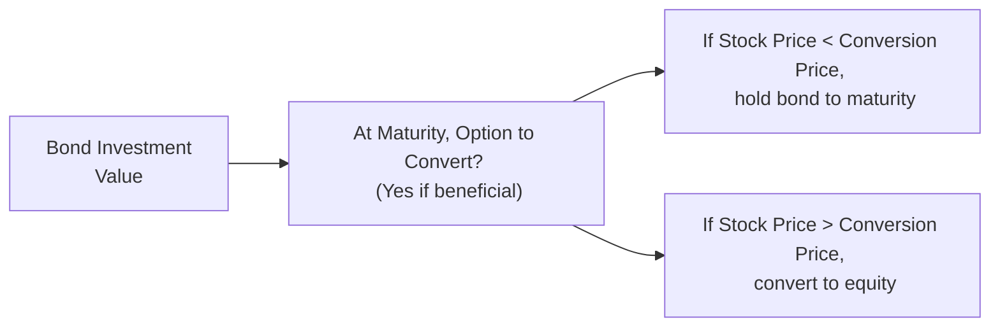

## Introduction
I still recall the first time I valued a convertible bond. I thought, “Wait, is it a bond or is it equity?” Spoiler alert—it’s both, or at least it can behave like one or the other depending on market conditions. This hybrid nature often confuses people, but it also opens up some exciting planning opportunities for portfolio managers. In your exam, you’ll likely see a vignette that forces you to tackle exactly these questions: Which part is the “bond floor”? When should I think of it as equity? How do dividends, call features, interest rates, and credit spreads affect its value?

In this section, we’re going to put it all together with a realistic scenario that mirrors what you might see on exam day. We will walk through a sample item set, identify relevant data, and crunch a few numbers to figure out the convertible bond’s value under different conversion scenarios. We’ll also talk about time management tips and common mistakes that can—unfortunately—happen under exam pressure.

## The Vignette Scenario
Imagine the following multi-part vignette:

A company named Rootbridge Tech Inc. has a five-year convertible bond outstanding with the following features:

• Face Value: USD 1,000 per bond  
• Annual Coupon Rate: 4% (paid semiannually)  
• Maturity: Five years from today  
• Conversion Ratio: 40 shares per bond  
• Conversion Price: USD 25 per share (implied from ratio for reference)  
• Current Share Price of Rootbridge Tech: USD 22  
• Call Protection: The bond is callable in two years at 102% of par  
• Credit Spread: Currently 250 basis points over the relevant benchmark (we’ll assume a Treasury yield curve)

Additionally, the stock’s historical volatility suggests that share price can vary widely—analysts are projecting a standard deviation of around 35% annually. Interest rates might rise or fall by about 1% over the next two years (you are given a small table of interest rate scenarios in the vignette). Students are asked to:

1. Identify the bond floor (the value the bond would have if we ignore the equity conversion portion).  
2. Calculate the conversion value based on current market conditions (stock price and conversion ratio).  
3. State whether the convertible bond is currently “in the money” or “out of the money.”  
4. Discuss how the bond’s value might change if Rootbridge Tech’s credit spread suddenly jumps from 250 basis points to 350 basis points.  
5. Explain the effect on the convertible bond’s value if Rootbridge Tech raises its dividend significantly.  
6. Consider if there is an incentive to convert right away if the stock price is near the conversion threshold.  

At the end, the vignette also wants you to piece everything together into a recommendation: should we hold onto these bonds for potential future upside, or convert now (or soon), or even consider selling?

## Working Through the Data
Below is a small summary table to keep track of the main convertible bond features:

| Parameter                  | Value                         |
|----------------------------|-------------------------------|
| Face Value                 | \$1,000                       |
| Coupon (Annual)           | 4% (paid semiannually)        |
| Maturity                   | 5 years                       |
| Current Stock Price        | \$22                          |
| Conversion Ratio           | 40 shares per bond            |
| Effective Conversion Price | \$25                          |
| Call Feature               | Callable in 2 years @ 102%    |
| Credit Spread              | 250 bps (current)             |

### 1. Bond Floor
At its core, a convertible bond is a corporate bond with the added feature of convertibility into equity. One way to think about it is to strip away the equity portion and value it purely as a bond. That value is the “bond floor” (or straight bond value). 

For quick exam approximations, you might discount the bond’s coupon and principal at the market yield (which includes the issuer’s credit spread plus the relevant risk-free rate). On test day, you won’t always have time to build a super-precise tree or do overly detailed calculations, but you should be comfortable with plugging in numbers into your financial calculator. 

Let’s do a conceptual outline (no need for messy decimals yet):  
• Determine the YTM using the risk-free rate plus the 250-bps spread.  
• Discount all coupon payments (4% of \$1,000 = \$40 annually, but paid semiannually, so \$20 each payment) and the maturity value (par plus final coupon).  
• The present value of those cash flows is your bond floor.  

If we were to guess in a stable interest rate environment, the bond floor usually hovers close to par if the company enjoys decent credit (4% coupon + 250 bps spread + 5-year maturity might end up somewhere near par, but it can vary depending on actual interest rates).

### 2. Conversion Value
The conversion value is straightforward: it’s how much the equity portion would be worth if you converted today. The formula:

Conversion Value = (Conversion Ratio) × (Current Stock Price).

In our scenario:
• Conversion Ratio = 40 shares.  
• Current Stock Price = \$22.  
So the conversion value right now is 40 × \$22 = \$880.

### 3. In the Money or Out of the Money?
To see if the convertible bond is in the money, compare the conversion value (\$880) to the bond’s face value (\$1,000) or to the bond’s market price. Generally, we say a convertible bond is “in the money” when the stock price is above the conversion price. Because the stock price (\$22) is below \$25 (the implied conversion price from ratio), we’re “out of the money.” In pure equity terms, you wouldn’t convert right now because \$880 of stock is less than the \$1,000 par—plus, you’d also be throwing away the time value of the option. 

### 4. Credit Spread Widens
Now, suppose Rootbridge Tech faces some negative news, and its credit spread widens from 250 bps to 350 bps. That means the market demands a higher yield to hold the firm’s debt. A wider credit spread lowers the straight bond value because higher discount rates lead to a lower present value of future bond cash flows. This compression in the bond floor can reduce the convertible bond’s overall price—unless the equity option component is driving most of the bond’s value (for instance, if the bond were deeply in the money). 

In the exam, you might see a scenario where the bond floor is meaningfully impacted, but the equity portion might or might not be affected, depending on the stock price’s reaction to the news. If negative credit events also take a toll on the equity price, the conversion portion is likely to drop in value too. So in a double whammy, both the bond floor and equity value can go down if credit conditions poke at the issuer’s fundamentals.

### 5. Dividend Increases
If Rootbridge Tech raises its dividend, the stock price might experience slight upward or downward pressure (depending on how markets view the dividend policy), but from a convertible-bond holder’s perspective, increasing dividends can actually reduce the value of the embedded call option. Why? Because once you convert, you become a shareholder and get dividends—but if you haven’t converted yet, the “option” portion is worth less as higher dividends incentivize short calls on the stock. This means the issuer’s stock is losing some option time premium. 

Remember, holders of the convertible bond do not enjoy those dividends unless they convert. If you plan to hold the bond for a while (collecting the coupon) and only convert when the stock is well above \$25, you might lose the advantage of those dividends in the meantime. On top of that, the theoretical value of a call option tends to be lower when the underlying is paying larger dividends. 

### 6. Converting Now vs. Waiting
The big question in the scenario: if the stock price hovers near \$25, do you convert and lock in your shares or wait? Usually, you wait. The reason is what we call time value of an option. Even if the stock price is near \$25, the convertible bond’s market price might be higher than the pure conversion value because of the potential for future upside. If you convert too soon, you sacrifice any remaining time value. The only reason to convert immediately is if the bond is deep in the money and you see no advantage in paying taxes later or if there’s an upcoming call date that might force your hand.  

In an exam setting, you’ll see a question that might say, “The stock is at \$24.50, the implied conversion price is \$25, do you convert now or wait?” The typical response is to wait. Even if you think the stock might go up soon, as a bondholder, you still collect coupons and maintain the optionality.  

A short note on calls: If the issuer calls the bond at 102% of par (for instance, at \$1,020), and the market conversion value is \$1,200, you’ll likely convert rather than accept \$1,020. However, that forced call scenario requires analyzing the call date, call price, and potential for further equity appreciation. In the real world, convertible bond calls often accelerate conversion when the bond is already well in the money.

## Step-by-Step Analysis and Structured Approach
When you face a multi-part item set in the exam, a structured approach can save you a lot of stress:

Identify Key Inputs from the Vignette  
• Bond terms (coupon, maturity, callable or not).  
• Conversion metrics (ratio, price).  
• Stock information (current price, volatility, dividend policy).  
• Market environment (interest rates, credit spreads).  

Select the Correct Model or Formula  
• A quick “straight bond + call option” valuation might suffice.  
• In advanced scenarios, you might see a binomial model question (though you won’t do huge spreadsheets on the exam, you might compare up and down nodes conceptually).  

Compute Bond Floor and Conversion Value  
• Bond floor = present value of future coupon and principal (discounted by yield).  
• Conversion value = shares you’d get × current share price.  

Check for “In the Money”  
• Compare current stock price to the conversion price.  
• Evaluate time value—it’s often not wise to convert early if you’re only slightly in the money.  

Incorporate Additional Factors  
• Credit spreads (influence on the bond floor).  
• Dividend changes (influence on option value).  
• Potential calls (forced conversion).  

Present Final Recommendation  
• Summarize your final numeric results and logically conclude whether the convertible bond is more driven by equity upside or has significant bond floor protection at this point.  
• If the question explicitly asks, “Should the investor convert?” be sure to weigh the time value of the option, coupon income, plus the call feature.  

## Common Pitfalls
In practice, these are the mistakes I’ve seen friends (and yes, even me once in a while) make:

• Mixing up the Face Value and Market Price when comparing with the conversion value.  
• Using the conversion ratio incorrectly by confusing it with the conversion price.  
• Forgetting that coupons might be paid semiannually, not annually.  
• Overlooking accrued interest if the bond is between coupon dates.  
• Double counting or ignoring the call redemption premium.  
• Failing to consider how a credit spread widening can reduce bond floor value.  

Remember that in the actual CFA exam, you can still earn partial credit for setting up the right equation or process, even if you mess up a final calculation. So always show your steps in a structured and consistent manner when you work these problems.

## Time Management Tips
When you’re dealing with an item set:

• Skim first: Rapidly ID the key data (coupon rate, maturity, etc.).  
• Mark or highlight key cast members: interest rates, spreads, strike/conversion price, stock price, and any table that shows interest rate or volatility scenarios.  
• Move systematically: Don’t get bogged down in too many decimal points. The exam typically rewards clarity over perfect decimals.  
• Keep an eye on partial credit: If it’s an item set, provide the formula or the logic, even if your final numeric answer is approximate.  
• Use your financial calculator wisely: Practice discounting coupon streams quickly but accurately.  
• Don’t panic: If you see a step you can’t do, skip it, finish the others, then circle back later.  

## Visualization: Convertible Bond Decision Flow
It’s often helpful to visualize the interplay between conversion value and bond floor. This simplified diagram shows the two main paths:

Of course, in real life, you may consider converting before maturity (especially if called by the issuer), but the logic remains similar: the embedded option grants you equity exposure while maintaining some bond protection.

## Conclusion
Convertible bonds can be powerful tools in a portfolio, offering downside protection via the bond floor and upside potential through equity conversion. However, they’re also chock-full of intricacies: call features, credit spreads, dividend policies, and more. Approaching these question sets with a methodical approach—focusing on the bond floor and the equity option—usually brings clarity. On the exam, don’t forget to weigh the time value of the embedded option. Nine times out of ten, you’ll want to hold off on conversion until the stock is meaningfully in the money or there is a call event to force your hand.

## Additional References
• CFA Institute Learning Ecosystem Practice Problems and Mock Exams  
  (https://www.cfainstitute.org)  
• Advanced Fixed Income Analysis – Various executive education courses from top finance institutes  
• Calamos, John P. “Convertible Securities: The Latest Instruments, Portfolio Strategies, and Valuation Analysis.” John Wiley & Sons.  
• CFA Institute Code of Ethics and Standards of Professional Conduct for considerations on fair representation of bond valuations.

## Assessing Convertible Bond Valuations: In-the-Money or Out-of-the-Money?



### A convertible bond’s “bond floor” is best described as:
- [ ] The minimum share price needed for conversion to be profitable.
- [ ] The present value of the bond’s coupons if the bond is trading above par.
- [x] The value of the bond if it were not convertible (i.e., valued purely as a straight bond).
- [ ] The difference between the bond’s market price and conversion value.

> **Explanation:** The bond floor is the value of the bond without the conversion feature, usually determined by discounting the expected cash flows at the market yield for the issuer’s credit risk.

### A convertible bond is considered “in the money” when:
- [ ] Its conversion ratio exceeds 1:1 for stock shares.
- [x] The market price of the underlying stock is above the effective conversion price.
- [ ] Its coupon rate beats the current market yields for similar credits.
- [ ] It trades at a price above par value in the secondary market.

> **Explanation:** “In the money” means that the stock trades high enough that converting the bond into shares yields more than the bond’s par value or costs. Specifically, the stock price > conversion price.

### What effect does a widening credit spread typically have on a convertible bond’s value, assuming the bond isn’t deeply in the money?
- [x] It reduces the bond floor, lowering the overall convertible bond price.
- [ ] It increases the bond floor, raising the overall convertible bond price.
- [ ] It raises the option value, increasing the overall convertible bond price.
- [ ] It has no direct effect on the bond’s price.

> **Explanation:** A widening credit spread boosts the discount rate applied to the bond’s coupons and principal, thus lowering its present value. If the conversion option isn’t overwhelmingly dominant, this decreases the convertible bond’s price.

### If a convertible bond’s stock price is slightly below the conversion price, which of the following is the typical investor action?
- [ ] Convert immediately to lock in a small loss.
- [x] Continue holding the bond for coupon income and embedded optionality.
- [ ] Sell the bond to the issuer immediately.
- [ ] Force the issuer to redeem the bond at par.

> **Explanation:** If the conversion value is below the bond’s par or below the bond floor, investors usually keep the bond position. They collect coupons and preserve the potential equity upside rather than converting at a loss.

### Which of the following statements is correct regarding the effect of higher dividends on the convertible bond’s embedded call option?
- [x] Higher dividends tend to reduce the value of the equity call option embedded in the bond.
- [ ] Higher dividends generally increase the value of the embedded call because it lowers stock volatility.
- [ ] Higher dividends have no effect on the embedded call’s valuation.
- [ ] Higher dividends always lead to an immediate conversion to capture the dividend.

> **Explanation:** Larger dividends reduce the attractiveness (and thus the value) of a call option on that dividend-paying stock, because call option holders do not receive dividends until they exercise (convert).

### An issuer calls a convertible bond at 103% of par, but the bond is deeply in the money. Investors will likely:
- [ ] Accept the 103% of par and re-invest elsewhere.
- [x] Convert to equity rather than accept the call redemption.
- [ ] Sue the issuer to prevent redemption.
- [ ] Buy put options on the underlying stock.

> **Explanation:** When a convertible bond is well in the money, the conversion value surpasses the call price. Investors would normally convert to capture the higher underlying equity value.

### In a typical exam scenario, if the convertible bond has a bond floor of \$900 and a conversion value of \$920, and the bond is trading at \$970:
- [ ] This indicates mispricing; arbitrage is impossible in the exam context.
- [x] The bond price includes some time value above both the floor and the conversion value.
- [ ] The conversion aspect is worthless, because the bond trades below par.
- [ ] The bond must be out of the money.

> **Explanation:** That extra \$50 (970 – 920) is the bond’s time premium, reflecting the possibility of greater future share price appreciation.

### Which of the following best explains why converting early might be suboptimal if the stock price is only slightly above the conversion price?
- [ ] Early conversion locks in higher coupon payments.
- [ ] Early conversion increases credit risk exposure.
- [ ] Early conversion might be prohibited by covenants.
- [x] Early conversion forfeits the bond’s remaining time value of the embedded option.

> **Explanation:** If you convert too soon, you lose out on the bond-like features (coupon and bond floor) plus any additional upside in the remaining option time value.

### Consider Rootbridge Tech’s convertible bond with a 4% coupon, 5-year maturity, and a 250-bps credit spread. If the credit spread suddenly narrows from 250 bps to 200 bps:
- [x] The bond floor value would increase, likely boosting the convertible bond price.
- [ ] The bond floor value would decrease, likely pushing the bond price down.
- [ ] The coupon payments would automatically adjust downward.
- [ ] The convertible bond would lose market liquidity.

> **Explanation:** A narrower spread reduces the discount rate, increasing the present value of future coupons and principal, thus raising the bond floor component.

### True or False: In the CFA exam item-set format, partial credit can be earned for demonstrating correct steps and logic even if the final numeric answer is not perfectly accurate.
- [x] True
- [ ] False

> **Explanation:** On constructed-response segments, the CFA Institute awards partial credit for correct methodology, provided the candidate shows their work and properly explains each step.


