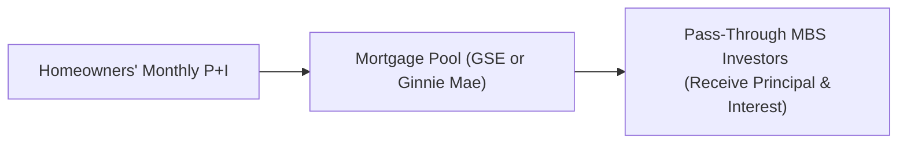

## Introduction

So the first time I ever sat down in a room full of mortgage bond traders, I was like, “Wait, so these things are basically just big pools of people’s home loans?” Yup, pretty much. But there’s a bit more nuance, especially when you peek under the hood of mortgage pass-through securities. These instruments form the bedrock of the residential mortgage financing market, and they often behave quite differently compared to your standard corporate or Treasury bonds. 

Below, we’ll walk through what mortgage pass-throughs are, why they exist, what’s special about them, and how they’re priced. We’ll also talk about issues like the “To-Be-Announced” (TBA) market and how prepayment behaviors can wreak havoc—or sometimes help—when you’re managing a portfolio. Understanding these details is hugely important for your CFA Level II prep, because you’ll encounter hourglasses of data on weighted average maturities, prepayment speeds, durations, and all sorts of real-world scenarios in the exam’s item sets. Let’s dig in.

## The Collateral: Pools of Mortgages

Unlike a typical bond, a mortgage pass-through security reflects an ownership interest in a pool of individual mortgage loans. Each month, homeowners in that mortgage pool make their payments (interest plus principal). Those payments are then “passed through” to investors. Essentially, you’re getting a pro-rata share of principal and interest from hundreds or even thousands of homeowners.

• The mortgages sharing the same characteristics (interest rate, maturity, loan type) are grouped into a single pool.  
• Investors receive monthly distributions—this includes both scheduled amortization and any unscheduled prepayments.  

These underlying mortgage pools can vary by credit quality, loan terms, and geographic concentration, influencing the security’s risk and return profile. That’s part of the fun (and challenge) in analyzing MBS.

## Roles of GSEs and Ginnie Mae

In the U.S., the largest issuance of mortgage pass-throughs comes from Government-Sponsored Enterprises (GSEs) like Fannie Mae (FNMA) and Freddie Mac (FHLMC), as well as from Ginnie Mae (GNMA), which is a full government agency. Here’s a quick rundown:

• Fannie Mae and Freddie Mac:  
  – Created by Congress to enhance mortgage market liquidity.  
  – They buy mortgages from lenders, pool them, and issue mortgage-backed securities (MBS) to investors.  
  – Carry an “implicit” government guarantee (backed by the agencies themselves, rather than the full faith and credit of the U.S. government).

• Ginnie Mae:  
  – Actually part of the U.S. government (under HUD).  
  – Guarantees the timely payment of interest and principal on MBS.  
  – Considered to have the full faith and credit of the U.S. government, which is huge for credit risk considerations.

Why does any of this matter? Well, from an investor's standpoint, the GSE or GNMA guarantee helps reduce credit risk. Hence, the main risk that remains is prepayment and interest rate risk (because the homeowner can refinance or sell the property and pay the mortgage off earlier than expected).

## The TBA (To-Be-Announced) Market

One of the coolest—and sometimes strangest—parts of agency mortgage pass-throughs is the TBA forward market. You might hear MBS folks say, “I’ll sell you $50 million of 5.5% Fannie Mae 30-year TBA, settle in two weeks.” So in essence, they’re trading MBS before the actual pools are specifically identified. That’s right: you don’t always know exactly which mortgages you’ll get until shortly before delivery.

• Standardization: TBAs have standardized parameters—coupon, face amount, issuance date, and settlement date. This fosters much deeper liquidity compared to specifying exactly which pool you’re selling or buying in advance.  
• Delayed Pool Identification: Not all pools are created equal (some are brand new, some are “seasoned”), but the market tolerates this unknown because the MBS must adhere to certain eligibility criteria.  
• Liquidity Boost: TBA trading effectively means investor demand can be met without the friction of needing to match every buyer with a unique mortgage pool.  

It might feel weird at first, but TBA trading is a big reason why the agency MBS market has historically been so liquid and so large.

## Cash Flow Variability and Prepayment Risk

Now, about those monthly payments. Each borrower has the option to prepay part (or all) of their mortgage anytime, without penalty in most conforming U.S. mortgage loans. This is key because:

• If interest rates drop, homeowners might refinance, which means mass prepayments for investors.  
• If homeowners move or sell their homes, you might also get partial prepayments.  
• As rates go up, prepayments could slow down.  

All this influences the timing (and amount) of the cash flow you, as the investor, receive. Ultimately, it’s not like owning a standard coupon bond where you know the exact schedule of interest and principal. Mortgage pass-throughs carry uncertainty around the principal repayments, forcing investors to model prepayment activity carefully. 

## How Pass-Through MBS Differ from Corporate or Treasury Bonds

Pass-throughs contrast with bullet bonds or even callable bonds in a few ways:

1. Each monthly payment from the borrower includes both interest and principal, so you receive principal gradually rather than a single redemption at maturity.  
2. Prepayment uncertainty: If rates fall, borrowers refinance, returning principal faster.  
3. Negative convexity: Because prepayments speed up when rates fall, the bond-like instrument doesn’t appreciate in price as much as a standard bond. 
4. Pricing complexity: You need a robust prepayment model to figure out the expected profile of cash flows.

In a sense, mortgage pass-through MBS are bridging the gap between “plain old interest-bearing instruments” and more exotic structures. They carry multiple embedded options—borrowers effectively have a free call option to “call their mortgage” any time they want by refinancing.

## Discounting Expected Cash Flows: Pricing Mechanics

From a theoretical standpoint, pricing a mortgage pass-through is about discounting future cash flows at an appropriate discount rate. But “future cash flows” are not as obvious as with a typical fixed-rate bond. You have to create a schedule of expected monthly payments based on a likely prepayment path. Then you discount those monthly cash flows to the present.

### The PSA Prepayment Model
An industry benchmark for modeling prepayments is the Public Securities Association (PSA) model, often expressed as a percentage of a “standard” prepayment speed. For example:
• 100% PSA corresponds to a given baseline speed of prepayments (usually starting slower and ramping up in the first 30 months).  
• 200% PSA implies that the pool is expected to prepay at twice the “standard” rate.  

You’ll see in practice that using 100%, 150%, or even 400% PSA assumptions is quite common, especially if the underlying mortgages carry relatively high coupons or the interest rate environment has changed drastically.

### Simplified Example
Let’s say we have a pool with $100 million outstanding principal, a weighted-average coupon (WAC) of 5%, and we assume a 100% PSA prepayment schedule. We model each month’s scheduled principal, interest, plus any prepayments. The discount rate might be a spread over a relevant benchmark (such as a Treasury yield curve) plus some MBS spread. Summing up the PV of all monthly payments gives us the pass-through’s price.

Of course, real-world models get more complicated, factoring in refinancing incentives, burnout effects (the phenomenon that those who haven’t refinanced at prior low-rate opportunities are less likely to do so), seasonality, and borrower credit profiles, among other variables.

## A Visual Overview

Here’s a simple mermaid diagram to illustrate the basic payment flow:

• A: Borrowers (often hundreds or thousands)  
• B: The entity collecting payments—Fannie/Freddie or Ginnie in the case of agency MBS  
• C: MBS Investors, receiving the pass-through of monthly (P+I)

## Real-World Scenario: Changing Interest Rates

Imagine interest rates drop from 5% down to 3%. Borrowers within your mortgage pool rush to refinance (it’s a huge saving on monthly payments!). That triggers more principal returning to you sooner, so your pass-through’s average life shortens. If you bought the security at a premium (say 102), you might face an effective loss because you’re being prepaid at par faster than anticipated.

If rates go up, the opposite usually happens. Prepayments slow, you’re stuck in a relatively lower-yielding investment, and your pass-through extends in duration. This phenomenon of extension or contraction risk can make pass-throughs a bit tricky to manage in a portfolio context.

## Practical Tips for the CFA® Level II Exam

• Recognize prepayment modeling is crucial: A big chunk of your item set analysis might revolve around adjusting for various PSA rates or interest rate changes.  
• Don’t forget negative convexity: Mortgage pass-throughs commonly exhibit it—knowing how that shapes the price-yield profile is testable.  
• Compare different bond types: The exam might ask you to compare a pass-through MBS to a plain-vanilla corporate or treasury in terms of price behavior, risk profile, and required yield.  
• The TBA angle: You could see scenario-based questions on TBA trading or how it affects liquidity and pricing.  

## Common Pitfalls and Best Practices

1. Ignoring Prepayment Assumptions: Some folks get lulled into using a single scenario. Real pass-through analysis requires multiple prepayment scenarios.  
2. Failing to Note Differences Among Agencies: Ginnie’s full-faith-and-credit guarantee is not the same as Fannie and Freddie’s creditworthiness.  
3. Underestimating Negative Convexity Effects: If you treat MBS like typical bullet bonds, you might overestimate the potential price appreciation.  
4. Not Considering TBA Delivery Standards: TBA pools have minimum quality criteria. Seasoned or “premium” pools might trade outside TBA or command payups.  

## References and Further Reading

• Fabozzi, F. J. “Bond Markets, Analysis, and Strategies.”  
  (link: https://www.wiley.com)  

• CFA Institute Level II Curriculum on Asset-Backed Securities (official readings).  

• Vickery, J. and Wright, J. “TBA Market: Liquidity and Role in the Mortgage Ecosystem,” Federal Reserve Bank of New York  
  (link: https://www.newyorkfed.org)

If you want a deeper dive into statistical methods for forecasting prepayments or advanced MBS analytics, check out research by the Federal Reserve, as well as academically rigorous papers shaping modern MBS modeling practices.  

## Mortgage Pass-Through Securities Knowledge Check



### Which of the following statements best describes mortgage pass-through securities?

- [ ] They represent ownership in a pool of corporate bonds.
- [ ] They pay semiannual coupons just like Treasury bonds.
- [x] They represent an ownership interest in a pool of mortgages, distributing monthly principal and interest to investors.
- [ ] They provide a guaranteed fixed schedule of principal repayments.

> **Explanation:** Mortgage pass-through securities “pass through” monthly principal and interest from a pool of mortgages to investors, resulting in variable payment amounts.

### What is the primary role of Fannie Mae and Freddie Mac in the mortgage market?

- [ ] To collect property taxes from homeowners.
- [ ] To only originate non-conforming loans.
- [ ] To provide a full-faith-and-credit guarantee backed by the U.S. government.
- [x] To enhance liquidity in the housing market by purchasing mortgages, pooling them, and issuing MBS.

> **Explanation:** Fannie Mae and Freddie Mac are GSEs established by Congress to increase mortgage market liquidity through mortgage purchases and securitization.

### How does the TBA (To-Be-Announced) market benefit agency MBS transactions?

- [ ] By eliminating all credit risk.
- [ ] By ensuring each trade is backed by corporate credit lines.
- [x] By standardizing settlement, enabling trading of MBS without identifying the specific pools until shortly before settlement.
- [ ] By locking in fixed prices for 30 years.

> **Explanation:** The TBA market streamlines trading by focusing on general parameters and deferring the identification of specific pools, thereby promoting liquidity.

### Why do mortgage pass-through securities exhibit “negative convexity”?

- [ ] Because mortgage pass-throughs never experience price fluctuations.
- [x] Because prepayments accelerate when interest rates fall, limiting price appreciation, and slow when rates rise, extending the bond’s life.
- [ ] Because Treasury rates dictate pass-through valuations directly.
- [ ] Because they have a legal provision forbidding price appreciation.

> **Explanation:** Negative convexity arises from the embedded prepayment option, which causes the bond’s effective duration to change unpredictably.

### Which factor typically increases prepayment rates in a mortgage pool?

- [ ] Rising market interest rates.
- [ ] Decreasing borrower credit scores.
- [ ] Higher property taxes.
- [x] Lower refinancing rates relative to the original mortgage rate.

> **Explanation:** When rates drop, more homeowners refinance at lower rates, elevating prepayment rates.

### In the PSA prepayment model, a 200% PSA assumption means:

- [ ] The pool is expected to prepay at 200% of the reference Treasury yield.
- [x] The pool is assumed to prepay at twice the baseline (100%) PSA standard speed.
- [ ] The mortgage coupons are automatically doubled by the pool aggregator.
- [ ] The GSEs are guaranteeing double the principal.

> **Explanation:** PSA models use a baseline (100% PSA) speed, and 200% PSA simply means twice that speed.

### Which of the following is the biggest credit difference between Ginnie Mae MBS and Fannie Mae MBS?

- [x] Ginnie Mae MBS are backed by the full faith and credit of the U.S. government.
- [ ] Fannie Mae MBS are guaranteed by the Federal Reserve.
- [ ] Ginnie Mae MBS are uncollateralized, whereas Fannie Mae MBS are fully collateralized.
- [ ] There is no credit difference at all.

> **Explanation:** Ginnie Mae is a government agency whose guarantees carry the full faith and credit of the U.S. government. Fannie Mae, although a GSE, does not carry the same explicit guarantee.

### An investor is modeling cash flows for a mortgage pass-through using a 150% PSA assumption. Which statement describes the process?

- [ ] The investor discounts a single bullet payment at maturity.
- [ ] The investor calculates the monthly cash flows ignoring interest payments.
- [x] The investor models principal payments according to a schedule at 1.5 times the base prepayment speed and discounts those monthly flows at a chosen discount rate.
- [ ] The investor assumes zero prepayments until the final month.

> **Explanation:** With a 150% PSA, the investor projects prepayment speeds 50% faster than the base schedule and then discounts each monthly (principal + interest) payment accordingly.

### Which of the following is a key challenge when valuing pass-through MBS?

- [x] Uncertain timing and amount of future cash flows due to prepayments.
- [ ] Complete absence of interest rate sensitivity.
- [ ] Rigid, fixed maturity dates that never change.
- [ ] Lack of data on mortgage borrowers.

> **Explanation:** The main challenge is modeling unpredictable prepayments. This uncertainty forces analysts to make assumptions about future refinancing behavior, principal paydowns, and interest rates.

### In a declining interest rate environment, how does the average life of a mortgage pass-through typically change?

- [x] It shortens because more borrowers refinance, accelerating prepayments.
- [ ] It remains the same because the coupon rate is fixed.
- [ ] It lengthens because borrowers wait for further rate declines.
- [ ] It has no relevance in MBS valuations.

> **Explanation:** As rates drop, homeowners refinance at the lower rates, returning principal sooner and reducing the pass-through’s average life.


