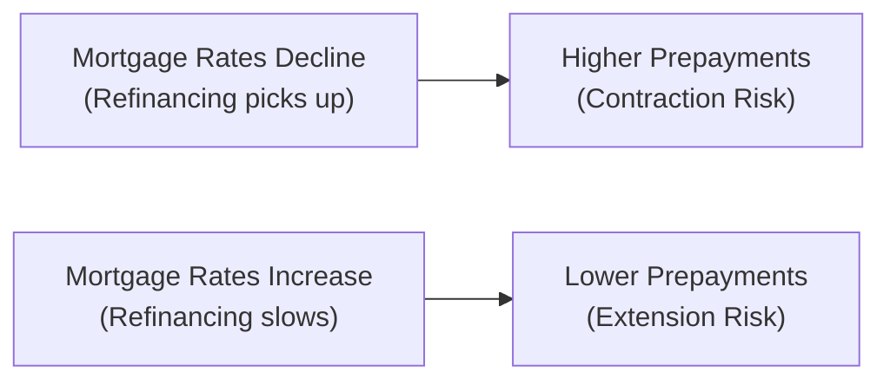

**Introduction**  
So, have you ever been surprised by how often people can repay their mortgage earlier than scheduled? I remember chatting with a friend who refinanced his home loan almost the minute interest rates dipped below 3%. It felt like he’d broken some unwritten rule (since he’d only had the mortgage for a couple of years), but as it turns out, this is surprisingly common. For mortgage-backed securities (MBS) investors, that friend’s speedy refinance is the very definition of prepayment risk: the possibility that mortgages get paid off faster (or slower!) than you might have planned when you first priced the security.

Mortgage-backed securities pool together individual home loans. Investors receive principal and interest from these loans, right? But unlike a typical corporate bond with a set maturity date, the “when” of that principal doesn’t always follow a neat schedule. Borrowers can prepay their loans for many reasons—refinancing for a better rate, selling a house, or maybe just having a financial windfall. Sometimes they pay earlier, sometimes they don’t, and those shifts can affect your cash flows in ways that might surprise you. Let’s walk through the essential aspects of prepayment risk and introduce two key sub-risks: contraction risk and extension risk.

**Understanding Prepayment Risk**  
We define prepayment risk as the uncertainty of mortgage principal repayment timing that arises because borrowers can pay off their loans before maturity. You can think of it like a big question mark looming over your expected cash flows. If you’ve outlaid a fixed sum to buy a mortgage pass-through security, you want to know how many scheduled coupons you’ll actually receive and how long your principal will keep earning interest. But prepayments can jump around based on interest rates, economic conditions, or even local real estate trends.  

While at Level I you might have learned that MBS cash flows depend on the underlying loans’ amortization schedules, here at Level II we dive deeper into the “what if” scenarios. What if rates crash 200 basis points next quarter, encouraging a flood of refinances? Or what if housing demand slows and fewer homeowners can move or refi? All of these possibilities add complexity to MBS pricing and yield analysis.

**Contraction Risk**  
Contraction risk is usually top-of-mind when interest rates fall. Picture an environment where mortgage rates plummet: people rush to refinance their homes at lower rates, meaning existing MBS holders get their principal back sooner than expected. That might sound okay at first (hey, you get your money back!), but the problem is that you’re probably reinvesting at these new lower rates, which likely reduces your overall return. This phenomenon is often called “negative convexity,” because the MBS price won’t rise as fast as a typical option-free bond when rates drop, thanks to the embedded refinancing option homeowners hold.

Let’s do a simple illustration. Suppose you buy an MBS with a coupon rate of 4%. Interest rates decline to 2.5%. Many borrowers in your MBS pool refinance, so the principal portion you receive each month explodes upward—reduced future coupon possibilities because your mortgage pool is shrinking faster than you previously projected. You suddenly face “contraction risk,” ironically feeling forced to accept a pile of cash you must now invest at a significantly lower rate.  

**Extension Risk**  
Extension risk is the ugly twin of contraction risk. In a rising rate environment, folks have little incentive (or opportunity) to refinance at higher rates. When interest rates climb, prepayments decline, and your MBS’s life can get stretched beyond your original projections.  

So, if you had planned for a 5-year average life but prepayments slow drastically, you might be stuck receiving principal for 7 or 8 years. Not only do you hold a lower-yielding security in an environment of rising yields, but your principal is locked up for longer. That basically hurts your total return if you want to reinvest at higher market rates and your existing principal is still tied to mortgages that are not prepaying.

**Prepayment and Market Dynamics**  
Variable prepayment rates can be driven by:  
• Changes in mortgage rates relative to the loan’s coupon rate.  
• The overall level of home sales and housing turnover.  
• Borrower-specific factors like job changes or relocation.  
• General economic climates: expansions tend to bring more refinancing, but it also depends on credit availability.  

Let’s lay out a simple flowchart to illustrate how interest rate changes can drive contraction or extension risk in an MBS.  

This diagram, while obviously simplified, provides a quick snapshot of how rate movements can push MBS cash flows to contract or extend.

**Scenario Analysis for MBS**  
Most sophisticated investors test multiple prepayment assumptions when valuing mortgage-backed securities. These typically include:  

• Fast Prepayment Scenario: Models a situation where mortgage rates have fallen sharply, or homeowner mobility is elevated. This scenario calibrates the upper boundary of how quickly borrowers might pay off loans.  
• Slow Prepayment Scenario: Models a slowdown in refinancing due to rising rates or a weak housing market, establishing the lower boundary.  
• Base-Case Prepayment Assumption: Often uses a “normal” or historically average rate, sometimes referred to as the 100% PSA assumption (where “PSA” stands for the Public Securities Association standard).

**PSA Prepayment Model**  
A common benchmark is the PSA model, which starts with a baseline monthly prepayment rate and increases it for the first 30 months of the mortgage (representing the ramp-up of refinancing activity) until it reaches a stable plateau. For example, “100% PSA” describes a standard pattern, while “200% PSA” means prepayments are running at double that standard rate, and “50% PSA” indicates half the normal pace.

Proprietary models—like those developed by large investment banks—can get far more granular, incorporating borrower credit scores, geographic factors, and even seasonality in housing markets. But the basic purpose remains the same: measure how prepayment assumptions affect the timing and amount of cash flows, and from there figure out a fair price for the MBS.

**Average Life vs. Nominal Maturity**  
When you think about MBS, be careful not to equate nominal maturity (say 30 years) with the actual expected life of the security. Because of ongoing principal payments—scheduled amortization plus unscheduled prepayments—most MBS typically see a much earlier end date. This expected holding period is often summarized by the “average life.”  

A common formula for Weighted Average Life (WAL) of a pass-through might look like:


\text{WAL} = \sum_{t=1}^{T} t \times \frac{\text{Principal Paid in Period } t}{\text{Total Initial Principal}}


Here, t is the time period (for instance, in months or years), and the fraction represents the portion of principal returned at each period. Because this depends heavily on prepayments, a slight shift in interest rates can drastically alter the “when” of principal returns and thereby the WAL.

**Practical Example**  
Imagine you hold a mortgage pass-through that you priced assuming a 5-year average life, based on a 100% PSA. Suddenly, interest rates drop, and prepayments accelerate to 250% PSA. Your security’s average life might compress to only 3 years because so many loans get refinanced quickly. You receive your principal back sooner, no longer earning that higher coupon, and you reinvest in a market that now offers lower yields.

Conversely, if rates shoot up or the economy tanks, you might get lumps of principal much later than anticipated. So your average life could jump to 7 years or more—extension risk in plain sight.

**Stress Testing and Risk Management**  
Because MBS is so sensitive to changes in interest rates (both upward and downward), most portfolio managers run aggressive stress tests to see how the MBS behaves in worst-case scenarios. For instance, you might:  

• Test a range of volatile rate movements (e.g., +300 bps, –200 bps).  
• Adjust prepayment assumptions based on different credit conditions or housing turnover rates.  
• Look at how shorter durations in a falling-rate environment can hamper your portfolio’s yield if you’re forced to reinvest.  
• Extend your portfolio’s duration if rates rise and your MBS is suddenly stuck with slow prepayments.

Ultimately, comprehensive scenario analysis can help you avoid big surprises—like finding yourself “locked in” at a low yield in a high-rate world or failing to meet your yield targets because your MBS collapsed too quickly.

**Incorporating MBS Prepayment Analysis into the CFA® Exam**  
At Level II, you’re likely to see item sets (vignettes) that present a range of assumptions about borrower behavior, interest rate shocks, or housing market conditions. You might need to:  

• Interpret different PSA speeds to figure out how soon you’d receive your principal.  
• Compare two MBS with varying extension or contraction risks.  
• Evaluate the reinvestment implications of faster prepayments.  

Make sure you can read a table of prepayment speeds, internalize how that might affect average life, coupon receipts, and yield, and then apply that logic to a recommended strategy—like whether an MBS is suitable for a certain portfolio or not.

**Best Practices and Common Pitfalls**  
• Don’t assume a single prepayment speed. Real life is rarely so linear, so always examine multiple scenarios.  
• Watch out for negative convexity traps. If interest rates drop, your “bond” might actually underperform an option-free bond because of contraction risk.  
• Remember that MBS yields are often quoted on a “yield to average life” basis under certain prepayment assumptions. If those assumptions are wrong, your realized yield might differ from your initial estimate—sometimes drastically.  
• Keep an eye on the difference between actual CPR (conditional prepayment rate) data and your forecast. If actual prepays deviate from your model, update your assumptions quickly.

**Glossary**  
• **Prepayment Risk:** The risk that investors will receive principal payments earlier or later than expected, making cash flows unpredictable.  
• **Contraction Risk:** The chance of receiving principal sooner than planned (generally occurs when interest rates fall and borrowers refinance).  
• **Extension Risk:** The chance of receiving principal later than planned (generally occurs when interest rates rise, slowing refinances).  
• **Base-Case Prepayment Assumption:** The standard or “most likely” prepayment scenario used in pricing MBS.  
• **Stress Testing:** Assessing MBS performance under extreme shifts in interest rates, credit conditions, or other factors.

**Further Reading**  
• Hayre, Lakhbir. “Salomon Smith Barney Guide to Mortgage-Backed Securities.”  
  (link: https://www.ssbguide-mbs.com)  
• Bekaert, G. and Hodrick, R. “International Financial Management.”  
  (link: https://www.cambridge.org)  
• CFA Institute: “Fixed Income Analysis” series offers advanced discussions on prepayment modeling techniques.

**Final Thoughts**  
Prepayment risk—and its relatives, contraction and extension risk—is at the very heart of MBS investing. If you understand these risks, you’ll be better equipped to handle item-set questions that dive into the details, from modeling PSA speeds to stress-testing entire portfolios. And you might also surprise your friends when you can easily explain why refinancing booms can be “bad news” for MBS holders. The next time someone mentions mortgage rates falling, you’ll appreciate the balancing act between borrowers who cheer and investors who cringe.

## Test Your Knowledge: Prepayment Risk and Contraction/Extension



### Which statement best defines prepayment risk for MBS holders?

- [ ] It is the risk that the coupon rate will remain unchanged for the life of the mortgage.
- [x] It is the uncertainty over the timing of principal repayment due to borrower prepayments.
- [ ] It is the risk that borrowers will always refinance if given the option.
- [ ] It is the guarantee that final maturity is always shorter than the nominal 30-year maturity.

> **Explanation:** Prepayment risk describes the uncertainty in cash flow timing because borrowers may choose to prepay or refinance at any time.  

### Contraction risk typically increases when:

- [x] Interest rates fall, leading to higher rates of refinancing.
- [ ] Home prices fall, reducing borrower equity.
- [ ] Employment declines, making it harder to qualify for refinancing.
- [ ] The economy shifts to a recession, reducing credit availability.

> **Explanation:** Contraction risk spikes when borrowers actively refinance at lower rates, causing the MBS to return principal earlier than expected.  

### If interest rates rise sharply, MBS investors are most likely to face:

- [ ] Contraction risk.
- [ ] Credit risk.
- [x] Extension risk.
- [ ] Market segmentation risk.

> **Explanation:** Rising rates discourage refinancing, leading to slower principal repayments. This scenario is known as extension risk.  

### In scenario analysis, a “fast prepayment” model scenario is generally used to:

- [ ] Estimate the maximum possible losses from defaults.
- [ ] Project extension risk under rising interest rates.
- [x] Simulate an environment where rates fall and many borrowers refinance.
- [ ] Calculate the bond’s yield to maturity on an option-free basis.

> **Explanation:** A fast prepayment scenario models accelerated borrower refinancing, shedding light on potential contraction risk.  

### Which of the following statements is accurate regarding average life for an MBS?

- [ ] Average life refers to the maturity date listed on the face of the MBS.
- [ ] Average life only applies to fixed-rate corporate bonds, not mortgage pass-throughs.
- [x] Average life can differ significantly from nominal maturity due to variable prepayments.
- [ ] Average life is calculated as a simple average of the MBS coupon payments.

> **Explanation:** Because of ongoing scheduled amortization plus unscheduled prepayments, the MBS’s average life often deviates substantially from the stated maturity.  

### The PSA model:

- [x] Standardizes assumptions about monthly prepayment rates over time.
- [ ] Reflects the probability that borrowers will default on mortgage payments.
- [ ] Stays constant at 50 CPR for the life of the security.
- [ ] Prohibits the use of proprietary models by investment banks.

> **Explanation:** PSA is a benchmark prepayment model that ramps up over the first 30 months and then levels off to estimate mortgage prepayment speeds.  

### In a falling rate environment, MBS can exhibit “negative convexity” because:

- [ ] Prices of MBS do not move at all with rate changes.
- [ ] Refinancing activity slows compared to corporate bonds.
- [x] Large-scale refinancing caps the upside price movement.
- [ ] Borrowers are prohibited from refinancing until interest rates rise again.

> **Explanation:** Negative convexity occurs when prepayments (and thus principal redemptions) surge, limiting gains that would typically come from falling rates in an option-free bond.  

### Stress testing MBS primarily involves:

- [ ] Examining how the issuer’s equity price changes.
- [ ] Assessing whether the MBS meets bank capital requirements.
- [ ] Ignoring changes in interest rates to see how credit risk alone affects the MBS.
- [x] Evaluating the security’s performance under various interest rate and prepayment scenarios.

> **Explanation:** Stress testing tries out extreme rate changes and different prepayment speeds to understand how an MBS might fare in diverse conditions.  

### What is the main danger of extension risk to an investor?

- [ ] Reduced credit quality of the underlying borrowers.
- [x] Getting stuck with lower interest rates for longer when market rates have risen.
- [ ] Early receipt of principal, forcing reinvestment at lower rates.
- [ ] Complete elimination of cash flows over the life of the security.

> **Explanation:** Extension risk locks investors into a low-yielding asset as interest rates rise, failing to deliver principal in time to reinvest at higher prevailing yields.  

### True or False? Prepayment risk does not affect the timing of interest payments, only the principal repayment schedule.

- [ ] False
- [x] True

> **Explanation:** Though “prepayment” specifically refers to principal, the early return of principal directly alters the duration and the expected coupon payments over time (indirectly affecting total interest earned). In practice, it’s more nuanced; but the key point is that prepayment primarily shifts principal payments and thus the overall cash flow profile.


