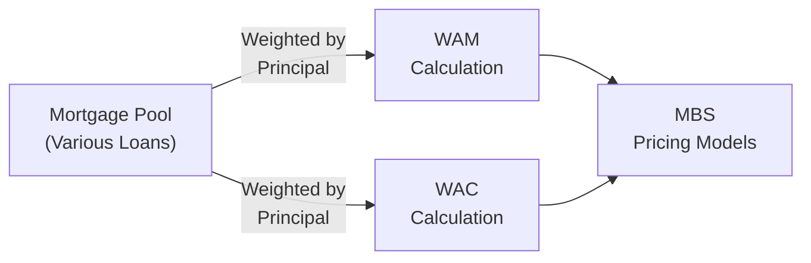

## Understanding Weighted Average Maturity (WAM) and Weighted Average Coupon (WAC)

Mortgage-Backed Securities (MBS) are created by pooling individual mortgages—each with its own maturity date, coupon rate, and outstanding balance—into a single instrument. If you think about it, it can feel like stuffing a bunch of puzzle pieces together to form one big mortgage “picture.” But how do we measure the overall maturity and coupon characteristics of this huge aggregate mortgage puzzle? That’s where Weighted Average Maturity (WAM) and Weighted Average Coupon (WAC) step in. These metrics help us summarize a mortgage pool’s behavior in terms of interest rates and expected cash flows.

### Key Definitions

Weighted Average Maturity (WAM)  
WAM is the weighted average of the remaining maturities of the mortgages in a pool. Each mortgage in the pool has its own principal balance and maturity date, and WAM reflects how many years (on average) remain before the entire pool’s principal is scheduled to be repaid. Mathematically, if we have mortgages i ∈ {1, 2, …, N}, each with remaining maturity Mᵢ (in months or years) and an outstanding principal balance of Bᵢ, then:

WAM = ( Σ ( Mᵢ × Bᵢ ) ) / ( Σ Bᵢ )

Weighted Average Coupon (WAC)  
WAC is the weighted average of the coupon rates across all mortgages in the pool, again assigning weights based on each mortgage’s outstanding principal. If Cᵢ is the coupon rate for each mortgage i and Bᵢ is its outstanding principal:

WAC = ( Σ ( Cᵢ × Bᵢ ) ) / ( Σ Bᵢ )

In practice, these formulas are typically implemented in specialized software or spreadsheets that automatically pull loan-level data and compute the pool-level metrics.

### Why WAM and WAC Matter

WAM and WAC can feel like fancy acronyms, but they significantly impact anyone who analyzes or invests in an MBS:

• WAM helps gauge the timing of cash flows. A pool with a higher WAM generally implies that principal repayments will take place further in the future—unless, of course, prepayments drastically alter that schedule.  
• WAC tells you the average interest rate the pool is paying to mortgage holders. A higher WAC indicates a larger stream of coupon income, but it might also hint at higher prepayment risk if interest rates decline and induce refinancing.

These two metrics serve as the backbone of MBS cash flow modeling and yield forecasting. Investors and analysts juggle changes in WAM and WAC to evaluate how much principal or interest might arrive each month, which ties directly to the bond’s pricing.

### The Impact of Prepayments and Refinancing

In mortgage land, there’s this constant risk (or opportunity, depending on how you see it) that borrowers will pay off their loans ahead of schedule. They might move, refinance to get a lower interest rate, or just plain pay off the mortgage whenever it suits them. Here’s how it matters:

• Refinancing Shortens WAM: Imagine a borrower with 25 years left on a mortgage at 7%. If market rates fall to 5%, the borrower may refinance, paying off the original mortgage in full. That mortgage disappears from the pool, effectively lowering the WAM if many borrowers do the same.  
• Prepayment Patterns Affect WAC: If high-coupon loans refinance first (the borrowers get out faster), the remaining pool might lean toward loans with lower coupons. Over time, the average coupon (WAC) may decrease, which can reduce the interest payments for the pool.

These dynamics are precisely why MBS valuations are tricky. The shape of the yield curve, housing market trends, borrower credit profiles, and interest rate movements all conspire to shift WAM and WAC in ways that can improve or erode your expected returns.

### Tracking Changes Over Time

Few things in finance change as fast as mortgage pools—each month, borrowers make payments, some default, others refinance, some pay off a portion of principal early. Naturally, WAM and WAC update regularly. In an MBS analysis context:

• Monthly Pool Factor Updates: Agencies or loan servicers distribute monthly “pool factor” statements that detail changes in total outstanding principal. These statements feed into updated WAM and WAC calculations.  
• Seasonal Patterns: Home-buying and refinancing can follow seasonal trends (hello spring homebuying season). This can lead to monthly or quarterly shifts in the pool that must be reflected in WAM/WAC estimates.

So if you’re evaluating an MBS for potential purchase, or just trying to forecast your existing position’s returns, it’s crucial to stay on top of how these metrics evolve. What was once a pool with a 25-year WAM and 6.5% WAC might slide to a 23-year WAM and 6.2% WAC within a year—altering its prepayment profile and cash flow expectations.

### Implications for Valuation and Risk Analysis

WAM and WAC form the backbone of MBS valuation models. If your Weighted Average Coupon is significantly above current market mortgage rates, you can guess that many borrowers will refinance—and thus your WAM might drop sharply, accelerating principal repayment. Similarly, if your Weighted Average Maturity is very long (like 28 or 29 years on average) in a low prepayment environment, you might expect stable but slow principal returns, which can be valuable if your portfolio needs a longer duration asset.

Some best practices and common pitfalls to keep in mind:

• Best Practices:  
  – Always examine historical prepayment speeds for the specific borrower type or region. Some pools are more sensitive to slight interest rate changes than others.  
  – Combine your WAM and WAC analysis with economic data. For instance, if interest rates are projected to remain unchanged, prepayment might slow. If they’re likely to drop, get ready for potential wave of refinancing.  
  – Monitor changes monthly. Even small changes can become material over time.

• Common Pitfalls:  
  – Assuming that WAM or WAC remain static when interest rates are volatile. They can shift quickly.  
  – Falling into “averages trap.” A pool’s average coupon can hide variability. Sometimes, half the pool might have a coupon near 8%, while the other half lingers near 4%. A single average can mask that distribution, making your prepayment estimates less accurate.  
  – Ignoring borrower behavior. It might be easy to assume that if interest rates fall, everyone refinances. But real-world borrowers behave differently. Some are locked out by credit constraints or personal factors, while others jump on the refinancing wagon immediately.

### Spreadsheet Analysis and Specialized Software

If you’re feeling adventurous (and you have a big chunk of mortgage data)—or if you just have a good MBS analytics tool—you can compute WAM and WAC yourself. Here’s how you might do it in a spreadsheet:

• Gather Loan-Level Data: For each mortgage, track its outstanding principal balance, remaining term, and current coupon rate.  
• Compute Weighted Values: For WAM, multiply the remaining term by the mortgage’s principal balance. For WAC, multiply the coupon by the mortgage’s principal balance.  
• Divide by Total Principal: Sum the results and divide by total outstanding principal for both WAM and WAC.  
• Refresh Monthly: Update the data each month based on servicer tapes. Factor in new principal balances and any refinanced (or defaulted) loans that drop out of the pool.

Most investors, however, rely on specialized MBS analytics platforms that incorporate advanced prepayment models (like PSA, CPR, or more sophisticated data-driven approaches). These programs automatically recast WAM and WAC after each monthly payment cycle, offering yield and spread projections under various interest-rate scenarios.

### Visual Overview

Below is a simple diagram illustrating how an MBS pool’s WAM and WAC ultimately feed into valuation:

### Glossary

Weighted Average Maturity (WAM): “The overall average time to maturity for an entire mortgage pool, weighted by outstanding principal balance.”

Weighted Average Coupon (WAC): “The average interest rate of the mortgages in an MBS pool, weighted by each loan’s outstanding principal balance.”

Resource Pooling: “The practice of combining multiple mortgages with different maturities and coupons into a single MBS.”

Refinancing Incentive: “The potential savings in interest for borrowers who replace their existing mortgage with a new one at a lower rate.”

### Summary

It’s sometimes tempting to oversimplify MBS analysis by focusing on broad-based prepayment assumptions, but ignoring the nuance of WAM and WAC can be hazardous. They don’t just give us an academic sense of what the “average” loan in the pool looks like; they transform into real-time indicators of how the mortgage pool might behave next month or next year. As you progress in your CFA studies—and even more so in your actual day-to-day as a finance professional—try to keep a close eye on these metrics. They’re like the vital signs of mortgage-backed securities, telling you how fast the heart is beating and how well the lungs are working.

In the next sections, as you learn more about advanced MBS products like Collateralized Mortgage Obligations (CMOs), you’ll see these metrics broken out by tranche, each with its own WAM and WAC profile. So, keep your WAM and WAC knowledge sharp—it’s going to serve you well in the practice vignettes and your real-world MBS analysis.

### References and Further Reading

• Fabozzi, Frank J. and Mann, Steven V. “The Handbook of Fixed Income Securities.”  
  (link: https://www.mhprofessional.com)  

• “U.S. Securities and Exchange Commission (SEC) - Mortgage-Backed Securities”  
  (link: https://www.sec.gov)  

• Consider reviewing Chapter 14: “Collateralized Mortgage Obligations (CMOs)” in this same Volume for deeper insights into how WAM and WAC factor into more complex MBS structures.

• For a refresher on prepayment modeling, revisit Chapter 13.2: “Prepayment Risk and Contraction/Extension.”

-----

## Weighted Average Maturity (WAM) and Weighted Average Coupon (WAC) Practice Questions



### In an MBS pool, which of the following best defines Weighted Average Maturity (WAM)?

- [ ] The average maturity date weighted by interest rates.
- [ ] The average of the mortgage coupon rates.
- [x] The principal-weighted average of remaining time to maturity for all mortgages in the pool.
- [ ] The outstanding principal used as weights, but ignoring maturity.

> **Explanation:** WAM is calculated by weighting the remaining time to maturity of each mortgage by the mortgage’s outstanding principal. It gives an overall maturity indicator for the entire pool.

### Which factor is most likely to cause a decline in the Weighted Average Maturity (WAM) of an MBS pool?

- [ ] A rise in market interest rates encouraging borrowers to stay in their mortgages.
- [x] Increased refinancing activity when market rates fall.
- [ ] No borrowers refinancing.
- [ ] The coupon rate on the MBS pool remaining unchanged.

> **Explanation:** When borrowers refinance, their existing mortgages are paid off earlier than scheduled, thus reducing the overall time to maturity for the pool, causing WAM to decline.

### Which of the following statements is true about Weighted Average Coupon (WAC)?

- [ ] It is computed by taking the average of all remaining mortgage maturities.  
- [ ] It does not depend on the principal balance of individual mortgages.  
- [x] It is computed by weighting each mortgage’s coupon rate by its outstanding principal balance.  
- [ ] It remains unchanged even if certain mortgages are removed from the pool.  

> **Explanation:** WAC is calculated as the principal-weighted average of each individual mortgage’s coupon rate. If high-coupon mortgages refinance (and leave the pool), WAC typically declines.

### If an MBS pool’s WAM is much longer than a comparable pool, which of the following is most likely?

- [x] The pool will, on average, have a later final expected payment date.
- [ ] The pool will necessarily have a higher coupon rate.
- [ ] Default rates will be higher.
- [ ] The pool cannot be refinanced.

> **Explanation:** A higher WAM suggests that the underlying loans have longer remaining maturities, leading to later payments of principal and thus a longer horizon for the entire pool. It does not dictate coupon rates, default rates, or refinancing potential by itself.

### Investors notice that a pool’s WAC is comparatively high. Which outcome is most likely if market interest rates fall below this pool’s average coupon?

- [x] The pool is more prone to prepayment risk, leading to a faster decline in WAM.
- [ ] The pool will follow the normal amortization schedule with no changes.
- [x] The attractiveness of refinancing rises, potentially shortening the pool’s life.
- [ ] The principal payments cannot be accelerated.

> **Explanation:** A high WAC relative to current market rates means borrowers have a significant financial incentive to refinance. This usually accelerates prepayments, causing WAM to drop.

### If many borrowers with high-interest mortgages within an MBS refinance, what immediate impact does that have on WAC?

- [x] It tends to lower the WAC, as high-coupon mortgages exit the pool.
- [ ] It has no direct effect on WAC.
- [ ] It increases the WAC substantially.
- [ ] It fixes WAC at the same level, regardless of exits.

> **Explanation:** High-coupon loans leaving the pool cause the overall average coupon (WAC) to decline because only the lower-coupon mortgages remain.

### What is a logical consequence of ignoring WAM updates in a rapidly changing interest rate environment?

- [x] MBS valuations may become inaccurate as prepayment dynamics shift.
- [ ] Volatility in bond prices ceases to exist.
- [x] Investors could misjudge the cash flow timeline of their investments.
- [ ] The mortgage pool will remain unaffected.

> **Explanation:** If analysts do not regularly track changes in WAM, they might misjudge both the timing of principal repayments and the bond’s duration, compromising valuation accuracy and portfolio decisions.

### A shift in WAM from 25 years to 20 years within six months most likely indicates:

- [x] A significant level of prepayments, refinancing, or other early paydowns.
- [ ] No real change in the underlying mortgage pool structure.
- [ ] A surge in new borrowers entering the pool.
- [ ] An error in coupon reporting.

> **Explanation:** A substantial drop in average maturity typically points toward borrowers prepaying faster than expected (often through refinancing). Mortgage pools shrink in duration as loans pay down or pay off ahead of schedule.

### Which of the following best summarizes the relationship between WAM, WAC, and MBS price sensitivity?

- [x] Longer WAM and higher WAC usually increase sensitivity to interest rates due to enhanced prepayment dynamics.
- [ ] WAM and WAC never affect MBS prices.
- [ ] Only WAC matters for price, while WAM can be ignored.
- [ ] Sensitivity to interest rates is unrelated to either WAM or WAC.

> **Explanation:** Both a longer maturity profile (WAM) and a higher average coupon (WAC) can amplify an MBS’s heightened exposure to interest rates, prepayment risks, and extension/contraction risks.

### Mortgage pools are reanalyzed monthly because:

- [x] Principal payments, refinances, and defaults constantly change the composition, affecting WAM and WAC.
- [ ] MBS yields are guaranteed not to change quarterly.
- [ ] Regulators require daily recalculation of WAM only.
- [ ] Coupons in the pool never adjust and remain the same indefinitely.

> **Explanation:** Mortgage pools evolve over time with each payment, refinance, or default. Consequently, WAM and WAC recast monthly to reflect the new principal balances and remaining terms.


