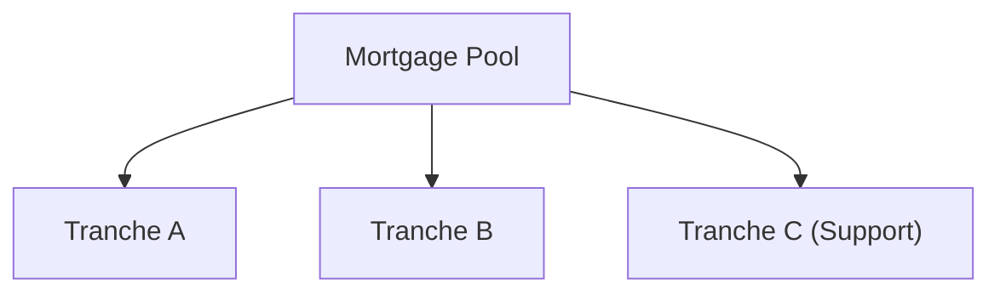

## Introduction

Collateralized Mortgage Obligations (CMOs) are created by repackaging mortgage pass-through securities into separate classes (or tranches). You might recall from Chapter 13 that mortgage pass-throughs bundle many individual residential mortgages. Each month, homeowners make mortgage payments that include principal and interest, and these payments flow to investors in the pass-through. CMOs take that same basic idea but carve up cash flows in a more refined way, offering structured payout schedules designed for different risk-return appetites.  

So, picture a big funnel of monthly mortgage payments. In a plain vanilla pass-through security, everyone shares proportionately in principal and interest. But with a CMO, the funnel splits into distinct pathways called tranches—each with its own characteristics, payment priority, and exposure to prepayment risk.  

This article provides a deeper look at three fundamental tranches in CMO structures:
• Sequential-Pay Tranches  
• Planned Amortization Class (PAC) Tranches  
• Support (Companion) Tranches  

We’ll also note some personal insights: when I first studied CMOs, I remember being surprised by how something so seemingly simple—just mortgage payments—could be sliced and diced into complex, pretty elegant structures. Let’s walk through these structures in a systematic way, highlighting the mechanics, investor implications, and typical pitfalls.

## CMO Structure Overview

Before we dig into the specific tranches, let’s glance at the high-level structure. A mortgage pool collects monthly mortgage payments from thousands (or hundreds of thousands) of individual borrowers. These payments flow into a CMO trust, which segregates the cash into multiple tranches.

Below is a simplified diagram showing the flow of principal and interest from a single mortgage pool to multiple CMO tranches. We won’t get too fancy, but it should give you a sense of how the funnel splits:

• Tranche A might receive principal first, based on a schedule or sequential priority.  
• Tranche B gets principal only after A is fully repaid.  
• Tranche C (Support) might absorb volatility in prepayments to protect another tranche.  

All these variations allow different investor classes to pick the maturity profile or risk level they want.  

## Sequential-Pay Tranches

A Sequential-Pay structure is the most straightforward arrangement within a CMO. In a nutshell, the deal is designed so that Tranche A is paid its entire principal first. Then once A is fully retired, Tranche B starts receiving principal, and so forth.  

This approach segments the mortgage pool’s maturity landscape. Early tranches (like A) have shorter average lives because they’re absorbing principal as quickly as it’s available. Later tranches (like B or C) have longer average lives because they wait until the earlier ones are completely paid down.

### Mechanics of Sequential-Pay

1. Principal Allocation:  
   • For as long as Tranche A is outstanding, all principal payments (scheduled principal plus any prepayments) go to Tranche A.  
   • Once Tranche A is fully repaid, principal redirections move to Tranche B, then C, in strict order.  

2. Interest Payments:  
   • All tranches typically receive interest (based on their respective principal balances) at the same time.  
   • The difference is in who gets the principal distribution first.  

3. Prepayment and Extension Impacts:  
   • If borrowers prepay heavily, earlier tranches get paid down much sooner, resulting in a shorter maturity for them but a potential ripple effect on subsequent tranches.  
   • If prepayments slow down, the maturity of Tranche A extends, delaying principal to the tranches behind it.  

### Example

Imagine a mortgage pool with $300 million in total principal. The sponsor splits it into two sequential tranches:
• Tranche A: $150 million  
• Tranche B: $150 million  

If monthly principal payments total $5 million and come in as expected, that whole $5 million (plus any prepayments) goes to Tranche A until it’s fully paid off. Tranche B is like, “Hey, I’ll wait in line.” If borrowers decide to prepay faster, A’s maturity shortens, possibly making B’s forecasted principal receipts start earlier.  

This structure is ideal for an investor who wants a shorter or “front-ended” maturity profile. The later tranches wind up with more extension risk because their principal is stuck behind the earlier tranches.  

## Planned Amortization Class (PAC) Tranches

Whereas Sequential-Pay tranches follow a strict first-first, next-next schedule, PAC tranches aim to provide more predictability. If you’ve ever said, “Um, I kinda need more stable payments and don’t want huge surprise prepayments,” you’ll appreciate the concept of PAC bonds.  

### Defining PAC

A PAC (Planned Amortization Class) tranche is structured with a “planned” principal repayment schedule. It’s almost as if the deal sponsor says, “Under normal prepayment speeds (e.g., 100 PSA or 200 PSA), we promise to pay you principal according to this schedule, give or take.”  

The underlying deal guidance sets a range of prepayment speeds (commonly called the PAC collar) within which the PAC bond is expected to satisfy its planned schedule. As a result, PAC investors typically get more stable average lives and reduced prepayment risks compared to standard pass-throughs. They are partially “insulated” from both high prepayment speeds (which would cause short seasoning) and low speeds (which would cause extension).  

### How PAC Schedules Work

1. **Assumed Prepayment Speed**: The deal is structured around a baseline (or sometimes multiple scenarios) of prepayment speeds.  
2. **Scheduled Principal Payments**: The offering docs create a schedule that details how much principal the PAC tranche will receive each month.  
3. **Protection Range**: As prepayments deviate from baseline, provided they’re within the collar, the support tranches (more on them below) absorb the extra variability to keep the PAC’s schedule largely intact.  

If actual prepayments exceed the upper collar, well, that can break your schedule. But, ironically, even if it’s beyond the collar, the “planned” part of the bond helps a lot—at least up to that point.  

### Why Investors Like PACs

• Predictable Average Life: Many institutional investors, especially those with liability-driven investing (LDI) mandates, prefer stable cash flows to avoid reinvestment risk spikes.  
• Less Contraction/Extension Risk: The existence of a buffer (the support tranches) helps reduce the unpredictable nature of homeowner prepayments.  
• Typically High Quality: Because of their more stable cash flow profile, PAC tranches often attract higher ratings (though the final rating also depends on the underlying mortgage collateral and other structural factors).

## Support (Companion) Tranches

Support tranches, sometimes called Companion tranches, are the real champs when it comes to absorbing variability in mortgage prepayments. You might say they’re the shock absorbers in the CMO. If actual prepayments come in faster or slower than expected, the support tranche picks up the slack, allowing the PAC bonds to remain on their more predictable track.

In effect, if prepayments are higher than the baseline, the support tranche receives more principal earlier. If prepayments are lower, the support tranche waits longer, receiving principal more slowly. This is precisely why the support tranche is riskier: it’s prone to receiving uncertain principal flow.  

### Risk-Return Profile

Because support tranches bear more prepayment risk, they often pay a higher yield compared to a PAC or highly rated sequential tranches. But be mindful: that yield premium comes with:
• Potential for significant contraction if homeowners prepay too quickly.  
• Potential for extension if prepayments slow dramatically.  

Support tranches are generally suited to investors willing to manage more volatility in exchange for potentially higher returns. But one must remain aware: if you prefer stable, easily modeled cash flows, a support bond might rattle your nerves.  

## Redistributing Prepayment Risk

Taken as a whole, the CMO is a game of distributing risk:  
• PAC investors get a narrower set of prepayment outcomes—some might call it “enhanced stability.”  
• Support investors take on wide variability in prepayment.  

The total prepayment risk in the entire mortgage pool remains the same; the deal’s structure just splits it in ways that might be more (or less) attractive to different buyers.  

## Measuring Average Life, Yield, and Duration

One of the more technical tasks in analyzing CMO tranches is measuring average life and effectively capturing interest rate risk (duration) and prepayment risk. Let’s outline the fundamentals:

### Average Life

In simpler terms, the average life of a mortgage-related instrument is the weighted-average time (in years) until principal is received. Here’s a standard formula:

$$
\text{Average Life} = \frac{\sum_{t=1}^{T} t \times \text{Principal Payment}_t}{\text{Total Principal}}
$$

This measure can help you gauge the “effective maturity” of each tranche. For example, a higher average life means you’ll generally be receiving principal further down the road.

### Duration and Convexity

• Duration attempts to measure sensitivity to interest rate changes. But in mortgage products, you can’t ignore prepayment behavior. If rates drop significantly, more homeowners refinance, accelerating principal paydowns and altering the bond’s effective duration in ways that standard duration models might not fully capture.  
• Convexity is often negative for pass-through and high-coupon mortgage products, but CMOs can mitigate or amplify that effect depending on the structure. For instance, a PAC tranche might display more stable duration, while a support tranche’s duration can swing wildly with changes in interest rates and prepayment speeds.

### Yield and Pricing Nuances

• Yield calculations will factor in assumptions about future prepayment rates. If you assume an aggressive high prepayment environment, you’ll forecast faster returns of principal, which might yield a different IRR than if you assume slow prepayments.  
• Many market participants rely on sophisticated models that feed in interest rate paths, prepayment modeling, and dynamic principal allocation to estimate fair values for each tranche.

## Practical Anecdote

I remember once chatting with a portfolio manager who joked, “My support-tranche bond is like an extreme athlete—great performance under uncertain conditions, but prone to abrupt landings.” That’s a perfect analogy for how these structures operate. It’s all about redistributing that prepayment roller-coaster: some folks want a calmer ride, and others accept more bumps for higher return potential.

## Common Pitfalls

• Overreliance on Single Prepayment Assumption: If you rely on only one prepayment speed assumption (say 100 PSA) without stress-testing faster or slower speeds, you can be caught off guard.  
• Ignoring Extension Risk: Many investors fixate on prepayments but forget that if interest rates rise, you can get stuck with a longer maturity than expected.  
• Failing to Grasp Structural Subordination: Even if you’re in a PAC, you need to confirm just how robust your protection is—extreme scenarios can break the PAC schedule if it goes beyond the pre-agreed collar.  
• Focusing Solely on Yield: A higher yield might look great, but if it’s a companion (support) bond, you also face the possibility of volatile cash flows, which can erode actual returns if rates change.  

## Exam Tips for CFA® Candidates

• You’ll likely encounter item set vignettes describing a CMO structure, asking you to identify how principal is allocated, or which tranche has the highest prepayment risk.  
• Be sure you can articulate the role of PAC vs. support tranches, describing how the latter absorbs prepayment variations.  
• Expect to do small calculations on average life or to reason about how changes in interest rates might shorten or extend the life of each tranche.  
• Understand the interplay between prepayment and extension risk, especially as it applies differently to stable (PAC) vs. more volatile (support) tranches.  

## Conclusion

CMOs illustrate creative structuring at its finest—splitting up the same mortgage cash flows into different risk and maturity profiles. Sequential-pay tranches are simpler, paying principal in a set order. PAC tranches offer predictable payment schedules for those who need stability. Support tranches add a layer of protection for the PAC bonds by buffering prepayment fluctuations, but they themselves carry more risk. And in the end, each tranche type is designed to cater to a specific investment style or liability management need.

If you’re new to analyzing these structures, try to build a mental map of how quickly principal will repay each tranche in different rate and prepayment environments. That understanding will help you see who’s wearing the “big boy risk pants” and who’s locked into a calmer ride.

## References

• Fabozzi, F. (Ed.). (2021). The Handbook of Mortgage-Backed Securities. New York: Oxford University Press.  
• Tuckman, B. & Serrat, A. (2011). Fixed Income Securities: Tools for Today’s Markets. Hoboken, NJ: Wiley.  
• Davidson, A. (2003). Securitization: Structuring and Investment Analysis. Hoboken, NJ: Wiley.  

## Test Your Knowledge: CMO Tranches, PAC, and Support Quiz



### Which best describes the principal allocation in a Sequential-Pay CMO structure?

- [x] Each tranche receives principal in strict order until it is fully repaid before moving on to the next.
- [ ] All tranches receive principal on a pro-rata basis at the same time.
- [ ] High-rated tranches receive principal first, regardless of initial prioritization.
- [ ] Principal is allocated based solely on market demand for each tranche.

> **Explanation:** In a Sequential-Pay CMO, Tranche A is paid its entire principal first. Then once A is fully retired, principal flows to Tranche B, and so on.

### Why are PAC tranches typically viewed as more stable than support tranches?

- [x] They have a planned amortization schedule within a range of prepayment speeds.
- [ ] They receive principal last and therefore face less volatility.
- [ ] They are smaller in principal size and so less risky.
- [ ] They are typically guaranteed by the U.S. government.

> **Explanation:** PAC tranches benefit from a planned amortization schedule and a support tranche that absorbs prepayment variability, thus providing more stability in cash flows.

### Which of the following is a key role of a Support (Companion) tranche?

- [x] To absorb deviations in prepayment so that the PAC tranche stays on schedule.
- [ ] To guarantee the entire mortgage pool.
- [ ] To lock in a zero prepayment speed and pass any variation to the lender.
- [ ] To provide mezzanine financing for the issuer’s corporate obligations.

> **Explanation:** The Support (Companion) tranche absorbs prepayment variability so that the PAC schedule remains intact.

### An investor who wants higher yield and is comfortable with prepayment risk might prefer which CMO tranche?

- [x] The Support tranche.
- [ ] A PAC tranche with a narrow collar.
- [ ] A super-senior tranche wrapped by a monoline insurer.
- [ ] The front Sequential-Pay tranche.

> **Explanation:** Support tranches generally pay higher yields because they bear more prepayment and extension risk compared to the PAC or top tranches.

### A major advantage of PAC tranches compared to standard pass-through mortgage securities is:

- [x] They have more predictable cash flows under a range of prepayment speeds.
- [ ] They are legally exempt from extension risk.
- [ ] They receive the highest coupon in every interest rate environment.
- [ ] They are not subject to regulatory capital requirements.

> **Explanation:** PAC tranches offer more predictable cash flows within a specified prepayment speed collar, making them attractive to investors needing stable amortization.

### Which factor most influences the initial structuring of the PAC’s amortization schedule?

- [x] The assumed prepayment speed (PSA or CPR).
- [ ] The historical 10-year Treasury yield.
- [ ] The borrower’s FICO scores.
- [ ] The sponsor’s credit rating.

> **Explanation:** A PAC’s scheduled principal payments are based on an assumed prepayment speed, typically referencing a baseline PSA or CPR model, to manage expected principal flows.

### When prepayments are faster than the upper collar, a PAC tranche may:

- [x] Lose part of its scheduled amortization protection.
- [ ] Receive no principal for the rest of its life.
- [x] Force a forced buyback of the mortgage loans.
- [ ] Immediately terminate and repay.

> **Explanation:** If actual prepayments exceed the upper collar or if conditions are extreme, the PAC may no longer fully adhere to its planned schedule, potentially exposing it to faster paydowns.

### If interest rates rise sharply and prepayments slow, which tranche is likely to experience the greatest extension risk?

- [x] A support tranche.
- [ ] A short Sequential-Pay tranche already in pay mode.
- [ ] A zero-coupon Treasury.
- [ ] A floating-rate note tied to SOFR.

> **Explanation:** The support tranche has higher extension risk since it waits for PAC or other tranches to receive principal first, and, additionally, it absorbs slower prepayments, extending the bond.

### Which statement best explains the trade-off in a CMO deal between PAC and support tranches?

- [x] PAC stabilizes cash flows by transferring excess volatility to the support tranche.
- [ ] PAC and support tranches carry identical, fully diversified risk profiles.
- [ ] The support tranche is generally the senior claim on collateral principal.
- [ ] The presence of a PAC tranche eliminates prepayment risk entirely for the issuer.

> **Explanation:** PAC tranches achieve more stable cash flows by transferring prepayment risk volatility to the companion (support) tranche.

### CMOs redistribute the risk in a mortgage pool, but the total prepayment risk of the underlying mortgages:

- [x] Remains the same across the entire CMO structure.
- [ ] Is eliminated through tranching.
- [ ] Is fully mitigated by government guarantees.
- [ ] Is always transferred to the triple-A investors.

> **Explanation:** Tranching redistributes prepayment risk among different classes of investors. It doesn’t remove the total risk from the system.


