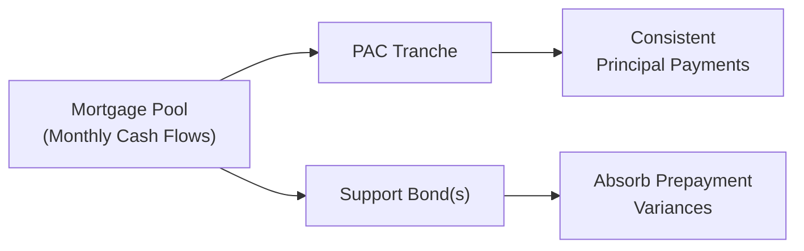
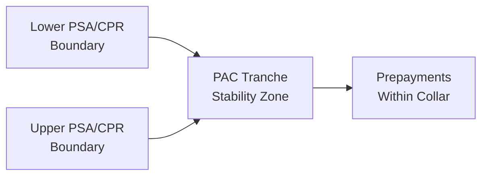

## Overview

Have you ever been puzzled by how some mortgage-backed structures promise (at least in theory) a relatively stable stream of principal payments, even in the face of changing prepayments? Well, that’s precisely what Planned Amortization Class (PAC) tranches in Collateralized Mortgage Obligations (CMOs) attempt to do. Granted, there’s no magical remedy that guarantees total stability—prepayments can still take surprising turns. But PACs come about as close as one can reasonably get to predictable principal schedules, thanks to their “collar” mechanism and the help of companion (support) bonds.  

In this section, we’ll walk you through how the PAC collar is defined, why support bonds are necessary, and the often-underestimated problem of extension risk. And—speaking from personal experience—it’s surprisingly easy to overlook extension risk until you see rates shoot up, and suddenly you’re holding a bond that refuses to amortize as quickly as you’d hoped. So let’s break this down step by step.

## PAC Collar and Prepayment Speeds

A PAC (Planned Amortization Class) tranche is designed with an expected principal repayment schedule. However, real-world mortgage prepayments can be fast (like in a refinancing wave) or slow (when interest rates rise, or mortgage holders decide to stay put). To mitigate the variability in prepayments, PAC tranches define what is often called a PAC collar—a range bounded by two prepayment speeds. Usually, these speeds are specified in terms of the Public Securities Association (PSA) model or in some cases a percentage of the Conditional Prepayment Rate (CPR).  

• Lower speed (e.g., 100% PSA): If prepayments occur more slowly than this lower boundary, the PAC schedule might receive reduced cash flows, and eventually the collar is considered “broken.”  
• Upper speed (e.g., 300% PSA): If prepayments occur faster than this upper boundary, the collar is likewise broken, but in the other direction—the PAC tranche might then receive principal more quickly than scheduled.  

So, if actual prepayments stay somewhere between those two extremes, the PAC tranche will in theory receive a stable, predictable stream of principal. This predictability is what makes PAC tranches so appealing to investors seeking consistent cash flows in an otherwise unpredictable mortgage-backed environment.  

### Breaking the Collar
When we say the collar “breaks,” it’s essentially a fancy way of indicating that actual prepayment rates have drifted outside the originally assumed boundaries. If prepayments are slower than the lower boundary, the PAC tranche doesn’t receive enough principal payments on time, and its average life extends. When prepayments are too fast, the PAC investors receive heavier principal payments much sooner than planned.  

While neither scenario is typically a wonderful outcome, faster-than-expected prepayments can sometimes be a lesser evil because they allow investors to reinvest principal at current market rates. Slower prepayments, on the other hand, force investors to hold the bond at below-market yields when interest rates rise. And that, in a nutshell, is trouble: it’s the dreaded phenomenon known as extension risk.

## The Role of Support (Companion) Bonds

PAC tranches do not stand alone in these structures. Instead, they’re part of a deal that includes other companion tranches known as Support bonds (or simply Companion bonds), which serve as a kind of shock absorber. Whenever actual prepayments differ from the base-case assumptions, these Support bonds absorb the brunt of the discrepancy.  

• Surplus principal (faster prepayments): The Support bond will pay down more quickly than anticipated, thus allowing the PAC tranche to maintain its schedule.  
• Shortfall of principal (slower prepayments): The Support bond receives less or even no principal, while the PAC tranche receives at least its planned principal payments (as much as possible).  

Essentially, the companion bond sits in front of the PAC tranche like a protective layer, absorbing the extremes in prepayment behavior so that the PAC collar remains intact—at least until the discrepancy becomes so large that the collar can’t cope.  

### Why Are Support Bonds Willing to Take This On?
You might be thinking, “Why would an investor choose to hold the Support bond if it bears so much prepayment volatility?” Typically, these support tranches offer a higher yield, compensating for the greater uncertainty in principal cash flows. They’re not for the squeamish, as both extension risk (in slow prepayment environments) and contraction risk (if prepayments accelerate) can hit them more drastically. But the compensation, in the form of an elevated yield premium over more predictable tranches, is the allure.

## Extension Risk: The Key Challenge

Extension risk is the possibility that a security’s expected payment schedule will extend due to slower-than-expected mortgage loan prepayments. In a rising interest rate environment, for instance, homeowners are less likely to refinance, and even voluntary prepayments (like people paying off their mortgages early to move or downsize) can slow considerably if the housing market’s momentum stalls.  

When that happens, well, the bond’s life extends. And as an investor, you’re stuck holding a lower coupon for a longer period, missing out on the opportunity to invest at higher prevailing rates. This can hurt the price of the MBS (Mortgage-Backed Security), because in a rising rate environment longer-duration assets typically experience a heavier price decline.

### Extension Risk and the PAC Collar
Normally, the PAC structure provides protection against extension risk (and contraction risk) within a specified range of prepayments. However, if prepayments drop below the lower bound of the collar, that risk hits you full force. The bond’s effective duration increases as it begins to function more like a tail-end security, with the principal trickling in at a frustratingly slow pace.  

## Support Bond Exposure to Extension Risk

Support bonds are the first to experience extension risk because they receive principal payments only after the PAC tranches have been satisfied (within the collar). In times of slower prepayments:  

1. PAC tranches still attempt to get their scheduled principal.  
2. The leftover principal that would normally flow to the Support bond just isn’t there (because actual prepayments are so low).  
3. The Support bond quickly finds itself with a significantly extended maturity profile, since it can’t get principal paydowns in line with earlier expectations.  

Hence, if you’re holding a Support bond in a rising rate environment, you could find the average life of the bond becoming a moving target—usually moving in the wrong (longer) direction.

## Managing Extension Risk in a Portfolio

Extension risk can surprise unwary portfolio managers. Let’s say the majority of your mortgage-backed holdings are structured so that you’re comfortable with the expected average life. And you might have told yourself: “The mathematical model shows this bond will be paid off in six years; I’m good.” Then interest rates rise by 200 basis points, putting the brakes on mortgage refinances and purchases—suddenly that six-year horizon might become eight, nine, or even longer.  

### Hedging Strategies
To protect against extension risk, portfolio managers may do some or all of the following:

• Interest Rate Swaps: Entering into a pay-fixed, receive-floating interest rate swap can help offset some of the risk of holding a bond that might extend if rates keep climbing. This strategy tends to be used by institutional investors.  
• Treasury Futures or Options: Another approach is to short Treasury futures (or buy interest rate call options) to mitigate price sensitivity if rates continue to move up.  
• Diversifying Across Prepayment Characteristics: Sometimes managers hold a mix of MBS with varying sensitivities to prepayment changes. This diversification can soften the blow when one part of the portfolio extends.  
• Model Monitoring: Keeping a close eye on updated prepayment models is crucial. Mortgage analytics providers frequently adjust their models based on changes in interest rates, home prices, and other economic factors, so you don’t want to rely on outdated assumptions.

## Best Practices and Common Pitfalls

• Best Practice #1: Understand the Prepayment Model  
  It might seem obvious, but many prospective investors rely solely on marketing materials or simplified spreadsheets. Real prepayment modeling is fairly involved, requiring assumptions around interest rates, borrower behavior, housing turnover, and so on.  

• Best Practice #2: Monitor the PAC Collar Regularly  
  A PAC collar is not a static creature. If real-world prepayments hover near the boundaries for an extended period, the risk of breaking the collar grows. Keep track of actual monthly prepayment rates (often published by agencies like Fannie Mae and Freddie Mac) to see trends.  

• Common Pitfall: Overlooking the Late Stages of a Companion Bond  
  Support bonds may behave almost like a normal bond for a while—until an interest rate hike or downturn in housing demand arrives. Then, the bond might extend far beyond your initial expectations. People often ignore that possibility, focusing more on yield than volatility.  

• Common Pitfall: Confusing Contraction and Extension Risks  
  In some markets, investors fret over getting their principal back too soon (contraction risk) because they have to reinvest at lower rates. But it’s usually extension risk that stings the most in a rising rate environment, since you can’t easily shed that longer maturity without potentially selling at a loss.

## Illustrative Diagrams

Below is a simplified view of how MBS principal cash flows are allocated between a PAC tranche and a Support bond.

As you can see, the PAC tranche receives principal in a stable, planned manner within the collar. The Support bond’s role is to take on the fluctuations—if prepayments run faster, the Support bond is paid down quickly; if prepayments run slower, it is the Support bond whose maturity extends.

We can also visualize the concept of a PAC collar graphically. Below, we see a stylized depiction of how the collar is bounded by a lower and upper prepayment speed:

When actual prepayments drift outside that range, the collar “breaks,” and the scheduled principal for the PAC may deviate significantly, ultimately behaving more like a support structure itself.

## Conclusion

Whether you’re new to analyzing mortgage-backed securities or have some experience, it’s easy to underestimate how quickly actual prepayments can derail your best-laid plans. That’s precisely why PAC tranches exist, to promote stability within a “range” of prepayment speeds—and why we have support bonds to shoulder the overflow of principal. Yet no strategy is foolproof. Extension risk, in particular, can turn a once 5-year target horizon into a 9-year slog if rates spike.  

As you continue exploring CMOs in more depth, remember that behind each acronym (PAC, TAC, Companion) lies a set of risk-transfer mechanisms designed to serve different investor preferences. And if there’s one lesson to take away, it’s that prepayment modeling—and the constant monitoring of it—remains crucial. Keep an eye on those monthly prepayment tapes from Ginnie Mae, Fannie Mae, and Freddie Mac, or you might find your collar unexpectedly broken.

## References

• Hayre, L. (Ed.). (2001). Salomon Smith Barney Guide to Mortgage-Backed and Asset-Backed Securities. New York: Wiley.  
• Vink, D. (2012). Various articles on prepayment modeling. Journal of Structured Finance.  
• Ginnie Mae, Fannie Mae, and Freddie Mac official websites (for prepayment data and MBS structures).  

• See also Chapter 14.4 (“Vignette: Allocating Cash Flows to Tranches”) for a step-by-step example of how cash flows are distributed among PAC and Support tranches under different prepayment scenarios.  

-------------------------------------------------------------------------------------

## Test Your Knowledge: Mastering PAC Collars and Extension Risk



### 1. Which of the following best describes the PAC collar?

- [ ] A guaranteed principal repayment schedule for an MBS 
- [x] A range of prepayment speeds within which the PAC tranche maintains its scheduled principal
- [ ] A stipulation that the CMO cannot break if interest rates rise
- [ ] A device used solely for managing credit risk

> **Explanation:** The PAC collar is defined by lower and upper prepayment speed boundaries. As long as actual prepayments are within that range, the PAC tranche follows its planned payout schedule.

### 2. What happens when actual prepayments fall below the lower bound of the PAC collar?

- [ ] The PAC bond receives faster principal payments
- [x] The PAC schedule cannot be fully maintained, and the bond may extend
- [ ] The support bond entirely shields the PAC from any extension
- [ ] The yield to maturity on the PAC bond immediately increases

> **Explanation:** If prepayments are slower than the lower boundary, the PAC’s original schedule breaks, leading to delayed principal payments and an extended effective maturity for investors.

### 3. Which statement best describes the role of support (companion) bonds in a CMO structure?

- [ ] They guarantee that the PAC will never break its collar
- [x] They absorb the fluctuations in prepayment speeds so the PAC can remain stable
- [ ] They provide additional subordination for credit enhancement
- [ ] They always pay off at a shorter maturity than the PAC tranche

> **Explanation:** Support (companion) bonds exist to absorb the variances (both faster and slower prepayments), making the stable payout of the PAC tranche possible—at least until the collar is exceeded.

### 4. Which of the following is the primary concern for investors holding MBS when interest rates rise significantly?

- [ ] Contraction risk
- [ ] Inflation risk
- [ ] Default risk
- [x] Extension risk

> **Explanation:** In a rising rate environment, slower prepayments can cause MBS durations to lengthen (extension risk), leaving investors stuck with lower coupon rates for longer.

### 5. Why might a support bond yield be higher than a comparable PAC tranche yield?

- [ ] Support bonds are senior in the capital structure
- [x] Support bonds assume greater prepayment volatility and therefore demand higher yields
- [ ] They are typically labeled as “junk” instruments
- [ ] Support bond payments are guaranteed by the government

> **Explanation:** Support bonds accept the first wave of uncertainty if prepayment speeds deviate from expectations, so investors want higher compensation for that elevated risk.

### 6. Which of the following scenarios would most likely break the upper bound of the PAC collar?

- [ ] A prolonged period of stable interest rates
- [ ] Slower-than-expected prepayments leading to extension
- [x] A refinance boom causing prepayments to spike above the assumed rate
- [ ] An uptick in home prices but stable interest rates

> **Explanation:** The “upper collar” is exceeded when prepayments outpace the high-speed assumption in the PAC structuring, typically during a nationwide rate drop or a big refinance wave.

### 7. In a scenario where the PAC collar is broken due to significantly slower prepayments, which bond is impacted first?

- [x] The support (companion) bond
- [ ] The senior-most PAC tranche
- [ ] The mortgage pool’s residual holder
- [ ] None of the bonds are impacted

> **Explanation:** The support bond takes the initial hit in the case of shortfalls in principal repayment. Its maturity extends to allow the PAC to continue receiving scheduled principal as much as possible.

### 8. A key reason that extension risk can be worse than contraction risk is:

- [ ] Contraction risk never impacts valuation
- [ ] Investors can typically hedge extension risk for free
- [ ] Shorter maturities are always less desirable in any environment
- [x] In higher-rate environments, being locked into a low coupon longer is more harmful

> **Explanation:** When rates rise, holding a lower-coupon bond for an extended period is detrimental. Contraction risk, by contrast, usually arises in a falling-rate environment, which often provides reinvestment options at lower rates.

### 9. Which is not a commonly employed hedge against extension risk?

- [ ] Interest rate swaps (pay fixed, receive floating)
- [ ] Short Treasury futures
- [x] Purchasing long-maturity zero-coupon bonds
- [ ] Buying interest rate call options

> **Explanation:** Purchasing long zeros could further increase duration and magnify interest rate risk; it’s not a typical hedge against extension. Options, futures, and swaps are more direct ways to mitigate upward rate movements.

### 10. True or False: Once a PAC collar is broken, the PAC tranche behaves more like a support bond.

- [x] True
- [ ] False

> **Explanation:** When a PAC collar is breached, the initially stable PAC can lose its planned principal schedule. From that point on, it experiences variations in principal flows more akin to a support bond.


