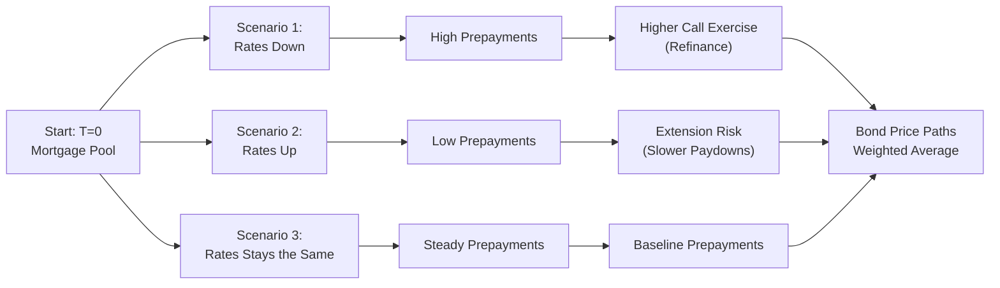

## Introduction and Context

Let’s be honest, valuing Collateralized Mortgage Obligations (CMOs) under shifting interest rate conditions can feel a bit like chasing a moving target. One minute, interest rates look stable, your prepayment assumptions stand nicely, and the next minute—boom—rates fall, prepayments surge, and you’re left with a new spreadsheet fiasco. That’s just the nature of mortgage-backed instruments. They have embedded options (prepayment options) that cause their cash flows and market values to change in often surprising ways. This section is all about the strategies and tools used to value CMOs when rates are anything but static.

Below, we dive into everything from fundamental interest rate modeling to scenario analysis, from Option-Adjusted Spread (OAS) to negative convexity, and from analyzing different tranches to advanced Monte Carlo simulations. By the end, you’ll (hopefully) feel a whole lot more at ease tackling a CMO valuation question—especially in an exam context.

## Significance of Interest Rate Models in CMO Valuation

Flexible and robust interest rate models are critical because the coupon and principal distributions of CMOs hinge on homeowners’ propensity to refinance (i.e., prepay). This prepayment behavior is highly sensitive to mortgage rates and changes in economic conditions. Valuation typically requires at least one of the following approaches:

• Static Prepayment Models: These models assume a constant or simplistic prepayment speed (like a fixed PSA speed). They can serve as quick approximations but often understate reality because they don’t dynamically adjust when rates fluctuate or when major macro events occur.  
• Dynamic Prepayment Models: More advanced models calibrate prepayment rates to fluctuations in mortgage rates, borrower behaviors, and economic drivers. They might incorporate the underlying borrower credit quality, property price movements, or even seasonality (some borrowers prepay more in certain times of the year).  

Many practitioners rely on advanced interest rate lattices or multi-factor models that capture yield curve shifts, interest rate volatility, and path dependency. Because a mortgage can be prepaid in part or in whole at almost any time, the projection of cash flows has to keep up with these real-world intricacies.

## Option-Adjusted Spread (OAS) in CMO Valuation

When a bond incorporates an embedded option—especially a prepayment option—conventional yield spreads can be misleading. That’s why investors use Option-Adjusted Spread (OAS).

At its core, OAS strips out (or “adjusts for”) the embedded option’s value. By comparing the bond’s risk-adjusted yield to a benchmark curve (often the Treasury or swap curve), OAS isolates the compensation an investor receives for bearing the instrument’s credit risk and liquidity risk, net of the embedded option cost.

In equation form, you might think of it roughly as:


\mathrm{OAS} \approx \text{Market Z-spread} - \text{Option Cost (in yield terms)}.


However, real-world implementations are more involved. First, you project the mortgage cash flows across numerous interest rate paths. Then, you discount them at each path’s appropriate forward rates plus a trial spread. Iterating until you find the spread that equates the present value of those paths with the market price yields the OAS. 

The big advantage? OAS-based analytics allow you to compare a wide range of mortgage products, even if they have very different embedded prepayment behaviours.

## Tranche Price Sensitivities: PAC vs. Support

CMOs split mortgage cash flows into multiple tranches, each receiving principal and interest under different rules:

• Planned Amortization Class (PAC) Tranches: With set “schedules,” PACs are designed to produce more stable, predictable cash flows across a range of prepayment rates. They typically have lower average price volatility compared to other tranches because Support tranches bear the brunt of prepayment unreliability.  
• Support Tranches: These tranches pick up the slack—if prepayments are higher or lower than the “expected band” for the PAC. Consequently, they have more volatile cash flows and typically trade at higher yields. The trade-off is more risk: if rates drop and prepayments accelerate, the Support bond’s principal is returned sooner (often limiting price appreciation). On the flip side, if rates rise and prepayment slows, the Support tranche extends and can lose price significantly.

In a rising rate environment, you might see extension risk: prepayments slow, bond extension is likely, and the Support bonds can get hammered because they end up locked in a below-market-yield environment longer. In a falling rate environment, prices for mortgage securities do not rally as much as typical bonds because of prepayments—this is negative convexity (more on that below).

## Scenario Analysis and Stress Testing

Let’s say you want to see how your fancy new CMO will behave if rates climb by 2% or tumble by 1%. Scenario analysis is exactly that: you shift input assumptions (interest rates, credit conditions, or prepayment speeds) and recalculate the bond’s projected cash flows and present value. 

Scenario analysis has a straightforward “what if?” logic. It’s especially important for CMOs because your baseline scenario might assume, for instance, a 5% mortgage rate. But if rates move to 3% next year, prepayment speeds might increase significantly—and the effect is different for a PAC vs. a Support. A thorough approach might incorporate the following:

• Rate Shocks: ±50 bps, ±100 bps, ±200 bps.  
• Prepayment Speed Variations: Adjust PSA from 100% to 300% or 400%.  
• Volatility Changes: If interest rate volatility picks up, could that trigger more strategic refinancing? Or might it not matter if the absolute level of rates is unchanged?

A typical exam scenario might read: “Assume a 1% drop in the yield curve. Evaluate the impact on a PAC bond vs. Support bond,” and you’d highlight that the Support bond’s price changes more drastically (due to higher negative convexity), while the PAC bond holds up a bit more steadily in that environment.

## Negative Convexity and Its Implications

“Negative convexity,” that dreaded phenomenon for mortgage-related instruments, basically means that when rates fall, you think your bond price might rally (like a normal bond). But because of prepayments, the bond’s effective duration shortens, and the price gain is capped relative to plain-vanilla bonds. The embedded call option (i.e., the homeowner’s right to prepay) is more likely to be exercised precisely when it’s most painful for the bondholder—those pesky borrowers refinance and pay you back early at par, limiting how far your bond’s price can rise.

Conversely, when interest rates rise, borrowers slow their prepayments, so you’re stuck receiving below-market coupon rates for longer, which causes a bigger drop in price compared to bonds without embedded prepayment options. The result is a curvature profile that dips below the standard bond price-yield curve, particularly in interest rate decline scenarios.

Support tranches exhibit especially pronounced negative convexity because they have less structural protection from prepayment fluctuations. For some folks, it’s reminiscent of “heads you lose, tails you also lose” in extreme rate moves. 

## Using Monte Carlo Simulation for Path-Dependent Valuation

Monte Carlo analysis is like scenario analysis on steroids. Instead of shifting interest rates by one or two “shock amounts,” you randomly (but systematically) generate a large number of possible future interest rate paths—each with consistent volatility and correlation assumptions across the yield curve. For each path, you calculate the projected mortgage cash flows, taking into account path-dependent prepayment triggers:

1. Rates go down in Path A, so prepayments accelerate.  
2. Halfway along Path A, rates go up, reducing further prepayments.  
3. Path B shows steadily rising rates, causing minimal prepayments but bigger extension risk for certain tranches.

Then you discount these path-specific cash flows at the appropriate rates, compute the average (or risk-adjusted average) bond price across all paths, and arrive at a more holistic measure of the bond’s fair value. 

Monte Carlo is particularly useful because real-life mortgage prepayments often depend on the sequence and timing of rate moves, not just a single endpoint. Borrowers might refinance in year 2 if rates are favorable, which means your bond’s year 3 or year 4 principal is dramatically changed. A binomial or trinomial tree can help, but for complicated real estate movements or multiple rate factors, a robust Monte Carlo approach typically yields a more refined result.

Below is a simple Mermaid diagram showing how path-dependent interest rates can affect a single mortgage bond’s projected principal repayment:

In actual practice, you’d have dozens or hundreds of scenarios. Each path has discrete time increments (monthly or quarterly) where rates can shift in small increments, and prepayments are re-estimated along the way.

## Bringing It Together: Practical Steps for Valuing a CMO

1. Model the Interest Rate Environment  
   Decide if you use a static or dynamic approach. For a more robust analysis, calibrate a dynamic model (e.g., lognormal interest rate model, Hull-White model, or a two-factor approach).

2. Determine Prepayment Assumptions  
   Incorporate data on borrower responsiveness, historical PSA speeds, and potentially refine them with different macro scenarios or volatility assumptions.

3. Run Your Valuation Engine (OAS or Otherwise)  
   Use OAS methods if you want to compare the bond’s spread fairly to other instruments. Or run a simpler yield-spread analysis if you only need a ballpark figure (but be aware that ignoring optionality can misguide your results).

4. Check Different Tranches  
   Look at price sensitivity for the PAC vs. the Support tranches. Understand that negative convexity is more pronounced for certain structures.

5. Perform Scenario and/or Monte Carlo Analysis  
   Evaluate the bond (or portfolio) under a range of interest rates, prepayment speeds, and volatility regimes. For advanced or large portfolios, Monte Carlo simulation typically yields deeper insights.

6. Interpret and Adjust  
   If your bond shows high negative convexity, consider hedging strategies or weigh whether that risk is acceptable. For instance, you might combine a mortgage product with swaptions or interest rate futures to mitigate certain rate exposures.

7. Document, Document, Document  
   As you can imagine, fiddling with these complicated prepayment and rate models can lead to confusion. Keep a clear record of your assumptions, calibrations, and results. On exam day, clarity in your approach is just as important as numerical accuracy.

## Best Practices, Common Pitfalls, and Exam Tips

• Best Practice: Always examine the range of possible future states because single-point estimates (like a static PSA assumption) might blindside you if rates move quickly.  
• Common Pitfall: Overlooking the effect of changing rate volatility. Higher volatility can incentivize more prepayments in some environments and reduce them in others, which drastically changes your bond’s average life.  
• Another Pitfall: Confusing OAS with the nominal spread or Z-spread. Remember, OAS is specific to measuring yield after factoring in optionality.  
• Exam Tip: Be ready to discuss how negative convexity bites you in both rising- and falling-rate scenarios, and how this effect is amplified in Support tranches compared to PAC tranches.  
• Time Management: Outline your CMO analysis in a structured manner: interest rates → prepayment model → scenario analysis/OAS → conclusions. Doing so under time pressure keeps you from skipping key steps.

It’s possible that on exam day, you’ll face a vignette describing a mortgage pool, some details on the borrower’s characteristics, a mention of a particular prepayment model (maybe a 200% PSA, for instance), and then a question about how the bond’s price would respond to a 100-basis-point drop. If you keep the negative convexity concept at the forefront, along with the difference between a PAC and a Support, you’ll be well ahead of the curve.

## Glossary

• Option-Adjusted Spread (OAS):  
  The incremental yield over a benchmark curve after accounting for an embedded option’s cost or value—often used to measure the relative value of mortgage-backed securities with prepayment options.  

• Negative Convexity:  
  A phenomenon where the effective duration of a mortgage security shortens in falling-rate environments (due to increased prepayments), limiting the price appreciation compared to a standard (positively convex) bond.  

• Scenario Analysis:  
  A method of stress testing a bond or portfolio by recalculating its price and risk exposures under different assumed interest rates or macroeconomic environments.  

• Monte Carlo Simulation:  
  An advanced modeling technique that creates many randomized interest rate paths (under specified volatility and correlation assumptions) to capture the path-dependent nature of mortgage prepayments.

## References and Further Exploration

• Goodman, L., et al. (2021). “Loss Severity on Residential Mortgages: Alternative Markets and Models.” New York: Wiley.  
• Duffie, D. & Singleton, K. (2003). “Credit Risk: Pricing, Measurement, and Management.” Princeton, NJ: Princeton University Press.  
• Brigo, D. & Mercurio, F. (2007). “Interest Rate Models—Theory and Practice.” Heidelberg: Springer.

If you want to go deeper, you might read up on these references, especially Brigo & Mercurio for advanced interest rate modeling or Goodman et al. for the intricacies of mortgage analytics.  

Also, keep in mind that technology matters: in practice, you’ll likely use specialized vendor software to run Monte Carlo or OAS calculations because the computations can get quite intense without automation.

Ultimately, mastering the valuation of CMOs in a changing rate environment is about balancing a thorough theoretical framework with practical scenario-based thinking. Remember to track not just the direction of rates but also their volatility, and watch out for those built-in prepayment calls quietly waiting to strike.

## Test Your Knowledge: Valuing CMOs in a Changing Rate Environment



### 1. A primary benefit of using a dynamic prepayment model rather than a static one is:

- [ ] It removes all uncertainty about future prepayments.
- [x] It adjusts prepayment speeds based on changes in interest rates and economic factors.
- [ ] It guarantees a higher yield for investors.
- [ ] It eliminates the need for scenario analysis.

> **Explanation:** Dynamic prepayment models consider how varying interest rates, refinancing incentives, and economic factors affect prepayment behavior over time, providing more realistic cash flow estimates.

### 2. Which of the following statements correctly describes Option-Adjusted Spread (OAS)?

- [ ] OAS is purely the nominal spread to Treasury yields.
- [ ] OAS excludes the cost of embedded borrower options.
- [x] OAS is the spread to a benchmark curve after removing the effect of embedded options.
- [ ] OAS is the same as a credit spread.

> **Explanation:** OAS accounts for embedded options such as prepayments by adjusting the spread. It helps investors isolate credit or liquidity compensation from optionality.

### 3. In a falling rate environment, what is a typical effect on a Support tranche of a CMO?

- [x] It may exhibit stronger negative convexity and face accelerated prepayments.
- [ ] It will fully insulate investors from prepayment risk.
- [ ] Its effective duration will become longer.
- [ ] It will maintain the same price sensitivity as a PAC tranche.

> **Explanation:** Support tranches absorb prepayment variability, so in falling rate scenarios (where prepayments pick up), they tend to show quicker principal return and more negative convexity than PAC tranches.

### 4. When performing scenario analysis, analyzing ±100 bps shifts in rates helps an investor:

- [ ] Eliminate the need to consider different prepayment speeds.
- [ ] Avoid dealing with interest rate volatility altogether.
- [x] Understand how CMO valuations might change if rates rise or fall by 1%.
- [ ] Guarantee a more stable bond price.

> **Explanation:** Scenario analysis with specified rate shifts allows investors to see potential changes in cash flows and valuations, preparing them for a range of outcomes.

### 5. Negative convexity is best described as:

- [x] A situation where a bond’s duration shortens as interest rates decline.
- [ ] A benefit that increases bond returns in falling-rate environments.
- [ ] An anomaly caused only by zero-coupon bonds.
- [ ] A measure of default probability.

> **Explanation:** Negative convexity happens when the embedded call (prepayment) is more likely to be exercised as rates drop, limiting price upside and shortening duration.

### 6. Monte Carlo simulation is especially valuable for CMO valuation because:

- [ ] It requires fewer computational resources than a single scenario analysis.
- [ ] It ensures that rates only move in one fixed direction.
- [ ] It captures only normal distribution outcomes.
- [x] It incorporates path-dependent prepayment behavior across numerous rate paths.

> **Explanation:** Monte Carlo methods generate many possible interest rate paths and recalculate prepayments for each, capturing the path dependence crucial for mortgage-backed securities.

### 7. How does an increase in interest rate volatility generally affect a CMO?

- [ ] It has no impact on the option value in the mortgage.
- [ ] It makes prepayments entirely predictable.
- [x] It can increase the value of the embedded prepayment option, altering pricing.
- [ ] It reduces negative convexity.

> **Explanation:** Higher volatility magnifies the likelihood of rates moving significantly, increasing the value of the embedded option (prepayment) and thus affecting spreads and pricing.

### 8. One common pitfall in valuing CMOs is:

- [ ] Using multiple interest rate scenarios.
- [ ] Incorporating dynamic prepayment assumptions.
- [x] Treating the mortgage security as if it had no embedded options.
- [ ] Factorizing negative convexity into the final price.

> **Explanation:** Ignoring embedded options by applying a simple spread to Treasuries can produce large inaccuracies. CMOs require models that consider optionality.

### 9. Among CMO tranches, a support tranche typically:

- [ ] Has the most stable cash flows under varying prepayment rates.
- [ ] Trades at lower yield due to reduced risk.
- [x] Absorbs excess or shortfalls in cash flow, leading to higher volatility.
- [ ] Matches the payoff profile of a standard Treasury bond.

> **Explanation:** The support tranche is designed to stabilize the PAC tranche’s cash flows. It absorbs variations in prepayment, which leads to more volatile cash flows and higher yield compensation.

### 10. True or False: Higher prepayments in a falling rate environment can limit a mortgage security’s price appreciation.

- [x] True
- [ ] False

> **Explanation:** This is the essence of negative convexity. When borrowers prepay faster, investors are returned principal earlier at par, thus capping the potential price gain of the bond.


