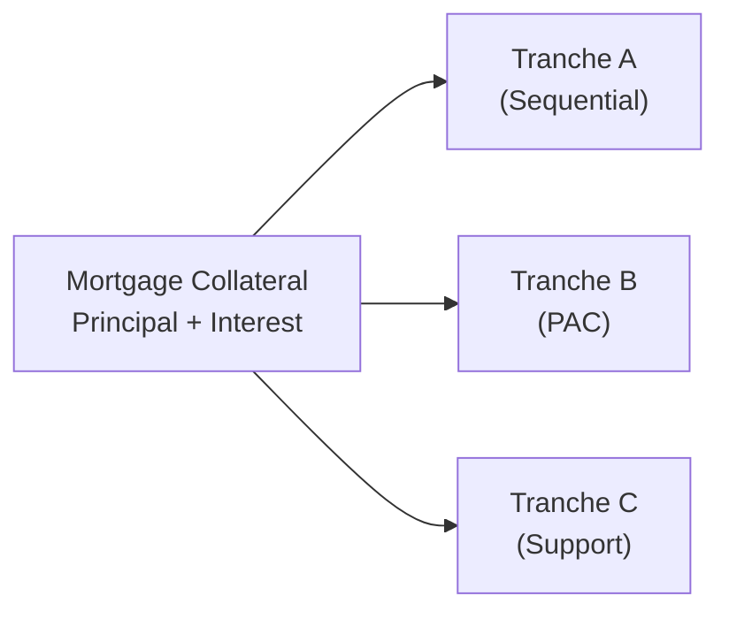

## Introduction and Scenario Overview

I remember the first time I came across a Collateralized Mortgage Obligation (CMO) structure with multiple tranches—PAC, Support, and Sequential. I was, well, a bit startled. There's something humbling about seeing mortgage payments carved up in a way that tries to meet different investors’ needs all at once. But hey, once you dig into the details, it actually begins to make sense: each tranche is designed to distribute the risk of prepayments and interest rate changes in a logical “waterfall.”

This section explores a typical real-world scenario for a newly issued CMO. We’ll define tranches, talk about principal and interest allocation, show you the step-by-step approach (which, by the way, is basically the blueprint for handling CMO waterfalls), and walk through how to handle unexpected changes in prepayment speeds. The big takeaway is learning how the predictable portion of your CMO (sometimes referred to as the Planned Amortization Class, or PAC) gets priority up to its scheduled amount, while the so-called Support bond absorbs the “excess” or “shortfall.” You get a neat perspective on how average life changes as interest rates or prepayment assumptions fluctuate.

## The CMO Structure: Tranches and Waterfall

Collateralized mortgage obligations typically pool a set of mortgage loans (the collateral). The monthly or quarterly cash flows—interest and principal payments—are then distributed to tranches. Each class of bond (or “tranche”) has different characteristics:

• A Sequential Tranche generally receives principal payments only after other higher-priority classes are paid down.  
• A PAC (“Planned Amortization Class”) Tranche has a defined principal repayment schedule, assuming prepayment remains within a predetermined band (the “collar”).  
• A Support Tranche absorbs prepayment risk extremes. If prepayments exceed the PAC schedule, the Support tranche might receive faster paydowns; if prepayments slow down, the Support tranche might go hungry for a while, extending its maturity.

Below is a simplified illustration of a typical waterfall in which cash flows from the mortgage collateral are allocated among three tranches according to priority:

In practice, of course, each tranche’s specific details—coupon rate, notional amount, priority rules, etc.—will shape how interest and principal flow each month.

## Hypothetical Example

Let’s imagine we have a newly issued CMO with the following key tranches:

| Tranche                   | Notional Amount | Coupon Rate (Annual) | Role in Structure               |
|---------------------------|-----------------|----------------------|---------------------------------|
| Tranche A (Sequential)   | \$100 million   | 3.50%               | Gets principal after PAC needs are met |
| Tranche B (PAC)          | \$100 million   | 3.25%               | Receives scheduled principal first      |
| Tranche C (Support)      | \$50 million    | 4.00%               | Buffers prepayment risk                |

• Assume the underlying mortgage collateral has a total principal of \$250 million and the pooled mortgages pay 4.50% weighted average coupon.  
• We also assume (for simplicity) a monthly payment structure.  
• Base-case prepayment speed assumption: 100% PSA (we’ll define “slow” as 50% PSA and “fast” as 200% PSA).  

### Interest Payments

Interest is generally straightforward: each tranche receives interest on its outstanding notional at the stated coupon rate. For instance, in the first month, if Tranche A’s entire \$100 million is outstanding:

• Monthly interest = (3.50% / 12) × \$100 million = \$291,667  

Similarly, Tranche B would receive (3.25% / 12) × \$100 million = \$270,833, and Tranche C would get (4.00% / 12) × \$50 million = \$166,667, assuming no principal has yet amortized away.

### Principal Payments

Principal payments follow the waterfall sequence:

1. PAC (Tranche B) aims to receive its scheduled principal based on standard prepayment assumptions. The monthly schedule is determined at issuance, ensuring that—if actual prepayment rates stay within a certain “collar” range—Tranche B receives enough principal to adhere to a planned amortization timetable.
2. Any principal in excess of the PAC schedule is then typically allocated to the next tranche in the sequence, in this case, the Sequential Tranche A or the Support Tranche C, depending on the structure. Often, the Support bond takes any leftover or shortfall once the PAC schedule is covered.  
3. If the monthly prepayments are insufficient to fulfill the PAC schedule, the Support bond forgoes principal, allowing the PAC class to remain on track (up to a limit known as the collar boundary).

## Step-by-Step Cash Flow Allocation

Let’s walk through an oversimplified monthly allocation in “Month 1.” We assume total principal available (scheduled plus prepayments) is \$5 million. The PAC schedule says Tranche B must receive \$3 million in principal this month to remain on track.

• First, from the \$5 million principal, \$3 million goes to Tranche B (the PAC), fulfilling its schedule.  
• We have \$2 million left. Suppose the structure states that after the PAC obligations are met, the next \$1 million goes to the Sequential Tranche A, and the remainder flows to the Support bond (Tranche C).  

Hence:

• Tranche B (PAC) receives \$3 million in principal.  
• Tranche A receives \$1 million.  
• Tranche C (Support) receives \$1 million.  

From an interest standpoint, each tranche gets interest on its outstanding balance. So, effectively:

- Tranche B’s new outstanding is \$97 million after Month 1.  
- Tranche A’s new outstanding is \$99 million.  
- Tranche C’s new outstanding is \$49 million.  

Why is this so important? Because in Month 2, the interest due on each tranche is based on these new principal balances. Meanwhile, the PAC schedule might call for \$3 million again (or a slightly different figure, depending on the amortization table and next-month assumptions). If we run short of principal overall in the next month, the support bond might have its principal portion reduced or withheld entirely so the PAC can maintain its schedule.

## Changing Prepayment Speed

Now, let’s say in “Month 2,” our prepayment speed significantly increases—jumping from 100% PSA to 200% PSA. So there’s extra principal collected, let’s hypothetically say \$7 million in total principal. You’ll see an immediate effect on the allocations:

1. Tranche B (PAC) still aims for its monthly schedule, which might be \$3.1 million this time.  
2. Because more principal is available than needed by the PAC, additional funds go to the next priority. Under many structures, the Support bond is designed to absorb these “excess” prepayments. If the support bond still has outstanding balance, it might gobble up that extra allocation—thus repaying more principal than expected.  

But if “Month 3” sees a slowdown to 50% PSA, the PAC is still due its next monthly schedule (maybe \$3.2 million). If that schedule can’t be met from the lower principal collections, the Support bond gets no principal. Meanwhile, the PAC is “protected” to an extent. 

This is precisely how the CMO tries to create a stable profile for the PAC, while letting the Support bond fluctuate more widely in its average life.

## Impact on Average Life

“Average Life” (often used interchangeably with “Weighted Average Life” or WAL) is a measure of how many years it takes on average for the bond’s principal to be repaid. It incorporates the expected timing of principal distributions.

• Under slow prepayment (50% PSA), the Support bond is likely to be “locked out” from receiving principal for an extended period, leading to a longer average life.  
• Under the base-case scenario (100% PSA), the Support bond might get principal at a moderate, stable pace.  
• Under fast prepayment (200% PSA), the Support bond sees principal come in sooner than planned, hence it shortens in average life—a dream scenario for an investor wanting a quick return of principal, though there could be reinvestment risk.  

The PAC bond, by design, tries to remain more stable across these scenarios as long as the speed remains within the collar (e.g., 80%–200% PSA). The sequential tranche typically gets principal after the PAC is satisfied, so it experiences moderate variability—but more than the PAC bond.

## Detailed Allocation Example

To make this tangible, let’s outline a simple second-month scenario. Below is a hypothetical breakdown of total cash flows:

• Total interest from the pooled mortgages: \$937,500 (given the 4.50% annual coupon on \$250 million, on a monthly basis).  
• Total principal from scheduled payments + prepayment: \$7 million.  

Assume the PAC schedule for Tranche B requires \$3.1 million in Month 2:

1. Interest Allocation (across three tranches, pro rata to outstanding balances):
   - Tranche A: 3.50% ÷ 12 × \$99 million = \$288,125  
   - Tranche B: 3.25% ÷ 12 × \$97 million = \$262,708  
   - Tranche C: 4.00% ÷ 12 × \$49 million = \$163,333  
   - Total = \$714,166. The difference from \$937,500 in mortgage interest reflects servicing fees, guarantee fees, and sometimes leftover interest allocated to the equity or IO tranches, if any. For simplicity, we assume the remainder goes to the aggregator or leftover bonds.  

2. Principal Allocation:
   - First \$3.1 million to Tranche B (PAC).  
   - Remaining principal available = \$7 million – \$3.1 million = \$3.9 million.  
   - Let’s say, next \$2 million goes to Tranche A, based on the specific structure.  
   - We have \$1.9 million left, which flows to Tranche C (Support).  

Hence, at the end of Month 2:
   - Tranche B new balance: \$93.9 million (it started Month 2 at \$97 million).  
   - Tranche A new balance: \$97 million (it started Month 2 at \$99 million).  
   - Tranche C new balance: \$47.1 million (it started Month 2 at \$49 million).  

This step-by-step breakdown is exactly the kind of detail you might see in an exam vignette. The entire approach is fully testable—knowing how to allocate interest and principal, plus the line reasoning that the “leftover” or “excess” principal typically ends up with the Support tranche.

## Exam Best Practices

• Memorize the “Waterfall” Logic: In the heat of an exam, you’ll want to quickly identify which tranches must be paid first (usually PAC to meet a schedule) and how leftover principal is distributed (often to Support).  
• Keep Track of Outstanding Balance: A new principal balance each month or quarter means a new interest calculation.  
• Watch Out for Speed Changes: The moment you see that prepayment speeds changed from 100% PSA to 200% PSA (or 50% PSA), you know the principal breakdown is going to shift. The PAC schedule, if within its collar, remains the same, but everything else gets jockeyed around.  
• Summarize in Steps: For each period, write out the total interest, total principal, and then systematically distribute them according to priority. Attempt to keep a “running tally” of outstanding principal to avoid confusion.  
• Time Constraints: The exam typically offers partial data, so be ready to do some quick short-hand calculations. Label your steps clearly.  

## Glossary

• Notional Amount (Tranche Principal)  
  The stated, or face, value of a bond. For CMOs, interest payments are calculated as a percentage of the notional amount, and principal paydowns knock down this notional over time.

• Prepayment Speed Assumption (PSA)  
  A standardized model (e.g., 100% PSA) indicating the rate at which borrowers prepay their mortgages. 100% PSA is a baseline; 50% means slower than base, 200% means faster.

• Average Life Computation  
  The average number of years until the bond’s principal is repaid, factoring in the expected schedule plus any prepayments. PAC tranches tend to have more stable average lives, while Support tranches can experience large swings.

• Waterfall Structure  
  The graphical or conceptual representation of how cash flows (principal and interest) trickle down from top-priority tranches to lower-priority tranches, ensuring some tranches receive their scheduled payments before others.  

## References and Further Reading

• Fabozzi, F. (2016). “Bond Markets, Analysis, and Strategies,” 9th Edition. Boston, MA: Pearson.  
• CFA Institute Resources on structured finance and mortgage-backed securities.  
• Research publications from major banks (e.g., JPMorgan, BofA Securities) on real-time CMO strategy and risk analysis.  

## Test Your Mastery of CMO Cash Flow Allocation



### 1. Which bond typically absorbs excess prepayment in a CMO structure that includes a PAC tranche?

- [ ] The PAC tranche
- [x] The Support tranche
- [ ] The Sequential tranche
- [ ] The IO strip

> **Explanation:** The Support tranche is designed to take on additional principal when prepayments are higher than expected, protecting the PAC’s schedule.

### 2. In Month 1, if a PAC tranche requires \$2 million in principal and total principal available is \$3.5 million, how much can the Support tranche receive (assuming the entire remainder flows to Support)?

- [ ] \$2 million
- [ ] \$1.5 million
- [x] \$1.5 million, but only if the sequential has no priority
- [ ] \$3.5 million

> **Explanation:** After \$2 million goes to the PAC, \$1.5 million is left. If the structure states it all goes to Support next, then \$1.5 million is allocated to the Support tranche.

### 3. The average life of a Support bond may extend drastically if prepayments:

- [ ] Remain stable at 100% PSA
- [ ] Increase from 100% to 200% PSA
- [ ] Fall within the collar
- [x] Drop significantly below the collar

> **Explanation:** When prepayments slow down, the Support bond receives less principal or sometimes none at all. This delay can significantly extend its average life.

### 4. If Tranche A (Sequential) is entitled to receive principal only after the PAC tranche meets its scheduled payments, which best describes Tranche A’s exposure to prepayment risk?

- [ ] Completely insulated from prepayment risk
- [x] Moderate exposure, as it depends on leftover principal after PAC
- [ ] High volatility in average life
- [ ] No exposure unless rates rise

> **Explanation:** Sequential tranches come after PAC tranches in the waterfall. They have moderate exposure since the PAC must be met first, but they don't absorb all the extreme swings which the Support bond would.

### 5. A certain PAC bond has a scheduled principal of \$2 million in a given month, and total principal collected in that month is \$1.8 million. How does the shortfall typically get handled?

- [x] The Support bond receives zero principal
- [ ] The manager borrows \$200,000 to meet the schedule
- [ ] The PAC bond is forced to accept \$1.8 million only
- [ ] The difference is reallocated to the IO strip

> **Explanation:** If the total principal is insufficient to meet the PAC schedule, the Support bond typically gets nothing until the PAC bond is made whole, up to the limits defined by the collar.

### 6. At issuance, a PAC tranche’s principal schedule is based on:

- [x] A certain range of PSA prepayment scenarios
- [ ] The highest possible PSA
- [ ] Actual realized prepayments each month
- [ ] Absolute random chance

> **Explanation:** PAC structures define a schedule that remains on track as long as the actual prepayment speeds are within the specified collar (range).

### 7. Interest due to each tranche is calculated by:

- [ ] Taking the total collateral interest and splitting it equally
- [x] Multiplying each tranche’s coupon rate by its outstanding notional
- [ ] Prioritizing whichever tranche is senior
- [ ] Using leftover proceeds after paying principal

> **Explanation:** Each tranche earns interest based on its stated coupon rate applied to its outstanding principal. The priority rules primarily apply to principal distributions, not interest.

### 8. Over multiple periods, which bond in a typical PAC/Support structure experiences the greatest variability in principal receipt?

- [ ] PAC
- [x] Support
- [ ] Sequential
- [ ] Senior AAA

> **Explanation:** The Support bond is designed to absorb variability in prepayments once the PAC’s schedule is met, leading to the greatest swings in realized principal inflows.

### 9. To compute the average life of a CMO tranche, one would:

- [ ] Estimate the yield to maturity and discount the future interest cash flows
- [x] Weigh each expected principal payment date by the proportion of total principal returned
- [ ] Set it equal to the final maturity date
- [ ] Use only the shortfall months to model the extension risk

> **Explanation:** Average life (or weighted average life) calculates the weighted average time to receive all principal, weighting each payment date by the share of principal returned on that date.

### 10. The bond with the most stable average life in a PAC/Support CMO structure is often:

- [x] The PAC tranche
- [ ] The Support tranche
- [ ] The leftover principal strip
- [ ] The interest-only bond

> **Explanation:** By design, the PAC bond maintains a relatively stable average life, as it receives priority principal allocations within a defined collar of prepayment speeds.



---

Feel free to revisit the step-by-step logic and practice building your own schedules for each PSA scenario. The best approach is to methodically track how each tranche’s outstanding principal changes through time. This vantage point not only helps on the exam but also clarifies key risks in the real world—especially for investors who want predictable structures (the PAC folks) or who are willing to absorb big swings in return for higher yields (the Support folks).
