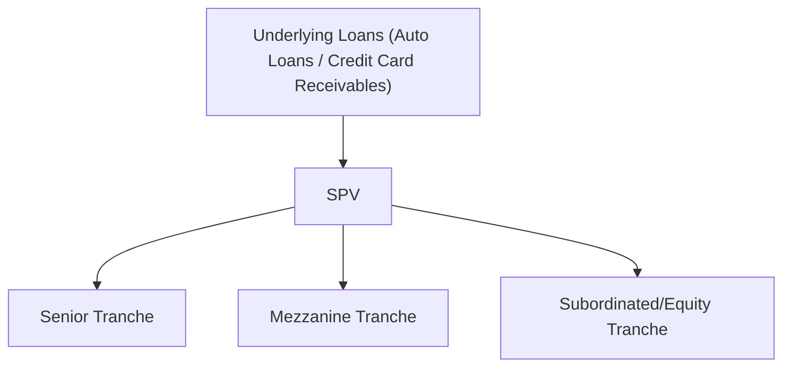

## Introduction
Sometimes, when people first hear about Asset-Backed Securities (ABS), they imagine something super complex or incredibly risky—perhaps reminiscent of the mortgage meltdown stories in the news. But if you dig a bit deeper, you’ll see that ABS can be quite straightforward in concept. At its core, an ABS is simply a bond or note that’s backed by a pool of receivables—think auto loans, credit card debt, or even student loans. These receivables generate cash flows, which then flow to investors in the form of interest and principal payments. 

In this section, we’ll home in on two very common collateral types for ABS: auto loans and credit cards. They might sound mundane, but—trust me—they play a critical role in the financial markets and are core content areas at Level II of the CFA® Program. We’ll break down how each type of ABS is structured, where the cash flows come from, and the different risk considerations that are likely to pop up in a test vignette. We’ll also talk about some typical credit support features like excess spread and early amortization triggers. By the end, you should feel comfortable analyzing the differences between auto loan ABS and credit card ABS and telling your friends (or maybe just your study group) all about them.

## Overview of Asset-Backed Securities
Before diving headfirst into auto loans and credit cards, let’s set the stage. An ABS is created when a bank or finance company bundles together a pool of loans or receivables—they might be auto loans, credit card balances, even student loans—and sells interests in that pool to investors through a Special Purpose Vehicle (SPV). The SPV is like a protective wrapper: it isolates the assets (the loans or receivables) from the original lender, which can help mitigate certain legal and insolvency risks.

Investors typically buy ABS for diversification, predictable cash flows, and yield pickup compared to, say, government bonds. Meanwhile, issuers (the banks or finance companies) get funding up front by selling these loans off their balance sheets. So it’s a two-way win (in theory) if everything is done carefully and ethically.

## Auto Loan ABS: Building Blocks
Auto loans are popular collateral for ABS because they’re fairly straightforward. You have a borrower (the car buyer) making monthly payments of principal and interest. These payments are somewhat predictable—borrowers usually repay over three to seven years, or sometimes shorter, depending on the loan contract. Rates are often fixed. 

### Cash Flow Structure
When an auto loan ABS is created, the SPV holds the underlying auto loans. Each month, borrowers send in their payments. The SPV uses those funds (less servicing fees and other expenses) to pay interest to bondholders and then to pay principal, usually based on a pre-agreed amortization schedule.

Prepayments can happen if borrowers trade in their vehicles or refinance. And let’s be honest—people do that a lot. Borrowers might get a better deal on a new loan, or perhaps they suddenly come into some cash. These prepayments can slightly reduce the average life of the ABS. Unexpected early repayments can disrupt your neat little timeline of cash flows, creating the well-known “prepayment risk.” 

### Collateral Characteristics
Auto loan ABS performance depends on the quality of the underlying loans. Analysts look at:
• Loan-to-value (LTV) ratios: The proportion of the car’s value financed. Lower LTV tends to mean lower risk.  
• Borrower credit profile: Prime vs. subprime borrowers.  
• Vehicle type: A brand-new SUV might hold its value longer than a used sedan—but it depends on market conditions.  

When analyzing an auto loan ABS, you’ll often see this info summarized in a report describing the pool’s weighted average LTV, borrower FICO scores, loan seasoning (how long they’ve been outstanding), and so forth.

### Default Risks
Of course, if borrowers stop paying, life gets dicey. That’s default risk, and it can vary widely based on economic conditions. A wave of unemployment could cause a spike in auto loan defaults. The strong investor protection here is that the underlying vehicle can be repossessed. Yet repossession and resale can be costly, and the car might depreciate quickly—so your recovery might be limited. 

## Credit Card ABS: Building Blocks
Credit card receivables are a bit trickier. Unlike auto loans, credit card balances don’t have a fixed maturity. Borrowers (a fancy name for everyday credit card holders) can revolve their balances, pay the minimum amount due, or pay off their entire balance every month. And so this results in a continuing cycle of new borrowing and repayment that’s less predictable than an auto loan’s straightforward amortization.

### Revolving Period
Because of this indefinite pay-down schedule, credit card ABS often feature a revolving period—during which all or part of the principal you receive is reinvested in new receivables. Essentially, the principal portion is kept within the deal to buy more credit card loans, so the investors only receive interest at that stage. This can last for a defined period (say, two to five years).

When the revolving period ends, the ABS transitions into an amortization period, distributing principal back to investors. That can be either controlled amortization (gradual) or rapid amortization if specific triggers are hit.

### Early Amortization Triggers
Early amortization triggers come into play if the performance of the credit card receivables deteriorates. Suppose charge-offs (i.e., debt written off due to borrower default) exceed a threshold, or the portfolio yield on the credit card balances drops. In that event, the structure might flip from revolving to paying back the ABS investor principal more quickly. In exam scenarios, you’re frequently asked to identify these triggers and explain how they protect senior investors—yet also reduce reinvestment flexibility.

### Excess Spread
Excess spread is the difference between the yield on the credit card receivables (the interest and fees cardholders pay) and the coupon (plus fees) paid to ABS investors. This difference often serves as a buffer against losses before more formal credit enhancements (like subordination or a reserve fund) come into play. If excess spread is consistently high, newly arising losses can be absorbed, so they don’t erode principal. In a tough market, though, that excess spread might shrink or even disappear if borrowers stop paying or if interest rates float in an unfavorable way (many credit card rates are tied to prime or other benchmarks).

## Cash Flow Waterfalls and Tranching
Most ABS feature multiple tranches—like senior, mezzanine, and equity or subordinated tranches. These tranches are a bit like floors in a building: The top floor (senior notes) sees the money first in the event of partial cash flows, while the equity or subordinated tranches sit at the bottom and absorb the first losses. In practice, you might see:

• Senior tranche: Highest credit rating, lower coupon, paid first in normal times.  
• Mezzanine tranche(s): Middle-tier credit standing and yield.  
• Subordinate (equity) tranche: Absorbs losses first, often highest yield.

The reason this matters for the exam is that each tranche carries different default probabilities and expected yields. Analysts must understand how the waterfall works—particularly how the structure divvies up principal and interest if there are losses or if triggers are tripped.

Below is a simplified diagram showing the flow from the collateral to bondholders. You’ll notice how principal and interest are collected by the SPV, then allocated according to the waterfall:

• A collects principal and interest from the pool of loans.  
• The SPV (B) disburses payments to investor classes in order of seniority.  
• Losses first affect the lower tranches before impacting senior notes.

## Distinguishing Auto Loan ABS from Credit Card ABS
Even though both are called “ABS,” auto loan deals differ from credit card deals in a few major ways:

• Maturities: Auto loans have a finite, predictable maturity; credit card balances are perpetual until the borrower pays them off (but they often revolve indefinitely).  
• Prepayment Profile: Auto loan borrowers might prepay to sell or trade their car; credit card holders can pay off or add to balances unpredictably.  
• Revolving Periods: Common for credit card ABS; rarely used in auto loan ABS, which typically just pay down over time.  
• Early Amortization: A hallmark of credit card ABS, triggered by adverse performance metrics; in auto loan ABS, principal is paid out more linearly.  

From a test-taking standpoint, you might be asked about the effect of early amortization on credit card ABS or how the decline in used-car market values might hamper recoveries for auto loan collateral.  

## Risk Considerations
### Prepayment Risk
• Auto Loans: Prepayments speed up the return of principal and can reduce total interest earned. 
• Credit Cards: “Prepayments” in credit cards aren’t quite the same. Cardholders reducing their balance or paying it off entirely is ongoing. This unpredictability influences the timing of the principal distribution to investors (especially once the revolving period ends).  

### Default / Charge-Off Risk
• Auto Loans: Default leads to repossession, so the car’s resale value matters.  
• Credit Cards: Unsecured, so if the cardholder defaults, there’s no asset beyond potential collection actions. This is one reason credit card ABS deals rely more on diversification (thousands or millions of cardholders) and robust credit enhancement.  

### Market and Yield Risk
• Auto Loans: Usually fixed rate. If interest rates rise, newly issued ABS might be more attractive, making old ones relatively less marketable.  
• Credit Cards: Often floating rates tied to prime or other benchmarks, so coupon payments to investors can shift. The net margin depends on the spread between the card interest rates charged to borrowers and the ABS coupon.  

## Practical Insights for the Exam
Look out for vignettes that compare a hypothetical auto loan deal with a credit card deal. The exam might show you a table with default percentages, prepayment rates, or revolve periods. You could be asked how an early amortization trigger affects the credit card deal or how a sudden jump in used-car depreciation might increase credit losses in an auto loan deal. 

You should also be comfortable interpreting a cash flow waterfall. If, say, prepayments come in faster than anticipated, how does that affect each tranche? Does the junior tranche get repaid earlier, or does it stay outstanding longer while seniors go first? 

Another favorite exam topic: the role of excess spread. You may have to show how shrinking interest margins reduce the “buffer” or how that buffer helps protect higher-rated tranches. 

## Illustrative Example
Imagine a credit card ABS that has a $500 million collateral pool with an average APR of 18%. The ABS pays a coupon of 12% to investors and uses 2% of that 6% difference for servicing and administrative costs, leaving a 4% excess spread. If defaults increase drastically, that 4% cushion is the first line of defense before principal is touched. Once it’s exhausted, losses will dip into the subordinated tranche, then mezzanine, and—finally—senior noteholders if things get really ugly.

For an auto loan ABS scenario, suppose a $300 million pool of prime auto loans, each with a five-year original term and a weighted average interest rate of 6%. The ABS coupon might be, say, 4.5% plus a servicing fee of 1%. The difference is 0.5% of the entire principal, which might serve as an excess spread. If used-car values plummet, recovery rates on defaults drop, increasing the chance that remaining principal could be at risk. Analysts need to watch the correlation between used-car prices and an economic downturn.

## Common Pitfalls
• Ignoring the effect of prepayment risk on yield calculations—especially if you’re used to stable mortgage pass-through structures.  
• Confusing credit card ABS amortization triggers with standard scheduled amortization from other fixed-income instruments.  
• Failing to notice that credit card ABS is unsecured, while auto loans are (theoretically) secured by the vehicle.  
• Overlooking the role of excess spread and how quickly it can be consumed by higher charge-offs.  

## Best Practices for Analysis
• Carefully review collateral characteristics: average FICO, LTV, loan seasoning, vehicle type, or credit line usage for cards.  
• Understand structural features like seniority, subordination, reserve accounts, and whether the deal includes monoline insurance or other forms of credit wraps (less common these days, but they still pop up).  
• Pay attention to the servicer’s track record—servicing quality can make or break the performance of an ABS.  
• In a credit card ABS, watch for early amortization triggers in the documentation; they’re vital clues about how quickly your principal will be returned under stress.  

## Conclusion
Well, that’s the gist of it. Asset-Backed Securities backed by auto loans and credit card receivables might look similar at a glance—both are forms of securitization that turn private debt into marketable securities. But dig deeper, and you’ll see how unique credit card deals can be, with their revolving structures, early amortization triggers, and reliance on excess spread to absorb losses. Meanwhile, auto loan ABS typically feature simpler, more predictable repayment streams. Both can be essential building blocks in a diversified bond portfolio, generating the potential for stable income if structured and analyzed properly. 

From a CFA Level II perspective, it’s crucial to be able to compare these structures, interpret how they respond to market changes, and figure out how layers of credit enhancement orchestrate investor protection. If you can do that, you’ll be well on your way to tackling ABS-related item sets with confidence. 

## References and Further Reading
• Fabozzi, F. J. (Ed.). (2016). The Handbook of Mortgage-Backed Securities. New York: Oxford University Press.  
• CFA Institute 2025 Level II Curriculum, Fixed Income Readings on Asset-Backed Securities.  
• SIFMA (www.sifma.org) for market data and insights on securitizations.  

---

## Auto Loan & Credit Card ABS: Practice Questions



### Which of the following statements best describes the difference between auto loan ABS and credit card ABS cash flows?

- [ ] Credit card ABS typically pay down principal immediately, while auto loan ABS often reinvest principal in new receivables.
- [x] Credit card ABS often have a revolving period before amortization, while auto loan ABS typically amortize steadily from inception.
- [ ] Auto loan ABS never feature prepayment risk, while credit card ABS always do.
- [ ] Auto loan ABS gain credit enhancement primarily through excess spread, while credit card ABS primarily use subordination.

> **Explanation:** Credit card ABS deals typically include a revolving period during which principal payments are reinvested in new receivables. Auto loan ABS generally follow a more standard amortization schedule.

### Which factor is most likely to trigger early amortization in a credit card ABS structure?

- [ ] Too many borrowers prepaying their balances in full.
- [ ] A sudden drop in auto loan interest rates.
- [x] Excessive charge-offs or higher-than-expected defaults.
- [ ] Improved borrower credit profiles reducing default rates.

> **Explanation:** Early amortization triggers are often linked to defaults or charge-off rates exceeding certain thresholds, protecting investors by halting the reinvestment phase and paying back principal.

### In the cash flow waterfall of a typical ABS, which tranche is exposed to losses first?

- [ ] Senior tranches are always exposed first.
- [ ] Mezzanine tranches are always exposed first.
- [x] Subordinated (equity) tranches absorb the initial losses.
- [ ] All tranches share losses equally.

> **Explanation:** Subordinated tranches take the first hit when collateral losses occur. This helps protect the more senior classes and enhances their credit profiles.

### Which statement correctly identifies an advantage of using auto loan collateral for an ABS?

- [x] Payments can be more predictable thanks to fixed amortization schedules.
- [ ] The collateral is always unsecured, removing repossession complications.
- [ ] The underlying asset rarely depreciates.
- [ ] Borrowers can keep the loan indefinitely, avoiding prepayments.

> **Explanation:** Auto loan collateral tends to be relatively straightforward, with fixed schedules that create more predictable monthly cash flows. However, the vehicles do depreciate, and prepayments occur if borrowers refinance or trade in their cars.

### Regarding excess spread in a credit card ABS, which of the following statements are correct?

- [x] Excess spread is the difference between the yield on the receivables and the ABS coupon payments.  
- [ ] Excess spread has no bearing on absorbing losses or credit enhancement.  
- [x] A decline in the portfolio’s yield can diminish the excess spread, reducing credit protection.  
- [ ] Excess spread is only relevant for auto loan ABS.

> **Explanation:** Excess spread is basically the extra margin between interest/fees collected on receivables and payments to investors. It can be a critical layer of credit enhancement by covering unexpected losses. A decline in that margin reduces protection.

### In what way does the SPV (special purpose vehicle) reduce risk for ABS investors?

- [x] It segregates the collateral from the originator’s balance sheet, mitigating bankruptcy risk.
- [ ] It guarantees full repayment of principal and interest to investors.
- [ ] It invests automatically in only AAA-rated government bonds.
- [ ] It only issues zero-coupon bonds to avoid interest rate risk.

> **Explanation:** By using an SPV, the assets backing the ABS are typically not subject to attachment by the originator’s creditors if the originator becomes insolvent.

### Comparing auto loan ABS and credit card ABS, which is correct regarding prepayment risk?

- [x] Auto loan prepayments occur through refinancing or early payoff, while credit card “prepayments” occur if cardholders reduce or eliminate balances.
- [ ] Only credit card ABS face prepayment risk; auto loan ABS do not.
- [x] Both face some form of prepayment risk, but the triggers differ significantly.
- [ ] Credit card ABS is fully protected from prepayments due to its revolving structure.

> **Explanation:** Both asset types face early repayment, but credit card prepayment is more fluid, reflecting the uncertainty of cardholder behavior, while auto loan prepayments are often tied to trade-ins or refinancing.

### Which of the following is unique to credit card ABS and not typically found in auto loan ABS?

- [ ] A senior-subordinate structure.
- [x] A defined revolving period during which principal is reinvested in new receivables.
- [ ] Subordination as credit enhancement.
- [ ] Exposure to default risk.

> **Explanation:** Credit card securitizations commonly feature a revolving period; auto loan deals generally amortize from the start without such structures.

### A high-level credit card ABS example shows a substantial excess spread of 8%. Why might this be considered a strong credit enhancement?

- [x] It can absorb losses before investors’ principal is at risk.
- [ ] It directly repays senior tranches first when losses occur.
- [ ] It eliminates the need for subordination.
- [ ] It means the receivables will never default.

> **Explanation:** Excess spread acts like a built-in buffer to absorb credit or default losses. Investors’ principal is only at risk once this cushion is depleted.

### True or False: A primary difference between auto loan ABS and credit card ABS is that credit card ABS issuance often includes early amortization triggers to safeguard the interests of senior noteholders.

- [x] True
- [ ] False

> **Explanation:** Early amortization triggers are a defining characteristic of many credit card securitizations. When triggered, they protect senior noteholders by paying principal earlier than originally scheduled.


