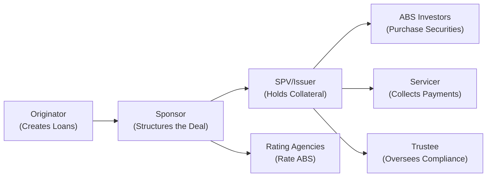

## Understanding the Securitization Lifecycle

Securitization, at its core, is about transforming a pool of relatively illiquid loans or receivables into tradeable securities that investors can buy. If you've ever financed a car through a dealership, the lender might eventually bundle your loan with others and sell it into a structure called an Asset-Backed Security (ABS). This process frees up capital for the lender—allowing them to originate more loans—while giving investors a new type of investment asset. It’s kind of like your favorite bakery parlaying its daily cookie sales into a fancy dessert box that it can sell at a premium. Sure, a home-baked cookie might be best enjoyed fresh on the spot, but packaging a variety of those cookies (or loans) into a “dessert box” (the ABS) can appeal to investors with different risk levels and yield objectives.

The lexicon for securitization can be confusing. After all, it’s not just about loans and bonds; it’s about complicated structures, legal entities, and lots of paperwork. So let's break it down in a straightforward way.

## Key Steps in the Securitization Process

1. The Originator—a bank, finance company, or other lender—creates loans or extends credit to borrowers.  
2. The Sponsor coordinates the securitization deal, packaging these loans into a reference pool.  
3. A Special Purpose Vehicle (SPV) is set up to legally “own” the pool of loans and issue securities.  
4. The SPV issues Asset-Backed Securities (ABS) to investors, which are then backed by the pool of underlying receivables.

In many cases, the same entity might act as both the originator and the sponsor, although these can definitely be separate parties. There's a bit of nuance, and the exam can sometimes push you to identify which role is doing what. For instance, if ABC Bank originates auto loans but sets up an SPV to issue securities, it might be serving both as the originator and sponsor—but not always.

## Who’s Who in a Securitization Deal

Let’s look at each role and why it matters.

### Originator
The originator is the entity that extends credit or creates the loans. Think of your local bank that provides auto loans or mortgages. In some of my past corporate finance work, I saw how banks wanted to reduce these loans on their balance sheets to fulfill capital requirements. So they would package and sell them. From the candidate perspective, understand that the originator’s quality of underwriting is crucial; if the borrowers default in large numbers, the originator’s portfolio ends up performing poorly.

Key responsibilities:  
• Extends credit (e.g., car loans, credit card receivables, small business loans).  
• Services the initial loan portfolio (unless a specialized servicer steps in).  
• Might offer certain representations and warranties about the collateral’s quality.

### Sponsor  
The sponsor is the mastermind behind structuring the securitization. Sometimes the sponsor is the same as the originator, sometimes not. The sponsor ensures that the entire securitization pipeline—from legal documentation to credit enhancement—is put together properly. If you think the sponsor’s job sounds complicated, well, it is. They have to coordinate with attorneys, rating agencies, underwriters, and trustees.

Key responsibilities:  
• Coordinates the securitization deal.  
• Structures the transaction’s terms, including collateral characteristics and credit enhancement.  
• Works with investment banks, legal counsel, rating agencies, and other service providers.

### Issuer or SPV (Special Purpose Vehicle)
The SPV is a separate legal entity created precisely to hold the pool of loans. The main reason for doing this is something we call “bankruptcy remoteness.” The idea is that if the originator or sponsor goes bankrupt, creditors shouldn’t be able to go after the loans that have already been sold to the SPV. This is essential to keep the ABS’s credit quality from being dragged down by the originator’s potential financial troubles. I remember reading one case study about an originator that went bankrupt—but thanks to the SPV structure, investors in the ABS were still paid out of the underlying loan payments, safe from the originator’s meltdown.

Key responsibilities:  
• Legally owns the collateral (the pool of loans).  
• Issues the ABS to investors.  
• Distributes cash flows (interest and principal) to investors according to deal documentation.

### Servicer
The servicer is the party responsible for collecting payments from individual borrowers. These can be monthly mortgage payments, credit card payments, auto loan payments, or other receivables. They track who’s behind on payments, handle delinquencies, and often handle reporting to the trustee.

Key responsibilities:  
• Collects scheduled payments (principal, interest, fees).  
• Forwards the collected funds to the SPV (or to the trustee on behalf of the SPV).  
• Maintains records of borrower performance and can initiate foreclosure or repossession for seriously delinquent loans.

### Trustee
Think of the trustee as the “referee.” The trustee makes sure cash flows are allocated in accordance with the terms of the deal. Also, the trustee checks that all participants abide by the legal covenants spelled out in what is often a very thick set of legal documents (trust indenture, servicing agreements, etc.). 

Key responsibilities:  
• Monitors compliance with transaction documents.  
• Ensures that cash flows are distributed properly among the different tranches.  
• Might have the power to replace the servicer if servicing guidelines aren’t followed.

### Underwriter or Investment Banker
The underwriter (often an investment bank) helps structure and market the securities to investors. They’ll be the ones traveling around explaining to potential investors why these ABS tranches might be a compelling investment. They also might help the sponsor determine the right credit enhancements—like overcollateralization or subordination—to get better credit ratings (which, in turn, can attract more investors).

Key responsibilities:  
• Structures the deal in tandem with the sponsor.  
• Markets and sells the ABS tranches to institutional investors.  
• Advises on credit enhancement levels to attain target ratings.

### Rating Agencies
Rating agencies (e.g., Moody’s, Standard & Poor’s, Fitch) provide their view on the credit risk of each tranche. They analyze the collateral (the loans), the structure (how subordination or other enhancements protect senior bonds), and the track record of the sponsor. Something you’ll see in exam scenarios is that rating agencies pay special attention to factors like the underlying borrowers’ FICO scores, loan-to-value ratios, historical default rates, and “stress scenarios” that measure how well the structure would hold up under severe economic downturns.

Key responsibilities:  
• Rate each tranche based on default risk.  
• Provide ongoing surveillance (periodic updates to reflect changing collateral quality).  
• Assess structural features (e.g., senior-subordinate, reserve funds, guarantees).

## Why Bankruptcy Remoteness Matters

The subtle magic of securitization is that a sponsor/originator can raise financing at potentially lower rates than if they issued unsecured debt on their own balance sheet. And that’s mostly because the ABS’s investors are lending against the pool of assets (car loans, mortgage loans, etc.), not the originator’s entire business. The SPV’s role is crucial here:

• The SPV is a separate entity.  
• The pool of collateral is sold through a “true sale.” That means ownership rights have been legally transferred.  
• If the originator goes bankrupt, the creditors of the originator can’t “claw back” the assets that were sold to the SPV.  

For the securitization to work effectively, legal opinions must confirm that the sale of assets to the SPV is, indeed, a true sale. If for some reason a court rules that it was not a true sale, the assets might become part of the originator’s bankruptcy estate, undermining the creditworthiness of the ABS.

## Documentation and Legal Considerations

In a securitization, documentation is extensive—trust indentures, offering memoranda, servicing agreements, pooling agreements, and legal opinions. Each party has specific obligations, from how payments are tracked to what happens if a servicer defaults on its responsibilities. If you’re analyzing or structuring a securitization, it’s super important to verify that:

• Transaction documents clearly define investor rights and the waterfall of payments.  
• Legal opinions confirm the “true sale” status.  
• Representation and warranties are made by the sponsor regarding loan underwriting standards.  
• There is clarity on recourse (or lack thereof) to the originator.

If you encounter an exam question describing a scenario where the “SPV is established to isolate the cash flows from the collateral in the event that the sponsor becomes insolvent,” you can bet it’s referencing this concept of bankruptcy remoteness. 

## Exam-Focused Insights

During the exam, especially in a vignette context, you might get something like:

• A scenario describing a bank that originates a set of credit card receivables and sells them to a newly formed trust.  
• A question asking: “Who is responsible for collecting the monthly payments?” or “Why does the sponsor set up a separate SPV?”  
• A scenario about a rating agency’s analysis of a collateral pool’s default probabilities or the effect of adding a reserve account.

Be prepared to identify the roles of each party in a securitization transaction. Also understand that rating agencies consider collateral quality, servicing capabilities, and structural enhancements when assigning ratings to each tranche. That’s exactly where subordination, overcollateralization, excess spread, and insurance wraps (if any) come into play.

A big hint for success is to pay attention to how the exam might subtly change the roles. For instance, you might see an item set where the originator is a consumer finance company that is not the same as the sponsor, which is an investment bank. Or the exam might highlight a servicer that is not the originator because the originator is a small lender that outsourced servicing to a major player. Keep your eyes on those details.

## Best Practices and Pitfalls

• Always verify the documentation that ensures true sale and separate legal status—without it, your securitization might be worthless in a sponsor bankruptcy scenario.  
• Do not assume the servicer’s role is always played by the originator; that can be a tricky exam detail.  
• Beware of scenarios where the collateral is of poor quality or the sponsor’s underwriting standards are weak. rating agencies might demand higher credit enhancements or lower ratings.  
• Understand that trustee oversight can curb moral hazard—especially if the originator or sponsor tries to pass on subpar collateral.

## Mermaid Diagram: Typical Securitization Flow

In the diagram above, notice how the SPV sits at the center. The Sponsor structures the deal and transfers the pool of loans to the SPV. Investors buy the securities from the SPV. Meanwhile, the servicer collects periodic payments on the underlying loans and channels them back to the SPV (often via the trustee). The rating agencies take a look at all these details and assign ratings to each tranche.

## Glossary

• Originator: The entity that originates the underlying loans or receivables.  
• Sponsor: Coordinates the securitization and often provides representations or warranties about the collateral pool.  
• Bankruptcy Remoteness: Legal distancing of collateral from the bankruptcy risk of the sponsor or originator.  
• Servicer Advances: Funds temporarily provided by the servicer to cover shortfalls in scheduled payments (e.g., interest or principal) with the expectation of reimbursement when borrowers pay.  
• True Sale: Legal transfer of assets from the originator to the SPV, ensuring the assets are not included in the originator’s bankruptcy estate.  

## References and Further Reading

• Fabozzi, F. J. (2012). Foundations of Financial Markets and Institutions. Boston: Pearson.  
• CFA Institute 2025 Level II Curriculum, sections on securitization origins, process, and mechanics.  

(If you’re eager for even more depth, you might check out advanced texts on structured finance or the official SIFMA site, which often posts relevant articles and guidelines related to securitization.)

## Test Your Knowledge: Securitization Process and Key Parties Quiz



### Which entity in a securitization legally holds the collateral and issues ABS to investors?

- [ ] Originator
- [ ] Sponsor
- [x] SPV (Issuer)
- [ ] Servicer

> **Explanation:** The SPV (also called the Issuer) is specifically created to hold the loans and issue the securities, ensuring that the assets are separate from the originator’s balance sheet.

### Which party is primarily responsible for structuring the transaction, including credit enhancements and deal terms?

- [ ] Trustee
- [x] Sponsor
- [ ] Servicer
- [ ] Rating Agency

> **Explanation:** The sponsor coordinates and structures the securitization, working closely with underwriters, rating agencies, and legal counsel.

### One of the key benefits of setting up an SPV is:

- [x] Achieving bankruptcy remoteness for the asset pool
- [ ] Avoiding the need for legal documentation
- [ ] Placing the collateral on the originator’s balance sheet
- [ ] Eliminating the need for rating agencies

> **Explanation:** Bankruptcy remoteness isolates the collateral from the originator’s bankruptcy risk, which is central to why sponsors form SPVs.

### Which role collects principal and interest payments from borrowers and forwards them to the SPV?

- [ ] Trustee
- [x] Servicer
- [ ] Sponsor
- [ ] Underwriter

> **Explanation:** The servicer’s job is to collect payments on the underlying loans, keep track of delinquent payments, and pass them on to the SPV or trustee.

### Which two functions are often combined if the same institution both originally funds the loans and coordinates the securitization?

- [x] Originator and Sponsor
- [ ] Trustee and Rating Agency
- [x] Sponsor and Underwriter
- [ ] Servicer and Trustee

> **Explanation:** An institution may originate loans and also act as the sponsor structuring the deal. Underwriter roles can also be performed by the sponsor or an affiliate, though not always.

### What is the primary reason rating agencies are consulted during a securitization?

- [ ] They manage the trustee’s responsibilities
- [ ] They provide servicer oversight
- [ ] They foreclose on delinquent loans
- [x] They assess credit risk of the tranches

> **Explanation:** Rating agencies assign ratings to each tranche based on collateral performance, structure enhancements, and default probabilities.

### What key legal concept ensures the pool of assets is legally isolated from the originator’s bankruptcy?

- [x] True sale
- [ ] Revolving facility
- [x] Bankruptcy remote trust
- [ ] Credit default swap

> **Explanation:** True sale is crucial for keeping the assets out of the originator’s bankruptcy estate. The entity is also specifically structured to be bankruptcy remote.

### Which party ensures compliance with transaction documents and proper allocation of cash flows?

- [ ] Underwriter
- [x] Trustee
- [ ] Sponsor
- [ ] Servicer

> **Explanation:** The trustee helps safeguard investor interests by overseeing that payments are made correctly and all parties follow the governing documents.

### Why might an originator pursue securitization over issuing unsecured corporate debt?

- [ ] Securitization typically requires no credit enhancements
- [x] Securitization can lead to lower interest costs due to collateral backing
- [ ] Unsecured corporate debt is always more expensive
- [ ] Rating agencies do not evaluate unsecured debt

> **Explanation:** With securitization, the investors are lending against a dedicated pool of assets, not the originator’s full business risk, often resulting in a lower cost of funds.

### True or False: If the originator goes bankrupt, creditors have a claim on the SPV’s assets.

- [ ] True
- [x] False

> **Explanation:** With proper bankruptcy remoteness and true sale, the SPV’s assets should remain separate from the originator’s bankruptcy estate.


