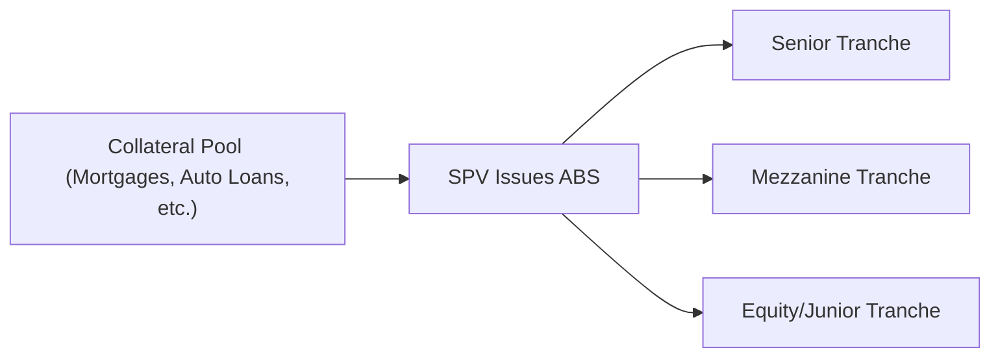

## Purpose of Credit Enhancement
Let’s start with a personal note: I remember the first time I encountered the term “credit enhancement” in a friend’s office, where a big, complicated diagram on the whiteboard explained how these structures get their strong credit ratings. I was a bit wide-eyed—like, how can you take a pool of shaky auto loans or mortgages, package them up, and somehow offer an investment that looks relatively safe? Well, credit enhancement is the key. It encompasses all the methods used to reduce the risk of loss for investors in Asset-Backed Securities (ABS). You can think of credit enhancement like a safety net: it can catch some of those potential losses before investors feel the impact.

The main point is that credit enhancement ensures investors receive principal and interest payments even if some portion of the underlying loans default. These techniques can either be set up internally (within the deal structure itself) or externally (through third parties like insurers). Whichever method is used, the goal is to mitigate credit risk and maintain stable periodic payments.  

## Internal vs. External Enhancement Overview
Yes, you might wonder: why are there two types of credit enhancements—internal and external? Actually, it’s because sponsors of ABS deals have multiple ways to protect investors:

• Internal enhancements are set right into the structure of the security. They typically rely on features like subordination, overcollateralization, and reserve funds that are built into how the transaction is organized and how its cash flows are distributed.  
• External enhancements are provided by a party outside the securitization vehicle—think an insurance company guaranteeing payments or a bank that pledges to bear some losses.  

Anyway, each approach has its own pros and cons. Internal enhancements are often standardized, reliable within the transaction, and relatively cost-effective. External enhancements can be powerful but are dependent on the creditworthiness of the third party that’s providing the guarantee.

## Internal Credit Enhancements
Internal credit enhancements are like the structural backbone of an ABS deal. They’re baked right into the documentation and the cash-flow waterfall. Let’s walk through some main internal enhancements that you’ll likely see in a typical securitization.

### Subordination
Subordination is probably the most frequently encountered technique in an ABS—and it’s surprisingly straightforward once you see it in action. Subordination creates multiple layers, also called tranches, within the same deal, ranked from highest credit quality (senior tranche) down to the riskiest (equity or junior tranche). When losses happen in the collateral pool—say a loan defaults or a mortgage goes bad—those losses go to the most junior (subordinate) tranche first. This means the top-tier, or senior, tranches typically remain protected, so they get higher ratings and lower required yields.

Imagine you have a stack of pancakes—nobody wants their pancake to burn on the bottom. The bottom-most pancake (equity tranche) is going to absorb the “heat” (losses) first, saving the pancakes above it (senior tranches) from getting burned. It’s a corny analogy, but hey, it captures the gist of how subordination works.

### Overcollateralization (OC)
Overcollateralization means the face value of the underlying collateral exceeds the total par value of the bonds issued. Let’s say your ABS is backed by loan assets of $110 million, but it only issues $100 million in securities to investors. This extra $10 million coverage is basically your cushion if some of the underlying loans default. So if losses do occur, the structure has “spare” collateral to offset them without necessarily impacting the bond investors right away.

Sometimes you might see a ratio called the OC ratio, which can be expressed as:

\text{OC Ratio} = \frac{\text{Collateral Value} - \text{Bond Principal}}{\text{Bond Principal}}.

If you have $110 million of collateral vs. $100 million of bonds, your OC ratio is:

\frac{110 - 100}{100} = 10\%.

That 10% can be a tidy buffer.

### Reserve Accounts
Reserve accounts (or reserve funds) are basically pockets of cash or highly liquid investments set aside to cover shortfalls in interest or principal. They can be funded at closing (upfront deposit) or replenished over time from excess spread (more on that in a moment). Such reserve funds are typically low-risk, short-term investments, so the money’s available if needed to make sure senior tranches get paid on time. These accounts add to investor confidence, since they represent a direct safety net within the SPV (Special Purpose Vehicle) structure.

### Excess Spread
Excess spread is the difference between the interest payments coming from the underlying loans and the interest the SPV has to pay out to bond investors. For instance, an ABS might collect an average 8% yield from auto loans but only pay 5% coupon to investors. That 3% difference is the excess spread. Over time, that extra cash can be used in part to pay deal expenses, but also to cover any losses. If no losses occur, the excess spread might eventually flow to the equity tranche holder or sponsor. But from a credit enhancement perspective, it first serves as sort of a built-in shock absorber to handle smaller credit losses before they eat into principal.

## External Credit Enhancements
So, now that we’ve covered the internal side, let’s address the external side—this is where outside institutions come to the rescue. It’s like buying an extended warranty on your car: you pay a premium to a third party, and if something goes wrong, they foot the bill (though subject to certain conditions).

### Monoline Insurance (Bond Insurance)
Monoline insurers are specialized insurance companies that focus on insuring the timely payment of principal and interest on financial instruments. In the good old days (pre-financial crisis), a lot of securitizations got a higher rating thanks to the monoline insurer’s AAA rating. If you had an ABS that might otherwise be rated A or BBB, you’d go buy bond insurance, and voilà—it might be rated AAA or AA+ because the insurer guaranteed payments.

However, the 2008 crisis changed things. Many monoline insurers ran into trouble and got downgraded themselves. This caused the insured bonds (previously AAA) to be dragged down in rating, ironically illustrating that external support is only as good as the third party behind it.

### Letters of Credit
A letter of credit (LOC) is a promise from a financial institution—usually a bank—that it will cover losses up to a certain amount if the SPV doesn’t have sufficient funds. These instruments work similarly to monoline insurance, except you have a bank as the guaranteeing agent. Often, the bank charges a fee for this service, and the sponsor of the ABS might incorporate this fee as part of its issuance costs.

### Surety Bonds/Guarantees
Surety bonds or third-party guarantees are essentially the same concept: an outside company, maybe an insurance firm or some other entity with a strong credit rating, agrees to indemnify investors for losses up to an agreed amount. The advantage is that such an arrangement can significantly reduce investor concerns. The main disadvantage is that if the surety provider is downgraded or defaults, the credit enhancement can vanish right when it’s needed most.

## Diagram: Typical ABS Structure With Internal Enhancement
Sometimes it’s easier to visualize how these enhancements fit into a deal structure. Here’s a simple mermaid diagram that captures a typical ABS with subordination (internal enhancement). The differences between internal and external enhancements might not be fully shown here, but it gives you a sense of how the SPV and tranches interact.

Senior notes are protected by subordinate notes. The entire pool might also be overcollateralized, with a reserve fund backing up shortfalls. If the sponsor—or a third party—provides external enhancements, you’d see an additional arrow from an external insurer or bank guaranteeing the SPV’s payments.

## Pros and Cons of Internal vs. External Enhancements
It’s helpful to weigh the trade-offs of using internal or external enhancements:

• Cost Considerations:  
  – Internal enhancements might be less expensive since they rely on structural tweaks.  
  – External enhancements require annual fees or upfront premiums to outside insurers or banks, which can be pricey.

• Credit Risk Shifting:  
  – Internal enhancements rely on the adequacy of the collateral pool itself plus the structural design.  
  – External enhancements rely on the strength of the counterparty providing the guarantee or LOC.

• Post-Crisis Trends:  
  – After 2008, bond insurance from monolines lost favor as monoline insurers were downgraded.  
  – Most modern deals emphasize robust internal enhancements and only selectively use external enhancements if they’re cost-effective and the provider is reliably high-rated.

• Standardization vs. Customization:  
  – Internal enhancements are highly standardized in terms of how subordination or excess spread is structured.  
  – External enhancements can vary widely (e.g., different banks might offer different LOC terms).

## Practical Financial Examples
Picture a residential mortgage-backed security (RMBS) with $500 million of mortgages. The sponsor issues $450 million in bonds (senior, mezzanine, and junior), leaving $50 million in overcollateralization. Additionally, there’s a $5 million cash reserve funded at closing. If a small batch of mortgages defaults, the sponsor can use some combination of the excess spread and the reserve account to make sure the senior and mezzanine tranches keep receiving interest.

In contrast, let’s suppose a commercial real estate securitization obtains a letter of credit from a reputable global bank to cover up to $20 million in losses. The existence of that external LOC might allow the sponsor to reduce the amount of overcollateralization or the size of the reserve account, thereby freeing more capital for other uses.

Frankly, each deal is bespoke, but you’ll see the same fundamental building blocks: subordination, OC, reserves, excess spread, or an external guarantee.

## From an Exam Perspective
On the CFA Level II exam (particularly in an item-set or vignette format), examiners love to test your understanding of these enhancements. You might see a scenario where you must identify whether a transaction’s protection is internal or external, or you may be asked to calculate coverage ratios or see how a specific loss scenario flows through the tranches. For instance:

• You could be given the original collateral amount, bond principal, and some default assumptions, then asked to figure out how much overcollateralization remains after certain losses.  
• Alternatively, a question might ask you to determine how subordination cushions the senior bonds or to evaluate what happens if the external credit provider is downgraded.

It’s crucial to carefully read the question stem to identify the key features built into the securitization. That’s your tip-off on whether you’re dealing with subordination (an internal mechanism) or a guarantee (an external mechanism).

## Glossary
• Credit Enhancement: Techniques used to lower the risk profile of an ABS, improving its credit quality.  
• Overcollateralization (OC): A structure in which the collateral’s market value exceeds the face value of the securities issued.  
• Reserve Account: Funds set aside within the SPV to absorb losses or shortfalls before investors are impacted.  
• Subordination: Structuring an ABS into multiple tranches where lower tranches bear losses first.  
• Monoline Insurer: An insurance company that specializes in guaranteeing bond principal and interest payments.  
• Letter of Credit (LOC): A guarantee from a bank to cover certain losses or payment shortfalls up to a specified amount.  

## References and Further Reading
• CFA Institute (2025). CFA Program Curriculum, Level II, structured finance and credit risk readings.  
• Jobst, A. (2008). “What Is Securitization?” IMF Working Paper, explaining credit enhancement mechanisms and market practices.  
• Moody’s, Standard & Poor’s, Fitch Ratings criteria reports for ABS transactions, for insights into how rating agencies evaluate these enhancements.

---

## Test Your Knowledge: Credit Enhancement in Asset-Backed Securities



### Question 1
An ABS structure that uses multiple tranches, where lower-ranking tranches absorb any losses first, is best described by which internal credit enhancement technique?

- [ ] Overcollateralization
- [x] Subordination
- [ ] Reserve fund
- [ ] Excess spread

> **Explanation:** Subordination divides the ABS into tranches of varying priority, ensuring that junior tranches take losses before more senior tranches.

### Question 2
Which of the following statements about external credit enhancements is most accurate?

- [ ] They are always free or built into the structure of the SPV.
- [ ] They cannot be used if the collateral pool consists of mortgages.
- [x] They rely on a third party’s promise to cover losses or guarantee payments.
- [ ] They are more common after the 2008 financial crisis.

> **Explanation:** External credit enhancements involve a third-party guarantee (like a monoline insurer or LOC). They became less popular post-financial crisis due to downgrades of insurers.

### Question 3
A transaction has $120 million of collateral and issues $100 million of ABS. The remaining $20 million is used for overcollateralization. Which formula is correct for the overcollateralization ratio?

- [ ] (Bond Principal / Collateral Value) × 100%
- [x] (Collateral Value − Bond Principal) / Bond Principal
- [ ] (Collateral Value × Bond Principal) / Collateral Value
- [ ] Bond Principal / (Collateral Value + Bond Principal)

> **Explanation:** Overcollateralization ratio = (Collateral Value − Bond Principal) / Bond Principal. In this example, that is ($120m − $100m) / $100m = 20%.

### Question 4
Which internal credit enhancement method involves setting aside cash to cover future interest or principal shortfalls?

- [ ] Subordination
- [ ] Excess spread
- [x] Reserve account
- [ ] Third-party guarantee

> **Explanation:** Reserve accounts are funded with cash or near-cash assets to ensure timely payments when the SPV’s regular inflows might be insufficient.

### Question 5
In a typical structure, monoline insurance:

- [ ] always guarantees the return of principal but never interest.
- [x] provides a guarantee of both principal and interest payments by an insurer.
- [ ] is primarily used to increase the yield on junior tranches of an ABS.
- [ ] is the same as overcollateralization from within the SPV.

> **Explanation:** Monoline insurers specialize in guaranteeing both principal and interest, thereby improving the credit profile of the insured securities.

### Question 6
When evaluating a letter of credit (LOC) as an external credit enhancement, an analyst should primarily consider:

- [x] the credit quality of the issuing bank.
- [ ] the time to maturity of the underlying collateral only.
- [ ] the sponsor’s equity position in the SPV.
- [ ] the average duration of the underlying loans’ coupons.

> **Explanation:** The strength of an LOC depends heavily on the bank’s creditworthiness. If the bank is downgraded, the enhancement may lose value.

### Question 7
Excess spread is:

- [x] the amount by which the interest on the collateral exceeds the security’s coupon.
- [ ] the written guarantee of payments by a third party.
- [x] a cushion that can absorb losses before hitting the bonds’ principal.
- [ ] a reserve that must be funded separately at the closing date.

> **Explanation:** Excess spread is the difference between the yield on the underlying collateral and the coupon paid on the issued bonds. This difference serves as a first line of defense against losses.

### Question 8
Which of the following best illustrates a drawback of external enhancements post-2008 crisis?

- [x] The providers of guarantees (e.g., monoline insurers) faced downgrades, reducing the bonds’ enhancement.
- [ ] Subordinate tranches continued to absorb losses despite the guarantee.
- [ ] Excess spread became too large to use effectively.
- [ ] Reserve accounts were not recognized by regulatory agencies.

> **Explanation:** In the crisis, monoline insurers and other external providers suffered downgrades, which undermined the credit enhancement they provided.

### Question 9
A reserve account in an ABS is funded at $4 million. Over time, $1 million of losses is covered by the reserve. If no replenishment mechanism is in place, how much remains in the reserve account?

- [ ] It automatically replenishes to $4 million.
- [x] $3 million remains.
- [ ] $4 million remains because the sponsor covers the difference.
- [ ] $1 million remains.

> **Explanation:** With $4 million initially set aside and $1 million used to cover a loss, $3 million continues to be available, assuming no replenishment is established.

### Question 10
Monoline insurance is an example of an internal credit enhancement.

- [ ] True
- [x] False

> **Explanation:** Monoline insurance is external credit enhancement, as it comes from a third-party insurer, not from the ABS’s internal structure.


