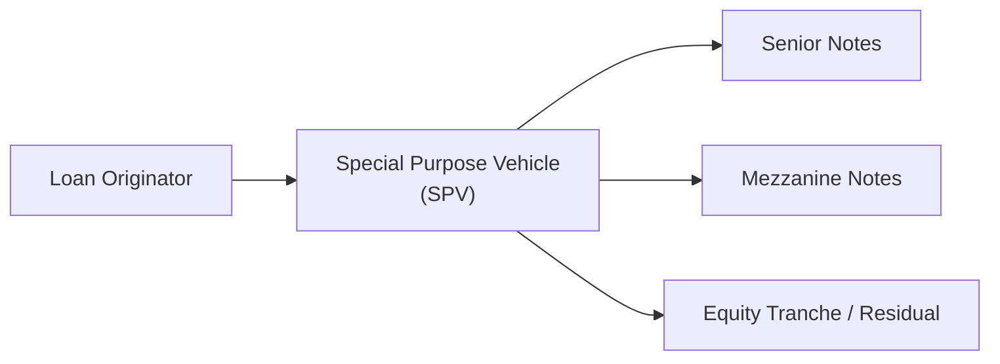

## Introduction

If you’ve ever spent time analyzing assorted bond deals or rummaging through new securitization filings, you’ll know that Asset-Backed Securities (ABS) come in all shapes and sizes. An ABS could be backed by car loans, credit card receivables, or even student loans. Now, if you’re preparing for the CFA® Level II exam, you’ll soon realize that ABS often pop up in item set (vignette) questions, where you have to use the short narrative plus supporting data to dissect credit quality, interpret coverage ratios, and see whether there’s enough juice (i.e., excess spread) to cushion potential losses.

Let’s explore how to approach an item set that focuses on “ABS Credit Analysis” and discuss the best ways to spot crucial details. We’ll look at typical variables—like an auto loan pool’s performance metrics or a credit card receivable pool’s triggers—and walk through relevant concepts such as coverage ratios, delinquency and default rates, and how structural features help senior noteholders sleep a little better at night. So, grab a pen (or your mental highlighter) and let’s dig in.

## Dissecting the Typical ABS Vignette

When you see a structured finance vignette on the exam, you’ll have a short scenario: perhaps describing a newly issued auto loan ABS. Certain data points usually appear:

• Collateral characteristics: average FICO scores, average seasoning (i.e., how long the loans have been outstanding), average loan size, or other portfolio-level metrics.  
• Credit enhancement details: overcollateralization (OC), subordination levels, reserve accounts, or insurance wraps (though these are less common nowadays).  
• Performance triggers: early amortization triggers, delinquency or default triggers, coverage tests, or interest coverage ratios.  

Remember: your top priority is to see how these details drive ABS performance. Are the loans in good shape, or are there signs of trouble? Does the deal structure provide enough protection for senior bondholders? If the collateral starts to degrade, how quickly might the structure redirect cash flows to protect the more senior investors? These are the questions exam item sets want you to evaluate.

### Identifying Relevant Information

While reading through the vignette, highlight data that directly affects your credit analysis, such as:

• The average or weighted-average FICO score: higher FICO scores imply lower expected default probabilities for consumer loans.  
• Historical delinquency rates: a 1.5% 30-day delinquency rate might be acceptable for prime auto loans, but 5% or 6% might raise eyebrows.  
• Excess spread: the difference between the interest received from the collateral and the interest paid on the ABS tranches plus fees. If that difference is large, it might cover losses before they eat into other credit enhancements.  
• Overcollateralization or subordination levels: do we have enough cushion if defaults spike?  

Try not to be distracted by extraneous numbers. Some minor detail about underwriting guidelines could be relevant, but if it doesn’t help you decide whether the collateral is strong or the potential risk is contained, it might not matter for the question.

## Key Analytical Points in ABS Credit Analysis

### Delinquency and Default Rates

ABS typically revolve around consumer credit—think mortgages, auto loans, credit cards, etc. The big question is whether those consumers will pay back their loans. The exam vignette might show that the current delinquency rate on the auto loan collateral is 2.0%. You’re told that in a typical economic environment, the default rate is expected to remain around 1.5%, but if unemployment rises or used-car values drop significantly (um, who remembers major used-vehicle price swings?), you could see default rates creep higher.

Default Rate = (Number of Loans in Default) / (Number of Outstanding Loans)

Any big jump in defaults reduces principal cash flow into the ABS trust and leads to losses unless you have enough credit enhancement to absorb them. So questions often probe your ability to say, “If the default rate goes up to 3%, what happens to the subordinate tranches?” or “Is excess spread enough to cover the additional losses?”

### Coverage Ratios and Overcollateralization

Remember, “coverage ratio” is just the ratio that indicates how many times over the collateral or credit enhancement can cover potential losses. A typical format might be:


\text{Coverage Ratio} = \frac{\text{Total Credit Enhancement}}{\text{Expected Losses}}


Credit enhancement usually comes from items like subordination (junior tranches take the first losses), overcollateralization (value of collateral exceeds the total face value of the bonds), reserve funds (cash set aside in a special account), and even excess spread. If your coverage ratio dips below 1.0, that indicates trouble: you lack enough resources to fully offset expected losses.

### Excess Spread

If the underlying loans yield an average of 10% and the trust is paying out 6% to funded notes plus 1% in expenses, your net “excess spread” is around 3%. That cushion might be used monthly to cover losses or it could be trapped in a reserve account until you reach a certain threshold. In item sets, you might be asked to evaluate whether a 3% or 4% excess spread is sufficient to handle a jump in default rates. Sometimes, the question is “Does the excess spread remain stable if interest rates rise?” because if the collateral’s rate is fixed but your required payout is floating, that can eat into your spread.

### Triggers for Early Amortization or Cash Flow Redirection

Triggers are basically performance thresholds. If battered by poor collateral performance and they pass certain levels, the deal goes into “self-preservation mode.” For example:

• Early Amortization Trigger: If the net charge-off rate on a credit card deal exceeds a threshold (say 7%), the trust might immediately try to repay bond principal faster rather than create new receivables or pay more subordinate interest.  
• Delinquency Trigger: If delinquencies exceed X%, subordinate interest payments might be halted to redirect cash flow to the senior tranche.  

A typical exam question might be: “If the default rate rises from 2% to 5%, does that breach the trigger level for early amortization? If so, how does that affect liquidity or subordination?” These are the sorts of questions that require you to plug in the numbers, confirm the threshold breach, and interpret the resulting effect on the structure.

## Exam Tips for ABS Vignette Questions

### Read the Entire Vignette First

It’s oh-so-tempting to cut straight to the first question. But trust me, read the entire scenario carefully. The last sentence might reveal that a credit enhancement facility is about to expire next quarter, or that the aggregator has set aside a large reserve. You need that full context. Vignette questions can be tricky if you haven’t fully connected all the data points.

### Focus on Data That Directly Influences the Outcome

Pick out the data that helps you make a call on credit quality: delinquency, default, coverage, enhancement levels, and triggers. That random mention of an “updated servicing agreement” could matter if it changes how cash is allocated, but if it’s purely descriptive filler, you can safely let it go.  

### Quick Ratio Calculations

You might need to do a coverage ratio or overcollateralization ratio calculation. Keep your calculator handy:

• Overcollateralization ratio = (Collateral Amount – Bond Balance) / Bond Balance  
• Excess spread coverage ratio = (Weighted Average Coupon on Collateral – Weighted Average Coupon on Bonds – Fees) / Weighted Average Coupon on Bonds  

And sometimes you’ll see something like this:

• Delinquency ratio = (Delinquent Loans) / (Total Loans)

If you see a big ratio jump, watch for potential trigger events.

### Validate or Reject Each Statement

In some question formats, you’re asked to confirm or refute statements about the deal. For instance:

1. “Senior tranche will absorb losses first.”  
2. “Excess spread will remain unaffected if interest rates rise.”  
3. “If the delinquency rate exceeds 6%, the subordinate tranche stops receiving interest.”  

Use your reading of the structure to confirm or reject each statement. The first statement is probably false (since it’s usually the subordinate tranche that gets hit first with losses). For the second statement, it depends on the mismatch of rates. For the third, check the triggers in the vignette.

## Practical Real-World Application

ABS credit analysts in the real world have to weigh macroeconomic data, such as unemployment or consumer confidence, plus micro-level loan stats. If you see folks losing jobs left and right, or if used-car prices are plummeting, auto ABS might see higher default rates. You might watch credit card data to see if consumers start rolling over more debt. The helpful part of structured finance is that each deal’s waterfall is laid out pretty explicitly. The question is simply if the projected losses remain within the structure’s capacity to absorb them.

In 2008–2009 (back during the global financial crisis), a lot of subprime ABS was structured with minimal cushion. Once default rates soared, the subordination wasn’t enough, and the deals quickly collapsed. But prime auto deals or credit card ABS with robust structures came through relatively okay because triggers kicked in early and the coverage ratio was decent.

## A Quick Look at ABS Structure

Before we jump further, here’s a simplified diagram of a typical ABS structure using mermaid.js to illustrate the key parties and flows:

• The SPV issues various tranches (senior, mezzanine, equity) and uses the proceeds to purchase the loan pool from the originator.  
• Cash flows from borrowers pay interest and principal into the SPV.  
• The SPV pays out according to the waterfall—a fancy word for the priority of payments.  

From a credit analysis perspective, note that each tranche has different risk and yield. The equity or residual typically absorbs first-loss, while senior notes are the safest.

## Step-by-Step Vignette Review Example

Let’s try a small hypothetical scenario:

Say we have “RiverAuto 2026-1,” an auto loan ABS:

• $800 million total loan pool with an average borrower FICO of 695.  
• The senior tranche is $600 million; the mezzanine tranche is $150 million; and the equity or residual piece is $50 million.  
• Overcollateralization: The loans are $800 million, but total notes are only $750 million. The difference of $50 million helps cushion losses.  
• Excess spread: 3.5% net of proposed interest and fees.  
• Delinquency rate: 1.0% (30+ days past due).  
• Default rate: historically 0.8%; stress scenarios range up to 2.5%.  
• Trigger: If delinquency exceeds 5% or net losses exceed 2.5% in any quarter, subordinate interest will be diverted to pay down senior principal.  

What if we suspect the default rate might jump to 3.0% due to rising unemployment? Immediately, we see that 3.0% surpasses the 2.5% net losses threshold, so that triggers subordination lockout. The effect? The mezzanine and equity tranches lose their interest until the senior is made whole or the trigger cures. That drastically shifts the potential cash flows.

Exam questions might ask you to:  
• Calculate how many basis points of default the excess spread can absorb before hitting subordination.  
• Determine whether the coverage ratio remains above 1.0.  
• Conclude whether the triggers would be tripped and how that affects each tranche’s payout.

## Common Pitfalls and Challenges

• Overlooking a detail: If you miss that the note is floating rate while the collateral is fixed, you might incorrectly evaluate the excess spread.  
• Misallocating the losses: The senior bond typically gets paid first from the cash flow, so losses usually go to the lower tranches initially.  
• Confusing delinquency with default: Delinquent loans aren’t necessarily in default, but they are a warning sign. The exam might trick you by stating “5% of loans are 60 days delinquent.” That’s not automatically a 5% default rate.  
• Not reading the entire vignette: You might see subordination is 10%, but in the last line, there’s a note that 2% is about to be released from the structure in the next payment period if a trigger is not breached, effectively reducing coverage.

## Strategies to Overcome the Pitfalls

• Use a structured approach: Read the entire vignette. Identify the key data. Sketch out how the waterfall works, even if it’s just in your mind.  
• Double-check definitions: Know the difference between delinquency and default. Check how each ratio is calculated.  
• Carry out “What-if” analyses: If default rates change from 1% to 3%, or from 2% to 5%, walk through the coverage ratio, triggers, and see if the deal is still viable. The exam loves to see if you can handle scenario sensitivities.

## Concluding Thoughts and Exam Tips

• Focus on the fundamentals: You can do the advanced math if needed, but often you just need to interpret coverage and triggers.  
• Practice: Work through official CFA Institute practice questions. Familiarize yourself with how these item sets are structured.  
• Time management: Vignette questions can be data-heavy. Don’t get bogged down in extraneous details.  

ABS can be a fascinating corner of the fixed income market. Once you grasp the structural mechanics—who’s protected, who gets paid last, and what triggers do in stressful times—you’ll be well-equipped to answer exam item sets effectively. And hey, these are the same skills you’d use if analyzing real auto loan or credit card ABS for a portfolio. Keep practicing your numeric calculations, watch out for the common traps, and you’ll likely do great.

## References and Further Reading

• CFA Institute, "Structured Finance and ABS," Official Curriculum Readings for CFA Level II.  
• SEC EDGAR Database (https://www.sec.gov) for real-life ABS offering documents.  
• Moody’s Analytics, “Credit Risk Modeling and Structural Analysis,” for in-depth credit enhancement modeling.  
• Chapter 25 of this volume for deeper insights into measuring interest rate risk and how it relates to structured products.  

## Test Your Knowledge: ABS Credit Analysis in a Vignette



### Coverage Ratios and Their Role
- [x] Coverage ratios determine how well ABS credit support can absorb potential losses.
- [ ] Coverage ratios are generally larger than 5.0 in most ABS deals.
- [ ] Coverage ratios are not relevant once a deal is launched.
- [ ] Coverage ratios only apply to mortgage-backed securities (MBS).

> **Explanation:** Coverage ratios measure the capacity of credit enhancement (like overcollateralization or reserve accounts) to cover potential losses. They are central to analyzing ABS credit quality.

### Understanding Delinquency vs. Default
- [x] Delinquency can act as an early warning signal before actual defaults occur.
- [ ] Defaulted loans always carry the same severity of loss as delinquent loans.
- [ ] Delinquency and default are interchangeable terms in structured finance.
- [ ] Default rates are always higher than delinquency rates.

> **Explanation:** Delinquencies often precede defaults, potentially signaling higher future losses. Delinquency and default are related but not synonymous.

### Excess Spread Dynamics
- [x] Excess spread is the difference between the interest collected on the collateral and the interest and fees owed to ABS noteholders.
- [ ] Excess spread is irrelevant if the ABS is fully funded.
- [ ] If interest rates on collateral decline, excess spread will always increase.
- [ ] Excess spread is the same as overcollateralization.

> **Explanation:** Excess spread is an ongoing source of credit enhancement that can absorb collateral losses before hitting subordinate tranches. However, it depends on both asset yields and liability costs.

### Trigger Breach Consequences
- [x] A trigger breach often reallocates cash flows to senior investors or accelerates principal repayments.
- [ ] A trigger breach automatically eliminates all subordinate tranches.
- [ ] Triggers have no impact on the timing of payments.
- [ ] Once triggered, it has no effect on subordinate interest payments.

> **Explanation:** If collateral performance worsens and triggers are breached, the deal typically moves into protection mode by prioritizing the senior noteholders. Subordinate interest payments can be halted or reduced.

### Overcollateralization Computation
- [x] (Collateral Value – Bond Face Amount) / Bond Face Amount
- [ ] (Bond Face Amount / Collateral Value) – 1
- [x] (Collateral Value – Bond Face Amount) / Collateral Value
- [ ] (Reserve Account / Bond Face Amount) – 1

> **Explanation:** Overcollateralization can be viewed in multiple ways, commonly measured by comparing the difference between collateral and bond face amount to either the bond face amount or the total collateral. Both correct formulas are used in practice.

### Real-World Stress Testing
- [x] Stress scenarios often involve higher default rates and lower recoveries to test if credit enhancements are sufficient.
- [ ] Stress testing is optional for issuers and rarely performed.
- [ ] Stress scenarios ignore macroeconomic factors like unemployment.
- [ ] Stress testing only applies to CMOs, not ABS.

> **Explanation:** Real-world analysts run stress scenarios—like rising unemployment—to confirm whether credit enhancements in the structure can withstand more severe losses.

### Subordination Hierarchy
- [x] Subordinate tranches absorb losses before senior tranches.
- [ ] Senior tranches absorb all losses first.
- [x] Equity or residual tranches often function as the first-loss piece.
- [ ] Mezzanine tranches generally do not exist in auto ABS transactions.

> **Explanation:** In a typical ABS, the equity or subordinate tranches bear losses first, protecting the senior tranche. This risk waterfall is central to structured finance.

### Delinquency Rate Impact
- [x] If the delinquency rate surpasses a preset threshold, cash flows might be diverted from subordinate to senior tranches.
- [ ] A higher delinquency rate immediately dissolves the deal.
- [ ] Delinquency rates do not affect an ABS as long as default rates remain the same.
- [ ] Once delinquency passes 10%, all interest payments revert to the originator.

> **Explanation:** Some deals have triggers tied to delinquency rate. Once breached, deals often go into “turbo” mode to protect senior investors.

### Importance of Reading the Vignette Carefully
- [x] Missing a structural detail—like when a reserve account expires—could lead you to an incorrect answer.
- [ ] You should immediately jump to the first question to save time.
- [ ] Vignette data typically repeats itself, so reading it twice is unnecessary.
- [ ] It is safe to assume that subordinate tranches have no triggers.

> **Explanation:** Vignettes can include subtle but critical details in the text. Eager test-takers who skip or skim can easily miss them, resulting in incorrect conclusions.

### True or False: Excess Spread as a Credit Enhancement
- [x] True
- [ ] False

> **Explanation:** Excess spread serves as a cushion against collateral losses, effectively acting as a form of credit enhancement in structured finance deals.


