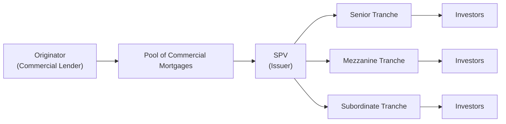

## Overview of CMBS Securitization

I remember chatting with a colleague years ago about the first time they encountered Commercial Mortgage-Backed Securities (CMBS). She was floored by how complex the structures could be. To be honest, it’s not exactly surprising—CMBS deals typically involve a lot of moving parts and layers of risk protection. Yet, this complexity is part of what makes them so attractive: each layer (or tranche) is designed for a different risk appetite and yield expectation. So, let’s unpeel these layers together.

At its simplest, a CMBS is created by pooling multiple commercial mortgage loans—often tied to properties like office buildings, malls, hotels, or industrial sites—and placing them into a special purpose vehicle (SPV). The SPV then issues bonds, or tranches, of varying seniority and return profiles. Because commercial properties differ widely in terms of tenant mix, lease structure, location, and property type, investors must pay close attention to how these underlying assets perform. They might be dealing with a 10-year loan for a bustling downtown office tower or a shorter-term loan on a suburban strip mall. Each property has its own distinct cash flow pattern, and that’s what underpins the bond payments.

Below is a simple diagram illustrating how a CMBS transaction might be structured:

• The Originator (like a bank) funds various commercial mortgage loans.  
• These loans are pooled together.  
• The SPV issues different layers (tranches) of CMBS, each with distinct risk/return characteristics.  
• Investors buy those tranches according to their risk preferences.

Commercial mortgages generally carry interest rates that are higher than those of residential mortgages (reflecting greater risk). Also, commercial real estate values—and hence the loans—can be heavily influenced by property-specific factors (e.g., local economic conditions, tenant credit quality, property management, etc.). It’s why extensive due diligence is so critical in CMBS.

## Comparing Commercial and Residential Mortgages

The difference between commercial and residential mortgages can be stark:

• Property Types: Commercial mortgages could finance retail malls, office complexes, industrial sites, and hotels—properties with specialized uses and often unpredictable tenant turnover or occupancy rates. Residential mortgages, on the other hand, typically finance single-family homes or smaller multi-family dwellings.  
• Loan Terms: Commercial mortgages commonly feature balloon structures, shorter maturities, and rigorous underwriting tied to the property’s net operating income and vacancy trends. Residential mortgages tend to have more standardized maturities (often 15 or 30 years) and rely heavily on personal credit scores and household income.  
• Cash Flow Uncertainty: Commercial property income often depends on lease contracts, anchor tenants, or even the cyclical performance of a given industry. Meanwhile, residential mortgage performance hinges primarily on a borrower's personal solvency.  

Because of these differences, structuring commercial loans into securities requires specialized call protection features, protective covenants, and robust underwriting to address the complexities in revenue generation.

## Call Protection in CMBS

As an investor, you probably don’t want your carefully planned yield disappearing overnight because a borrower decides to refinance early. This is where call protection steps in. Commercial mortgage loans tend to include provisions that discourage or altogether prohibit early repayment (prepayment). This ensures that investors, especially in the higher-rated tranches, have a stable income stream. Let’s take a look at four main call protection mechanisms you’re likely to encounter:

### Prepayment Lockout Period
Think of it as a “no early exits allowed” rule. During a lockout period (often a few years from the loan’s inception), the borrower simply can’t prepay the mortgage at all. It guarantees that the investor will receive interest payments for that duration. For the borrower, it means sticking with the original loan terms, which might feel restrictive. But this is the cost of securing a commercial mortgage, especially if you want a more attractive financing rate.

### Defeasance
Defeasance replaces the mortgage collateral with a portfolio of risk-free Treasury securities (or high-quality instruments) that generate the same cash flows the mortgage would have. Borrowers are still effectively “paying” the loan, but now those payments come from the substituted securities rather than the property itself. Investors receive the same payment schedule, so they’re protected from reinvestment risk. The borrower can free up the property but must purchase the Treasuries (which can be pricey if interest rates have fallen).

### Yield Maintenance
Another approach: make the lender or investor “whole” if the loan is paid off early. Basically, the borrower pays a premium designed to replicate the yield the investor would have earned if the loan stayed around. It’s a fancy way to say: “If I bail early, I’ll compensate you for your lost future interest.” Sometimes that premium is pegged to a reference interest rate (often Treasuries) plus a certain spread.

### Prepayment Penalties
Perhaps the simplest form of call protection is a prepayment penalty: a lump-sum fee that the borrower must fork over if they retire the mortgage before maturity. Unlike a yield maintenance fee (which is often based on a formula linked to prevailing rates), a prepayment penalty might be a fixed percentage of the outstanding balance. This helps cushion any blow to the investor’s expected income stream.

Below is a quick table summarizing these mechanisms:

| Call Protection Method | Definition                                                            | Impact on Investors                                         |
|------------------------|----------------------------------------------------------------------|-------------------------------------------------------------|
| Prepayment Lockout     | Restricts any prepayment for a set term                              | Guarantees interest for lockout period                      |
| Defeasance             | Substitutes loan collateral with Treasury securities                 | Preserves cash flows, reduces reinvestment risk            |
| Yield Maintenance      | Premium paid by borrower to keep investor’s yield whole             | Compensates investor for lost interest if loan is prepaid  |
| Prepayment Penalty     | Flat or percentage fee upon early repayment                          | Protects lender from some prepayment risk                  |

## Impact on Tranche Structures

Within a CMBS deal, tranches range from senior (lowest risk, lowest yield) down to mezzanine and subordinate (higher risk, higher yield). Senior tranches are the first to receive principal and interest but also have the lowest chance of experiencing losses. Subordinate tranches absorb losses first if there’s a default on the underlying loans, so their yields are higher to compensate for that extra risk.

Call protection provisions can differ across these tranches:

• Senior Tranche: Often has robust call protection, ensuring stable cash flow. Investors here might be especially sensitive to prepayment because losing a consistent coupon can be detrimental if they reinvest at lower market rates.  
• Mezzanine Tranche: May have moderate call protection, with yields reflecting moderate risk.  
• Subordinate Tranche: Often sees the biggest yield boost when call protection is robust, since these investors sit at the back of the line for repayments. They demand higher spreads to offset both credit risk (default) and the possibility that early prepayments erode future interest payments.

In practical terms, stronger call protection reduces the volatility of the bond’s price because prepayment rates become more predictable. If borrowers can’t easily refinance or prepay, the stream of payments is more certain. On the flip side, if interest rates fall significantly, a borrower might still do a cost-benefit analysis to see if paying that yield maintenance or prepayment penalty is worth the savings locked in by cheaper financing.

## Real-World Mini-Case: Refinancing an Office Complex

Imagine a large office complex in a major city, financed by a 10-year commercial mortgage. The owner sees market interest rates drop three years into the loan and considers refinancing. However, the loan includes a prepayment lockout for the first five years and a yield maintenance provision if the borrower terminates after that lockout. This means:

• For the first five years: They can’t pay off early, plain and simple.  
• After five years: They’d have to cough up a yield maintenance premium if they exit before the tenth year.

If interest rates have dropped enough, the potential savings from refinancing might exceed the hefty premium. But if rates haven’t fallen significantly, the cost of yield maintenance could wipe out any savings. From the CMBS investor’s point of view, it’s a win to have that yield protected or fairly compensated.

## Scenario-Based Exercise

Let’s compare two hypothetical CMBS deals:

• Deal A has a modest prepayment penalty (a percentage of the outstanding loan balance) but no yield maintenance.  
• Deal B has a combination of a two-year lockout followed by a yield maintenance provision for years 3 to 10.

Key things to consider:

◦ Projected prepayment speeds: If interest rates are projected to fall sharply, which deal’s tranches might see more stable cash flows?  
◦ Overall duration: Which deal likely maintains its duration profile better if rates drop and borrowers get the itch to refinance?  
◦ Credit issues: Which transaction might face higher delinquency risk if the underwriting on the underlying properties is weaker, and how does call protection help?

Built into each deal’s bond pricing will be the expectation of how likely prepayments are, whether or not interest rates will drop significantly, and how robust the underlying commercial property operations are (occupancy, rental rates, location attractiveness, etc.). As an exercise, you can try modeling the bond’s expected cash flow schedule under multiple interest rate scenarios. Then, factor in the prepayment or yield maintenance premiums. You’ll see how call protection helps preserve yield even when market conditions might favor a full or partial refinance.

## Exam Tips

• On the CFA exam, be ready for a vignette about a CMBS deal that references call protection features. You might be asked to calculate how prepayment lockout or yield maintenance affects bond pricing.  
• Pay attention to the property type and location—these details can hint at the risk of default or the likelihood of a borrower pursuing a refinance.  
• Be clear on how each call protection mechanism works: lockout eliminates prepayments altogether (temporarily), whereas yield maintenance and prepayment penalties act as financial disincentives.  
• Understand how the different tranches in CMBS absorb risk, especially in the context of call protection. Senior tranches usually have top priority in receiving interest and principal, but all tranches benefit from stable, predictable cash flows.

## Glossary

Tranche: A slice or layer of a securitization, each with distinct risk and return characteristics.  
Call Protection: Provisions that prevent or discourage early payoff of a commercial mortgage.  
Defeasance: Substitution of the underlying loan collateral with government (often Treasury) securities so that bondholders continue receiving scheduled payments.  
Yield Maintenance: A prepayment premium ensuring that the lender or investor effectively receives the same yield as if the loan had not been prepaid.  
Prepayment Penalty: A lump-sum fee paid by the borrower to compensate investors when a loan is paid off ahead of schedule.  
SPV (Special Purpose Vehicle): A separate legal entity that isolates financial risk in securitizations.  
Securitization: The pooling of contractual debts (such as mortgages) and selling them as bonds to investors.

## References

• Fabozzi, F. J. “Mortgage-Backed Securities: Products, Structuring, and Analytical Techniques.”  
• CFA Institute’s official curriculum on Fixed Income Securitizations (Level II/III Readings).  
• Various Structured Finance publications (e.g., Bloomberg Intelligence, International Financing Review) covering CMBS deal structures and performance.  
• Federal Reserve Bank research papers on commercial real estate loan performance in CMBS.

## Test Your Knowledge of CMBS Structures and Call Protection



### Which of the following best describes defeasance in a CMBS transaction?

- [ ] A preset fee paid when the borrower pays off the loan early.  
- [ ] A short period during which no prepayment is allowed.  
- [x] Substitution of the mortgage collateral with a Treasury securities portfolio.  
- [ ] An agreement to provide senior lenders with priority in payment.  

> **Explanation:** Defeasance is a process where the borrower replaces the real property collateral with government securities that replicate the cash flow schedule of the original mortgage.

### Which of the following is a key benefit of having a lockout provision in a commercial mortgage?

- [ ] It ensures the property’s net operating income remains steady.  
- [ ] It encourages borrowers to refinance quickly.  
- [x] It prevents any prepayment within a specified period, ensuring stability for investors.  
- [ ] It allows junior tranches to receive early principal repayments.  

> **Explanation:** A lockout provision simply disallows any prepayment during the stated lockout period, guaranteeing the investor’s interest income for that term.

### How does yield maintenance protect CMBS investors if interest rates decline?

- [ ] It places the borrower’s property in receivership.  
- [x] It forces the borrower to pay a premium that replicates the investor’s expected yield.  
- [ ] It accelerates principal repayments to the senior tranche.  
- [ ] It converts the mortgage into an interest-only structure.  

> **Explanation:** Yield maintenance requires the borrower to pay a penalty that compensates the lender for any loss of yield that results from early payment.

### Compared to residential mortgage-backed securities, commercial mortgage-backed securities typically:

- [x] Involve more diverse property types and higher underwriting complexity.  
- [ ] Have simpler underwriting standards due to uniform property characteristics.  
- [ ] Are subject to greater prepayment risk due to more borrower-friendly terms.  
- [ ] Have government-sponsored agency backing in every deal.  

> **Explanation:** CMBS deals often include a variety of commercial property types, each with unique cash flow profiles and more complicated due diligence requirements compared to standardized residential loans.

### An investor is comparing two CMBS deals. Deal A includes a 5-year lockout with no prepayment penalty afterwards. Deal B lacks a lockout, but it has yield maintenance through year 10. Which statement is most accurate?

- [x] Deal B’s structure better protects investor yields if the borrower refinances early.  
- [ ] Deal B’s yield maintenance provision has no effect on investor returns.  
- [x] Deal A’s lack of yield maintenance means investor cash flow might be less predictable after year 5.  
- [ ] Deal A offers zero call protection.  

> **Explanation:** Yield maintenance in Deal B disincentivizes prepayment throughout the loan period. Once Deal A’s lockout expires, the borrower can prepay without compensating the investors.

### In a CMBS structure, which tranche typically has the highest yield?

- [ ] Senior tranche.  
- [ ] Super senior tranche.  
- [ ] Mezzanine tranche.  
- [x] Subordinate (or equity) tranche.  

> **Explanation:** The subordinate (or equity) tranche absorbs losses first, so it bears the greatest credit risk and typically offers the highest yield as compensation.

### Which of the following correctly pairs a call protection feature with its primary effect?

- [x] Prepayment penalty → Borrower pays a lump-sum fee for early payoff.  
- [ ] Lockout → Borrower must replace collateral with Treasury securities.  
- [x] Yield maintenance → Borrower is charged a fee that approximates lost interest.  
- [ ] Defeasance → Borrower has the right to prepay without penalty.  

> **Explanation:** A prepayment penalty is a straightforward fee if the loan is retired early. Yield maintenance approximates the lost interest, and defeasance involves replacing the property collateral with Treasuries.

### A CMBS investor is primarily concerned with stable cash flows and minimal reinvestment risk. Which call protection method is generally most secure for the investor?

- [ ] Flex options.  
- [ ] Partial recourse.  
- [ ] Seasoning structures.  
- [x] Defeasance.  

> **Explanation:** With defeasance, the mortgage collateral is swapped with Treasury securities, ensuring bondholders receive known and stable scheduled payments.

### When a lockout period expires for a commercial mortgage, which additional cost may protect CMBS investors if the borrower decides to prepay?

- [ ] Balloon extension.  
- [x] Yield maintenance.  
- [ ] Pari passu share.  
- [ ] Zero-volatility spread.  

> **Explanation:** After the lockout ends, yield maintenance might still apply to ensure investors are compensated for lost interest income.

### Prepayment penalties in a CMBS context:

- [x] Are designed to compensate investors for the potential loss of future interest payments.  
- [ ] Always equal zero if the borrower meets certain underwriting criteria.  
- [ ] Apply only if interest rates rise.  
- [ ] Remove any credit risk to investors.  

> **Explanation:** Prepayment penalties reimburse the lender/investor for lost interest income when borrowers pay off early.


