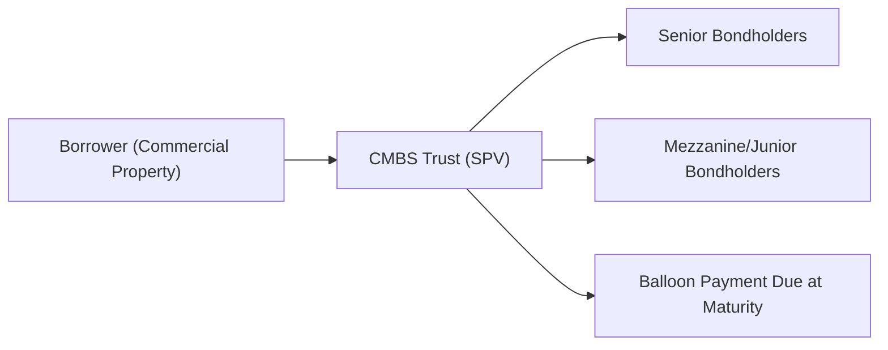

## Introduction and Overview

Commercial mortgage-backed securities (CMBS) are a special kind of asset-backed security—structured from pools of commercial mortgage loans on offices, retail centers, hotels, and other incoming-producing real-estate assets. One particular quirk of commercial mortgages, as opposed to residential mortgages, is that they often include large “balloon” payments by the end of the loan term. You might typically see five-, seven-, or ten-year maturities for these commercial mortgages, rather than the 30-year terms we often see for residential loans.

Hand-in-hand with these balloon structures, we also find “lockout” provisions, which restrict early repayment. These features can have a big impact on how we analyze, value, and manage risk in a CMBS portfolio. Let’s dig into the mechanics of each, focusing on what they mean for investors, borrowers, and the entire deal structure.

Before we jump into the details, let me share a quick anecdote. I once had a friend—he was part of a small investment group—that purchased a mid-sized office building using a seven-year balloon mortgage. His group planned to refinance or sell within that time frame. Things got rocky when property values in the area dipped unexpectedly, and the bank was suddenly a lot less keen on offering a good refi package. That final balloon payment became a huge source of stress. This story always reminds me that balloon risk is real and can catch even savvy investors by surprise.

## Balloon Risk in CMBS

### What Is a Balloon Payment?

A balloon payment is that big final payment of principal near or at maturity. Commercial borrowers must either (1) repay the entire sum out of available funds or (2) refinance into a new mortgage to cover that sum. If a loan is originated at $50 million, for instance, but requires only interest payments during its five-year term, the borrower might need to pay off practically the whole $50 million at the end of year five. That large chunk is the “balloon.”

### Why Do CMBS Loans Commonly Have Shorter Maturities?

From a lender’s perspective (and thereby from the bondholders’ perspective in a CMBS deal), shorter maturities allow more frequent credit risk reevaluations. Think of it like hitting a “reset” button every so often. Instead of carrying a 30-year loan that could turn sour at year 15, a lender can require the borrower to refinance or repay at year five or seven. This practice effectively shifts refinancing risk onto the borrower. Meanwhile, property owners might prefer shorter maturities because they anticipate selling the property or taking advantage of more favorable rates in the future.

### Where Does Balloon Risk Come In?

Balloon risk (a subset of refinancing risk) appears if the borrower cannot secure a new loan or cannot repay the final principal amount in full. If market conditions deteriorate (maybe interest rates spike or property values fall), then the borrower can’t refinance easily at maturity. The dreaded outcome is a potential default if the borrower cannot come up with alternative financing, dragging bondholders into a messy workout process. 

If local real estate markets go through a slump, or if the sponsor’s creditworthiness tanks in year four, that final balloon payment becomes a genuine hazard. For CMBS investors, this often translates into a higher required yield or spread to compensate for the uncertainty associated with balloon payments.

## Prepayment Lockouts

### How Lockout Provisions Work

Lockout provisions are a form of call protection that says, “Hey borrower, you can’t pay off this mortgage early—at least not for the first few years.” We might have a lockout period of, say, three years on a ten-year mortgage. During those three years, the borrower is legally prohibited from prepaying the loan, meaning they must keep making monthly debt service payments and cannot just call the lender and say “I’m out, here is the entire principal.” 

Lockout is different from yield maintenance. Yield maintenance is often a penalty-based approach (the borrower can still prepay but pays a penalty that’s designed to make the lender “whole” in terms of lost interest). By contrast, a lockout is a prohibition—there’s simply no option to prepay at all. For investors in newly originated tranches, locking out prepayment helps stabilize the expected cash flow. Nobody wants their bond to get paid off prematurely if they’re aiming for a predictable yield over a certain horizon.

### Why Lockouts Matter for CMBS Investors

The presence of a lockout period means that the cash flows (i.e., periodic interest payments) to senior bondholders remain stable for that period. This is particularly relevant for those top tranches reliant on a certain schedule of payments. Lockouts offer reassurance that the bond’s cash flows won’t vanish in year two. On the flipside, if interest rates drop significantly, the borrower can’t immediately refinance at the lower rate. So, lockouts offer more consistent returns to the bondholders but can be a pain for borrowers if rates move favorably.

## Valuation Impact of Balloon Risk

### Rising Interest Rates and Property Value Declines

When rates go up, the cost of borrowing also rises, making refinancing more expensive or even unattainable. If that happens near the balloon date, the property owner might be faced with spiraling debt costs. Combine rising interest rates with a drop in property value—maybe a major tenant left, or the local market is oversupplied—and you have a double whammy. The property appraised at $50 million might suddenly be worth only $40 million, and the loan-to-value ratio (LTV) leaps from 70% to 88%. Lenders get skittish, and the borrower can’t refinance at a good interest rate (or at all).

From an investor’s standpoint, that heightened balloon risk is priced in via higher spreads. If deals exhibit more uncertain payoff behavior, investors demand higher returns. In a sense, the balloon risk premium sneaks into the coupon and the overall yield.  

### Modeling Balloon Risk

In practice, CMBS analysts screen deals by focusing on the property’s credit metrics:

• Debt Service Coverage Ratio (DSCR): We want the property’s net operating income to exceed its debt obligations by a reasonable margin. A DSCR of 1.2 means the property’s cash flow is 1.2 times the debt service. Higher is safer.  
• Loan-to-Value (LTV) Ratio: The loan principal as a percentage of the property’s appraised value. The lower the ratio, the more cushion. If a property is worth $100 million and has a $65 million loan, that’s a 65% LTV.  
• Sponsorship and Borrower Credit: Who’s behind the property? A well-capitalized sponsor with a strong track record might find it easier to refinance.  

As the maturity date nears, falling DSCR or rising LTV signals that balloon default risk is inching upwards. This feeds into credit models that produce an implied default probability at balloon. That, in turn, affects the discount rate used to value the CMBS tranches.

## Underwriting Approaches to Mitigate Balloon Risk

### Buyer and Lender Perspectives

From the borrower’s perspective, it may help to negotiate extension options. Some commercial loans let you extend the maturity by, say, one or two years if certain performance criteria are met (maintaining a DSCR above 1.2, for instance). Alternatively, borrowers might build up reserve accounts, i.e., putting aside some money monthly that can reduce the balloon at maturity. 

From the lender/underwriter’s perspective, thorough due diligence on the region’s real estate market, the sponsor’s track record, and robust appraisal processes help mitigate balloon risk. A well-structured CMBS transaction may have:

• Tranching of risk (senior/subordinate),  
• Overcollateralization,  
• Reserve funds or Cash flow sweeps,  
• Extension triggers or performance covenants.  

## Case Study Example

Let’s imagine a scenario with an office tower financed at $100 million. The term is ten years, interest-only, with a balloon payment of $100 million at maturity. Initially, the building’s market value was appraised at $150 million. An LTV of roughly 67% might look fine. The DSCR, based on multi-year projections, was a comfortable 1.4. Flash forward nine years: COVID-style disruptions left the downtown office market in flux, and occupancy rates dropped, reducing net operating income and bringing the DSCR down to 1.0. Meanwhile, new environmental requirements made building upgrades expensive, dropping the building’s value to $120 million.  

Now the $100 million balloon is looking precarious: the building’s LTV is up around 83%. On top of that, interest rates are significantly higher than a decade ago. If the borrower tries to refinance, they might face steeper terms or risk not finding a willing lender at all. If they can’t secure a new loan, they might default outright. That’s balloon risk—stark and very real. Bondholders in the CMBS deal will be on edge, especially those in the junior tranches.

## Practical Takeaways

• Balloon payments in commercial mortgages are large final payments—making them inherently riskier if market conditions turn sour by maturity.  
• Prepayment lockouts ensure stable cash flows for CMBS investors but also prevent borrowers from escaping high interest costs if rates fall.  
• Balloon risk is closely linked to refinancing risk factors: property values, interest rate levels, DSCR, LTV, and broader credit market conditions.  
• Comprehensive underwriting, extension provisions, or stable sponsor track records help mitigate (but never fully eliminate) balloon risk.  

Below is a simplified diagram showing how payments flow in a CMBS deal and where balloon risk fits in:

## Glossary

• Balloon Payment: A large final payment of principal due at or near the maturity date of a mortgage.  
• Refinancing Risk: The risk that a borrower cannot obtain new financing to repay the current mortgage when it matures.  
• Lockout Period: A timeframe during which the borrower is prohibited from prepaying the mortgage.  
• Debt Service Coverage Ratio (DSCR): A measure of a property’s cash flow (NOI) relative to its debt service obligations.  
• Loan-to-Value (LTV) Ratio: A measure comparing the mortgage size to the appraised property value.

## References for Further Study

• Geltner, D. M., Miller, N. G., Clayton, J., & Eichholtz, P. (2013). “Commercial Real Estate Analysis & Investments.”  
• Mortgage Bankers Association (MBA): Data on commercial loan maturities, refinancing trends, and broader commercial mortgage research.  
• Federal Reserve Board: Publications and market stress testing resources relevant to commercial lending standards.  

Feel free to explore these resources if you want to do a deeper dive into the complexities of commercial real estate lending, historical default cases, or advanced property valuation methods.

## Practice Exercises

It’s often helpful to see what these concepts look like in an item set context. Here’s a scenario-based exercise:

You are analyzing a CMBS transaction composed of 15 separate commercial loans. Several of these loans include a prepayment lockout for the first five years, while most have a balloon payment at year seven. Market interest rates have begun to rise, and property values in certain regions are softening. You’re tasked with:

1. Identifying the potential impact of rising interest rates on balloon risk.  
2. Explaining why the lockout provisions might be beneficial for senior bond investors but detrimental for borrowers in a falling-rate environment.  
3. Recommending steps for mitigating balloon risk from the underwriter’s perspective.  

Practice your analytical approach by forming short answers to each prompt. Consider DSCR, LTV, sponsor strength, and extension options. If you’re feeling ambitious, run some quick sensitivity analyses on how a 100-basis-point rise in interest rates might affect the property’s ability to refinance.

---

## Balloon Risk and Prepayment Lockouts: Test Your Knowledge



### Which statement best describes balloon payments in commercial mortgage loans?

- [ ] They refer to monthly payments that partially amortize the principal.
- [x] They are large final payments of principal due at or near the maturity date.
- [ ] They are interest payments that occur only in the final year of the loan.
- [ ] They are random lump-sum payments triggered by certain property conditions.

> **Explanation:** Balloon payments are large principal installments required at maturity—and a central feature of many commercial mortgages included in CMBS.

### How does a lockout provision differ from yield maintenance?

- [ ] A lockout provision requires the borrower to shorten the maturity of the loan, while yield maintenance lengthens it.
- [ ] They are essentially the same provision for prepayment penalties.
- [x] A lockout prohibits prepayment for a fixed period, while yield maintenance allows prepayment but imposes a penalty.
- [ ] A lockout provision only applies when interest rates rise, whereas yield maintenance applies in all rate environments.

> **Explanation:** Lockouts ban prepayment completely during a set period; yield maintenance lets the borrower prepay but forces them to compensate the lender for foregone interest.

### Which factor typically increases balloon payment refinancing risk?

- [x] Declining property value and increased interest rates.
- [ ] Lower occupancy rates but stable interest rates.
- [ ] Rising property value and a high DSCR.
- [ ] Shorter lockout periods and stable loan-to-value ratios.

> **Explanation:** When property values fall and rates climb, refinancing can become difficult or too costly, heightening the chance of default at balloon maturity.

### For an investor assessing balloon risk in a CMBS, which metric is most relevant?

- [ ] The borrower’s personal net worth alone.
- [ ] The yield on Treasury securities.
- [ ] The capital structure of the underwriting bank.
- [x] The property’s DSCR and LTV at origination and over time.

> **Explanation:** DSCR and LTV capture both income sufficiency and the buffer against declines in property value—critical factors for balloon payment viability.

### Which of the following is a primary reason commercial mortgages have shorter maturities than residential mortgages?

- [x] Lenders require periodic refinancing to better manage credit risk.
- [ ] Federal regulations forbid commercial mortgages over ten years.
- [ ] Commercial properties always fully amortize in five years.
- [ ] Institutional investors dislike monthly cash flows beyond seven years.

> **Explanation:** Lenders often prefer the ability to re-price risk and reevaluate the borrower’s situation rather than commit to a 30-year term.

### Why might higher required yields or credit spreads appear in CMBS issues with significant balloon risk?

- [x] Investors demand more premium when the probability of default at maturity rises.
- [ ] Investors prefer balloon risk because it facilitates early refinancing opportunities.
- [ ] Balloon risk automatically decreases the overall credit spread.
- [ ] Balloon structures reduce the lockout period, thus lowering yields.

> **Explanation:** Securities with greater balloon default risk must offer higher yields to compensate investors for shouldering that uncertainty.

### What is one strategy commonly used to mitigate balloon risk in CMBS transactions?

- [ ] Issuing only fixed-rate loans with zero-coupon payments.
- [ ] Eliminating lockout periods altogether.
- [x] Including extension options contingent on performance metrics and loan coverage ratios.
- [ ] Mandating mandatory refinancing by the Federal Reserve Board.

> **Explanation:** Extension options let borrowers push out maturity if they meet certain conditions, providing an extra safety net against default at balloon time.

### If market interest rates decline but a lockout period is in effect, what is one likely outcome?

- [x] Borrowers cannot refinance early to capture the lower interest rates, maintaining stable cash flows for investors.
- [ ] Borrowers can freely prepay, leading to increased early repayment risk.
- [ ] Lockout triggers lengthy foreclosure processes.
- [ ] Lockout provisions become invalid, forcing immediate refinancing.

> **Explanation:** During the lockout, the borrower is prohibited from prepaying. That lockout ensures stable cash flows but prevents the borrower from capitalizing on reduced rates.

### What happens if a borrower fails to refinance or repay at balloon maturity?

- [ ] The lockout period is automatically extended for another five years.
- [ ] The borrower’s interest rate is automatically doubled.
- [ ] The loan is treated as paid in full even without payment.
- [x] The borrower may default, leading to possible foreclosure or workout procedures.

> **Explanation:** In typical commercial mortgage contracts, failing to repay the balloon triggers default remedies, which can include foreclosure or restructuring.

### Balloon risk refers to the danger that the borrower cannot repay or refinance the mortgage when it matures.

- [x] True
- [ ] False

> **Explanation:** Precisely. Balloon risk is essentially a form of refinancing risk that arises due to a large principal balance coming due at loan maturity.


