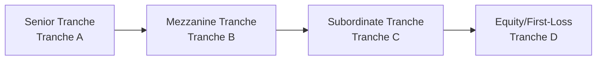

## Introduction and Overview

So, have you ever looked at a Commercial Mortgage-Backed Security (CMBS) transaction and thought, “Um, there are so many moving parts here—where do I even start?” Don’t worry; you’re not alone. Back in my early days in the industry, I remember receiving a CMBS deal document that was, like, 200 pages long. At first, all I saw were grids, footnotes, disclaimers, and more disclaimers. But once you break it down, it’s honestly just a puzzle. We have the properties, the loans, the tranches, and a bundle of underwriting rules tying it all together.

Below, we’ll walk through a hypothetical CMBS vignette—just as you might see on exam day. We’ll go step by step, highlighting the underwriting features, typical call protection mechanisms, balloon payment considerations, and how to interpret them in an exam-style scenario.

## Hypothetical CMBS Transaction Setup

Imagine that a CMBS issuer, GreatLakes Funding LLC, pools together loans from four commercial properties:

• Property A: A suburban office park.  
• Property B: A shopping center anchored by a major grocery chain.  
• Property C: An industrial warehouse with short-term leases.  
• Property D: A multi-tenant mixed-use property in a downtown location.

The combined mortgage pool totals US$250 million. Each property’s loan matures in seven years, featuring a balloon payment at maturity. And you’ll see a range of underlying terms, from LTV to DSCR, that measure how healthy each component is.

Let’s lay out some of the critical underwriting data in a table for clarity:

| Property   | Occupancy | Loan Amount (US$M) | Appraised Value (US$M) | LTV    | DSCR (Yr 1) | Notable Feature                               | Balloon Payment Date |
|------------|----------:|--------------------:|------------------------:|-------:|------------:|-----------------------------------------------|----------------------:|
| A (Office) |       88% |                60.0 |                    100.0 |  60.0% |       1.45x | Lease rollovers in 3 years (mid-term risk)    | End of Year 7        |
| B (Retail) |       95% |                80.0 |                    120.0 |  66.7% |       1.30x | Anchor tenant with strong credit rating        | End of Year 7        |
| C (Industrial) |   73% |                50.0 |                     80.0 |  62.5% |       1.25x | Short-term tenant leases—higher turnover risk | End of Year 7        |
| D (Mixed-Use)|   92% |                60.0 |                     90.0 |  66.7% |       1.40x | High cap-rate market, stable local economy    | End of Year 7        |

Occupancy gives us an early sense of property stability. Property C’s 73% occupancy might be a flag for weaker cash flows and potential volatility, especially if the warehouse loses a key tenant. DSCR provides a snapshot of how comfortably each property’s Net Operating Income (NOI) covers its debt service. Properties A and D look robust, though B and C are borderline, which could matter big-time if interest rates rise or the local market softens.

From chapters 16.1 through 16.3, remember that factors like property type, tenant mix, and lease maturity schedules are crucial to assessing default risk. This sets the stage for your underwriting approach: you want to see if these properties can comfortably meet their mortgage obligations, even under stress conditions (like an economic downturn or rising vacancy).

## Tranche Structure and Subordination

The transaction is carved into senior and subordinate tranches. Let’s imagine an illustrative structure:

• Tranche A: Senior bond (US$150M)  
• Tranche B: Mezzanine bond (US$60M)  
• Tranche C: Subordinate bond (US$30M)  
• Tranche D: Equity/First-loss piece (US$10M)

A visual might help:

Each step downward represents a layer of credit enhancement to protect higher tranches. If there’s a payment shortfall, losses are allocated first to the lowest (equity) tranche, then to the subordinate tranche, and so on, preserving the senior bond to the extent possible. 

## Call Protection Mechanisms: Lockouts, Yield Maintenance, and Defeasance

CMBS often includes call protection methods that keep loans from prepaying too early. Common examples:  

• Lockout: A period (often a few years from issuance) during which borrowers cannot prepay the loan.  
• Yield Maintenance: If borrowers prepay after the lockout, they generally must compensate the lender for lost interest based on prevailing Treasury yields.  
• Defeasance: Instead of an outright prepayment, the borrower replaces the mortgage collateral with suitable government securities that mimic the loan’s cash flow to maturity.  

In our hypothetical deal, there’s a three-year lockout on all loans. After that, a yield-maintenance provision applies until two years before maturity. In the final two years, borrowers can prepay with nominal penalties. 

A typical yield-maintenance formula (roughly) is:

$$
\text{Yield Maintenance Penalty} 
= \sum_{t=1}^{T} \frac{(\text{Loan Coupon} - \text{Treasury Yield}) \times \text{Outstanding Balance}}{(1 + r)^t}
$$

Where \\( T \\) is the number of remaining periods until maturity, and \\( r \\) is the discount rate—usually the same Treasury rate used in yield calculations or a rate specified in the loan documents.

Anyway, if a property owner wants to sell or refinance early, they’re on the hook for compensating the bondholders so that the original yield expectation is preserved. This helps protect the cash flow continuity feeding the CMBS trust.

## Balloon Payments and Refinancing Risk

Each of these loans has a seven-year term with a balloon payment. That means at final maturity, the borrower repays the remaining principal in one lump sum—often requiring them to refinance. If we’re in a higher interest rate environment or the property’s occupancy declines significantly, the borrower might not be able to swing a new loan at favorable terms.

From an exam perspective, watch out for DSCR projections and property-level trends as we approach maturity. For instance, if the office leases in Property A’s portfolio are set to roll over around year five, the property’s future NOI could be in flux—leading to a higher probability that the balloon payment can’t be refinanced. That can lead to extension or modification risk, which can ripple through to the subordinate bonds.

## Property-Level Credit Quality and Market Trends

In underwriting, you want to consider:  

• Net Operating Income (NOI) stability (linked to tenant quality, lease length, local economy)  
• Capital expenditures, particularly in older properties that may need additional renovation or retrofitting  
• Market vacancy rates and rent projections  

If, for example, you suspect an economic downturn will raise vacancy rates in industrial properties, you might run a scenario where occupancy for Property C drops from 73% to, say, 60%. Then the DSCR might dip below 1.0x, meaning the property’s NOI no longer covers mortgage payments. That scenario would arguably increase default risk.  

Meanwhile, a major tenant default in Property B’s grocery anchor scenario could degrade the property’s ability to maintain foot traffic, further depressing rent from smaller tenants and creating domino effects on DSCR. As a result, loan-level defaults could occur, pulling the sub tranches or even the senior notes into the risk zone, depending on severity.

## Stress Scenarios and Recovery Prospects

Stress testing is where we consider changes in these variables—occupancy, cap rates, interest rates, etc. Let’s say a downturn occurs in Years 3–5:

• Occupancy for Property C dips to 60%, DSCR drops to 0.95x.  
• Market interest rates tick up 150 bps, making it harder for the sponsor to refinance the balloon.  
• Rents for all industrial tenants slide by 5% annually due to slower demand.  

Now, the question: how do these changes flow through to the trust’s cash flows? Possibly, the senior bonds will still receive interest (at least for a while), but subordinate tranches could start seeing shortfalls. In extreme cases, you might see partial foreclosures or forced sales. This is precisely why we have subordination (Tranche D, then C) to absorb first losses.

## Partial Prepayment and Breakage Costs

Sometimes, a borrower might partially prepay the loan—selling off a portion of the property or obtaining additional financing. In these instances, partial breakage costs (i.e., partial yield-maintenance penalties) could apply. The penalty is often proportional to the outstanding balance that’s being prepaid.  

If that partial prepayment occurs within the lockout period, well, tough luck for the borrower—some deals entirely disallow partial prepayment until the lockout ends. It’s essential to parse the actual legal documents for the final word, but from an exam perspective, it’s typically a multi-step calculation that references the yield-maintenance formula for the fraction of principal being paid off early.

## Underwriting Steps and Key Connections to Prior Sections

Here’s a quick recap of the underwriting link to prior chapters:  

• From Chapter 16.1–16.2: Key call protection elements and investors’ need for stable cash flows.  
• From Chapter 16.3: How balloon risk and call protection interplay with extension risk, especially if property fundamentals deteriorate.  
• From Chapter 18 onwards (Credit Risk Analysis): Assessing default probabilities and loss given default (LGD) based on historical data.  

For the exam, don’t forget to interpret DSCR, LTV, occupancy, and property type synergy in a single cohesive manner. A property with moderate DSCR and good occupancy in a stable submarket might be safer than a high-DSCR property in a volatile or overly concentrated sector (e.g., a single pop-up tenant who could bolt next year).

## Conclusion and Additional Resources

Commercial real estate analysis in a CMBS deal can feel a bit like spinning plates. You’re juggling so many aspects: property economics, structural features, yield maintenance, and subordination. But if you approach it step by step—focusing on how changes in each property’s fundamentals affect the securitization’s overall cash flow—you’ll do just fine.

For deeper exploration:

• S&P Global Ratings, Moody’s, and Fitch CMBS Sector Reports: Real-world insights into rating approaches and underwriting standards.  
• Academic case studies on commercial real estate loan workouts: Learn how refinancing risk plays out when markets get rocky.  
• CFA Institute’s official practice problems, if available, on CMBS underwriting scenarios.

And remember, it’s all about seeing the forest for the trees: each property’s loan is a puzzle piece, and the tranching plus call protection shape how that puzzle fits together. Good luck, and keep practicing those scenario analyses!

---

## Test Your Knowledge: CMBS Features and Underwriting



### In the vignette’s deal structure, which property might pose the greatest immediate risk from an underwriting perspective?

- [ ] Property A with 88% occupancy and DSCR of 1.45x
- [ ] Property B with a strong anchor tenant
- [x] Property C with 73% occupancy and short-term leases
- [ ] Property D with 1.40x DSCR and stable local economy

> **Explanation:** Property C stands out due to short-term leases and lower occupancy. Those conditions can lead to more volatile cash flows and potentially higher default risk.

### Which best describes a yield maintenance provision in most CMBS deals?

- [ ] A simple lump-sum payment equal to one quarter’s interest
- [x] A penalty to compensate bondholders for lost yield due to early repayment
- [ ] A provision that locks out all principal repayments until the loan matures
- [ ] A balloon payment restriction triggered only during an economic downturn

> **Explanation:** Yield maintenance provisions require a penalty payment that replicates the lost spread or interest so that the investor is kept “whole” for the intended investment horizon.

### In the hypothetical transaction, if occupancy rates decline substantially for Property B’s anchor tenant, what is a likely outcome for the CMBS trust?

- [x] Reduced cash flow may threaten the subordinate tranches first
- [ ] Automatic refinancing of the loan at a lower interest rate
- [ ] No effect on any tranche because anchor tenants rarely default
- [ ] Downward readjustment of DSCR on the senior bond only

> **Explanation:** If the anchor tenant’s occupancy declines, NOI falls, forcing the trust to allocate losses or shortfalls first to the lower tranches because of the subordination structure.

### A three-year lockout provision primarily protects:

- [x] Investors, by preventing early prepayments and lost interest
- [ ] Borrowers, by allowing them to prepay without penalty
- [ ] Tenants, by fixing their rental rates
- [ ] Only the equity tranche, by guaranteeing them a fixed coupon

> **Explanation:** Lockout ensures the bondholders aren’t exposed to reinvestment risk too early, preserving the promised yield.

### Which of the following is true about balloon payments in this deal scenario? (Select two)

- [x] Balloon payments require the borrower to refinance or repay the entire principal at maturity.  
- [x] Higher interest rates near maturity can increase refinancing risk.  
- [ ] Balloon payments are typically smaller than monthly amortized payments.  
- [ ] Balloon payments usually eliminate the need for subordination.

> **Explanation:** Balloon payments result in a large principal repayment at term-end, exposing the borrower to refinancing risk, especially if interest rates have risen or property fundamentals have deteriorated.

### If a partial prepayment is made during the yield-maintenance period, the borrower:

- [x] Usually owes a penalty proportional to the unrecovered yield on the prepaid amount
- [ ] May do so without any cost if the property LTV is above 70%
- [ ] Is automatically released from the lockout provision
- [ ] Must fully defease the remaining principal

> **Explanation:** Partial prepayments often force a partial yield-maintenance penalty that covers the interest shortfall for the prepaid portion, maintaining investor yield expectations.

### In a stress scenario where market cap rates increase significantly:

- [x] Property valuations might drop, raising LTV ratios
- [ ] Property valuations increase, lowering LTV ratios
- [x] DSC ratios might worsen if NOI stays constant but refinancing rates climb
- [ ] The lockout provisions automatically lengthen

> **Explanation:** When market capitalization rates rise, property values decline (inversely related to the cap rate), thus increasing LTV. Also, higher cost of debt can lower DSCR upon refinancing.

### If Property A undergoes a major lease rollover a year before balloon maturity and can’t renew its largest tenant:

- [x] The DSCR could fall, making refinancing more difficult
- [ ] The lockout automatically extends
- [ ] The yield-maintenance penalty doubles
- [ ] The mezzanine bond is automatically upgraded

> **Explanation:** Loss of a major tenant can significantly reduce NOI, pushing DSCR down and increasing refinancing risk at balloon maturity.

### How is credit enhancement primarily achieved in the given transaction?

- [x] Through subordination of lower tranches (C and D)
- [ ] By imposing higher coupon rates on the senior tranche
- [ ] By ensuring borrowers carry private mortgage insurance (PMI)
- [ ] Via deflation adjustments to the loan principals

> **Explanation:** CMBS transactions typically employ structural subordination, where subordinate tranches absorb first losses, enhancing the credit of the senior notes.

### A typical “first-loss” tranche in CMBS structures is:

- [x] True
- [ ] False

> **Explanation:** The equity or most subordinate piece is often the “first-loss” tranche because it absorbs losses ahead of other tranches, providing credit protection to more senior notes.




