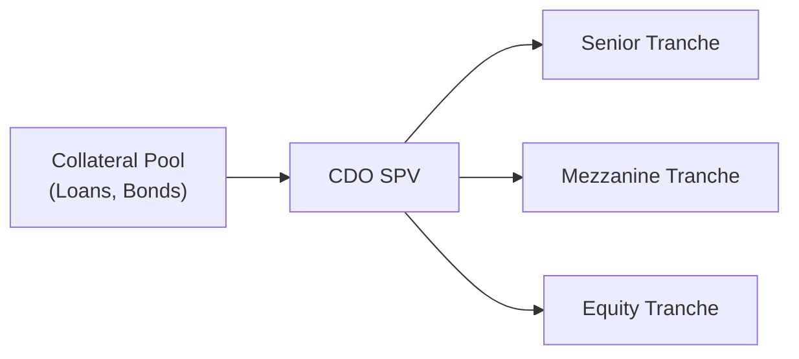

## CDO Structures and Rationale

Collateralized Debt Obligations (CDOs) are structured finance products that pool various fixed-income assets, like corporate loans or bonds, and package them into tranches. Each tranche has its own risk and reward level, which is pretty neat because it lets different investors pick the level of risk suited to them. In a sense, you’re slicing a pie—some folks want the sweet fruit filling (higher yield but more risk), others just want the crust (lower yield but lower risk), and the structure ensures everyone gets their piece.

CDOs appeal to financial institutions because they can be used to achieve either arbitrage profit (collecting the excess spread between the pooled assets and the liabilities) or balance sheet relief (moving debt or loans off the institution’s balance sheet). For investors, the attraction often lies in the potential for higher yields relative to similarly rated securities, although the complexity of CDOs can hide certain risks. I remember chatting with a colleague who once joked that reading a CDO prospectus is like studying a map to buried treasure—there’s a lot of detail and a few hidden traps if you look closely.

Below is a simple diagram that shows how these cash flows might move from the collateral pool to different tranches:

In this structure, “CDO SPV” (Special Purpose Vehicle) issues multiple tranches—senior, mezzanine, and equity. The collateral pool generates interest and principal repayments that flow through a payment waterfall, usually paying the senior tranche first, then mezzanine, and finally the equity tranche if anything remains.

## Cash Flow vs. Market Value CDOs

One of the first distinctions in CDO structures is between Cash Flow CDOs and Market Value CDOs:

• Cash Flow CDOs: These rely on the actual interest and principal payments from the collateral—think about coupon payments on bonds or loan interest payments—as the main source of cash. If the underlying borrowers keep paying, you get a predictable stream of cash to distribute to investors. The emphasis is on stable credit performance and meeting certain coverage tests (e.g., Overcollateralization and Interest Coverage ratios).

• Market Value CDOs: Here, the ability to repay investors depends mainly on the market value of the underlying collateral rather than just the cash flow it generates. These are more actively managed because changes in market prices can affect whether the SPV can meet its obligations. If the collateral prices decline, the manager may need to trade assets to maintain enough value to pay off the tranches. This typically introduces more price volatility exposure.

## Arbitrage vs. Balance Sheet CDOs

Another big distinction is why the sponsoring entity sets up the CDO in the first place:

• Arbitrage CDOs: The sponsor is aiming to earn a spread between the yield on the pooled assets and the cost of issuing those tranches. Picture a bank that puts together a pool of high-yield bonds yielding, say, 8.0% per year, while the resulting tranches cost it 6.5% on average. That 1.5% difference is the potential “arbitrage” gain for the equity tranche holder (assuming default rates don’t spoil the party). Arbitrage CDOs tend to revolve around capturing that excess spread.

• Balance Sheet CDOs: These are often initiated by banks to move assets off their balance sheets, reducing their regulatory capital requirements. Rather than a “let’s profit from the spread” motive, it’s about de-risking the institution’s balance sheet and achieving capital relief. The bank effectively transfers the credit risk to external investors, which can allow them to lend more or comply with stricter capital rules.

## Collateralized Loan Obligations (CLOs)

CLOs are one of the most common types of CDOs, typically backed by leveraged loans. The underlying collateral often includes senior secured loans made to corporate borrowers, sometimes with high yield or low credit quality. Anyway, if you’ve ever heard stories about big syndicated loans to large corporates, CLOs might be buying those up.

Key features of CLOs:

• Multiple Tranches: Senior notes, mezzanine notes, and an equity piece. Each has different priorities in the payment waterfall. Senior slices get lower yields but have more protection. Equity slices (sometimes called the “subordinated notes”) can get hammered first if defaults increase but get a bigger payoff if the collateral performs well.

• Reinvestment Period: Many CLOs have a reinvestment window during which they can reinvest principal proceeds from the underlying loans into new loans instead of passing them through to investors. This period might be managed by a CLO manager who monitors credit risk and compliance with coverage tests (like Overcollateralization (OC) or Interest Coverage (IC)).

• Active Management: CLO managers often buy and sell loans within certain constraints to satisfy the deal’s covenants and maintain the overall credit quality of the pool. They might remove a deteriorating borrower while adding a better one. That said, it’s not a free-for-all; they must adhere to the original criteria in the CLO documentation.

## Collateralized Bond Obligations (CBOs)

CBOs are similar in concept to CLOs but hold bonds as collateral rather than loans:

• Underlying Collateral: Can be high-yield corporate bonds, emerging market debt, or even structured notes. Because these bonds can have different credit and market risks, performance in a CBO can hinge heavily on interest rate movements and default rates.

• Payment Streams: The coupon income from the bonds (and eventual principal repayment) funds the CBO’s payments to each tranche. Since many of these bonds might be non-investment grade, credit enhancements and subordination are critical in protecting more senior investors.

• Sensitivity to Interest Rates: Like with any bond portfolio, the interest rate environment can shift the value of the underlying assets. When rates go up, bond prices typically go down, which can erode the value in a Market Value CBO but might not disrupt the cash flow in a Cash Flow CBO (unless the issuer defaults).

## Synthetic CDOs

A Synthetic CDO references a portfolio of assets (usually bonds or loans) but doesn’t hold them directly. Instead, the deal is constructed using credit derivatives—most commonly credit default swaps (CDS). If you want exposure to, say, 50 corporate bonds but you don’t actually want to buy them all, you can enter into swaps that replicate the credit risk.

Key points about Synthetic CDOs:

• Credit Derivatives: The SPV sells protection on a basket of reference entities. If a credit event happens, it must make a payout. This effectively replicates the risk of holding the underlying bonds or loans without physically owning them.

• Counterparty Risk: Now you’re exposed to the possibility that the swap counterparty might fail to pay if the underlying asset defaults. In other words, you have to watch out not only for your reference pool’s default risk but also for your contracting party’s solvency.

• Flexibility in Exposure: Synthetic CDOs make it faster and sometimes cheaper to scale up or scale down credit exposure. However, the added complexity can create unforeseen risks—particularly if the derivative contracts aren’t well-structured.

## Key Considerations

When analyzing CDOs—be they CLOs, CBOs, or Synthetic CDOs—there are a few vital checks to remember:

• Payment Waterfall: Determines who gets paid first. Typically, senior tranches are top priority. Equity sits at the bottom, bearing the first losses.

• Overcollateralization (OC) and Interest Coverage (IC) Tests: Help ensure that enough collateral is in place to withstand losses and that interest cash flows exceed the interest payment obligations. If these tests fail, interest cash flows might be diverted from lower tranches to shore up the senior ones—a feature sometimes called “turboing.”

• Credit Enhancement: Includes subordination (i.e., layering tranches), reserve funds, excess spread, or third-party guarantees. The more robust the credit enhancement, the safer the senior positions become—at least theoretically.

• Manager Behavior (Active Management): For CLOs especially, managers may reinvest principal proceeds, swap out declining credits, or keep coverage tests in line. The manager’s track record can significantly impact how well the structure performs.

• Market Conditions: Even a well-structured CDO can suffer if disruptions in the secondary market for loans or bonds cause abrupt drops in asset values. Market Value CDOs are especially prone to forced liquidations if the asset coverage ratios aren’t maintained.

## Practical Example: Simplified CLO Payment Waterfall

Let’s say we have a CLO that has pooled US$500 million in senior secured loans. The CLO issues:

• Senior Tranche (AAA): US$300 million  
• Mezzanine Tranche (BBB): US$150 million  
• Equity Tranche: US$50 million  

Suppose the total interest from the underlying loans the first year is US$30 million. The waterfall might prioritize paying:

1. Admin/Servicing fees (say US$2 million).  
2. Senior note interest payments (say US$12 million).  
3. Mezzanine note interest payments (say US$9 million).  
4. Anything left goes to equity holders (US$7 million in this simplified scenario).

If some loans default, the equity holders lose out first, then the mezzanine, and finally the senior if the defaults are severe enough. Meanwhile, if the Overcollateralization or Interest Coverage tests slip below predetermined thresholds, the deal might “divert” equity payments to pay down the senior or mezzanine tranches faster.

## Glossary

• Collateral Pool: The collection of bonds, loans, or other assets backing the CDO.  
• Credit Enhancement: Features that improve the safety of certain tranches, e.g., subordination, overcollateralization, reserve accounts.  
• Overcollateralization (OC): The difference between the face value of assets and the total face value of issued tranches. A “cushion” for absorbing losses.  
• Interest Coverage (IC): A ratio ensuring the collateral’s interest payments exceed the interest owed on CDO tranches.  
• Arbitrage CDO: A CDO designed to capture a spread between asset returns and financing costs.  
• Balance Sheet CDO: A CDO designed primarily to remove assets from a bank’s balance sheet for capital relief.  
• Synthetic Exposure: Gaining credit exposure via derivatives (like CDS) instead of holding the actual underlying assets.  
• Reinvestment Period: A time window during which the CDO manager can reinvest principal proceeds into new collateral.

## References and Further Reading

• Fabozzi, F. J. (Ed.). (2021). The Handbook of Fixed Income Securities. McGraw-Hill.  
• Davidson, A., & Levin, A. (2014). Securitization: Structuring and Investment Analysis. Wiley.  
• Tuckman, B., & Serrat, P. (2011). Fixed Income Securities: Tools for Today’s Markets. Wiley.  
• “Collateralized Debt Obligations (CDO).” CFA Institute Learning Ecosystem (login required).  
• IMF Global Financial Stability Reports on structured finance products: https://www.imf.org

## Exam Tips and Final Thoughts

• Thoroughly understand payment waterfalls and coverage tests—these are prime “gotcha” points in exam vignettes.  
• Pay attention to whether a CDO is Cash Flow or Market Value; your analysis of risk factors, especially interest rate or price risk, will differ.  
• Don’t overlook Synthetic CDOs. The concept of credit derivatives and how they replicate the exposure is essential, and you’ll want to keep an eye on counterparty risk.  
• Practice working through mini case studies that detail a portfolio’s performance under stressed conditions.  
• Watch out for stable-sounding tranches. Even a “senior” label doesn’t guarantee safety if the collateral defaults are large.

CDOs can appear daunting, but if you untangle the structure—i.e., identify the collateral, figure out the motivation (arbitrage vs. balance sheet), note the coverage tests, and understand the distribution of losses—you’ll have a framework to tackle exam questions confidently. I remember hearing from an exam candidate who said that once they grasped the ‘why’ and ‘how’ behind each step, CDO structures no longer felt like black boxes. And that’s exactly what we’re aiming for here.

## Practice Questions: Test Your Understanding of CDOs



### Which best characterizes the primary objective of a Balance Sheet CDO?

- [ ] To maximize equity returns through spread arbitrage.
- [ ] To hedge currency risk associated with foreign bonds.
- [x] To remove loans from a bank’s balance sheet for regulatory relief.
- [ ] To reduce interest rate volatility in high-yield portfolios.

> **Explanation:** Balance Sheet CDOs are typically used by banks or other financial institutions to remove debt instruments from their books, reducing regulatory capital requirements and transferring credit risk to external investors.

### Which of the following is true about a Cash Flow CDO?

- [ ] It relies on daily mark-to-market gains to fully repay tranches.  
- [x] It depends on scheduled interest and principal payments from the underlying collateral.  
- [ ] It typically invests only in hedge fund equity.  
- [ ] Its returns come exclusively from currency swaps.  

> **Explanation:** Cash Flow CDOs primarily use the interest and principal cash flows from the collateral to meet obligations to investors, in contrast to Market Value CDOs, which depend more on trading and market price appreciation of the collateral.

### In a CLO structure, which type of asset is typically pooled?

- [ ] Auto loan receivables.  
- [ ] Personal unsecured loans.  
- [ ] Municipal bonds.  
- [x] Leveraged corporate loans.  

> **Explanation:** CLOs usually focus on leveraged loans, often senior secured corporate loans. The essential concept is that these loans, with their higher-yield profile, are pooled and tranched into different risk-return slices.

### All else equal, which tranche is most exposed to initial credit losses in a CDO?

- [ ] Senior tranche.  
- [ ] Mezzanine tranche.  
- [x] Equity tranche.  
- [ ] Retained subordinated note by the originator.  

> **Explanation:** The equity tranche sits at the bottom of the payment waterfall. It absorbs the first losses from defaults in the collateral pool and typically has no contractual coupon payment.

### Which of the following statements about Synthetic CDOs is most accurate?

- [ ] They hold a physical pool of high-yield bonds.  
- [ ] They cannot be used to short credit risk.  
- [ ] They are less complex than standard CDOs.  
- [x] They gain exposure via credit derivatives rather than owning underlying bonds.  

> **Explanation:** Synthetic CDOs replicate exposure to bond or loan portfolios through credit default swaps or other derivatives instead of physically holding the assets.

### One major difference between Arbitrage CDOs and Balance Sheet CDOs is:

- [x] The primary motivation for issuance.  
- [ ] The requirement for at least one equity tranche.  
- [ ] Arbitrage CDOs only invest in equity.  
- [ ] Balance Sheet CDOs cannot use market value structures.  

> **Explanation:** Arbitrage CDOs are set up to profit from the spread between returns on collateral and funding costs, while Balance Sheet CDOs are designed to reduce or remove certain assets from an entity’s balance sheet for regulatory benefits.

### If the Overcollateralization (OC) test fails in a CLO, what generally happens?

- [x] Cash flows that would otherwise go to junior tranches are diverted to pay down senior tranches.  
- [ ] The entire structure dissolves immediately.  
- [ ] The CLO manager must issue new equity immediately.  
- [ ] Interest coverage tests become irrelevant.  

> **Explanation:** Failing an OC test often triggers a redirection (sometimes called “turboing”) of cash flows from lower tranches to senior tranches until the metrics regain compliance.

### A Market Value CDO is more sensitive than a Cash Flow CDO to:

- [x] Price fluctuations of the underlying assets.  
- [ ] Rising default rates on the underlying collateral only.  
- [ ] Foreign exchange exposures.  
- [ ] Changes in accounting standards.  

> **Explanation:** Market Value CDOs rely on the market value of their underlying collateral. Shifts in market prices can trigger coverage ratio breaches, resulting in forced asset sales or early repayment of senior notes.

### What is the role of a CLO manager during the reinvestment period?

- [ ] To passively collect coupons without making any changes to the asset pool.  
- [x] To actively manage and reinvest principal proceeds in new loans under deal constraints.  
- [ ] To distribute all principal returns immediately to the equity tranche.  
- [ ] To merge CLO notes with other securitization vehicles.  

> **Explanation:** During the reinvestment period, the manager can buy and sell loans to maintain or improve portfolio quality, manage credit risk, and ensure compliance with coverage tests, as stipulated by the CLO’s governing documents.

### True or False: Synthetic CDO investors face virtually no counterparty risk.

- [ ] True  
- [x] False  

> **Explanation:** Synthetic CDO structures depend on credit derivatives. If the swap counterparty fails to meet its obligations, investors can be adversely affected. Therefore, counterparty risk is an essential consideration in Synthetic CDOs.


