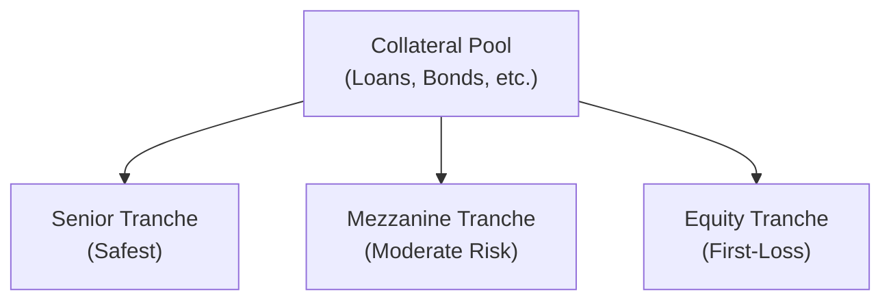

## Introduction to CDO Tranches

Collateralized Debt Obligations (CDOs) are portfolios of fixed-income assets (like corporate bonds, mortgage-backed securities, or bank loans) that are divided into slices, or tranches. Each tranche features a unique risk and return profile. If you think about it, it’s a bit like building a tall wedding cake layer by layer. The top layers are usually the safest (like the bride and groom figurines standing on top), while the bottom layers face the highest risk of getting smashed if something goes wrong. In the context of CDOs, the “top” or “front” of the line for payments is known as the senior tranche, followed by the mezzanine tranche, and finally the equity (or subordinated) tranche at the bottom, which must absorb the first losses if the underlying collateral defaults.

In this section, we’ll break down the key characteristics of equity, mezzanine, and senior tranches. We’ll also stroll through some real-world examples, share a few “lessons learned,” and illustrate how a payment waterfall distributes cash flow among the tranches. Let’s dive in!

## Senior Tranche

The senior tranche is the “privileged guest” in the CDO structure:

• Priority Position: These tranches get paid first. So if you’ve ever witnessed a buffet dinner running low on appetizers, think of the senior tranche as having priority access—guaranteed to get the first pick of the hors d’oeuvres.  
• Highest Credit Rating: Often rated AAA or AA, thanks to subordination protection from mezzanine and equity pieces below it.  
• Lowest Yield: Because there’s more safety in receiving principal and interest, investors usually accept lower returns. The trade-off is greater stability.  
• Minimal Credit Risk: As long as default and loss levels in the collateral pool remain within expected boundaries, senior investors get paid. But if things go absolutely south, the senior tranche can still be impacted (though typically last in line).

From a regulatory viewpoint, many institutional investors (like insurance companies or banks) prefer AAA or AA instruments to satisfy capital requirements and reduce credit risk. Accordingly, senior tranches cater to more risk-averse investors, offering a predictable—though often modest—return profile.

## Mezzanine Tranche

Mezzanine tranches sit just below senior investors in the payment queue:

• Middle of the Stack: They receive cash flows after senior tranche obligations. In other words, they get the second slice of the metaphorical pizza.  
• Ratings Range: May be rated investment grade (BBB) or below investment grade, depending on the specifics of subordination and the collateral’s credit quality.  
• Moderate to Higher Yield: Because of larger exposure to potential collateral defaults, mezzanine tranches must compensate investors with higher yields relative to senior positions.  
• Moderate Risk: While nowhere near as protected as the senior tranche, they still face less risk than the equity tranche below them.

Mezzanine tranches appeal to investors who are willing to assume somewhat higher risk in exchange for higher coupon payments. As the middle child of the capital structure, mezzanine is often overshadowed by the safer senior tranche. Yet some highly specialized hedge funds, asset managers, or sophisticated high-yield bond investors like mezz tranches—for them, it’s a sweet spot between safety and yield potential.

## Equity (Subordinated) Tranche

If you’re a thrill-seeker in the fixed-income world, the equity tranche might pique your interest. This is the “first-loss” slice:

• First-Loss Piece: If assets in the CDO start to default, the equity tranche absorbs those losses. Like the proverbial canary in the coal mine.  
• Highest Potential Returns: Equity holders might enjoy substantial cash flows if defaults remain low or if the underlying collateral performs beyond expectations.  
• Typically Unrated or Junk Ratings: Equity tranches often carry no rating or a rating far below investment grade, reflecting their vulnerability.  
• High Volatility: Performance can swing dramatically, from huge gains in favorable environments to devastating losses in a crisis.

We’ll be honest—some folks love the equity tranche precisely because of its optionality-like payoff. If the collateral experiences limited defaults, equity tranche holders may reap big rewards. But be warned, it’s definitely the riskiest seat in the CDO theater.

## Payment Waterfall Mechanics

Now, let’s visualize the money flow. CDOs typically employ a waterfall approach, allocating interest and principal proceeds in a strict order. Here’s a succinct depiction:

• Priority of Payments: Senior tranches get paid first from interest and principal proceeds. After senior obligations are met, any remaining proceeds “flow down” to mezzanine. Whatever is left (if anything) goes to equity holders.  
• Reverse-Order Loss Allocation: Losses are allocated from the bottom of the structure (equity) upward. Equity gets pummeled first, then mezzanine, and ultimately the senior tranches if the losses are severe.  
• Coverage Tests (OC/IC Tests): Overcollateralization (OC) and Interest Coverage (IC) ratios are used to monitor performance. When these ratios slip below specified limits, cash flows that would normally go to equity or mezzanine might be “turboed” up to the senior tranches instead, building more cushion for senior investors.  
• Turboing: A fancy term meaning that excess spread or principal proceeds are diverted to retire senior notes faster. If coverage tests breach thresholds, the lower tranches see their payments redirected toward making the senior folks whole.

To build intuition, consider a scenario where defaults on the underlying loans creep up. The coverage tests get triggered, leading to principal payments being “turboed” to the seniors. This quickly de-risks the top of the stack but can effectively starve the equity piece of cash flow. It’s a protective measure for the safer part of the capital structure.

## Risk-Return Allocation

It’s helpful to think of the entire CDO structure as a layered risk chart:

• Senior Tranche: Highest priority for payments ⇒ Lowest yield.  
• Mezzanine Tranche: Intermediate priority ⇒ Moderate yield.  
• Equity Tranche: Subordinated position ⇒ Highest yield potential but largest chance of losses.

This risk-return trade-off lies at the heart of structured finance. Investors self-select based on their tolerance for risk and desired yields. Pension funds or insurance companies might lean toward senior or high-grade mezzanine pieces, while a private hedge fund might scoop up equity tranches hoping for higher returns.

## Practical Highlights and Pitfalls

• Diversification Myth: Sometimes folks assume that “slicing and dicing” automatically diversifies risk. But if the underlying collateral is all cut from the same unstable cloth—say, subprime mortgages or high-yield bonds in a recession—diversification might be illusory.  
• Trigger Over-Reliance: Coverage tests protect the senior tranches, but they can quickly starve the equity piece of returns. If you’re an equity investor, you might experience sudden cash flow shutdown when triggers breach.  
• Market Liquidity: Trading in mezzanine and equity tranches can dry up during market stress, making them illiquid.  
• Rating Agency Surprises: Ratings can be procyclical. In downturns, large-scale downgrades happen swiftly, affecting mezz and even senior paper.

A friend of mine once invested in a CDO mezzanine tranche back in the pre-2008 era. He was enticed by the yield. It was all great—until defaults ticked up, coverage tests got triggered, and the mezz holders saw their cash flows drastically cut. Eventually, the rating agencies came calling, and my friend’s “BBB” slice tumbled well into junk territory, which definitely wasn’t the original plan!

## Attachment and Detachment Points

To quantify when a given tranche starts to absorb losses and when it “runs out” of notional, structured finance practitioners often refer to:

• Attachment Point: The collateral loss level at which the tranche begins to experience losses.  
• Detachment Point: The level of collateral loss at which the tranche is fully eroded (i.e., the notional of that tranche is completely wiped out).

For example, if the equity tranche attaches at 0% and detaches at 5%, it means that up to the first 5% of collateral losses will fully hit the equity tranche. The mezzanine tranche might attach at 5% and detach at 10%, meaning it starts getting hit after 5% of total losses are realized, and it’s fully wiped out when total losses reach 10%. Senior tranches could begin taking losses beyond the 10% loss level, depending on the structure.

## Real-World Example

Imagine a hypothetical CDO with $500 million in assets—corporate bonds, for instance. The capital structure might look like:

• $300 million Senior Tranche (AAA): 3.5% coupon  
• $100 million Mezzanine Tranche (BBB): 5.5% coupon  
• $100 million Equity Tranche (NR): Residual cash flow

The equity slice gets a “residual” or leftover interest amount after paying coupons to senior and mezzanine holders. If the underlying bonds default or significantly decline in value, the equity is on the hook first. This might reduce or even eliminate the residual.

In a benign environment, that equity piece might receive robust returns—potentially more than 10%—because it collects all the leftover interest plus principal allocations once the other coupons are paid. But once credit quality deteriorates, watch out: the equity can be quickly hammered.

## Coverage Tests and Turboing in Action

Let’s say the same $500 million CDO sees default rates rising in the underlying collateral. Suddenly, the overcollateralization (OC) ratio for the senior tranche is at risk of dropping below a preset threshold of 120%. Once it slips to 119%, the trust’s governing documents might stipulate that the interest slated for mezzanine or equity must be diverted to pay down the senior. This is the so-called “turbo” effect, effectively fast-forwarding principal repayments on the senior notes at the expense of lower tranches.

For the senior investor, it’s a relief: you get your principal and interest more quickly. For the equity investor, it’s a potential meltdown because your coupon flows could vaporize the moment coverage tests get breached.

## Summary and Best Practices

• Align Tranche Choice with Risk Appetite: Senior tranches fit more conservative profiles seeking stable returns. Mezzanine suits those comfortable with moderate risk for higher yields, and equity is for high-risk/high-reward seekers.  
• Beware Correlation Risk: Diversification only works if the underlying assets are truly uncorrelated. In a systemic event, correlations can spike, hurting all tranches at once.  
• Monitor Coverage Ratios: Understand the triggers and be prepared for “turboing” if market conditions deteriorate.  
• Perform Scenario Analysis: Model different default and recovery rate scenarios. This reveals where and when each tranche might get impaired.  
• Liquidity Matters: In stressed markets, it might be tough to offload mezz or equity slices. Keep that in mind if you may need to exit early.  
• Regulatory and Accounting Dynamics: Shifts in laws or capital requirements can affect how these tranches are valued or how quickly they can be sold.

In practice, it’s essential to keep an eye on the macros—like economic growth, default rates, and interest rate volatility—and how they can ripple through the entire waterfall. A small disturbance at the collateral level can have an outsize impact on the equity investors at the bottom of the stack.

## Additional Resources for Further Study

• Global Association of Risk Professionals (GARP) resources on structured products.  
• O’Kane, D. (2011). “Modeling Single-Name and Multi-Name Credit Derivatives.” Wiley.  
• Brigo, D., & Mercurio, F. (2006). “Interest Rate Models: Theory and Practice.” Springer.  
• “CDO Waterfall Structures.” Moody’s Special Reports (https://www.moodys.com)

These materials dig deeper into the mathematics of structured finance, coverage tests, correlation modeling, and the advanced intricacies of credit derivatives.

Remember: each tranche can serve a different kind of investor. Choose wisely based on your risk tolerance and investing horizons. If you need more insight on how these tranches interact with broader credit risk measures, check out Chapter 18 (“Introduction to Credit Risk Analysis”) and Chapter 21 (“Credit Valuation Adjustment”) for practical strategies and even deeper coverage on default probabilities and credit exposures.

## Exam Tips

• Understand the Payment Waterfall: You should be comfy identifying which tranche gets paid first and which absorbs losses first, especially in a vignette scenario.  
• Coverage Tests: Expect a question on how failing the overcollateralization test can “redirect” or “turbo” cash flows.  
• Attachment/Detachment Points: Be prepared to illustrate how mezzanine or equity tranches might see partial principal write-down once total losses surpass a given threshold.  
• Yield vs. Risk Trade-Off: Commonly tested in item sets, you must interpret or compute why senior yields are lower and equity yields are highest in normal markets.  

Below, you’ll find a short quiz to test your knowledge on these concepts.

## Evaluating CDO Capital Structures: Equity, Mezzanine, and Senior Tranches Quiz



### Which of the following tranches typically has the highest credit rating in a CDO?

- [ ] Equity tranche
- [ ] Mezzanine tranche
- [x] Senior tranche
- [ ] None of the above

> **Explanation:** By design, the senior tranche receives priority in claim on the cash flows and is generally structured to achieve the highest rating (e.g., AAA or AA).

### In a CDO’s payment waterfall, which tranche absorbs losses first if defaults begin to rise?

- [ ] Senior tranche
- [x] Equity tranche
- [ ] Mezzanine tranche
- [ ] They absorb losses proportionally

> **Explanation:** Losses are allocated from the bottom up to protect the senior interests. The equity (subordinated) tranche absorbs the initial losses, hence the term “first-loss position.”

### Which of the following best describes the mezzanine tranche of a CDO?

- [x] Middle layer between senior and equity tranches, offering higher yields than senior but lower risk than equity.
- [ ] Highest yielding and unrated portion of the CDO structure.
- [ ] Tranche that is typically rated AAA.
- [ ] Exclusively reserved for retail investors only.

> **Explanation:** The mezzanine tranche stands between the senior and equity tranches, bearing moderate risk and generally offering moderate to higher yields relative to the senior tranche.

### What is the primary function of coverage tests (OC/IC) in a CDO?

- [ ] To increase the coupon rate paid by the equity tranche.
- [ ] To prevent any principal repayment to the senior tranche.
- [ ] To determine whether monthly mortgage payments are made on time by underlying borrowers.
- [x] To ensure that senior tranches are adequately covered and to trigger “turboing” if coverage falls below critical levels.

> **Explanation:** Coverage tests ensure protection for higher tranches. If these tests fail, cash flows normally allocated to mezzanine or equity may be diverted to retire senior tranches first.

### If a mezzanine tranche has attachment and detachment points of 5% and 10% respectively, at what level of portfolio losses does it begin to incur losses?

- [ ] Losses above 0%
- [x] Losses above 5%
- [ ] Losses above 10%
- [ ] It never incurs losses

> **Explanation:** The mezzanine tranche starts taking losses after 5% of the collateral pool is lost. Below that, the equity tranche absorbs the losses.

### Which of the following statements about the equity tranche is correct?

- [x] It has the potential for the highest return but also faces the highest risk of loss.
- [ ] It is typically rated AAA.
- [ ] It has the highest priority in the payment waterfall.
- [ ] It is always fully insured against default.

> **Explanation:** The equity tranche is the first-loss piece and usually garners the highest yield potential to compensate for absorbing initial defaults.

### What happens to the equity tranche’s cash flow when overcollateralization tests fail?

- [x] It may be diverted to pay down more senior obligations (“turbo” effect).
- [ ] It is locked into a separate trust account for the equity holders.
- [x] It is split evenly with the senior tranche.
- [ ] No changes are made unless the default rate is 100%.

> **Explanation:** When OC or IC tests fail, principal and sometimes interest that would normally flow to equity (and potentially mezzanine) can be diverted to protect senior noteholders.

### Which of the following can lead to a rapid decline in the market value of mezzanine and equity tranches?

- [ ] Decreasing correlation in the underlying collateral pool
- [ ] Repurchase of the senior notes by the issuer
- [x] Downgrades from rating agencies and increased default rates in underlying collateral
- [ ] A significant drop in the general level of interest rates

> **Explanation:** If the collateral experiences higher-than-expected defaults or if rating agencies issue downgrades, investors often flee riskier tranches, causing their market values to plunge.

### Which statement is most accurate regarding turboing in a CDO structure?

- [ ] It is a mechanism where lower-rated tranches get principal repayments ahead of senior tranches.
- [x] It is a mechanism redirecting principal and/or interest from subordinate tranches to retire senior notes faster when coverage ratios are breached.
- [ ] It is a system of paying extra interest to equity holders when default rates fall.
- [ ] It permanently suspends payments to the mezzanine tranches.

> **Explanation:** Turboing accelerates paydown of senior notes using cash flows that would normally be distributed to lower tranches to restore coverage levels.

### True or False: The equity tranche of a CDO is usually rated at least BBB because it has additional protection from the transaction structure.

- [ ] True
- [x] False

> **Explanation:** The equity tranche is typically unrated or very low rated, as it absorbs the first losses.


