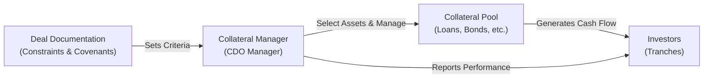

## Understanding the Collateral Manager’s Role

Collateralized Debt Obligations (CDOs) can feel like a labyrinth. They bundle a pool of income-generating assets—think corporate loans, bonds, or other structured credits—then slice them into tranches for different classes of investors. The manager’s role here? It’s essentially that of a pilot guiding the aircraft: selecting the collateral to be included in the CDO, monitoring performance, and ensuring continued compliance with coverage tests and covenants.

If you ever sit down with a collateral manager—like I did once (I was astonished by their constant juggling of data streams)—you’ll hear about everything from random credit rating shifts to industry concentration limits to potential correlation meltdowns. The manager weaves through these variables like a pro, deciding which assets to buy, hold, or sell.

Below, we’ll break down how collateral managers operate, highlight the difference between active and static management, show how they handle coverage tests, and discuss ways to align incentives while avoiding conflicts of interest.

## Selecting and Managing the Collateral

One of the first big tasks for a CDO manager is deciding which assets to include. It might sound straightforward at first—“Just pick high-quality stuff that yields more than the cost of funds,” you might say—but the reality is more nuanced.

### Eligibility Criteria and Constraints
CDO structures typically come with a set of eligibility criteria wired into the deal documentation. These criteria cover:

• Minimum and maximum credit ratings.  
• Geographic or industry-based concentration limits.  
• Caps on how many assets of a certain tenor or structure the CDO can hold.  

So if the manager sees a golden opportunity (a high-yielding corporate bond in a volatile industry, for instance), they have to make sure it adheres to the constraints. Otherwise, the entire CDO structure might violate coverage ratios or rating agency thresholds.

### Diversification and Sector Allocation
Managers strive to build a diversified pool of collateral to mitigate idiosyncratic risk. Overexposure to a single sector—like emerging market corporate debt—could lead to a meltdown if that sector experiences a downturn. Practical guidelines often exist to limit how much of the portfolio can be allocated to any single issuer or sector.

### Credit Research and Due Diligence
Managers don’t just rely on external ratings. They frequently do their own credit due diligence—analyzing issuer financial statements, running scenario analyses, stress testing potential losses, and evaluating macroeconomic factors. Ideally, they maintain a small watchlist of backup assets in case a last-minute problem emerges with a prospective holding.

## Active Management vs. Static Pools

An essential distinction in the CDO universe is the difference between active and static collateral pools:

### Active Management
Actively managed CDOs, especially Collateralized Loan Obligations (CLOs), allow managers to trade the underlying assets. It’s like having a dynamic portfolio: you can rotate out of deteriorating credits, seek new opportunities if market yields shift, and maintain coverage tests through timely trading. These managers operate within preset guidelines and covenants (e.g., they must keep the portfolio’s weighted average rating above a certain threshold), but they hold the freedom to adapt.

Advantages of Active Management  
• Ability to respond to market changes, credit events, and interest rate movements.  
• Potential for better credit quality (by selling weaker assets, buying stronger ones).  
• Opportunities to capture mispricings or relative-value trades.

Disadvantages of Active Management  
• Higher expenses (e.g., trading costs, manager fees).  
• Necessity of skillful management to avoid value destruction.  
• Potential conflicts of interest if fee structure rewards excessive turnover.

### Static Pools
On the other end, static pools fix the underlying collateral at inception. The composition doesn’t change much, aside from mandatory actions like replacing defaulted assets. Once the initial collateral is selected, the manager steps back from active trading.

Advantages of Static Pools  
• Lower management fees and trading costs.  
• More predictable performance since the collateral composition is locked in.

Disadvantages of Static Pools  
• Lack of flexibility to exit underperforming credits.  
• Missed opportunities when market conditions or credit spreads shift favorably.

## Coverage Tests and Reinvestment

A key function of collateral managers is to ensure that the CDO maintains specific coverage tests, such as overcollateralization (OC) and interest coverage (IC) thresholds. Failing these tests can trigger a series of unpleasant boss-level events—like cash flow redirection from equity tranches to senior noteholders, or even a partial liquidation of the collateral pool.

### Overcollateralization (OC) and Interest Coverage (IC) Tests
• Overcollateralization: The par value of the collateral assets must remain above a certain ratio compared to the outstanding notes.  
• Interest Coverage: The interest generated by the collateral must meet or exceed a coverage ratio comparing it to interest due on the issued debt.

When coverage tests dip below a required threshold, managers might have to sell assets to reduce liabilities or reinvest differently. It’s a bit like a bank that must hold a certain capital cushion for regulatory requirements—when that cushion shrinks, the bank must take corrective actions.

### Reinvestment Period
Many CDOs, and particularly CLOs, come with a defined “reinvestment period” during their early phase. Principal proceeds from loan repayments or prepayments can be reinvested in new assets that satisfy eligibility criteria. This is where the manager’s skill truly shines. They redirect capital into higher-yielding or more stable assets to maintain or boost coverage ratios while abiding by deal covenants. After the reinvestment period, principal proceeds typically get distributed to noteholders.

## Risk Monitoring and Ongoing Reporting

Even if the CDO has a static pool, the manager still needs to keep an eye on potential credit events or rating downgrades. The risk monitoring function is as much about real-time vigilance as it is about strategic portfolio shaping.

### Continuous Surveillance
Managers track credit ratings, watch for early warning signals (e.g., changes in corporate financial indicators, broader economic indicators like a slowdown in global trade), and run periodic stress tests. These tests often involve applying haircuts to the portfolio or simulating how the collateral might behave under scenario shocks—for instance, sector-wide losses in energy or a spike in interest rates.

### Correlation Effects
It’s one thing to keep an eye on each credit individually; it’s another challenge entirely to consider correlations across them. If you hold a bunch of loans from different issuers in the same cyclical industry, a downturn could collectively weaken your portfolio. Part of risk monitoring involves mapping out cross-correlations, so the manager can see the actual exposure to systemic risk.

### Reporting and Transparency
CDO structures often require managers to supply monthly or quarterly reports to investors, rating agencies, and trustees. These reports detail coverage ratio calculations, portfolio composition data, defaulted assets, if any, and upcoming covenant triggers. Careful, timely reporting helps keep all stakeholders on the same page, which is particularly critical whenever coverage ratios near threshold levels.

## Manager Incentives and Potential Conflicts

Let’s be honest: managers aren’t running a charity. They often earn a senior management fee based on the total par amount of the collateral, plus a performance or incentive fee driven by the equity tranche’s returns. This structure can create conflicts of interest if the manager is incentivized to pursue high-yield but risky assets to juice returns.

### Aligning Manager and Investor Interests
A well-structured CDO tries to align incentives such that managers only reap large performance fees if they achieve stable, long-term returns—or if they maintain coverage ratios across the board. Sometimes fee waterfalls are shaped to encourage conservative management, requiring coverage tests to be met before the manager can receive certain incentive fees.

### Potential Conflicts of Interest
• Overly aggressive trading to chase yield.  
• Concentration in riskier credits if that means a higher short-term yield.  
• Holding onto losing assets too long to dodge the negative outcomes on performance fees.

Reputable managers rely on robust compliance guidelines and oversight to mitigate these conflicts. They often have internal credit committees that must sign off on proposed trades, along with transparent reporting to external parties.

## A Quick Visual of the CDO Manager’s Role

In this diagram, the manager (A) is guided by the constraints in the deal documents (B). The manager actively selects and manages the collateral pool (C), which in turn generates interest and principal payments that flow to the different tranches of investors (D). The manager’s reporting obligations bridge the collateral pool’s performance with investor transparency.

## Practical Examples and Case Studies

Let’s say a CDO manager invests primarily in leveraged loans. Imagine an airplane manufacturer’s loans start to show signs of distress due to a global slowdown in travel. If the manager holds a large chunk of those loans, coverage ratios could be threatened if the credit rating gets downgraded. The manager might quickly trade out of that loan, potentially accepting a small loss, and reinvest proceeds into a more stable industry (like a consumer staples firm) if permitted by the documentation. This is textbook active management in motion.

In static deals, the manager doesn’t have the latitude to trade. So they’re stuck with that airplane manufacturer’s loans, hoping for an eventual rebound. But they’ll still keep track of coverage ratios to ensure the CDO doesn’t breach triggers.

## Common Pitfalls and Best Practices

• Pitfall 1: Excessive Industry Concentration.  
  – Watch out for managers who load up on a single industry with the assumption of stable performance. If that industry tanks, coverage tests get hammered.  

• Pitfall 2: Not Monitoring Rating Migration.  
  – One or two notches of downgrades can severely dent the overcollateralization ratio, especially in high-yield instruments.  

• Pitfall 3: Short-Term Thinking.  
  – Grabbing the highest-yield loans can be tempting, but coverage triggers might suffer if the borrowers are more vulnerable to default or negative rating migrations.

• Best Practice 1: Transparent Reporting.  
  – Providing consistent, clear monthly or quarterly reports to investors fosters trust and ensures there are no unwelcome surprises.  

• Best Practice 2: Adequate Stress Testing.  
  – Proactive scenario analysis helps managers foresee potential meltdown scenarios, plan trades, or adjust coverage.  

• Best Practice 3: Maintaining Risk-Return Balance in Asset Selection.  
  – Reaching for yield only makes sense if the underlying risk remains controlled.

## Exam Tips

When dealing with CDOs in exam vignettes, watch for coverage ratio shortfalls and how managers respond. Often, a question might highlight items like:  
• An asset’s downgrade from BBB– to BB+.  
• A sector limit breach.  
• A manager’s trade to maintain coverage tests.  
• Reinvestment of principal after an early loan repayment.  

Remember to connect these details to possible changes in the overcollateralization ratio and performance of various tranches—especially the equity tranche, which typically absorbs the first losses and is most sensitive to coverage ratio shortfalls.

Exam questions might require you to calculate coverage ratios, interpret a manager’s strategy for reinvestment, or identify whether a potential trade violates deal documentation constraints. Keep an eye out for the manager’s fee structure too. If you see a scenario where a manager’s performance fee is heightened by risky trades, be prepared to evaluate the ethics or the alignment of interests.

## Glossary

• Collateral Manager: The entity in charge of selecting, underwriting, and actively managing the collateral pool within the constraints of the CDO’s deal documentation.  
• Eligibility Criteria: Specific conditions (like credit rating thresholds or sector limits) that every potential asset must meet for inclusion in the CDO pool.  
• Reinvestment Period: A defined period during which the manager can buy new assets with principal proceeds.  
• Collateral Trading: The ongoing buying or selling of assets in actively managed CDOs to maintain or improve credit quality and compliance with coverage tests.  
• Manager Fees: Compensation to the manager, usually consisting of a base (senior) management fee and an incentive or performance fee.  
• Covenants: Deal-specific or contract-based restrictions that manage portfolio composition, leverage, and other structural aspects.  
• Stress Testing: Running “what-if” scenarios to see how the collateral pool holds up under various adverse market conditions.  
• Haircut: A discount imposed on the current value of assets in coverage test calculations or risk assessments.

## References and Further Reading

• CFA Institute Level II Curriculum: Fixed Income Readings on credit analysis, structured products, and risk management.  
• Chaplin, G., & Jäckel, P. (2018). Credit Derivatives: Risk Management, Trading and Investing. Wiley.  
• Kortanek, K. (2013). Structured Finance Modeling with Object-Oriented VBA. Wiley.  
• Creditflux. (n.d.). CLOs and CDO Market Trends. Retrieved from https://www.creditflux.com

--------------------------------------------------------------------------------

## Collateral Manager Roles & Collateral Selection Quiz



### 1. Which of the following best describes a collateral manager’s primary responsibility in a CDO structure?

- [ ] Ensuring the trustee sets appropriate interest rates for different tranches
- [ ] Guaranteeing that defaults never occur in the collateral pool
- [x] Selecting eligible assets and maintaining coverage tests in line with deal documentation
- [ ] Providing insurance to investors against credit losses

> **Explanation:** The collateral manager’s key function is to choose and manage the underlying collateral, adhering to eligibility criteria, and ensure the CDO remains compliant with coverage tests. They do not set tranche interest rates, guarantee zero defaults, or insure the pool.

### 2. In an actively managed CLO, what is the primary advantage of allowing the collateral manager to trade assets?

- [ ] It eliminates the need for overcollateralization tests.
- [x] It enables the manager to respond to changing credit risk and market conditions.
- [ ] It permanently locks in higher interest rates on all collateral.
- [ ] It reduces management costs by avoiding trading fees.

> **Explanation:** In actively managed CLOs, the manager can sell or replace distressed or downgraded assets, adjusting the portfolio to maintain or improve its credit quality. Coverage tests are still enforced, and trading typically involves higher, not lower, management costs.

### 3. Which of the following statements about static CDO pools is most accurate?

- [ ] They generate higher management fees due to frequent trading activity.
- [ ] They cannot include any reinvestment of principal proceeds.
- [x] They have limited trading activities and largely fix the collateral composition at inception.
- [ ] They are more prone to coverage test violations because collateral changes daily.

> **Explanation:** Static CDO pools maintain the collateral mix established at inception, with minimal trading allowed after the deal closes. They generally have lower management fees because the manager is not actively trading.

### 4. A manager is monitoring a potential drop in overcollateralization (OC) ratio. Which of the following actions would most likely help restore the OC ratio?

- [ ] Paying additional management fees to the manager.
- [x] Selling low-rated assets and using proceeds to retire outstanding debt.
- [ ] Increasing the collateral manager’s incentive fee.
- [ ] Distributing excess cash flow to equity holders immediately.

> **Explanation:** To boost the OC ratio, the manager might sell some collateral (particularly riskier positions) and use the proceeds to pay down senior liabilities, thus improving the ratio of collateral par value to outstanding note balances.

### 5. During the reinvestment period of a CLO, the manager receives principal repayments from maturing loans. Which of the following is the most likely use of those proceeds?

- [x] Buying new assets that comply with the CLO’s eligibility criteria.
- [ ] Distributing all the proceeds to the senior noteholders as scheduled interest.
- [x] Paying out manager performance fees immediately.
- [ ] Refunding the equity tranche at par value.

> **Explanation:** In the reinvestment window, principal proceeds are typically redeployed into new assets that meet the deal’s eligibility standards, helping maintain or enhance the portfolio’s yield and coverage ratios.

### 6. Why are interest coverage (IC) and overcollateralization (OC) tests crucial for a CDO?

- [ ] They determine whether the manager can invest in unrated bonds.
- [ ] They serve only to calculate manager fee structures.
- [ ] They apply only when the collateral manager is replaced.
- [x] They help ensure that cash flows and collateral par values remain sufficient to meet debt obligations.

> **Explanation:** IC and OC tests measure the health of a CDO’s ability to generate enough interest to service its liabilities (IC) and have sufficient collateral par value relative to those liabilities (OC).

### 7. Which of the following best explains the potential conflict of interest in a manager’s incentive fee structure?

- [ ] The manager’s fee is always zero when coverage tests are missed.
- [ ] The manager’s fee is solely based on the success of the senior tranche.
- [x] The manager might favor high-yield, higher-risk collateral to earn more performance fees.
- [ ] The manager is paid only by the trustee, independent of collateral performance.

> **Explanation:** Because higher-yield assets can generate bigger returns, some managers might be tempted to take on more credit risk. This approach boosts the potential for outsize equity returns—and potentially larger performance fees at the expense of portfolio stability.

### 8. A manager is required to keep the average rating of the portfolio at BBB– or better. A segment of the collateral is downgraded, dragging the overall rating below BBB–. Which step might the manager most likely take?

- [ ] Increase the coupon rates on the existing bonds in the pool.
- [ ] Cancel all scheduled equity distributions.
- [x] Sell the downgraded assets and purchase better-rated credits.
- [ ] Refinance the entire CDO structure at a lower interest rate.

> **Explanation:** When collateral downgrades threaten the portfolio’s required average rating, the manager typically sells the downgraded assets and redeploys proceeds into better-rated credits, helping restore compliance.

### 9. How do sector concentration limits protect a CDO’s overall performance?

- [x] By preventing excessive exposure to any single industry, reducing idiosyncratic risk.
- [ ] By forcing the manager to invest only in government-backed securities.
- [x] By guaranteeing no defaults will occur in a given sector.
- [ ] By ensuring each asset has at least a BB rating or higher.

> **Explanation:** Concentration limits keep the portfolio balanced so that a problem in one industry does not threaten the entire CDO. They do not guarantee zero defaults and do not stipulate government-only securities or minimum ratings.

### 10. True or False: In a static CDO structure, the collateral manager typically has no flexibility to replace assets even if they default.

- [x] True
- [ ] False

> **Explanation:** Static structures rarely permit much (if any) post-closing trading except under extreme circumstances, such as when assets default or the manager must address a covenant breach. Generally, they do not have the same flexibility as actively managed CDOs.


