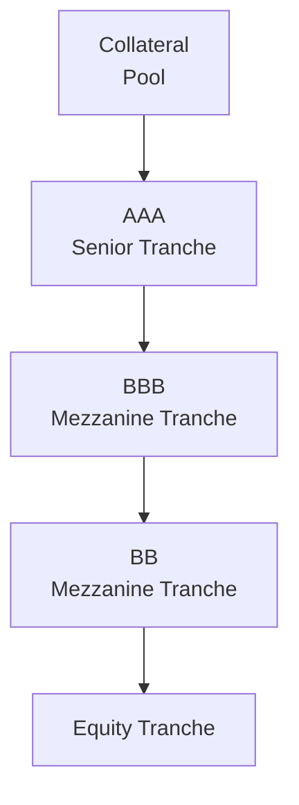
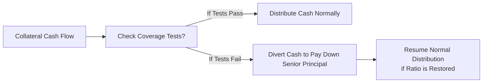

## Introduction and Scenario Context

Imagine you’re sitting by your desk, coffee in hand, staring at the numbers from a newly issued Collateralized Debt Obligation (CDO). You notice a few big red flags: some of the corporate bonds in the collateral pool just got downgraded, and the Overcollateralization (OC) ratio might be squeaking below its threshold. And to top it off, the manager is thinking about buying new loans that promise higher yields but come with higher default probabilities. Um, that’s a lot going on, right?

This practice vignette aims to walk you through evaluating a typical CDO structure under stress. We’ll look at coverage tests (OC and IC ratios), consider what happens if a trigger is breached, and see how reinvestment strategy can either shore up or erode the deal’s long-term stability. By the end, you’ll be ready to tackle item-set questions that require analyzing partial data exhibits and applying them to coverage test formulas.

## High-Level Overview of a CDO Waterfall

Before diving into the nitty-gritty, let’s visualize the capital structure of our hypothetical CDO. Picture a well-defined hierarchy of tranches. The senior tranche holds the highest rating (AAA), followed by two mezzanine tranches (BBB and BB), and then that feisty equity tranche at the bottom—hungry for yield but first in line to bear losses. A super simple diagram of how cash flows move from the collateral pool to different tranches could look like this:

In normal times, interest and principal flow from the collateral pool to each tranche according to its seniority. If coverage tests, such as the OC or interest coverage (IC) ratio, drop below thresholds (called “triggers”), the waterfall can be redirected to pay down more senior tranches first.

## Scenario Details

In our scenario, the deal is just a few months old. A partial redemption from some of the collateral assets has arrived—great news for liquidity, but the manager is contemplating reinvesting those proceeds in riskier, higher-yield loans. Meanwhile, multiple high-yield bonds in the pool have been downgraded from B+ to B–, raising concerns that the CDO’s OC ratio might fail.

You might be thinking, “Wait, just because a bond got downgraded doesn’t mean it’s defaulting, right?” True. But downgrades often push deals closer to coverage test failures, especially if portfolio guidelines require marking down the loan’s principal or adjusting the collateral value for the deal’s coverage tests.

## Key Analysis Areas

### Overcollateralization (OC) and Interest Coverage (IC) Ratios

A healthy OC ratio indicates that the par value of collateral exceeds the outstanding principal of certain tranches by a comfortable margin. If it slips, the deal may hit an “OC trigger,” meaning CDO documents will force the manager to divert cash flows to pay down senior principal until the ratio recovers.

The formula for an OC ratio typically looks like this:

$$
\text{OC Ratio} = \frac{\text{Adjusted Collateral Par}}{\text{Outstanding Senior Notes}}
$$

Interest coverage (IC) ratio is somewhat similar but focuses on interest receipts from the collateral relative to the interest owed to senior (or sometimes senior and mezzanine) tranches. The formula could be:

$$
\text{IC Ratio} = \frac{\text{Collateral Interest Collected}}{\text{Interest Due on Senior Tranche(s)}}
$$

If any ratio fails, the senior tranche typically gets more of the cash flow to reduce risk at the top of the structure. The equity tranche—sitting at the bottom—could lose out on distributions altogether.

### Potential Reinvestment Strategy

The manager’s idea: redeem principal from the downgraded bonds and plow the proceeds into new, higher-yielding loans. We all love yield, but you gotta ask, “Is the credit risk worth it?”

Points to weigh:
• Higher yield might boost cash flows—great for equity.  
• Lower credit quality means higher default probabilities. A default might blow up the coverage tests.  
• Some CDO documentation sets minimum quality requirements or guidelines. If those guidelines are violated, that’s a problem.  

### Impact on Equity Tranche

Let’s be honest: the equity tranche invests in this deal mostly for the potential big yield, but also bears first-loss risk. If coverage triggers fail, the equity proceeds might get “turboed” toward paying down senior tranches, leaving the equity investor with scraps. That’s a real possibility here if the manager invests heavily in borderline credit—especially if further downgrades occur and triggers are repeatedly breached.

### Correlation Risk

Correlations matter more than you might first guess. You could have a loan portfolio that’s been divvied up among automotive, airline, energy, and retail. If the economy dips or if there’s a sector-driven downturn, suddenly a bunch of assets might default simultaneously. Then your coverage tests absolutely crater. So we can’t just look at each asset in isolation; we have to consider how assets move together.

### Scenario Analysis and Stress Testing

It’s prudent to run a few “what-if” scenarios. For instance:
- A modest stress scenario where two more high-yield bonds get downgraded.  
- A severe or “worst-case” scenario where default rates spike in the underlying collateral and correlations intensify.  

In each scenario, recalculate coverage ratios. If the coverage ratio ends up below 100%, you’re clearly failing triggers and messing with the waterfall in ways that can be catastrophic for the junior tranches.

Anyway, this is the bread and butter of what you might see in a CFA vignette: partial data on rating transitions, historical default rates, changes in the collateral composition, etc. You’d have to piece it all together to see whether the CDO might breach a trigger.

## Example Calculation Walkthrough

Let’s run through a very simplified numeric example to illustrate how you might see this in an exam item set.

Assume:  
• Adjusted Collateral Par = $500 million (post-downgrade).  
• Outstanding Principal of the AAA Senior Notes = $480 million.  
• The established OC trigger for the senior notes is 105%.  

Step 1: Calculate the OC ratio.  
$$
\text{OC Ratio} = \frac{500\, \text{million}}{480\, \text{million}} \approx 1.0417 \,(\text{or } 104.17\%).
$$

Step 2: Compare to 105% trigger.  
104.17% < 105%, so the OC trigger is breached.

Step 3: Interpret consequences.  
When the OC trigger fails, cash that the manager might have planned to distribute to mezzanine or equity tranches is redirected (or “turboed”) to pay down principal of the AAA tranche. The goal is to bring the ratio back above 105% as quickly as possible.

Step 4: Reinvestment angle.  
If the manager invests in new loans, it might raise the total collateral par—potentially helping the OC ratio—but it also increases default risk if those new loans eventually get downgraded or default.

## Additional Considerations for a Manager’s Strategy

• If the manager invests in lower credit quality assets, the immediate yield might improve. Equity holders will cheer. But if further downgrades affect the coverage ratio, you get stuck feeding the senior tranches in an endless loop.  
• Maintaining a cushion above the trigger is generally the safer bet if you want to ensure stable cash flows to mezzanine and equity.  
• Covenant or guideline breaches can sometimes force the manager to purchase only higher-quality assets, especially if the trustee imposes restrictions after a trigger breach.

## Practical Exam Tips

• In the exam, you may see partial data in a table: a row with prior ratings, a row with new ratings, default rates, coverage test levels, etc. Assemble all these details in your scratch or highlight them.  
• Always be mindful of which coverage ratio is being tested: sometimes you’ll be asked about an “OC test,” other times an “IC test” might be relevant.  
• Keep track of tranches: Any shortfall or coverage test breach usually helps the most senior tranches and hurts the more junior ones.  
• Watch for correlation assumptions: if data references that a large portion of the collateral is in the same industry, you can guess that might intensify default risk in a stress scenario.

## Short Mermaid Break: Coverage Trigger Flow

Sometimes, it helps to see how a “trigger event” changes the waterfall. At a high level:

## Common Pitfalls

• Ignoring correlation: In real life, we often surprise ourselves by how correlated different industries can be, especially during market downturns.  
• Overemphasis on yield: A high coupon is nice, but if defaults blow your coverage tests, it doesn’t matter.  
• Not factoring in partial redemptions timed incorrectly: The manager has to respect the deal’s reinvestment periods and guidelines.  

## Conclusion and Final Thoughts

Well, that’s the story of evaluating a CDO credit structure—kind of a roller coaster. If you’re analyzing a deal with potential coverage trigger breaches, keep a close eye on the manager’s reinvestment strategy, the credit quality of underlying loans and bonds, and the correlations among the assets. In a stressful environment, junior tranches might see their distributions vaporize, while senior tranches typically get more protection. For the CFA Level II exam, be ready to handle the item set format: you’ll need to interpret partial data, do quick ratio computations, and determine the effect of triggers on cash flow allocation. Good luck out there!

## References and Further Reading

• CFA Institute, Level II Curriculum on Structured Products and Credit Analysis.  
• Standard & Poor’s (S&P Global) research reports on CDO structures and tranching (https://www.spglobal.com).  
• Hull, J. (2018). Options, Futures, and Other Derivatives. Pearson.  
• Bloomberg Intelligence on CLO Market Trends (for real-time insights into structured credit).  

## CDO Credit Structure Knowledge Check



### Which statement best describes the purpose of the overcollateralization (OC) ratio in a CDO?

- [ ] It measures the market value of the entire collateral pool against the CDO’s equity tranche.  
- [x] It compares the par value of the collateral to the outstanding principal of specified notes to ensure sufficient coverage.  
- [ ] It measures only the interest cash flow coverage for senior tranches.  
- [ ] It is a ratio used exclusively to measure correlation between assets.  

> **Explanation:** The OC ratio ensures that the collateral pool has sufficient par value compared to the principal owed to the notes. If the OC ratio dips below a trigger, cash flow is often redirected to pay down senior notes until the coverage is restored.

### What typically happens when an OC ratio trigger is breached?

- [ ] Junior tranches receive accelerated payments of principal.  
- [ ] The equity tranche automatically gets a larger share of cash flows.  
- [x] Cash flows are diverted to pay down senior principal, protecting senior investors.  
- [ ] The CDO manager is forced to sell the entire collateral pool.  

> **Explanation:** If the OC ratio fails, the priority of cash flow shifts to the senior notes to restore coverage. Junior and equity tranches often lose distributions in the process.

### In deciding whether to reinvest partial principal redemptions into higher-yielding but riskier assets, the CDO manager should primarily consider:

- [x] Whether the incremental default risk might further pressure OC/IC triggers.  
- [ ] If the rating agencies have a separate scale for undocumented assets.  
- [ ] Whether the CDO manager personally prefers high-yield investments.  
- [ ] If the trustee forbids any assets with a rating below CCC.  

> **Explanation:** The big question is always whether the higher yield compensates for the added default risk, especially if the coverage tests are already under strain. The manager must ensure that the CDO remains in compliance with its triggers and investment guidelines.

### Which tranche typically faces the greatest risk of reduced or eliminated coupon payments when an OC trigger is breached?

- [ ] The AAA senior tranche  
- [ ] The BBB mezzanine tranche  
- [ ] The BB mezzanine tranche  
- [x] The equity tranche  

> **Explanation:** The equity tranche is at the bottom of the waterfall, so it is the first to lose out on cash flow distributions when the deal is in trouble.

### If multiple assets in the collateral pool are exposed to the same industry downturn, this raises the risk of:

- [x] Higher default correlation, which can exacerbate coverage test failures.  
- [ ] Lower default correlation due to diversification.  
- [ ] Immediate redemption of the entire collateral pool.  
- [ ] Complete immunity to coverage triggers.  

> **Explanation:** When many assets share the same industry risk factors, the correlation among them is higher. A downturn in that industry can cause multiple defaults, making trigger breaches more likely.

### In a simplified scenario, the CDO’s adjusted collateral par is $540 million, the outstanding principal of the AAA notes is $500 million, and the OC trigger is 110%. What is the OC ratio, and does it breach the trigger?

- [ ] 92.59%; yes, it breaches the trigger.  
- [x] 108%; yes, it breaches the trigger.  
- [ ] 108%; no, it does not breach the trigger.  
- [ ] 110%; no, it does not breach the trigger.  

> **Explanation:** The OC ratio is 540/500 = 1.08 or 108%, which is below the 110% trigger. Hence, the trigger is breached.

### Which coverage ratio specifically measures whether the interest coming from the collateral pool is sufficient to pay the interest due on a tranche or group of tranches?

- [ ] Overcollateralization (OC) ratio  
- [ ] Reinvestment ratio  
- [x] Interest coverage (IC) ratio  
- [ ] Default coverage ratio  

> **Explanation:** The interest coverage ratio focuses on whether the interest payments collected from the underlying collateral are adequate for servicing the interest costs of the notes.

### When the coverage tests fail and cash is diverted to pay down senior debt, this phenomenon is sometimes called:

- [ ] A correlation lock.  
- [x] A turbo effect.  
- [ ] A negative waterfall.  
- [ ] A partial default guarantee.  

> **Explanation:** The “turbo” effect is when principal or interest that would otherwise go to junior tranches is instead used to rapidly pay down senior note principal, effectively “accelerating” coverage for senior noteholders.

### If the CDO manager purchases a new loan that has a slightly lower credit quality than the existing collateral but a higher yield, the immediate effect on the equity tranche is likely:

- [x] Potentially higher distributions if defaults do not materialize.  
- [ ] Guaranteed higher distribution irrespective of defaults.  
- [ ] No effect on distributions because ratings do not matter.  
- [ ] Immediate improvement in the OC ratio.  

> **Explanation:** Higher-yielding assets can increase interest proceeds if defaults remain low. However, there is also a greater risk that downgraded or defaulted assets will hurt the coverage tests.

### True or False: A decline in a loan’s credit rating automatically causes a CDO to liquidate that loan immediately.

- [ ] True  
- [x] False  

> **Explanation:** Downgrades don’t mandate immediate liquidation of the loan in most CDO structures. Instead, they may lower the adjusted coverage calculation or prompt coverage test concerns, but actual liquidation depends on the deal’s documentation and manager’s discretion.


