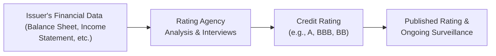

## Introduction

Sometimes I think back to my first experience with bond research—my boss at the time said, “We only buy investment-grade credits here.” I nodded confidently, even though, truth be told, I was a bit fuzzy on why we put so much trust in the rating letter from a third party. In this section, we’ll zero in on two types of credit measures: (1) the familiar credit ratings assigned to corporations, municipalities, and sovereigns by agencies such as Moody’s, Standard & Poor’s (S&P), and Fitch, and (2) the personal credit scores like FICO® in the United States, used in consumer lending. Each approach serves a specialized function in assessing the creditworthiness of borrowers, but they differ in audience, methodology, scope, and—sometimes—effect on markets.

## Defining Credit Ratings and Credit Scores

Credit ratings and credit scores are both numerical or letter-based indicators of the likelihood that a borrower will meet its obligations. However, if you’re managing a portfolio of corporate bonds, you’re much more likely to see institutional credit ratings from the major rating agencies. If you’re simply checking whether to underwrite a mortgage or personal loan, you’ll gravitate to the consumer credit scoring systems produced by TransUnion, Equifax, or Experian. 

• Credit Ratings  
  Credit ratings are forward-looking opinions about an entity’s overall creditworthiness and its ability to repay debt. They typically come in letter-grade form (e.g., AAA, AA, A, BBB, and so on down the scale) and are accompanied by descriptors such as “positive,” “stable,” or “negative” outlook. They’re often used by institutional investors, pension funds, and insurance companies with specific investment guidelines (like “only hold A or better”).

• Credit Scores  
  A credit score (e.g., a FICO® score in the U.S.) is a numerical expression of a consumer’s likelihood of defaulting on personal debt obligations. Credit scores typically range from about 300 to around 850. If you’ve ever applied for a credit card or a mortgage, you know the drill: the lender checks your credit score, which is heavily influenced by payment history, outstanding balances, and other personal financial factors.

## Key Differences

Whereas credit ratings talk about a corporation or government (with phonebook-sized annual reports and complex capital structures), credit scores address mostly individuals. Here are some of the main disparities to keep top of mind:

• Scope:  
  – Credit Ratings: Focus on corporate entities, municipalities, sovereign governments, and sometimes structured products.  
  – Credit Scores: Centered on consumers and retail lending (mortgages, credit cards, auto loans).  

• Scoring Mechanism:  
  – Credit Ratings: Assigned based on both quantitative metrics (profit, leverage, coverage ratios) and qualitative factors (management quality, competitive advantages, regulatory environment).  
  – Credit Scores: Derived via statistical models that use historical data on consumer credit usage and payment patterns.  

• Format and Symbols:  
  – Credit Ratings: Commonly designated using letter grades, like AAA (highest), AA, A, BBB, through the speculative (junk) categories, ending in CCC or D.  
  – Credit Scores: Usually numeric (e.g., FICO® from 300 to 850).  

• Usage in the Market:  
  – Credit Ratings: In institutional finance, ratings determine risk-based capital charges, investment mandates, and can trigger forced bond-selling if an issue is downgraded.  
  – Credit Scores: In retail banking, a credit score determines if you get a new credit card, how large a mortgage loan you qualify for, or how high your interest rate will be.

## Methodology

### Credit Rating Agency Process

Agencies like Moody’s, S&P, and Fitch typically combine a blend of detailed quantitative modeling and qualitative judgment to issue ratings. They will:

• Review detailed financial statements, focusing on metrics such as debt-to-EBITDA, interest coverage, and free cash flow generation.  
• Conduct on-site visits (sometimes) to interview management, gauge business strategy, and examine corporate governance.  
• Look at industry outlook, macroeconomic drivers, and regulatory changes.  
• Assign an overall rating (e.g., “A+”), accompanied by a rating outlook (positive, stable, or negative) that indicates the direction the agency believes the rating might move in the foreseeable future.

This process is often iterative, with a “notching” approach for specific debt tranches. For instance, a company’s senior unsecured debt could be rated BBB, while its subordinated debt, carrying slightly higher risk of nonpayment, might receive a BB+.

### Consumer Credit Bureau Process

Meanwhile, consumer credit scores incorporate huge statistical databases, focusing on factors like:

• Payment History: Timeliness of monthly payments on credit cards, loans, and other bills.  
• Credit Utilization: Current outstanding balances as a percentage of available credit limits.  
• Length of Credit History: How long you’ve had active credit lines.  
• New Credit Inquiries: Multiple recent applications can lower your score.  
• Credit Mix: Having a balanced use of credit (credit cards, auto loans, mortgage) often helps.

These factors are weighted (though the exact weighting can vary slightly by model). In the U.S., the FICO® score formula is closely guarded, but we know payment history and outstanding debt levels carry the heaviest weight.

## Reliance and Criticisms

It’s fair to say credit ratings play a central role in fixed income markets. But, sometimes, people rely on them a bit too much.

• Over-Reliance in the Market  
  Many institutional investors have mandates that specify “investment-grade only.” If an issuer’s rating suddenly drops below BBB–, that bond might leave the eligible universe for such funds. This often triggers forced selling and can cause liquidity squeezes, especially in the short term.

• Systemic Risk Concerns  
  We’ve seen from incidents like the Global Financial Crisis of 2008 that credit rating agencies may lag in downgrading troubled issuers or structured products. Over-reliance on their opinions can magnify market downturns if agencies all reevaluate their ratings simultaneously.

• Limitations of Consumer Credit Scores  
  Speaking from personal experience, it can feel weird to watch your FICO® score drop 20 points because you opened a new line of credit for a furniture purchase. In the end, these scoring models are just that—models. They don’t always pick up on real-world context, such as job security or macroeconomic changes that affect an individual’s ability to repay.

## Advanced Focus for Portfolio Managers

For a professional bond portfolio manager—like many of you preparing for the CFA exam—there’s more to credit risk analysis than just checking that an issuer is “A-rated.” You might also want to look at:

• Proprietary Credit Models: Many large investment firms develop their own internal credit scoring or rating models. This helps them spot potential rating upgrades or downgrades before the market does.  
• Market-Implied Metrics: Tools like bond spreads, credit default swap (CDS) spreads, and yield differentials relative to benchmarks can provide a real-time sense of perceived credit risk.  
• Sector and Macro Trends: Industries can move quickly (think technology or energy). By integrating top-down analysis, you can anticipate issues that rating agencies might not incorporate until their next review cycle.  
• Monitoring Rating Transitions: Be mindful of “fallen angels,” or bonds that move from investment-grade to high-yield status, and “rising stars,” which do the opposite. Rating transition matrices can help gauge the probabilities of movement from one category to another.

## Visual Overview of Credit Rating Assignment

Below is a simple diagram illustrating how an issuer’s overall credit profile travels through the agency’s assessment process, resulting in a final public rating.

## Case Study: The 2008 Crisis and Structured Products

We can’t talk about credit ratings without mentioning the infamous example surrounding structured products (e.g., subprime mortgage-backed securities) leading up to 2008. Many of these were initially rated AAA or AA, partly because rating methodologies relied on historical default rates that were not representative of the new, riskier pool of mortgages. When housing prices declined and defaults rose, these securities plummeted in value, severely damaging investor confidence in credit ratings.

## Integration with Chapter Concepts

Earlier in Chapter 18 (Section 18.1), we covered fundamentals like Probability of Default (PD), Loss Given Default (LGD), and the basics of expected exposure. Credit ratings effectively bundle these metrics into a single “opinion,” though they are not direct measures of PD or LGD. Moving forward into Chapter 19: Structural Credit Risk Models, you’ll see how advanced modeling can complement ratings by evaluating a firm’s assets and liabilities dynamically to estimate distance-to-default—a wholly different but related perspective on creditworthiness.

## Common Pitfalls and Best Practices

• Excessive Reliance on One Agency: If your investment policy or personal “mental comfort” depends purely on a single rating agency’s letter, you risk being blindsided by unexpected rating actions.  
• Delayed Response to Rating Changes: Some managers wait until they see a formal rating downgrade to act. But market prices often anticipate such moves.  
• Underestimating the Value of Consumer Credit Trends: In consumer ABS (asset-backed securities) or MBS (mortgage-backed securities), changes in average credit scores of underlying borrowers can be a leading indicator of default risk.  
• Ignores “Split Ratings”: Sometimes different agencies issue different ratings on the same obligation. Understanding the reasons behind this can provide deeper macro or issuer insights.

## Glossary and Key Terms

• Investment-Grade: Bonds rated BBB– (Baa3) or higher by major rating agencies.  
• Speculative Grade (Junk): Bonds rated below BBB– (Baa3). These carry higher yields but greater default risk.  
• FICO® Score: A widely used consumer credit score in the U.S., generally ranging from about 300 to 850.  
• Notching: Adjustments made by rating agencies for specific securities within an issuer’s capital structure.  

## References and Additional Reading

• International Organization of Securities Commissions (IOSCO), “Credit Ratings and Market Over-reliance.”  
• CFA Institute Research Foundation: Various “Behind the Ratings” resources and webcasts.  
• Financial Analysts Journal: Articles covering rating agency methodologies and academic studies on the efficacy of credit ratings.  

Anyway, that sums up how credit ratings and credit scores fit together in our big picture of credit risk analysis. Hopefully, you can see how each is vital in its own domain—one for large-scale corporate or government debt and the other for individual consumer lending—and why you can’t just assume a rating or score will handle all your credit-risk decisions. As a portfolio manager, always supplement external opinions with your own analysis to catch early warning signals and manage risk proactively.

---

## Exam-Style Questions on Credit Ratings vs. Credit Scores



### Which of the following most accurately describes the primary distinction between credit ratings and credit scores?

- [x] Credit ratings are used mainly for corporate, municipal, and sovereign debt, whereas credit scores focus on individual consumer credit risk.
- [ ] Credit ratings focus solely on quantitative metrics, whereas credit scores consider both quantitative and qualitative factors.
- [ ] Credit ratings are exclusively produced by government agencies, whereas credit scores are produced by private firms.
- [ ] Credit ratings only reflect a borrower’s payment history, whereas credit scores use management interviews and macroeconomic forecasts.

> **Explanation:** Credit ratings and credit scores both assess creditworthiness, but the major difference is their scope: institutional (corporate/sovereign) vs. individual consumer.

### In the context of credit ratings assigned by major agencies, “notching” refers to:

- [x] Adjusting the credit rating on specific debt issues compared to the issuer’s overall rating.
- [ ] Moving a bond rating up or down by one rating category based on interest coverage.
- [ ] Arbitrarily assigning different letter grades for the same borrower to test default probabilities.
- [ ] An adjustment made to reflect the current yield environment.

> **Explanation:** “Notching” is a process where an agency rates individual debt issues differently than the overall issuer rating, reflecting differences in seniority and other factors.

### A mortgage-backed security (MBS) largely depends on the credit profile of underlying borrowers. Which metric would a portfolio manager most likely review to assess potential credit deterioration?

- [x] Average consumer credit scores of the mortgage pool.
- [ ] The 5-year Treasury rate.
- [ ] The free cash flow of the issuing bank.
- [ ] The global GDP growth rate.

> **Explanation:** The core risk in an MBS is borrower default on mortgage payments. As such, changes in borrowers’ credit scores can be a leading indicator of increased default risk.

### Which of the following does NOT appear as a criticism of credit rating agencies?

- [ ] They may lag behind markets in updating ratings.
- [ ] Their models sometimes rely on historical data that might not mirror future conditions.
- [ ] Investors may over-rely on their grading, ignoring other risk factors.
- [x] Their use of advanced forward-looking, real-time data sets ensures immediate rating adjustments.

> **Explanation:** One of the main critiques is that ratings agencies often fail to update quickly. It is incorrect to state they ensure immediate rating updates.

### Why might a portfolio manager with an “A or better” investment mandate be forced to sell certain bonds suddenly?

- [x] A downgrade from A to BBB+ might breach the fund’s stated investment-grade criteria.
- [ ] A bond paying a higher coupon might now be too expensive.
- [ ] The bond’s duration increases unexpectedly.
- [ ] The rating agency demands that these bonds no longer be held in a portfolio.

> **Explanation:** Many investment policies tightly restrict holdings to securities with a minimum rating (e.g., A or better). If the rating falls below that threshold, funds must sell to remain compliant.

### Credit scores are predominantly based on:

- [x] A statistical model analyzing personal borrowing and payment history.
- [ ] An agency’s qualitative assessment of global economic factors.
- [ ] Interviews with management and site visits.
- [ ] Industry risk and cyclical factors.

> **Explanation:** Consumer credit scores are created using statistical models that emphasize an individual’s credit history, outstanding debts, and various personal data points.

### In a downturn, which of the following might show stress signals more quickly than a formal rating change by a credit rating agency?

- [x] CDS spreads.
- [ ] The letter grade assigned at issuance.
- [x] Market yield spreads.
- [ ] The rating agency’s annual report.

> **Explanation:** Market-related indicators like CDS spreads or yield spreads tend to reflect changes in perceived credit risk rapidly, often well before official rating changes are announced.

### During the 2008 crisis, why were many structured products initially able to secure AAA or AA ratings?

- [x] Rating agencies used historical mortgage default data that underestimated the risk of subprime loans.
- [ ] The underlying borrowers all had excellent credit scores.
- [ ] The government guaranteed these bonds.
- [ ] The Fed required agencies to give them high ratings.

> **Explanation:** Many structured products were rated based on optimistic historical data; agencies did not fully account for the increased risk in subprime or poorly documented loans.

### Which of the following is generally counted as a primary factor in determining an individual’s consumer credit score?

- [x] Credit utilization ratios.
- [ ] Industry concentration of the borrower’s employer.
- [ ] The firm’s competitive strategy in the retail space.
- [ ] Management interviews and strategic direction.

> **Explanation:** Consumer credit scores focus on personal borrowing behavior. Credit utilization ratios—i.e., how much of available credit lines are in use—are highly relevant.

### True or False: Over-reliance on credit ratings and credit scores has been cited by regulators as a potential source of systemic risk.

- [x] True
- [ ] False

> **Explanation:** Regulators worry that if large segments of the market rely too heavily on these metrics without independent analysis, sudden downgrades or shifts can amplify systemic volatility.


