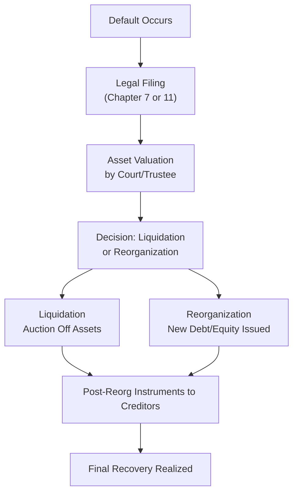

## Role of Recovery Rates in Credit Risk

Let’s set the stage with a quick recap: Recovery Rate (RR) captures how much value creditors can claw back after a default. In the context of credit risk, we usually measure RR as a fraction of the bond’s par value or outstanding principal amount that’s recovered post-default—often net of legal fees and other costs. It’s intimately tied to Loss Given Default (LGD), since:

(1)  
LGD = 1 – RR  

So if a bond has an RR of 30%, you lose 70% of your investment in the event of default. This can be sobering, but it’s also an essential part of measuring credit risk accurately. 

Sometimes I like to think of recovery rates like the “safety net” for investors. When an issuer defaults, the actual financial damage depends heavily on what you manage—or fail—to get back. If you’re analyzing credit instruments, it’s crucial to nail down a solid approach for estimating RR because, combined with probability of default, it drives so many credit metrics (like expected loss or pricing of credit derivatives).

## Key Influences on Recovery

### Seniority and Collateral
Picture a long line at an ice cream shop that’s just about to close: everyone wants the last of the ice cream (the firm’s remaining assets), but there’s only so much left. If you’re first in line, you’ve got a better chance of getting your full share. It’s similar with seniority—senior, secured bondholders typically get paid out first. Subordinated or unsecured folks might be left with the dregs. 

• Senior, secured debt: Typically recovers a higher percentage (some large-scale studies have shown recoveries exceeding 50% or more, depending on market conditions).  
• Senior, unsecured and subordinated debt: Might see lower RRs in the 20-40% region or even lower in extremely distressed cases.

### Industry and Economic Cycle
It’s also worth considering big-picture economics. If the collateral behind a loan or bond is real estate, and you’re liquidating property during a hot real estate market, you might get a much higher recovery than in a crash. Similarly, an oil and gas company’s liquidation proceeds might vary drastically depending on commodity price cycles. So, industry health and broader macroeconomic trends can induce big swings in the final recovery figure. 

### Legal Jurisdiction and Bankruptcy Laws
Local bankruptcy codes are a bit like traffic laws—some places give the pedestrian (creditor) the right of way; others favor the driver (borrower). For example, in jurisdictions that favor creditor rights with rapid foreclosure procedures, you might see speedier asset sales and fewer legal hold-ups. Meanwhile, more debtor-friendly codes might slow down liquidation and even require partial forgiveness of claims, thereby lowering recovery. 

## Approaches to Estimating Recovery Rates

Researching and estimating RR is partly science, partly art. Here are the common approaches:

### Historical Averages
Under this approach, you look at aggregate data—often from rating agencies or academic research—on how much creditors have historically recovered when borrowers default. For instance, if historically senior secured bonds in the energy sector recovered an average 55%, analysts might use that figure for quick estimates. It’s a straightforward starting point, but it can fail to reflect current market sentiment or unique issuer circumstances.

### Market-Implied Recovery
Bond prices and credit default swap (CDS) spreads often carry embedded assumptions about default risk and recovery. By backing out implied default probabilities at different recovery assumptions, analysts can approach a range of potential RRs that markets have priced in. Although more dynamic, it can be tricky to disentangle all the market factors—liquidity, risk appetite, or even transient panic selling.

### Fundamental Analysis
Here, you roll up your sleeves. You might run a scenario analysis for a hypothetical liquidation or reorganization. For instance, if a shipping firm defaults, you’d look at vessel valuations, repossession costs, potential re-chartering agreements, and so on. 

• Collateral Valuation: If the bonds are secured by tangible assets (e.g., real estate, equipment, inventory), you estimate forced-sale or liquidation values.  
• Reorganization Prospects: In some legal frameworks, companies can be restructured, meaning bondholders swap some of their debt for equity or new debt. That new instrument’s value also factors into how much you eventually recover.

## Complexity of Real-World Recoveries

It’s easy to talk about these concepts in neat bullet points, but let’s be real: the actual experience can be a messy slog. You might spend years in bankruptcy proceedings. Fees pile up. Asset values may drop mid-process if the market goes soft or if management can no longer maintain the assets. 

A personal anecdote: I once managed a portfolio that included distressed real estate bonds. We estimated a 60% recovery if the firm restructured quickly. Well, the process dragged on, the courts had a backlog, and by the time we got the sale completed, we barely reached a 30% recovery. It was a real lesson in humility about the unpredictability of legal and market forces.

## Advanced Focus: Scenario-Based Analysis and Correlated Defaults

For more intricate portfolios—think Collateralized Loan Obligations (CLOs) spanning multiple industries—it’s wise to run scenario or probability-weighted models:

• Multiple outcomes: For instance, “Best” scenario (robust economy, timely restructuring) might yield a 70% recovery, “Base” scenario 40%, and “Worst” scenario 10%.  
• Probability weighting: Assign probabilities to each scenario based on macroeconomic forecasts, historical default patterns, etc.  
• Correlated defaults: In a systemic crisis, multiple borrowers may default, which can push down asset prices if too many distressed assets flood the market simultaneously, dragging recovery rates lower across the board.

This is one reason bond indentures and loan agreements often include protective covenants (limiting additional debt issuance, specifying certain coverage ratios, etc.). They protect creditors, increasing the potential for higher recoveries if default does occur.

## Numerical Example Under Different Economic Assumptions

Let’s run a simplified scenario for a hypothetical corporate bond with a face value of $1,000:

• In a stable economy, you expect a quick reorganization. Analysts estimate a 60% RR. So if default happens, you recover $600 out of the $1,000 principal.  
• In a mild recession, the firm’s assets are less liquid, and legal costs are higher. Now the estimated RR is 45%, or $450.  
• In a severe crisis, competitor bankruptcies create a surplus of distressed assets on the market. That pushes your final RR to maybe 20%, or $200.  

If you weight each scenario by probability—say 25% stable, 50% mild recession, 25% severe crisis—then your expected recovery is:

(0.25 × 0.60 + 0.50 × 0.45 + 0.25 × 0.20) × $1,000  
= (0.15 + 0.225 + 0.05) × $1,000  
= 0.425 × $1,000  
= $425  

So, if a default occurs, the “expected” amount you get back is about $425. Obviously, you’d refine these probabilities with more rigorous modeling inputs, but you get the idea.

## Sovereign vs. Corporate Debt Considerations

Sovereign debt recovery can be its own can of worms because a government rarely goes into a formal bankruptcy proceeding in the same manner as a corporation. Instead, they might restructure, reschedule payments, or negotiate haircuts on principal. The International Monetary Fund (IMF) or other supranational bodies can be involved, further complicating the timeline and final recovery.

In corporate high-yield or distressed debt, you’re typically looking at a standard legal process. Senior bondholders often have explicit rights, while equity holders might get wiped out or heavily diluted. 

## Diagram: Key Steps in the Bankruptcy Process Affecting RR

Below is a simplified Mermaid diagram showing a typical corporate bankruptcy flow and how it intersects with recovery. Notice the interplay of liquidation vs. reorganization, plus the time factor:

Although the process might look neat in a chart, each arrow can represent months or even years. And every step can influence the final RR.

## Best Practices and Pitfalls

• Stay Alert to Legal Nuances: One of the biggest pitfalls is assuming all bankruptcies play out the same way. Each jurisdiction has specific laws.  
• Don’t Over-Reliance on Historical Data: Past recoveries may not reflect current market or industry conditions.  
• Update Your Assumptions: The real economy evolves, and so should your recovery models.  
• Protect Yourself With Covenants: From an investor’s viewpoint, robust covenants can significantly improve your odds of a decent recovery.  
• Stress Testing: Particularly for large, diversified portfolios, incorporate correlated default assumptions and scenario analysis.

## Exam Relevance and Time Management

In the Level II exam, especially for vignette questions, you may be given partial info about a firm’s capital structure, pledged collateral, or macroeconomic scenario. You’ll likely need to estimate final recoverable amounts or compute an expected loss. Keep your focus on the details provided:

• Identify senior vs. junior claims.  
• Check if collateral is specified.  
• Look for any mention of reorganization or liquidation assumptions.  
• Assess the legal environment if it’s included.

Time management is critical: You’ll typically have to switch between reading the scenario text and executing quick calculations. Practice being both systematic and efficient—jot down known formulas (like LGD = 1 – RR) and relevant data as you go.

## References for Further Study

• Altman, E. I., and Kishore, V. M.: Research on high-yield bond default rates, historical recoveries, and returns.  
• U.S. Bankruptcy Codes (Chapters 7, 11, 15) for deeper legal insights into corporate restructuring vs. liquidation.  
• IMF Working Papers on sovereign default and restructuring dynamics.  

---

## Test Your Knowledge: Estimating and Applying Recovery Rates



### Which statement best describes the role of Recovery Rate (RR) in calculating Loss Given Default (LGD)?

- [ ] LGD is equal to the coupon payment plus RR.
- [ ] LGD is half of the RR when senior debt is involved.
- [x] LGD is determined by 1 minus the RR.
- [ ] RR is the same as the bond’s current yield, and thus equal to LGD.

> **Explanation:** By definition, Loss Given Default (LGD) is 1 – RR. If the RR is 60%, then the LGD is 40%.  

### What is a common drawback of relying solely on historical averages to estimate recoveries?

- [ ] They are calculated only by equity analysts and not bond analysts.
- [ ] They ignore coupon type.
- [x] They may fail to capture current market and macroeconomic changes.
- [ ] They assume all defaults occur simultaneously.

> **Explanation:** Historical figures are a useful starting point but don’t always reflect present conditions such as shifting market liquidity or economic cycles.  

### Which of the following most directly influences recovery rates for secured debt?

- [x] The quality and liquidity of the collateral.
- [ ] The equity holders’ ability to vote on reorganizations.
- [ ] Duration remaining until maturity at time of default.
- [ ] The bond’s below-investment-grade status alone.

> **Explanation:** With secured debt, the assets pledged (collateral) and their market liquidity at time of default are primary determinants of recovery.  

### How might correlated defaults in a stressed economic environment affect recovery rates?

- [ ] They tend to increase RR due to more efficient bankruptcy proceedings.
- [ ] They have no meaningful impact on RR.
- [x] They often depress RR as multiple asset liquidations flood the market.
- [ ] They make no difference if senior debt is secured by intangible assets.

> **Explanation:** In a crisis where multiple firms default, a flood of distressed assets can push prices down further, reducing what creditors ultimately recover.  

### Why is it beneficial to use market-implied recovery rates?

- [x] They can reflect real-time market perceptions of default risk and recovery.
- [ ] They rely on the face value of bonds instead of historical data.
- [ ] They don’t change based on interest rates.
- [x] They eliminate all modeling uncertainty.

> **Explanation:** Market-implied RRs are dynamic and capture current investor sentiment. However, they don’t fully eliminate uncertainty—investors still have differing views, and market anomalies might occur.  

### Which factor can significantly lower an investor’s potential to recover debt in a bankruptcy proceeding?

- [x] Lengthy legal procedures that increase costs.
- [ ] Short maturity date prior to default.
- [ ] High coupon rate relative to peers.
- [ ] Excessive bond liquidity in secondary markets.

> **Explanation:** Prolonged bankruptcy processes effectively burn money in legal fees and administrative costs, decreasing the final amount paid to creditors.  

### Which method of estimating recovery rates requires evaluating the specific liquidation scenarios for a firm’s collateral?

- [x] Fundamental Analysis (scenario-by-scenario).
- [ ] Statistical default modeling.
- [x] Historical Average approach.
- [ ] Factor-based regression analysis.

> **Explanation:** Fundamental analysis dives into specific details: the collateral’s liquidation value, potential reorganization outcomes, etc. This approach is more hands-on than using broad historical data.  

### If a bond’s recovery rate is assumed to be 40%, what is the loss given default?

- [ ] 100%
- [ ] 60%
- [x] 1 – 0.40 = 0.60
- [ ] 25%

> **Explanation:** LGD = 1 – RR. With an RR of 40%, the LGD is 60%.  

### Which of the following statements is correct regarding senior secured debt?

- [x] It usually has higher recovery rates compared with unsecured debt.
- [ ] It is always backed by government guarantees.
- [ ] It ranks below subordinated debt for default payouts.
- [ ] It eliminates default risk entirely.

> **Explanation:** Senior secured debt is higher in the payment hierarchy and collateralized, generally leading to higher recoveries than unsecured or subordinated debt.  

### A bond analyst notes that a sovereign issuer is experiencing financial distress and is likely to restructure rather than liquidate. Which statement is most accurate?

- [x] Sovereign restructuring may involve negotiating a reduced principal while still trying to repay some portion, impacting recovery.
- [ ] Sovereign entities follow the same legal bankruptcy process as corporates in Chapter 11.
- [ ] Restructuring results in a full recovery of principal and accrued interest.
- [ ] Sovereign default has no correlation to macroeconomic variables.

> **Explanation:** Unlike corporate entities, sovereigns negotiate with creditors—often yielding partial principal repayment (“haircuts”), thus altering the recovery.  


