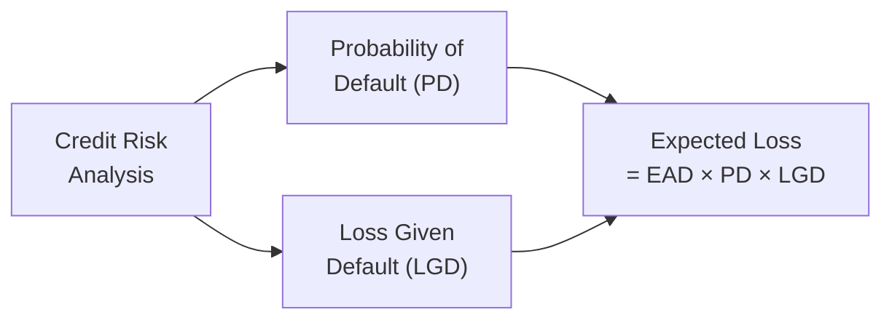

## Background on Loss Given Default

Loss Given Default (LGD) plays a huge role in credit risk analysis. You know how some folks think, “I’ll just consider the probability of default (PD) and maybe a recovery rate, and that’s enough”? Well, in practice, you can’t overlook LGD. After all, if an obligor does default, the magnitude of your loss can vary drastically based on your collateral’s value, your position in the capital structure, and the overall health of the markets. I remember a very telling scenario in my early career, analyzing a distressed retail chain. The retailer had a decent chunk of physical stores, but the real estate was overvalued. When it defaulted and the dust settled, the actual recovery turned out to be half of what we expected—was that a wake-up call or what?

LGD basically measures the portion of an exposure that is lost when a borrower defaults. Formally, if Recovery Rate (RR) is the fraction you eventually recoup, then:

LGD = 1 – RR.

It’s often used in tandem with the probability of default (PD) to determine expected loss (EL). The standard approach is:

Expected Loss = Exposure × PD × LGD.

In advanced credit modeling, you might see risk-adjusted discount rates, haircuts on collateral, or multi-year recoveries that demand discounting future cash flows. But let’s keep it accessible and straightforward as we build up. 

Below is a quick snapshot of how LGD fits into the bigger picture of credit risk:

The diagram helps us see that credit risk analysis is about combining the probability and magnitude of a potential default.

## Key Elements in LGD Calculations

If you think about credit risk from a lender’s perspective, the dream scenario is zero default, but real life can get complicated in the blink of an eye. Here’s what typically goes into an LGD calculation:

• Exposure at Default (EAD): The outstanding amount at the time the borrower defaults. Sometimes you’ll see the maximum credit limit used if the entire amount is drawn.  
• Recovery Rate (RR): This can emerge from collateral liquidation or partial payments from the defaulted obligor. You might see “haircuts” (reductions) here to reflect fire-sale conditions.  
• Seniority in Capital Structure: Senior secured debt usually recovers more, while subordinated or mezzanine debt is at a greater risk of large losses.  
• Time to Recovery and Discount Rate: If recoveries happen over several years, we typically discount the expected cash flows to present value using a risk-adjusted discount rate.  

## Vignette-Style Practice: Setting the Scene

Let’s imagine you’re reading through a multi-paragraph story describing a fictional firm, Global Manufacturing Inc. (GMI). You’re given details about GMI’s capital structure, the secured and unsecured portions of its debt, current macro issues potentially increasing default risk, and some numeric details on collateral valuations. You’ll typically see a table with one or two years of projected financials, plus some rating agency commentary about the sector’s outlook.

Following that, you might see a bullet point that says something along the lines of:  
• Senior Secured Loan: $100 million  
• Subordinated Note: $50 million  
• PD (Annual) for Senior Secured: 4%  
• Expected Recovery for Senior Secured: 80%  
• PD (Annual) for Subordinated Note: 10%  
• Expected Recovery for Subordinated: 30%  

They might also throw in a mention that "Recovery might be slower than normal due to macroeconomic headwinds, and the rating agency suggests a 10% haircut to planned collateral proceeds." They could also mention you’re dealing with a forced liquidation scenario which could further reduce the effective recovery.

## Step-by-Step Calculation Approach

1. Determine Exposure:  
   • For the senior secured loan, EAD might simply be $100 million if it’s fully drawn.  
   • For the subordinate note, EAD is $50 million.  

2. Adjust Recovery Rate for Potential Haircuts:  
   • Suppose the stated recovery for the senior loan was 80%, but the rating agency suggests a 10% haircut to your collateral’s market value.  
   • If that 80% was derived from the collateral, the new effective recovery might be 80% – (10% of 80%) = 72%.  
   • By the same logic, if the subordinated note’s 30% is subject to the same haircut, it’d be 30% – (10% of 30%) = 27%.  

3. Calculate LGD:  
   • LGD for the senior loan: 1 – 0.72 = 0.28 (28%).  
   • LGD for the subordinated note: 1 – 0.27 = 0.73 (73%).  

4. Incorporate Probability of Default:  
   • PD (Senior): 4%. PD (Subordinated): 10%.  

5. Compute Expected Loss (EL):  
   • Senior: $100 million × 4% × 28% = $1.12 million.  
   • Subordinated: $50 million × 10% × 73% = $3.65 million.  

And done. That’s the typical numeric flow. In real item sets, you might see interest rates, discount factors for future periods, or partial recoveries trickling in over multiple years. You’d have to discount each year’s expected recovery at an appropriate rate—maybe they’ll specify "discount at 6%" or something. But the principle remains the same: multiply your final discounted Recovery Rate (or the present value of total recoveries) by the Probability of Default and the Exposure.

## Advanced Considerations

• Multiple Tranches: Watch out for capital structures with different layers—first-lien, second-lien, mezzanine, and subordinated. Each layer gets a distinct Recovery Rate, and the item set might ask you to "rank them in order of expected LGD" or "calculate the total expected loss if the second-lien is only partially covered after the first-lien recovers its portion."  
• Collateral Valuation Over Time: If the scenario states that real estate or machinery assets decline in value each year, you might see a lowered recovery assumption in year two or three, requiring discounting.  
• Risk-Adjusted Discount Rates: They’ll sometimes say something like, "Given the uncertainty, discount the final recovery at 15%." That’s a subtlety you can’t ignore. The bigger the discount rate, the lower your net present recovery.  
• Covenant Triggers: If the item set remarks that "breach of coverage ratio triggers immediate acceleration," it might shift the timeline of default and your EAD or your recovery assumptions.  

## Best Practices for Exam-Style Item Sets

• Read the Vignette Carefully: Don’t get trapped by extraneous data. The exam loves sprinkling details. Watch out for data that’s irrelevant or is only relevant to a part of the question.  
• Organize Key Inputs: I like to make a quick table or bullet list of EAD, PD, Recovery Rate, discount rates, etc. Then do your math in a linear, methodical flow.  
• Watch for Time Horizons: Are we looking at next year’s default probability or a multi-year scenario? Evaluate if the problem uses a multi-year accrual or a single point in time.  
• Cross-Check Inclusion of Collateral Haircuts: Make sure you incorporate any final instructions about forced selling or changes in collateral value.  

## Mini Vignette Example: Eclipse Tech Inc.

Here’s a condensed version of what an item set might look like. Quick heads-up, some of the details might be tricky on purpose—just as exam content is.

Eclipse Tech Inc. (Eclipse) is a mid-sized technology hardware firm facing high competition in a rapidly evolving market. Outlined below is select information from Eclipse’s CFO, rating agency commentary, and an independent collateral appraiser:

• Senior Secured Loan: $80 million.  
• Unsecured Debenture: $40 million.  
• Estimated Probability of Default (Senior Secured Loan): 6%.  
• Estimated Probability of Default (Unsecured Debenture): 11%.  
• Current Collateral Value (for Senior Secured): $65 million, but the CFO expects a forced liquidation at 90% of that amount.  
• The rating agency study suggests a further 5% discount to the forced liquidation value due to uncertainties in hardware resale.  
• Unsecured Debenture has no dedicated collateral. Recovery might be 20% in a best-case scenario.  
• Some rating agency analysts foresee a potential discount-rate increase if markets turn more volatile, albeit it’s not reflected in current assumptions.  

In an exam item set, you might see questions like:  
• Calculate the senior secured loan’s final recovery assumption after adjusting for forced liquidation and rating agency haircuts.  
• Derive LGD (1 – RR) for both the senior secured loan and the unsecured debenture.  
• Estimate the expected loss for each instrument.  
• Identify which changes (increase or decrease in discount rate, further asset market deterioration, etc.) would have the largest impact on LGD.  

## Conclusion and Exam Tips

Loss Given Default is one of those areas that feels straightforward on paper, but the complexity can ratchet up quickly. Maybe that’s why the CFA exam item sets love to throw curveballs—like multi-year recoveries, final discount rates, or partial draws on credit lines. Remember, a key to success is reading carefully, separating relevant from irrelevant data, and methodically applying the formula. 

Also, be sure to watch for subtle triggers in the text that might alter your PD or your recovery assumptions mid-calculation. If you see “covenant triggers,” “contingent collateral,” or “market disruptions,” factor them in. It might feel a bit stressful the first time you see it under timed conditions, but practice enough, and you’ll handle them with confidence.

• Take advantage of official CFA practice questions and mock exam item sets.  
• Cross-check each step of your numeric logic under exam constraints.  
• Don’t be afraid to annotate the vignette. Jotting down quick notes can save mistakes.  

Finally, always keep the bigger picture in mind: The LGD calculation is only part of standard credit risk assessment, alongside PD and exposure trends. Confidence with these processes will not only help you pass the exam but also equip you for real-world credit analysis.

## References and Further Exploration

• CFA Institute Learning Ecosystem: Advanced credit risk and item set examples.  
• Federal Reserve Board Papers on Stress Testing Methodologies: Good for exploring discount rates and multiple scenario analyses.  
• Tavakoli, Janet. “Structured Finance and Collateralized Debt Obligations.” For deeper multi-tranche structured product insights.  
• For thorough coverage on exam question style, see prior Level I/II references on fixed income valuations and risk measurements.  

## High-Value Questions on Loss Given Default



### For a typical bond, which of the following best defines Loss Given Default (LGD)?

- [ ] The cost of servicing a bond over its entire lifetime.  
- [ ] The fraction of exposure paid out in coupon payments.  
- [x] The percentage of the exposure that is actually lost after default, net of recoveries.  
- [ ] The full face value of the bond prior to default.  

> **Explanation:** By definition, LGD focuses on the portion of exposure not recovered post-default. It is 1 – Recovery Rate.

### Using the Senior Secured Loan example where the initial collateral coverage is $100 million and a forced-sale haircut reduces that coverage by 15%, which step correctly calculates the haircut-adjusted recovery assumption?

- [x] Adjust the collateral value to $85 million and divide by the exposure to find the revised recovery rate.  
- [ ] Deduct 15 percentage points directly from the model’s PD.  
- [ ] Multiply the interest rate by 0.85.  
- [ ] Convert the recovery rate to default mode.  

> **Explanation:** Haircuts affect the value of collateral, lowering potential recovery. You recalculate the expected recovery from the new collateral value divided by the total exposure.

### If a borrower’s senior bond has a 5% PD, the bond’s face value is $50 million, and you estimate a 70% recovery rate, what is the expected loss?

- [ ] $50 million × 70% × 5%  
- [x] $50 million × 5% × (1 – 70%)  
- [ ] $50 million × 70% × (1 – 5%)  
- [ ] $50 million × (1 – 70%)  

> **Explanation:** Expected Loss = EAD × PD × LGD. Here, LGD = 1 – 70% = 30%. So the EL is $50 million × 5% × 30% = $0.75 million.

### Which of the following is a common advanced technique in LGD calculations when recoveries are received over multiple years?

- [ ] Ignoring time value of money considerations.  
- [x] Discounting the expected recovery cash flows using a risk-adjusted rate.  
- [ ] Adding a premium for voluntary prepayments.  
- [ ] Assuming zero recovery whenever drawn.  

> **Explanation:** When recoveries come in future periods, standard practice is to discount those cash flows at a rate that reflects the risk of actually receiving them, thus generating a present value for the recovery.

### In the context of structured finance, if you see multiple tranches with varying seniorities, how does that typically affect LGD calculations for junior tranches?

- [ ] Junior tranches always have lower LGD.  
- [ ] Senior and junior tranches share the same LGD.  
- [ ] Junior tranches are always refinanced before any senior debt.  
- [x] Junior tranches often face higher LGD due to their lower priority in the capital structure.  

> **Explanation:** Junior (or subordinated) tranches get paid after senior tranches in a default scenario, implying higher risk of larger losses.

### Suppose a lender uses a 12% discount rate instead of 6% when calculating recovery values. What is the impact on LGD?

- [x] LGD increases because the present value of recoveries decreases.  
- [ ] LGD decreases because discounting is lower.  
- [ ] LGD stays the same because discount rates don’t affect recoveries.  
- [ ] LGD improves due to reduced time to default.  

> **Explanation:** A higher discount rate lowers the present value of future recoveries, thereby increasing the fraction at risk (LGD).

### In an exam-style question, which detail might be a “trap” that distracts you from calculating LGD correctly?

- [ ] The principal amount of the bond.  
- [x] Mention of a coupon payment due after the firm has already defaulted.  
- [ ] Probability of default data.  
- [ ] Collateral valuation details.  

> **Explanation:** Coupons expected after a default event can mislead your calculation. Often, once default occurs, future coupons aren’t received (unless specified in a restructured agreement). So referencing that coupon can be a red herring.

### You are given that an unsecured bond’s PD is 8%, the face value is $25 million, and the best recovery estimate is 40% after discounting. Which is the correct formula for the expected loss?

- [x] EL = $25 million × 8% × (1 – 40%)  
- [ ] EL = $25 million × (1 – 40%)  
- [ ] EL = $25 million × 8%  
- [ ] EL = $25 million × (1 – 8%)  

> **Explanation:** Standard formula = Exposure × PD × LGD. Here, LGD = 1 – 40%.

### In a forced liquidation scenario, what best describes the concept of a “haircut”?

- [ ] A bonus payment to bondholders to expedite the sale.  
- [ ] A total write-off of the underlying collateral.  
- [x] A reduction in the collateral’s assumed value to reflect poor selling conditions.  
- [ ] A mandatory fee paid by the lender.  

> **Explanation:** A haircut is a deduction from the asset’s fair value that acknowledges the depressed prices likely to result from a quick or forced sale.

### True or False: An increase in the PD of a borrower, holding all else constant, will reduce the LGD.

- [ ] True  
- [x] False  

> **Explanation:** LGD is independent of PD. If PD rises while collateral assumptions remain unchanged, LGD stays the same—though the overall expected loss (which is PD × LGD × EAD) will increase.


