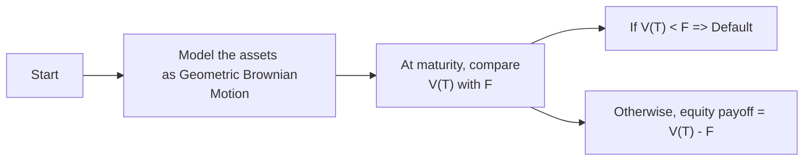

## Introduction
Well, let’s start by reminding ourselves what we’re dealing with here: the Merton model is considered one of the earliest—and arguably the most foundational—frameworks for analyzing credit risk in a “structural” way. It was developed by Robert C. Merton (yes, the Nobel laureate) who essentially thought, “Hey, if equity holders have limited liability, then holding equity in a leveraged firm isn’t so different from holding a call option on that firm’s assets.” That observation, which might sound simple now, was revolutionary. It gave us a way to model when a company would end up in default by modeling the firm’s underlying asset value and tracking how it evolves over time.

Even though we’re exploring this for the Level II curriculum, it’s relevant across many advanced finance applications. When we talk about corporate bonds, leveraged finance, or even some fancy credit derivatives, the Merton model’s fundamental ideas serve as the conceptual foundation. So, it’s probably worth diving a bit deeper: we’ll look at the underlying assumptions, the mathematical formulation, how one might “get practical” with it, and the possibility of calibrating the model in real markets.

## Why It Matters in Fixed Income Analysis
Fixed income investors—especially those dabbling in corporate bonds or other credit-sensitive instruments—care about the probability that the issuer might default on its obligations. The Merton model ties the idea of default to the firm’s asset value dropping below its debt obligations. Conceptually:

• If the firm’s asset value ends up higher than the face value of its debt at maturity, the equity holders can repay the debt and keep whatever is left.  
• If the firm’s asset value falls below the debt obligations, the equity holders can just walk away—equity’s payoff is zero, and the firm defaults.  

This means the more uncertain or volatile the firm’s asset value, the higher the likelihood that it might sink below the debt threshold at some point—thus raising default risk.

On top of that, you’ll see connections to earlier chapters where we talk about yield spreads, risk premia, and the ways risky debt is priced in the market. Merton’s approach helps you get that “aha” moment about why corporate credit spreads exist and how they might change if the underlying assets get riskier.

## Key Concepts and Fundamental Assumptions
The Merton model rests on a few straightforward assumptions, though in practice they’re not always easy to fulfill:

- The firm’s asset value follows a stochastic process, typically assumed to be a geometric Brownian motion (GBM). This implies continuous price evolution with a certain drift and volatility.  
- The firm issues zero-coupon debt (face value F) that matures at time T. In reality, companies often issue coupon-bearing debt or a portfolio of obligations. But we simplify it here for clarity.  
- Default can only happen at debt maturity. In other words, it’s a European-style approach—no early triggers. Some might say that’s a strong assumption, but hey, it’s a starting point.  
- Equity holders’ liability is limited to their initial investment, making their position akin to a call option on the firm’s assets (with strike price F). If you can’t meet the debt face value, you lose any residual claim.  

So, the short story is: at time T, if the firm’s assets V(T) < F, the firm defaults. If V(T) ≥ F, equity holders pay off the debt and keep the difference.

## The “Equity as an Option” Perspective
We’ve all encountered the Black-Scholes option pricing formula at some point—maybe from our Level I days or from a close reading of option markets. The Merton model effectively takes that same mathematics and says:

“Let’s treat the total equity of the firm as the call option payoff: max(V − F, 0). Then we can price that call just like we would any option using Black-Scholes logic.”

This is a huge conceptual step. By linking a firm’s capital structure to standard option pricing, we can talk about default in the language of probabilities and distributions. Specifically, under the risk-neutral measure:

- We treat the expected growth rate of the firm’s assets as the risk-free rate r, rather than its actual expected return μ.  
- The volatility of the firm’s assets, σ, drives the spread of possible asset values over time.

## A Quick Look at the Math
If you’ve seen Black-Scholes before, this will feel pretty familiar. In the Merton model, let:

• V₀ be the current market value of the firm’s assets.  
• F be the face value of debt (essentially the strike price).  
• T be the time to maturity of that debt.  
• r be the risk-free rate.  
• σ be the volatility of the firm’s assets.  

Under the risk-neutral measure, the value of equity E₀ is:


E_0 = V_0 \, \Phi(d_1) \; - \; F e^{-rT} \, \Phi(d_2)


where


d_1 = \frac{\ln\left(\frac{V_0}{F}\right) + \left(r + \frac{\sigma^2}{2}\right) T}{\sigma \sqrt{T}}, \quad 
d_2 = d_1 - \sigma \sqrt{T},


and \\(\Phi(\cdot)\\) is the cumulative distribution function (CDF) for a standard normal variable.

In this setup, \\(\Phi(d_2)\\) can also represent the risk-neutral probability that the firm’s assets will exceed the face value of the debt at maturity: in other words, \\(\Phi(d_2) = P\text{(no default under risk-neutral measure)}.\\) From that, we get that the probability of default over the period is \\(1 - \Phi(d_2).\\)

## Probability of Default and Credit Spreads
One of the neat features of Merton’s approach is that it naturally ties in with the idea of a credit spread. The risk-neutral probability of default is basically the chance, in a pricing sense, that the firm’s asset value at T falls short of F. So, if you look at a corporate bond from that issuer, you might rationalize that its yield spread is compensating you for that potential shortfall.

In practice, if the risk-neutral PD for a firm is calculated to be x%, you’d expect the corporate bond’s yield to reflect that risk (plus possibly some risk premium and an additional spread for illiquidity, taxes, or other frictions). This is why the Merton model is considered a foundation for understanding the structural reasons behind credit spreads.

## Schematic Representation
Sometimes a diagram helps. Here’s a simple flowchart of how the Merton model conceptualizes the asset evolution and payoff at maturity:



In the real world, we can have partial defaults or renegotiations, but for the Merton model’s simplest version, it’s quite binary: either your asset value is above the debt threshold, or it’s not.

## Implementing and Calibrating the Merton Model
Okay, so let’s say you’re an analyst wanting to use the Merton model to estimate the default probability or the fair value of debt/equity for some firm. How do you do it?

### 1. Estimate Asset Value (V₀) and Volatility
In real markets, the firm’s asset value isn’t directly observable. We do see the firm’s equity price and debt outstanding. Typical steps might look like:

• Use the market capitalization (plus possibly some measure of net liabilities) as an initial guess for V₀.  
• Use the observed equity volatility to help back out the overall asset volatility.  

Because equity is basically an option on these assets, you can solve a system of equations:  
(1) The Merton formula for equity.  
(2) The “equity volatility” relation, derived from option pricing (delta times asset volatility).  

### 2. Iterate to Find the Consistent Set of Parameters
In many real-world implementations (like the Moody’s KMV model), you do an iterative approach:

- Guess V₀ and σ.  
- Plug them into the Merton formula to see if you get the right equity price.  
- Adjust until you converge on a pair (V₀*, σ*) that’s consistent with the observed market data.  

### 3. Calculate the Probability of Default
Once you have the implied asset values and volatility that match reality, you can compute \\( \Phi(-d_2) \\) (or \\( 1 - \Phi(d_2) \\)) as your risk-neutral probability of default. If you shift out of the risk-neutral measure to real-world probabilities, you might add or subtract a risk premium or use different assumptions about drift. That’s more advanced, but also quite common in practice.

### 4. Sensitivity and Scenario Analysis
It’s often valuable to see how changes in volatility, capital structure, or drift assumptions can affect default probabilities. This is especially useful when you’re trying to see if a firm’s default risk might spike if asset volatility goes up (like in a recession or some crisis scenario).

## A Simple Python Example
Just to give a quick and very simplified demonstration of how you might approach solving for V₀ and σ, here’s a tiny snippet of Python-esque pseudocode. Let’s assume we have some known equity price E0, risk-free rate r, time to maturity T, face value F, and an initial guess for V0 and sigma:

```python
import math
from math import log, sqrt, exp
from statistics import mean
import random

def black_scholes_equity(V0, F, r, sigma, T):
    d1 = (math.log(V0 / F) + (r + 0.5 * sigma**2) * T) / (sigma * math.sqrt(T))
    d2 = d1 - sigma * math.sqrt(T)
    # Equity value per Merton
    return V0 * phi(d1) - F * math.exp(-r * T) * phi(d2)

def phi(x):
    # Standard normal CDF (placeholder – library function needed)
    return 0.5 * (1 + math.erf(x / math.sqrt(2)))

def objective(params):
    # We want to match the observed equity price E0
    V_candidate, sigma_candidate = params
    E_model = black_scholes_equity(V_candidate, F, r, sigma_candidate, T)
    return (E_model - E0)**2  # Minimizing squared error

best_params = None
best_obj = float('inf')

for V_guess in [i for i in range(50, 2000, 50)]:
    for sigma_guess in [i/100 for i in range(5, 51)]:
        val = objective((V_guess, sigma_guess))
        if val < best_obj:
            best_obj = val
            best_params = (V_guess, sigma_guess)

V_star, sigma_star = best_params
print("Best V0:", V_star, "Best sigma:", sigma_star)
```

This approach is obviously quite brute-force (and definitely not the approach you’d use in a professional environment), but it highlights the big idea: we search for the asset value and volatility that best replicate the observed market equity price, using the Merton formula. Once we have \\(V_{\star}\\) and \\(\sigma_{\star}\\), we can compute default probabilities.

## Practical Considerations and Limitations
Let’s be real—like many models in quantitative finance, the Merton model can feel too neat compared to the messy real world:

- Firms can default before the maturity of their debt.  
- Capital structure can be more complicated than one piece of zero-coupon debt.  
- Market inefficiencies, illiquidity, or strategic behavior by management can disrupt the “no-arbitrage” assumptions.  
- Estimating the firm’s asset volatility can be highly sensitive to modeling choices.  

Even so, the Merton model remains a go-to for conceptual clarity. It’s also the backbone of many more sophisticated approaches. For instance, if you relax the assumption that default happens only at maturity, you move toward barrier models or first-passage models, but you keep the structural viewpoint that default is triggered when asset value dips below some threshold.

## Relationship with Other Topics in This Volume
Earlier chapters dealt with interest rates, yield spreads, and risk management techniques for bond portfolios. The Merton model complements that knowledge by providing a robust theoretical lens to interpret why bond spreads exist and how they might change if a borrower’s asset value, leverage, or volatility changes. Meanwhile, in advanced sections on credit derivatives (like CDS), we often rely on both structural and reduced-form models to infer default probabilities and price credit protection. The Merton model is your stepping stone in structural credit risk modeling.

## Exam Relevance
If you’re prepping for the CFA® Level II exam, keep the following pointers in mind:

- Be comfortable with the “equity-as-a-call-option” analogy. You might see item sets that require you to interpret or calculate default probabilities from a Merton perspective.  
- Understand how \\(\Phi(d_2)\\) ties to risk-neutral probabilities of default. That’s often tested.  
- Don’t panic if you see references to iterative solutions or calibrations. Typically, exam questions stick to conceptual or simplified numeric examples.  
- Be ready for cross-topic integration: you might see a question that references interest rate changes (from prior yield curve chapters) and asks how that affects the model’s implied default probability.  

Time management on the exam is crucial—when you see a Merton model question, sometimes it’s best to identify the needed formulas quickly, interpret the data from the vignette carefully, and then do the standard plug-and-chug to get the probability of default.

## Conclusion
The Merton model is a powerful piece of intellectual machinery that changed how we think about credit risk. By framing equity as a call option, it clarifies that default risk is inherently linked to a firm’s asset volatility, leverage, and market values. For our purposes in Level II Fixed Income, learning this approach helps build intuition about why credit spreads appear, how they can be measured, and what might drive them up or down. So, the next time you’re examining a corporate bond’s yield or analyzing a firm’s default risk, keep Merton’s insights in mind: it’s all about the distribution of asset values relative to debt thresholds.

## References
- Hull, J. (various editions). “Options, Futures, and Other Derivatives.” Pearson.  
- CFA Institute. “Credit Risk Modeling,” CFA Program Curriculum.  
- Crouhy, M., Galai, D., & Mark, R. “Risk Management.” McGraw-Hill.  
- Merton, R. C. (1974). “On the Pricing of Corporate Debt: The Risk Structure of Interest Rates.” Journal of Finance, 29(2), 449–470.  

## Test Your Understanding: Merton Model Basics



### Under the Merton model, which of the following best describes the firm’s equity?
- [ ] A short call option on the firm’s assets.
- [x] A long call option on the firm’s assets.
- [ ] A long put option on the firm’s assets.
- [ ] A futures contract on the firm’s assets.

> **Explanation:** Under the Merton model, equity holders effectively hold a call option on the underlying firm’s assets with strike price equal to the face value of debt.

### In the basic Merton model setup, when is the firm considered to have defaulted?
- [ ] Whenever its equity price drops more than 20% in a given period.
- [ ] Whenever it violates a debt covenant before maturity.
- [x] At maturity if the firm’s assets are less than the face value of debt.
- [ ] At maturity if the yield on its bonds rises above the risk-free rate.

> **Explanation:** The classical Merton model assumes that default can only happen at the debt’s maturity if the assets are insufficient to meet the debt obligation.

### Which parameter in the Merton model primarily drives the “spread” in potential future asset values?
- [ ] The face value of debt (F).
- [ ] Time to maturity (T).
- [x] The volatility of the firm’s assets (σ).
- [ ] The discount rate on the bond.

> **Explanation:** Volatility (σ) determines the dispersion of possible asset values over time, which directly impacts the probability of asset values falling below debt obligations.

### If you interpret the Merton model in a risk-neutral framework, the probability of default corresponds to:
- [ ] The real-world measure of default.
- [ ] The firm’s historical default frequency.
- [x] 1 − Φ(d₂).
- [ ] 1 − Φ(d₁).

> **Explanation:** Under the risk-neutral measure, 1 − Φ(d₂) represents the risk-neutral default probability. Φ is the CDF of the standard normal distribution.

### Which of the following is a key limitation of the basic Merton model in practice?
- [x] It assumes that default can occur only at a fixed maturity date.
- [ ] It models debt as having embedded call features.
- [ ] It perfectly accounts for coupon payments on debt.
- [ ] It is never used for real-world credit analysis.

> **Explanation:** The standard Merton model only looks at a single maturity. In reality, issuers may default at any time or have multiple debt tranches with various payment structures.

### Which statement is correct regarding equity volatility and asset volatility in the Merton model?
- [ ] Equity volatility is always lower than asset volatility.
- [x] Equity volatility can be higher than asset volatility because of financial leverage.
- [ ] They are always the same value because the market is efficient.
- [ ] Equity volatility is not used in calibrating the Merton model.

> **Explanation:** Because equity is a leveraged claim on the firm’s assets, the volatility of equity returns generally exceeds the volatility of the underlying assets.

### In calibrating the Merton model, practitioners often need to:
- [ ] Ignore the stock price and rely solely on the firm’s accounting data.
- [x] Iterate to find asset value and asset volatility that match observed equity prices.
- [ ] Estimate only the payout ratio of dividends.
- [ ] Assume zero volatility to simplify calculations.

> **Explanation:** Market participants typically solve an iterative process to arrive at consistent estimates for asset value and volatility that reproduce the observed equity price under the Merton assumptions.

### According to the Merton model, what is the strike price of the “call option” interpretation of equity?
- [x] The face value of debt.
- [ ] The current share price of equity.
- [ ] The 10-year Treasury rate.
- [ ] The market value of total assets.

> **Explanation:** In the Merton model, the strike price of the call option is the debt face value—if the firm’s assets exceed the debt value, equity holders “keep” the excess.

### When might the Merton model overestimate the probability of default?
- [ ] When the firm’s volatility is overestimated.
- [ ] When there are short-term liquidity issues not captured by the model.
- [ ] When the firm routinely pays dividends.
- [x] When the model ignores the possibility of capital infusions before maturity.

> **Explanation:** The standard Merton setup assumes no injections of new equity or renegotiation of debt prior to maturity. In reality, a company may secure a capital infusion and avoid default, which the basic model doesn’t capture.

### True or False: The Merton model directly links a firm’s credit spread to the statistical moments of its asset value distribution.
- [x] True
- [ ] False

> **Explanation:** One of the model’s significant contributions is the link between asset value volatility (and drift) and the corresponding credit spread on the firm’s debt.  


