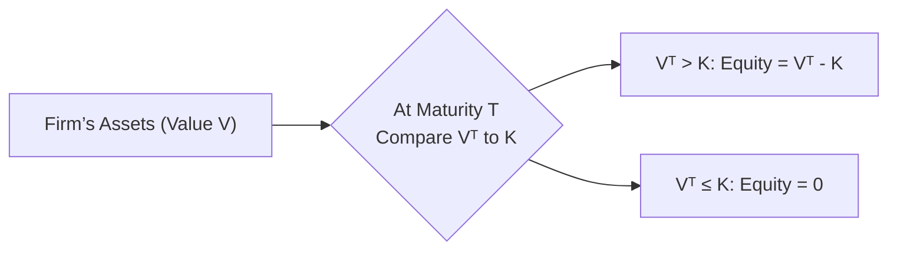

## Conceptual Foundation

When you think about buying a company’s stock, it’s a bit like you're buying an option on that company’s value, “hoping” that the firm’s assets will exceed the debt the company owes so that you, as the stockholder, can enjoy any surplus. If the “option” is worth nothing because the company’s total assets have fallen below its debts, guess what? Your upside is gone, and your shares become worthless. But the most you can lose is the money you initially invested—your liability is limited. And that, in a nutshell, is the core notion behind viewing equity as a call option on a firm’s assets in structural credit risk models.

In more formal terms, structural models of credit risk (like Merton’s model) depict corporate debt and equity in terms of option payoffs. Specifically, shareholders hold something that resembles a call option on the firm’s total assets with a strike price equal to the face value of the debt. That means if, at debt maturity, the value of the firm’s assets exceeds what’s owed to creditors, equity holders “exercise” their call and retain the residual. If it falls short, that call expires worthless. This perspective explains many interesting behaviors—like why higher volatility simultaneously increases equity value (call options love volatility) yet also raises the probability of default (the firm’s assets might drop below the amount of debt).

## The Merton Model: A Quick Refresher

### Basic Logic Behind Merton’s Setup
Merton’s approach builds upon the celebrated Black-Scholes option pricing framework. Here’s a quick recap of how it applies to corporate liabilities:

• The firm is financed with a combination of equity (E) and debt (D).  
• The total value of the firm’s assets (V) evolves randomly over time.  
• The debt has a certain face value to be repaid at maturity (K).  
• If V > K at bond maturity, shareholders keep the difference V – K.  
• If V ≤ K at bond maturity, shareholders can hand over the firm to the bondholders (i.e., they walk away), and their equity is worthless.

### Equity as a Call: Strike Price and Underlying Asset
If you’re a stockholder, the main payoff you care about arises when you decide if you will, in effect, “exercise” your right to the firm’s assets. In Merton’s version:

• Underlying asset: The firm’s total assets, V.  
• Strike price: The face (par) value of the debt, K.  
• Maturity: The bond’s (or debts’) maturity date, T.

At T, the equity “payoff” is max(V – K, 0). That’s exactly how a call option’s payoff is structured: max(S – X, 0) in standard options notation, where S is the underlying price, X is the strike. Equity holders cannot owe beyond their initial stake, thanks to limited liability.

### A Mathematical Snapshot
For those who enjoy a quick foray into formulas:

Let V₀ be the current value of the firm’s assets, and let σᵥ be the volatility of the firm’s assets. Under the Merton model, the value of equity (E₀) at time 0 can be estimated with a Black-Scholes-type expression:

E₀ = V₀Φ(d₁) – (K e^(-rT))Φ(d₂),

where:

• r is the risk-free rate.  
• T is the time to maturity.  
• K is the face value of debt.  
• Φ(·) is the cumulative distribution function of the standard normal.  
• d₁ = [ln(V₀ / K) + (r + 0.5σᵥ²)T] / (σᵥ√T)  
• d₂ = d₁ – σᵥ√T

Though you might not be tested on plugging direct numbers into these formulas under exam pressure, the conceptual link is what’s crucial for CFA Level II: Equity holders have a call option with strike K. If the firm’s assets exceed K at T, that call has intrinsic value.

## Why This Matters for Credit Risk

### Intuition: Higher Volatility → Higher Equity Value, But Higher Default Risk
Equity is effectively a long call on the firm’s assets. One hallmark of call options is that volatility is beneficial—the chance of big upside increases. That means that as a firm’s asset volatility goes up, the value of the equity option can also go up, ironically even though the chance of default (assets dropping below debt) can also increase.

For bondholders, increased volatility is generally a negative—higher likelihood of losses if the firm’s assets fall. So, you see immediate tension: things that help equity generally hurt debt. This tension becomes critical when constructing capital structures and setting yields on risky debt.

### Distance to Default
We sometimes talk about “Distance to Default” in structural models. It’s basically how many standard deviations away the firm’s assets are from dropping below the debt amount:

Distance to Default = (ln(V₀ / K) + (μ – 0.5σᵥ²)T) / (σᵥ√T)

(μ might be the expected drift of the firm’s assets, though Merton’s risk-neutral approach often uses r in place of μ for pricing.)

A larger distance to default means the firm is less likely to go bankrupt any time soon. Analysts sometimes simplify by focusing on the ratio V₀ / K. If that ratio is high—meaning assets are big compared to debt—then the equity call is well in the money.

## Practical Example: A Personal Anecdote

I once owned a small portion of stock in a technology company that ran into a massive lawsuit. The possibility of losing that lawsuit made the company’s asset value extremely volatile. As a shareholder, I found myself weirdly rooting for volatility; if the company managed to escape the lawsuit or if the final settlement was smaller than fearmongers expected, the stock price might skyrocket. On the flipside, if the settlement was enormous, the assets could get wiped out. That’s the real-life twist of being an equity holder: you have upside if the firm’s assets rise above its debts, but you lose everything if they don’t. Essentially, I was sitting with a call option on whether the company’s total asset value would remain above the lawsuits and debt obligations.

## Advanced Considerations

### Multiple Debt Maturities
Merton’s original framework is built around a single bond maturity. In reality, firms have multiple types of debt that mature at various times. A short-term loan might mature next quarter, while a long-term bond might not mature for 10 years. This layered structure means that in practice you can’t always say, “At T, it’s all or nothing.” Instead, a firm might have partial defaults or renegotiate terms. For exam preparation, be aware that the single-period approach is a neat conceptual tool, but real-life is more complicated.

### Dividend Payments
Dividends paid out to shareholders reduce the firm’s total asset base—think of them like the firm shipping some assets directly to equity holders. From an “option perspective,” paying dividends is often unfavorable for the call option’s value because the underlying asset price (firm value) effectively gets reduced each time a dividend is paid. Of course, from a shareholder’s perspective, those dividends are attractive as immediate income. But from the vantage point of preserving the “in-the-money” nature of your call, dividends can reduce future asset coverage if the firm’s near-breakeven on obligations.

### Regulatory and Accounting Nuances
While IFRS or US GAAP might not necessarily codify “equity as a call,” you’ll see capital structure footnotes in financial statements that give hints: convertible debt, warrants, preferred shares—these embedded options can magnify or offset the call option features. Nothing in Merton’s approach changes basic accounting, but it’s good to connect the dots: structural models rely on consistent asset valuation (which can be tough if intangible assets or brand goodwill is large).

## Diagram: Schematic of Equity as a Call

Below is a simplified flowchart that can help you visualize the payoff structure. On the left, you have the firm’s total assets. We see two potential outcomes at maturity T: either asset value (Vᵀ) is above debt (K) or below debt (K).

When Vᵀ > K, shareholders “exercise” their call, effectively paying K to bondholders and keeping the excess. When Vᵀ ≤ K, shareholders walk away—equity expires worthless, leaving bondholders to recover whatever remains of the assets.

## Implications for Bond Investors

### Credit Spreads
If you’re analyzing a bond, you’re essentially on the other side of the call. Since volatility benefits equity, it harms bondholders’ position. The bond’s yield or credit spread must compensate the lender for the possibility that the firm’s assets could suddenly crash below K. As asset volatility soars, bondholders will demand higher spreads.

### Negative Covenants and Restrictions
Bond indentures often restrict dividends or the incurrence of more senior debt precisely because these actions might reduce asset coverage or increase risk. From a structural perspective, bondholders attempt to control some sources of “volatility” that would shift value to equity.

## Common Pitfalls in Applying the Model

• Ignoring Multiple Maturities: Real capital structures are messy. Don’t oversimplify.  
• Misestimating Asset Volatility: The model heavily depends on asset volatility (σᵥ). Over- or underestimating it can lead to big mispricing.  
• Overlooking Dividends and Payouts: In real life, consistent dividends can erode the asset base for bondholders.  
• Confusing Book Values With Market Values: Merton’s framework uses market value of assets, which can be tricky to estimate if the firm’s intangible assets or brand value is large.  

## Exam Tips: Mastering the Vignette

• Keep an Eye on Debt vs. Asset Value. Look for language in a vignette about how “assets significantly exceed liabilities.” This signals the call is comfortably in-the-money.  
• Spot the Role of Volatility. If a vignette mentions “increased project risk” or “volatile earnings,” that’s your clue that equity’s call option value might be rising even as the bond outlook worsens.  
• Time-to-Maturity. Watch if the question discusses near-term or long-term obligations. You may need to evaluate the structural model differently.  
• Potential for Dividend Payments. If a company has a large dividend payout ratio, it might reduce the “underlying asset” over time, affecting how realistically the call remains in the money.  

## Concluding Thoughts

Equity holders are, in essence, call option holders on a firm’s assets, which is central to structural credit risk modeling. This concept helps us see why shareholders often cheer for volatility while bondholders get anxious, and why firm value relative to debt is such a critical measure for everyone. On the exam, you’ll find these big-picture ideas in credit risk item sets, especially where they ask you about the interplay between equity and debt in the context of performance, defaults, or changes in the firm’s business risk.

As you continue studying structural credit risk, remember it’s a simplification. Yet, it succinctly frames a fundamental truth: if you hold equity, you can’t lose more than you invest, but your upside is unlimited. The key, then, is to grasp how changes in total asset value, volatility, and capital structure feed into that equity call—and how that interplay influences real-world default probabilities, credit spreads, and investor returns.

## References and Further Reading

- Black, F. & Scholes, M. (1973). “The Pricing of Options and Corporate Liabilities.” Journal of Political Economy.  
- Merton, R. (1974). “On the Pricing of Corporate Debt: The Risk Structure of Interest Rates.” Journal of Finance.  
- O’Kane, D. (2008). Modeling Single-Name and Multi-Name Credit Derivatives. Wiley.  
- Damodaran, A. (2012). Investment Valuation: Tools and Techniques for Determining the Value of Any Asset. Wiley.  
- CFA Institute. (Latest Edition). CFA Program Curriculum, Level II, Volume 5: Corporate Finance and Level II, Volume 6: Fixed Income.  

-----

## Test Your Knowledge of Equity as a Call Option in Structural Models



### Which statement best describes the equity-as-call-option viewpoint in structural credit risk models?

- [ ] The value of equity is modeled as the sum of all discounted cash flows of the firm.
- [x] The value of equity can be seen as a call option on the total assets of the firm with the debt's face value as the strike price.
- [ ] The face value of debt can be considered a put option on the firm's assets.
- [ ] The equity payoff is equivalent to a short position in a call and a long position in a bond.

> **Explanation:** In Merton’s structural approach, equity is represented by a call on the firm’s assets, with the debt face value acting as the strike. Shareholders either “exercise” if assets exceed liabilities or let it expire worthless if they don’t.

### Under the Merton model, which of the following increases the value of the equity call option?

- [ ] Lower asset volatility.
- [x] Higher asset volatility.
- [ ] Stricter debt covenants that limit risk-taking.
- [ ] Shorter time to maturity.

> **Explanation:** Call option values generally rise with underlying asset volatility. Greater volatility increases the odds of a large positive outcome, even though it also increases default risk for bondholders.

### How does dividend payout affect the equity call in Merton’s framework?

- [ ] Dividends decrease the face value of debt.
- [x] Dividends reduce the firm’s asset value, typically decreasing the value of the equity call.
- [ ] Dividends increase asset value over time by incentivizing investment.
- [ ] Dividends don’t affect the option value at all.

> **Explanation:** Paying dividends transfers a portion of the firm’s assets to shareholders immediately, lowering the asset base that backs the firm’s liabilities. This generally reduces the value of the call in a standard option pricing sense.

### In a single-period Merton model, what happens if, at maturity, the firm’s asset value is below the face value of the debt?

- [ ] Shareholders must inject capital to cover the shortfall.
- [ ] Bondholders compensate shareholders for market movement.
- [x] Equity becomes worthless, reflecting the limited liability feature.
- [ ] Equity resets with a new strike price equal to the next period’s face value of debt.

> **Explanation:** With limited liability, shareholders can walk away, leading to an equity value of zero. Bondholders then seize whatever remains of the assets.

### Which of the following best captures the definition of “distance to default” in structural models?

- [ ] The required interest coverage ratio to avoid default next period.
- [x] The gap, in standard deviation units, between the current asset value and the default threshold.
- [ ] The time left until the debt reprices at market rates.
- [x] The difference between the market value and book value of the firm’s debt.

> **Explanation:** Distance to default is a measure of how many standard deviations the firm’s assets are away from the debt boundary. The greater the distance, the lower the default probability.

### From a bondholder’s perspective, how does rising asset volatility usually affect credit spreads?

- [x] Credit spreads widen because default risk increases.
- [ ] Credit spreads tighten because equity becomes more valuable.
- [ ] Credit spreads remain unaffected.
- [ ] Credit spreads flip to negative spreads.

> **Explanation:** Bond investors demand additional yield to compensate for higher default risk when firm asset volatility increases.

### Which of the following is a common shortcoming of applying the single-period Merton model to real-world firms?

- [x] Firms often have multiple maturities of debt that are not captured by a single maturity assumption.
- [ ] A single debt maturity assumption always accurately reflects real-world capital structures.
- [ ] Equity cannot ever be worth more than the firm’s assets.
- [ ] Dividends do not influence the firm’s asset value in typical applications.

> **Explanation:** Most corporations have layered and rolling debt obligations, which complicates a purely single-maturity analysis.

### If a company consistently pays high dividends, how might that impact its structural credit risk assessment?

- [ ] It reduces bondholders’ exposure because shareholders are compensated over time.
- [x] It can quicken asset depletion, potentially making default more likely if the firm’s asset cushion is thin.
- [ ] Dividend payments are irrelevant to structural models.
- [ ] It always increases equity valuation due to the immediate cash flow.

> **Explanation:** Large, frequent dividends diminish the firm’s asset base, lowering the buffer above the debt threshold.

### What role does “limited liability” play in the call option analogy?

- [ ] It requires shareholders to increase equity contributions if the firm’s assets drop.
- [ ] It ensures that shareholders always get some recovery even if assets are below debt.
- [ ] It mandates that dividends should not exceed retained earnings.
- [x] It caps shareholders’ losses to the value of their initial equity stake.

> **Explanation:** Limited liability is central to the call option viewpoint, as shareholders only lose their initial investment; they do not owe anything beyond it.

### True or False: Under the Merton model, a single formula can perfectly capture all real-world complexities of corporate capital structure.

- [ ] False
- [x] True

> **Explanation:** This is actually a trick. The correct statement is that it’s false that a single formula can capture everything. Merton’s model is powerful but often oversimplified in real-world scenarios. (If you chose “True,” watch out—this is a common pitfall in exam questions that test your understanding of model limitations.)


