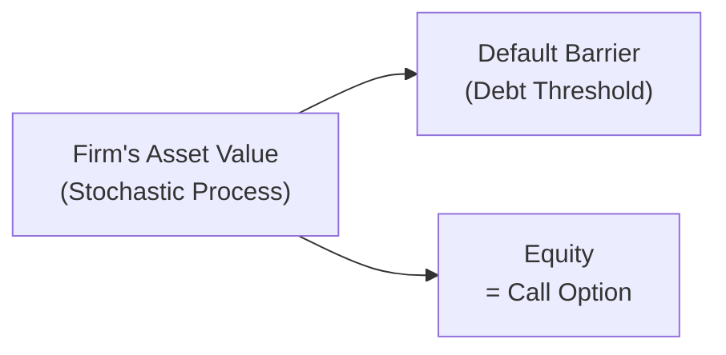
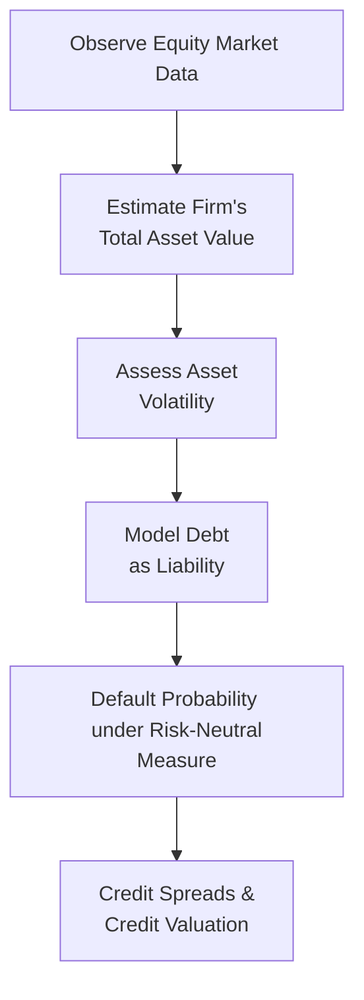

## Introduction

Structural credit risk models take a firm’s balance sheet as their starting point, analyzing how the value of the firm’s assets and liabilities evolves over time to estimate default probabilities. Many readers may have encountered the well-known Merton model in earlier chapters or coursework. These models give an economic intuition for default: a company defaults if its asset value drops below a specific threshold (often the face value of debt). 

Now, I remember the first time I encountered the structural approach: I was, well, a bit hesitant because it seemed to promise so much clarity—like, “Oh, just treat the firm’s equity like a call option on its assets.” But soon I realized the benefits come with caveats. So let’s delve into both the strong points and the weaknesses of structural models, and then wrap up with some practical guidance.

## Recap: Structural Models in Context

In structural models, the main idea is that a firm’s assets follow some stochastic process—often assumed to be geometric Brownian motion. Meanwhile, the firm’s debt holders have a claim on these assets. If the asset value falls below a certain boundary (like the total debt), that triggers default or financial distress. 

For instance, the classic Merton model represents equity as a call option on the assets of the firm, with a strike price equal to the debt’s face value. Under the risk-neutral measure, this yields a neat formula for equity values. A simplified version is:

$$
E_0 = A_0 \cdot N(d_1) \;-\; D\, e^{-rT} \cdot N(d_2),
$$

where:  
• \\( A_0 \\) is the current total asset value of the firm.  
• \\( D \\) is the face (or par) value of the debt maturing at time \\( T \\).  
• \\( r \\) is the risk-free rate.  
• \\( d_1 \\) and \\( d_2 \\) are functions of \\( A_0 \\), the asset volatility, \\( \sigma \\), time-to-maturity \\( T \\), and \\( r \\).  
• \\( N(\cdot) \\) is the cumulative distribution function of a standard normal variable.

If you like visual aids, here’s a quick snapshot of the typical structural approach:

Equity derives its value from the difference between the firm’s asset value and its debt, just as a call option payoff is the difference between the underlying asset price and the strike price.

## Strengths of Structural Models

• Economic Intuition  
One of the biggest upsides is how straightforward the link to economics is: a company defaults if things turn south enough that assets can’t cover liabilities. Even if that’s an oversimplification, it’s an instantly understandable premise. The firm’s default is not an arbitrary event; it’s grounded in actual asset values and capital structure.

• Market Integration  
Structural models can use market-based data, especially equity prices. Since equity is considered a call option on the firm’s assets, the stock price’s fluctuations can reveal information about the firm’s default risk. This dynamic data integration is powerful, letting you refresh a default probability estimate as new market data rolls in.  

• Pricing Consistency  
We can derive structural models from well-grounded option-pricing theory. If we assume risk-neutral pricing and no-arbitrage conditions, these models align well with broader financial theory. This internal consistency helps analysts who want a coherent, all-in-one framework that resonates with the rest of the derivatives pricing universe.

## Limitations of Structural Models

• Assumption of Constant Volatility  
Real-world volatility is path-dependent; a firm under stress often sees its asset volatility leap higher. Traditional structural models might assume a uniform volatility constant across the time horizon, potentially understating default risk just when it’s rising the fastest.

• Single Debt Maturity  
Classic structural models typically assume that all the firm’s debt matures at once (often in a single bullet maturity). But in reality, firms juggle multiple liabilities with different maturities. By ignoring this layered maturity structure, the model might misalign with actual default timing.

• Complexity of the Firm’s Capital Structure  
In my experience, analyzing a multi-layered capital structure—like a firm with callable bonds, convertible debt, preferred equity, and so on—can become extremely cumbersome in a pure Merton-style approach. Real corporate balance sheets are, well, complicated. Trying to handle every bond covenant or structural subordination can stretch the basic structural model beyond its neat formulaic beauty.

• Model Calibration Challenges  
As if complexity wasn’t enough, finite data represent a practical headache. If a firm isn’t publicly traded or you have limited market data to estimate the firm’s total asset value, calibrating the model can feel like guesswork. Even for public firms, you might face big uncertainties in measuring off-balance-sheet items or intangible assets.

## Practical Guidance and Best Practices

• Combine with Reduced-Form Approaches  
Structural models capture the “why” behind default, while reduced-form models (see Chapter 20: Reduced-Form Credit Risk Models) tend to focus on “when” default might happen, often using hazard rates or default intensities. If your job is measuring short-term jump-to-default risk, the structural approach might be less sensitive. Merging both gives you a more balanced view.

• Stress Testing  
Even the best theoretical model is only as good as the scenario it’s tested under. Suppose we run a scenario with drastically higher volatility, or quickly deteriorating macro factors. Stress testing can reveal whether your structural model remains stable under extremes. It also hints at which assumptions are most fragile.

• Ongoing Data Updates  
To remain robust, any structural model needs periodic recalibration. I don’t want to sound like a broken record, but relying on stale estimates for the firm’s asset value or ignoring changes in capital structure is a recipe for misleading outputs. Updates are essential—especially in dynamic markets.

## Illustrative Example

Let’s say we have a telecom firm—call it TeleBeam, Inc. They have a large chunk of debt maturing in three years, and the stock is publicly traded. Using the Merton approach, you estimate the asset value (based on equity data plus liabilities) to be \$1.2 billion, with a volatility of 25%. The debt value is \$900 million. Based on these numbers, your structural model might generate a probability of default around 3–4%.

But if TeleBeam announces a new technology that invests them heavily in a high-risk market, their equity might fluctuate more wildly, and the market’s estimate of asset volatility could jump from 25% to 40%. That might raise the default probability significantly—maybe up to 8–10%, depending on model calibration. This is how quickly calibrations can shift with fresh market data.  

## Visualization of the Model’s Core Idea

Here’s a slightly more detailed flow of how structural models intersect with credit risk estimation:

The equity market data feed into your asset value estimates. From there, you estimate volatility, combine it with the known liability structure, and compute a default probability in a risk-neutral framework. That result can then be used for credit pricing and credit spread calculations.

## Final Thoughts

Structural models present a robust, conceptually clean approach for understanding default from an “inside-out” perspective. They remind us that a firm is fundamentally about its underlying economic value exceeding its liabilities. But real markets are messy, and you must accept the complexities bedeviling model assumptions—like changing volatility and multi-layer capital structures. While it’s sometimes tempting to rely heavily on their elegant math, remember these limitations and keep your model flexible, updated, and, where possible, complemented by other methods.

## Glossary

• Economic Rationale: A framework linking assets and liabilities to a firm’s likelihood of default.  
• No-Arbitrage Condition: Ensures that two identical sets of future cash flows can’t trade at different prices.  
• Calibration: The process of adjusting parameters so that your theoretical model lines up with real market observations.  
• Hybrid Model: An approach that blends aspects of structural and reduced-form models to capture complexities at multiple horizons.  
• Stress Testing: Running hypothetical extreme scenarios to see how model outputs behave under unusual market conditions.

## References and Further Reading

• Sundaresan, S. “Fixed Income Markets and Their Derivatives.” Academic Press.  
• Giesecke, K. “Credit Risk Modeling and Valuation.” Princeton University Lecture Notes.  

Consider also reviewing Chapter 20 (Reduced-Form Credit Risk Models) for a complementary view of default processes, and Chapter 19.4 for a vignette scenario applying structural concepts to a real firm case.

## Structural Models: Strengths and Limitations Mastery Quiz



### Which of the following is a key economic rationale behind structural models?

- [ ] Default occurs at a random intensity unrelated to the firm's capital structure.
- [x] Default is triggered when the firm's asset value falls below the debt level.
- [ ] The firm defaults based solely on historical default rates.
- [ ] Equity holders have no claim on the firm’s upside.

> **Explanation:** Structural models assume a direct connection between the firm’s assets and its liabilities, so if assets fall below the debt threshold, the firm defaults.

### Which statement best describes why market integration is considered a strength of structural models?

- [ ] Structural models assume market data are entirely irrelevant to a firm's default risk.
- [x] Market data (e.g., equity prices) can update estimates of default risk in real time.
- [ ] They rely solely on rating agencies to determine whether a firm defaults.
- [ ] Market integration is irrelevant because default risk is constant over time.

> **Explanation:** One major benefit of structural models is that they can incorporate publicly available, updated market data, especially from equity markets, to adjust default estimates dynamically.

### In the classic Merton framework, which assumption can lead to underestimation of default risk?

- [x] Constant asset volatility over the entire horizon.
- [ ] The debt threshold is continuously adjusted.
- [ ] Credit spreads are updated daily.
- [ ] The model fully accounts for convertible securities.

> **Explanation:** Assuming constant volatility often fails to reflect heightened risk when a firm’s financial health deteriorates, thus understating default probability.

### A firm uses a basic structural model but has bonds maturing at multiple points in time. What is the primary limitation here?

- [ ] Structural models allow for infinite debt maturities by default.
- [ ] The model easily incorporates each maturity without adjustments.
- [ ] The model fully captures the complexity of multi-tranche liabilities.
- [x] The model typically assumes a single, lump-sum maturity, ignoring multiple debt maturities.

> **Explanation:** Classic structural models often assume a single debt maturity, so a firm’s real-world staggered maturities aren’t always modeled accurately.

### Why do structural models sometimes struggle with complex capital structures?

- [ ] They include too many debt tranches by default.
- [ ] Equity is treated as a zero-coupon bond.
- [x] They assume a relatively simple structure where debt is a single claim.
- [ ] They naturally incorporate convertible bonds and warrants.

> **Explanation:** Extensions to handle multiple debt layers and convertible instruments can be quite complicated. A simple structural model usually presumes a single, homogenous debt claim.

### Which of the following best describes calibration in the context of structural models?

- [ ] Avoiding the use of market data for parameter estimation.
- [ ] Ensuring no-arbitrage by ignoring observed market conditions.
- [x] Adjusting model parameters to match observed market securities or prices.
- [ ] A guarantee that credit spreads remain static.

> **Explanation:** Calibration is about aligning the theoretical model with reality by choosing parameters that best fit observed data, typically equity prices or credit spreads.

### What is a recommended practice to deal with extreme risk scenarios in structural credit models?

- [ ] Only rely on historical averages for volatility.
- [ ] Assume loads of capital always exist.
- [x] Perform stress tests under various severe but plausible market shocks.
- [ ] Avoid updating model parameters once set.

> **Explanation:** Stress tests let you see how model outputs change under high volatility or severe downturn assumptions.

### Which is an effective way to improve the robustness of credit risk estimates when using a structural model?

- [ ] Only analyze recovered default data from 50 years ago.
- [x] Combine structural and reduced-form approaches to incorporate different aspects of default risk.
- [ ] Eliminate all references to the equity price data.
- [ ] Assume the risk-free rate is always zero.

> **Explanation:** A hybrid approach can account for structural insights (e.g., capital structure) while also incorporating hazard rates and jump risk from reduced-form models.

### What is a major takeaway regarding the no-arbitrage foundation of structural models?

- [x] It ensures that identical cash flows cannot trade at different prices.
- [ ] It guarantees that actual volatility is always constant.
- [ ] It eliminates the need to consider changing market conditions.
- [ ] It makes calibrating private firms straightforward.

> **Explanation:** No-arbitrage is a core concept in derived asset pricing models, ensuring model consistency with fair market pricing principles.

### Structural models assume that a firm defaults only if the asset value falls below a certain threshold. Is this assumption always valid in practice?

- [x] True
- [ ] False

> **Explanation:** While it is a foundational assumption, real-world defaults can occur for other reasons (liquidity crises, covenant breaches, etc.). Nonetheless, structurally, the threshold approach remains the model’s defining feature.




