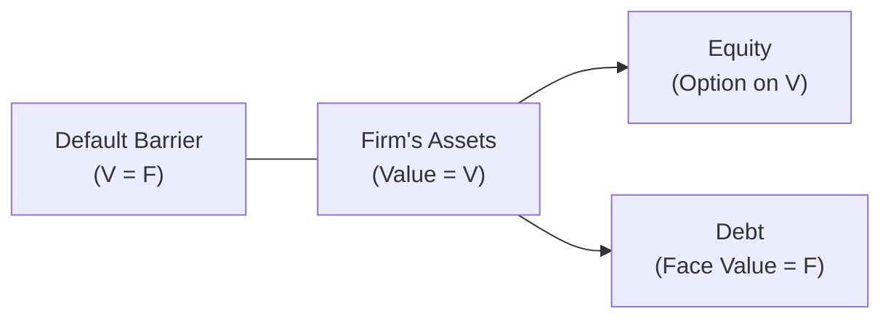
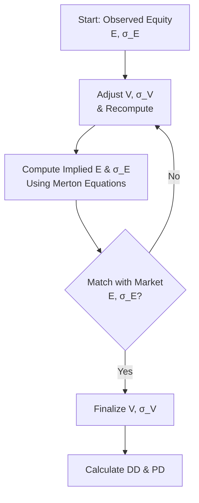

## Introduction

So you’ve probably heard folks talk about “Distance to Default” like it’s some mysterious gauge of how close a firm is to going under. But guess what? It’s actually not that scary—especially once you see how the Merton model frames the firm’s debt and equity as contingent claims on the firm’s assets. In this section, we’ll walk through a vignette that shows a mid-sized company’s potential credit risk exposure. We’ll figure out its Probability of Default (PD) by computing the Distance to Default (DD). All in a day’s work for a structural model approach!

This is where the Merton model shines. It’s named after Robert C. Merton, who extended Black-Scholes option pricing to corporate debt. The key idea: if you consider the firm’s equity as a call option on its assets, then default risk is basically the chance that your assets end up below what you owe (the “default barrier”) at the time of maturity. We’ll cover the formulas, add some cautionary tales, and then let you try your hand at a short practice scenario (the vignette). Let’s dive in.

## The Merton Model in a Nutshell

At the highest level, the Merton model treats the value of a firm’s assets (V) as the underlying variable that determines whether the firm defaults on its debt (F) at maturity. Equity (E) can be seen as a call option on the firm’s assets, since equity holders only lose if the value of the firm’s assets falls below the default point.

Why a call option? Because if the assets are worth more than F at maturity, equity holders can “exercise” and keep the residual. If assets are worth less, its owners “walk away,” effectively handing over assets to debt holders (the firm defaults). By linking equity price dynamics to overall asset value, we can glean insights into default likelihood. In practice, we measure distance to default in standard deviation units.

Below is a simplistic diagram to illustrate the relationship:

• If V > F at maturity → Equity retains value (no default).  
• If V ≤ F at maturity → Default occurs, debt holders get firm’s assets.

## Estimating Asset Value and Volatility

One critical wrinkle: we rarely observe V or σᵥ (the asset volatility) directly. We see equity’s market value, E, and we (sometimes) know the debt structure. But the firm’s “asset side” is not always reported in market terms—balance sheets use book values, but we need forward-looking market values.

Hence we rely on the Merton model to back out the unobserved asset value (V) and asset volatility (σᵥ) from:

• The observed equity value (E).  
• The observed equity volatility (σ_E).  
• The face value of debt (F).  
• The risk-free rate (r), used for discounting and modeling the drift of assets (under risk-neutral valuation).  

The iterative technique conceptually goes like this:

1. Guess an initial value for V.  
2. Compute the implied equity value under the Merton model assumption.  
3. Compare that implied equity value with the observed equity market value.  
4. Adjust V accordingly until the two converge.  
5. Repeat for σᵥ using a relationship between equity volatility σ_E and σᵥ (the “option on assets” perspective).  

Equity behaves like a call option on V with strike F, so you can use Black-Scholes relationships to solve the system:

(1) E = V·Φ(d₁) - F·e^(-rT)·Φ(d₂)  
(2) σ_E = σᵥ · (V · Φ(d₁)) / E  

where  
d₁ = ( ln(V/F) + (r + ½σᵥ²)T ) / (σᵥ√T),  
d₂ = d₁ - σᵥ√T.  

It can sound complicated, but it’s mostly about matching model outputs (E, σ_E) with reality. Let’s see how this plays out in practice.

## Distance to Default

Distance to Default (DD) tells you how many standard deviations the firm’s asset value is above its default point. A bigger value means you can imagine you’re “farther away” from failing. It’s computed (in a risk-neutral sense) by the formula:


\text{DD} = \frac{\ln\left(\frac{V}{F}\right) + \left(\mu - \frac{1}{2}\sigma_V^2\right)T}{\sigma_V \sqrt{T}},


where:  
• V is the current asset value.  
• F is the liability face value (or default boundary).  
• μ is the expected annual drift of the firm’s assets (often replaced by r, the risk-free rate, under risk-neutral valuation).  
• σᵥ is the asset volatility.  
• T is time to maturity in years.  

I remember the first time I tried to compute DD—my biggest confusion was deciding on which rate to plug into μ. But for Merton-based risk-neutral probability, we typically assume the risk-free rate. This helps isolate the effect of default risk.

## Probability of Default

Once you have DD, the Probability of Default (PD) under the Merton framework is given by:


\text{PD} = \Phi(-\text{DD}),


where Φ is the cumulative distribution function of the standard normal distribution.

A negative sign is in there because if you are k standard deviations above the barrier, you want the probability that you go k standard deviations down. So a large positive DD yields a small PD, and vice versa.

## Sensitivity Analysis

Small changes in the assumptions—like the asset vol σᵥ—can shake up the PD in a big way. If you assume 2% higher asset volatility, you might see PD jump significantly. The same goes for the drift rate or risk-free rate. This is a classic “be cautious with inputs” scenario, because every parameter strongly influences the model’s outcome. Collecting the best data and calibrating carefully is critical.

## Interpretation of Results

If the DD is large (say 4 or 5 standard deviations above the default boundary), that suggests a low Probability of Default—like, the firm’s assets would have to slump drastically to breach the default barrier. A smaller DD, especially below 1, signals a high PD, meaning the firm is on shaky ground. Practitioners often watch how DD evolves over time as a measure of credit health.

## Vignette Example: The Mid-Sized Firm

Let’s jump to a practical case. Suppose an analyst wants to estimate the probability of default for a mid-sized firm. The specifics:

• Total liabilities: USD 120 million, due in 2 years.  
• Current market value of equity: USD 100 million.  
• Observed equity volatility (σ_E): 40%.  
• Risk-free rate (r): 3% (annualized, for example).  
• Time to maturity (T): 2 years.  

### Step 1: Estimate V and σᵥ  
We need asset value and volatility. We solve a pair of equations:  
(1) The Merton nuclear equation linking E, V, F, r, and σᵥ.  
(2) The relationship between σ_E and σᵥ.  

Practically, you can do this in Python or on a fancy spreadsheet using an iterative approach. You guess V, check how your guess differs from E (the actual market equity), and iterate until the difference is negligible. Let’s say we end up finding:

• Estimated V = USD 200 million.  
• Estimated σᵥ = 30%.  

(This is just hypothetical; you’d confirm it using real iterative methods.)

### Step 2: Compute Distance to Default  
Now we can compute:

(3)  

\text{DD} 
= \frac{\ln(\frac{200}{120}) + \left(0.03 - \frac{1}{2}\times 0.30^2\right)\times 2}{0.30 \sqrt{2}}.


Walkthrough:

1. ln(200/120) = ln(1.6667) ≈ 0.51.  
2. 0.03 - 0.5 × 0.30² = 0.03 - 0.045 = -0.015.  
3. Multiply by 2: -0.015 × 2 = -0.03.  
4. Numerator = 0.51 + (-0.03) = 0.48.  
5. Denominator = 0.30 × √2 ≈ 0.30 × 1.4142 ≈ 0.4243.  
6. DD = 0.48 / 0.4243 ≈ 1.13.  

So Distance to Default is about 1.13. That means the firm’s asset value is a little more than one standard deviation above the default boundary over a two-year horizon.

### Step 3: Convert DD to Probability of Default  
We do:


\text{PD} = \Phi(-1.13).


From standard normal distribution tables (or a quick calculation in something like Excel, Python, or your calculator),  
Φ(-1.13) ≈ 0.13 (i.e., around 13%).

This suggests a 13% chance that the firm’s assets end up below its debt obligations in two years. That’s not trivial, but also not catastrophic. A small shift in asset volatility might push that 13% up or down.

### Step 4: Sensitivity Analysis  
If the analyst tested alternative scenarios—for instance, a volatility of 35% instead of 30%—the result might push PD higher. Conversely, if you discovered the firm’s assets were actually valued at USD 220 million, the PD might plummet. In real-world usage, you’d run these for best-case, worst-case, and base-case.

### Step 5: Interpret the Results  
Is 13% high for a mid-sized firm? Possibly. It depends on the sector, overall economy, and what lenders or investors typically expect. Credit rating agencies have average transition probabilities that might put 13% in perspective. The model is a powerful barometer, but it’s not a perfect crystal ball.

## Practical Notes and Common Pitfalls

• Picking the Right Rate: Under a risk-neutral framework, the drift often becomes the risk-free rate. Using an overly optimistic asset growth rate can artificially lower PD.  
• Volatility Estimation: This is tricky. Equity vol is easier to observe than asset vol. If you do a subpar job calibrating σᵥ, your PD might be way off.  
• Maturity and Debt Structure: Make sure you use the right default point. Some prefer short-term liabilities or “all liabilities” or something in between.  
• Market Liquidity: Thinly traded equity or stale debt quotes complicate your data.  
• Iteration Error: If you don’t converge properly in your iterative approach, you might get nonsense values for V and σᵥ.  

## Diagram: Visualizing the Structural Model Flow

Here’s a quick visual showing how we integrate equity market data, liability data, and risk-free assumptions to arrive at PD:

## Conclusion and Exam Tips

Anyway, the Merton model approach—especially computing Distance to Default and Probability of Default—remains a classic method for structural credit risk analysis. Be sure you’re comfortable with:

• Understanding how V, σᵥ, and E, σ_E relate as an option on assets.  
• Applying (or at least conceptually describing) iterative methods for calibration.  
• Plugging into the DD formula and using Φ(·) for PD.  
• Performing sensitivity checks on your assumptions.

On exam day (or in real life), you might see item sets that ask: “Given these data points, what’s the firm’s probability of default using a Merton-based approach?” Double-check your approach to the formula, interpret your results carefully, and be aware of how changing asset vol or the risk-free rate can drastically alter your forecast. And keep an eye out for tricky wording in vignettes—sometimes they slip in details about short-term vs. total debt or changes in market data. You’ve got this!

## References and Further Reading

• Moody’s KMV Methodology: The real-world extension and applications of Merton’s framework.  
• Mason, D. and Bhattacharya, S. (Eds.): “Credit Risk: Models and Management” for a deeper dive into structural credit risk models.  
• CFA Program Curriculum (Fixed Income volumes) for more on structural vs. reduced-form models.  
• Standard Normal Distribution Tables or a financial calculator for Φ(·) value references.

## Distance to Default Mastery: Practice Questions



### Which of the following statements best describes why equity is considered a call option on the firm’s assets in the Merton model?

- [x] Equity holders have a right to the firm’s assets above the default barrier but can walk away if assets are below liabilities.
- [ ] Equity holders must purchase the firm’s assets at face value from debt holders at maturity.
- [ ] Equity is effectively short the firm’s assets at maturity if the firm defaults.
- [ ] Equity holders bear no risk if the value of the firm’s assets declines.

> **Explanation:** In the Merton model, equity holders effectively hold a call option on the firm’s assets. If the assets exceed the debt at maturity, they “exercise” and keep the residual. If not, they let it expire (i.e., they walk away).

### In computing Distance to Default, which of the following variables is typically replaced by the risk-free rate under risk-neutral valuation?

- [ ] Equity volatility
- [ ] Asset volatility
- [x] The asset drift (μ)
- [ ] Accrued interests

> **Explanation:** Under risk-neutral valuation, the firm’s asset drift is typically replaced by the risk-free rate. This isolates default risk by removing extra risk premia or growth assumptions from the equation.

### You have estimated a firm’s Distance to Default at 1.5. Which of the following is closest to the Probability of Default, assuming a standard normal distribution?

- [ ] 5.0%
- [ ] 6.7%
- [x] 6.7% or approximately that range
- [ ] 0.07%

> **Explanation:** Distance to Default = 1.5 corresponds to about Φ(-1.5). You can check standard normal tables or a calculator; it’s around 6.7%.

### A firm’s market value of assets is two standard deviations above the default point. Which of the following changes would increase the Probability of Default the most, holding everything else constant?

- [ ] A slight decrease in the risk-free rate
- [ ] A decrease in maturity
- [x] An increase in asset volatility
- [ ] A small reduction in equity volatility

> **Explanation:** Higher asset volatility increases the likelihood that the asset value will fluctuate downward below the default point. Thus, it meaningfully increases PD.

### If the computed Merton model Probability of Default is significantly higher than the implied probability from credit spreads, this may indicate:

- [x] The model overestimates asset volatility or underestimates the asset value.
- [ ] The model accurately reflects all market information.
- [ ] Real-world probabilities always exceed risk-neutral probabilities.
- [x] There are arbitrage opportunities to exploit.

> **Explanation:** If the Merton model’s PD is much higher, it could be that the model’s assumptions (asset value or volatility) are off. Or the credit spread might be relying on different market conditions or liquidity premiums. Sometimes it can even hint at an arbitrage if discrepancy persists, though arbitrage is rare in practice.

### Which of the following is a direct input you would normally observe from the market when building a Merton model?

- [x] Current equity price
- [ ] Asset volatility
- [ ] Asset drift
- [ ] Distance to Default

> **Explanation:** We typically get the firm’s market-cap (equity price × shares outstanding) and measure its equity volatility from the market. Asset value and volatility are unobserved and must be derived.

### Which statement most accurately explains the role of “iteration” in the Merton model?

- [x] Asset value and asset volatility are solved simultaneously to match observed equity value and equity volatility.
- [ ] We iterate to find the exact day a firm defaults.
- [ ] It is used to find the best discount rate for the firm’s liabilities.
- [ ] It is only relevant for non-public firms with no equity data.

> **Explanation:** We need iteration to solve for unobserved asset value and asset volatility so that the “modeled” equity matches the observed equity market value and volatility.

### The Merton model is most closely aligned with:

- [x] Structural credit risk models
- [ ] Reduced-form credit risk models
- [ ] Actuarial credit risk approaches
- [ ] Behavioral finance models

> **Explanation:** The Merton model is a prime example of structural credit risk modeling, as it hinges on the firm’s asset dynamics and capital structure.

### A firm’s equity is somewhat illiquid, leading to difficulties in measuring its volatility. Which of the following best describes a potential practical workaround?

- [x] Rely partially on industry peers’ equity volatilities or implied volatilities from option markets.
- [ ] Exclude equity volatility and assume zero.
- [ ] Use only historical bond yield data.
- [ ] Switch from a structural model to a purely fundamental analysis.

> **Explanation:** Often analysts supplement direct volatility estimates with peer group data or implied vol data to overcome illiquidity issues. Setting vol to zero is seldom realistic.

### True or False: A firm with zero Distance to Default has zero probability of default.

- [ ] True
- [x] False

> **Explanation:** If Distance to Default is zero, then the firm’s asset value is right at the default boundary. The probability of default is definitely not zero—small negative changes in asset value could trigger default.


