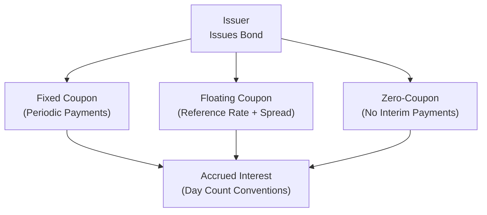

## Introduction

So, I remember the very first time I had to deal with bond coupon payouts: I was working on a small trading desk, and one of my colleagues casually said, “Hey, watch for the day count—it’s Actual/360, not 30/360.” I thought, “Wait, does that really matter that much?” Two days later, I realized just how much a fraction of a day can mean in a multi-million dollar bond transaction. The differences in day count conventions and coupon structures can dramatically affect portfolios, especially when you’re dealing with large notional amounts or complex settlement schedules.

We’re going to cover the essentials of coupon structures, from plain-vanilla fixed-rate bonds to the more nuanced deferred-coupon and floating-rate varieties, and then dive deep into day count conventions—like Actual/Actual and 30/360—and why they might just be the single most overlooked yet vital detail for any fixed income professional.

## The Basics of Coupon Structures

### Fixed-Rate vs. Floating-Rate Coupons

Let’s kick things off with the easiest structure: the fixed-rate coupon bond. This type of bond will pay investors a steady interest rate, usually expressed as an annual rate, over its life. When a bond is labeled “7% annual coupon,” it means that each year the issuer pays 7% of the bond’s face (par) value as interest in total. Depending on the bond’s frequency of payments (annual, semiannual, quarterly), those payments get divided accordingly.

Floating-rate notes (FRNs), on the other hand, tie their coupon to a reference rate—like the Secured Overnight Financing Rate (SOFR) or, historically, LIBOR. If you’ve got a floating-rate note pegged to SOFR plus a spread, your regular coupon might be something like “SOFR + 150 basis points,” reset every 3 or 6 months, depending on the bond’s terms. If interest rates rise, your coupon resets higher, offering some protection against rising rates. But if rates drop, well, your coupons get smaller.

### Zero-Coupon Bonds

Then we have the no-frills (but also somewhat fancy) zero-coupon bond. A zero-coupon bond:
• Pays no regular interest.  
• Is issued at a discount.  
• Redeems at par value at maturity.  

The holder’s “return” is simply the difference between the purchase price (the discount) and the par value repaid at maturity. Zeros can be handy if you’re planning for a specific date-driven cash flow, like a future tuition payment or a bullet debt payoff in corporate finance. But watch out: zeros are more sensitive to interest rate changes (they have a higher duration) because there are no periodic coupon payments, so all your money is tied up until maturity.

### Coupon Frequency

Coupon frequency affects everything: pricing, accrued interest, yield, and more. A 7% annual coupon paid semiannually will result in two coupon payments per year of 3.5% each. Meanwhile, a quarterly schedule would break that 7% into four payments of 1.75%. The effect of more frequent coupon payments is that the investor can reinvest smaller amounts more often, typically increasing the bond’s effective yield. But it also changes the day count and accrued interest calculations because you will have multiple coupon dates within a year.

### Deferred-Coupon Bonds

Another interesting category is deferred-coupon bonds—sometimes reminiscent of zero-coupon behavior. With deferred-coupon bonds, the issuer defers paying interest for a specified period. After that “grace” period, they begin making coupon payments. These bonds can be attractive for companies who want to preserve cash flow during early years—helpful in big capital expenditure cycles or in project finance. But from an investor standpoint, you either:
• Accept a lower price at issuance to account for not receiving early coupons.  
• Or potentially earn a higher yield to compensate for the delayed cash flow.  

## Day Count Conventions

Now, let’s talk day counts. Honestly, day count conventions can feel a bit baffling when you first dive in. Why not just count actual days and call it done? Because the bond world has a long tradition of certain “standard” ways to compute accrued interest and coupon interest, each shaped by market conventions to “simplify” or unify calculations (though for newbies, it feels anything but simple).

### Why Day Count Conventions Matter

Day count conventions define how you measure the fraction of the coupon period that has elapsed, which in turn determines how much accrued interest you either pay or receive at purchase or sale. If you’re building a bond portfolio, even a tiny fraction of a day difference can alter your P&L. So you definitely want to keep these conventions clear. In a CFA exam context, you might have a problem statement with a precise day count: “Bond X uses a 30/360 convention.” If you assume Actual/365, your result will be off, and that’s an easy route to an incorrect answer.

### Common Conventions

Below are some conventions you’ll commonly see:

• **Actual/Actual (ICMA or ISDA)**  
  - Counts actual days from the last coupon to the settlement date over the actual days in either that coupon period or the entire year (depending on the specific variant).  
  - Often used for U.S. Treasuries and many government bonds.  

• **30/360 (Bond Basis)**  
  - Assumes each month has 30 days, and the year has 360 days.  
  - Commonly used for corporate or municipal bonds in the United States.  
  - Slightly simpler to compute by “normalizing” months to 30 days.  

• **Actual/360**  
  - Uses actual days between payment dates but divides by 360 for the year length.  
  - In money markets, particularly for T-bills, you’ll see this approach. Also used in some swap settings.  

• **Actual/365**  
  - Uses actual days between payment dates but divides by 365.  
  - Some U.K. government bonds and other instruments adopt this.  

Let’s illustrate how these differences can matter:

#### Example Calculation of Accrued Interest

Suppose you have a corporate bond paying a 6% annual coupon on a semiannual basis (that’s 3% per payment). The last coupon date was January 1, and the next coupon is July 1. You purchase the bond on January 16. How many days have elapsed and how do we compute the fraction of the coupon period?

1. With a 30/360 convention:  
   - Each month has 30 days. So from Jan 1 to Jan 16 is (16 - 1) = 15 days.  
   - The total period from Jan 1 to July 1 is 180 days (6 months × 30 days per month).  
   - Accrued interest fraction = 15/180 = 0.0833.  
   - For a face value of 1,000,000: interest per semiannual period is 3% of 1,000,000 = 30,000.  
   - Accrued interest = 30,000 × 0.0833 = 2,499.  

2. With Actual/Actual:  
   - Count the actual days from Jan 1 to Jan 16. That’s 15 days (if we treat Jan 1 as day zero, we typically measure from the next day, but watch for exam details).  
   - The total actual days from Jan 1 to July 1 is 181 days (assuming a 31-day January, plus 28 in Feb if not a leap year, and so on). But let’s keep it simple.  
   - Accrued interest fraction = 15 / 181 ≈ 0.0829.  
   - Accrued interest = 30,000 × 0.0829 = 2,487—a slight difference from 2,499.  

Might sound trivial, but at scale, these differences add up—especially if your portfolio is jam-packed with an array of bonds, each using different conventions.

### Diagram of Coupon Flows

Below is a simple Mermaid diagram illustrating how an issuer might handle different coupon schedules:



Even though zero-coupon bonds don’t pay interest regularly, the day count method still influences yield calculations and how the bond is quoted over time.

## Practical Implications 

• **Investment Strategy**: For instance, if you expect interest rates to rise, a floating-rate note might do better than a fixed-rate bond. But always pay attention to the day count in a floating-rate note, because that can affect exactly how your reset coupon is calculated.

• **Valuation Accuracy**: You must select the correct day count in your valuation spreadsheet or financial model. A mismatch between your internal model’s day count and the actual market day count leads to pricing discrepancies and potential misquotes.

• **Portfolio Rebalancing**: When rebalancing, you might swap out certain bonds. If your trade settlement date falls right after a coupon date, your accrued interest might be small. But if it’s near the next payment date, you could pay a hefty chunk in accrued interest.

• **Yield Comparisons**: Accurately compare yields only if you’re sure the day count basis is the same. Otherwise, you risk an apples-to-oranges fiasco.

## A Quick Python Example

If you’re coding up bond analytics, it might look like this:

```python
def accrued_interest(coupon_rate, face_value, days_accrued, days_in_year):
    """
    Returns accrued interest for a bond given:
    - coupon_rate (decimal): e.g. 0.06 for 6% annual
    - face_value (float): e.g. 1000000.0 for $1 million
    - days_accrued (int): number of days accrued in the coupon period
    - days_in_year (int): day count basis, typically 360 or 365
    """
    return coupon_rate * face_value * (days_accrued / days_in_year)

if __name__ == "__main__":
    ai = accrued_interest(0.06, 1_000_000, 15, 360)
    print(f"Accrued interest (30/360 basis) is: ${ai:,.2f}")
```

You might replace 360 with 365 or do a real day count function to handle Actual/Actual more precisely. In exam item sets, you won’t be writing Python, but you’ll be doing the same kind of logic to quickly figure out the correct fraction and multiply it by the bond’s coupon payment.

## Glossary

• **Zero-Coupon Bond**: A bond issued at a deep discount, paying no interim interest. It’s redeemed at par at maturity, generating return from the price appreciation.  
• **Deferred-Coupon Bond**: A bond allowing the issuer to skip coupon payments during an initial period, often used to preserve short-term liquidity.  
• **Actual/Actual Convention**: Counts the actual number of days in the coupon period (and year). Used frequently for government securities like U.S. Treasuries.  
• **30/360 Convention**: Assumes 30 days per month and 360 days per year when calculating the fraction of the coupon period. A staple for corporate bond calculations.  

## References and Further Reading

• CFA Institute Level II Curriculum, Fixed Income Valuation.  
• Fabozzi, F. J. “Fixed Income Mathematics: Analytical & Statistical Techniques.”  
• ICMA and ISDA Official Guidelines for Day Count Convention Standards.  

Check these resources for a detailed deep dive into discounting, compounding, and standard market conventions across various global markets.

## Final Review and Exam Tips

• **Stay Alert for the Given Convention**: If the item set states something like “Bond A uses 30/360,” you absolutely want to adopt that convention in your accrued interest or yield calculations.  
• **Watch for Frequent Payment Schedules**: A bond that pays quarterly coupons might look like a short coupon period in item set questions. Always confirm how many days you’re counting in each period.  
• **Do a Sanity Check**: If your bond price or accrued interest number seems off by 30–40% from typical yield logic, revisit your day count assumption or confirm the frequency.  
• **Leverage Key Formulas**: Have a standard formula memorized or a reference in your mind for the typical calculation. The exam loves to see if you’re consistent and precise.  

Anyway, these details may sound small, but they can have a big effect on exam day. Practicing small scenarios under different day count “rules” is an excellent way to build confidence. 

Let’s wrap all this up by testing yourself with a short quiz. Good luck, and as always, keep an eye on the details.

## Test Your Knowledge of Coupon Structures and Day Count Conventions



### A corporate bond has a 5% annual coupon, paid semiannually. Which of the following best describes how this coupon is distributed?

- [ ] 5% coupon is paid each half-year.
- [x] 2.5% coupon is paid each half-year, totaling 5% per year.
- [ ] 5% coupon is paid in the first half and 0% in the second half.
- [ ] Coupon rate depends on interest rate resets.

> **Explanation:** A 5% annual coupon with semiannual payments is split into two payments of 5%/2 = 2.5% each.

### Which bond does not pay interim coupon interest during its life?

- [ ] Floating-rate note
- [ ] Deferred-coupon bond
- [x] Zero-coupon bond
- [ ] Putable bond

> **Explanation:** A zero-coupon bond makes no interest payments until maturity; it is issued at a discount and matures at par value.

### If a bond specifies a day count convention of 30/360, what assumption is made for each month?

- [ ] Each month has 31 days.
- [x] Each month has 30 days.
- [ ] Each month has the actual number of days.
- [ ] Each month is calculated based on last coupon date.

> **Explanation:** Under 30/360, each month is simplified to 30 days, creating a 360-day year.

### A floating-rate note resets its coupon quarterly based on a reference rate. Which statement is accurate?

- [ ] The coupon payments remain the same throughout the bond’s life.
- [ ] The day count convention is always Actual/365.
- [x] The coupon changes each quarter based on the reference rate plus a spread.
- [ ] It never requires accrued interest calculations.

> **Explanation:** A floating-rate note’s coupon shifts each reset date according to the reference rate plus a fixed spread.

### If a deferred-coupon bond defers interest for 3 years, which statement best describes this feature?

- [ ] Coupons are paid every quarter after the first quarter.
- [x] No coupon is paid during the deferral period, then coupons begin after 3 years.
- [ ] The coupon rate is zero beyond 3 years.
- [ ] The bond accumulates interest daily and pays it every month.

> **Explanation:** With a deferred-coupon bond, the issuer postpones coupon payments for a specified time (3 years in this case), after which normal coupons begin.

### Actual/Actual is often used for which type of securities?

- [ ] Corporate bonds only.
- [x] U.S. Treasuries and many government bonds.
- [ ] All municipal bonds globally.
- [ ] Only mortgage-backed securities.

> **Explanation:** U.S. Treasury notes and bonds frequently use Actual/Actual, capturing the exact days in each coupon period.

### You purchase a corporate bond that follows 30/360 on February 15, and the last coupon date was February 1. How many days of accrued interest are typically counted?

- [ ] 14 days (Actual/Actual)
- [x] 14 days (30/360)
- [ ] 15 days (30/365)
- [ ] No accrued interest until the first quarter ends

> **Explanation:** Under 30/360, we assume each month has 30 days. From the 1st to the 15th typically counts as 14 days.

### A zero-coupon bond has how many interest payments during its life?

- [ ] It pays interest every quarter until maturity.
- [ ] It pays interest semiannually.
- [ ] It pays interest annually.
- [x] It pays no interest until redemption at maturity.

> **Explanation:** A zero-coupon bond does not pay interim coupons; all the return is realized at maturity.

### Which day count convention is often used in money markets for short-term T-bills?

- [ ] Actual/Actual
- [ ] 30/360
- [x] Actual/360
- [ ] Actual/365

> **Explanation:** Money-market instruments, such as T-bills, frequently use Actual/360 for calculating yields and accrued interest.

### For a bond with a semiannual coupon, the total annual coupon payment is 10%. Under a typical fixed-rate structure, each semiannual payment is:

- [x] 5%
- [ ] 10%
- [ ] 2.5%
- [ ] 8%

> **Explanation:** A 10% annual coupon paid semiannually means each payment is 5% of par.


