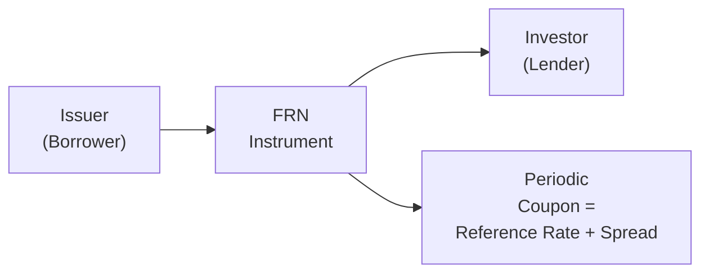
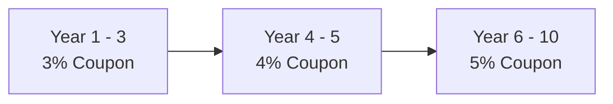

## Introduction

When interest rates are shifting faster than you can say “yield curve,” investors often gravitate toward bonds that can help them navigate rate volatility. Floating-rate notes (FRNs) are one such choice, with variable coupons tied to a benchmark. Step-up bonds also offer intriguing features—coupons that rise at predetermined times or after specific events. These instruments can be a lifesaver in certain market conditions but come with complexities that require thoughtful analysis. 

Let’s untangle the operational details of FRNs and step-up bonds, walk through some examples, and consider the risk-return implications. We’ll wrap up with a short glossary, references for further reading, and a practice quiz to help you test your knowledge.

## Floating-Rate Notes (FRNs)

### Definition and Basic Mechanics
Floating-rate notes, or FRNs, are bonds whose coupon payments reset periodically based on a reference rate plus a spread. The reference rate might be an interbank lending rate like SOFR, EURIBOR, or—back in the day—LIBOR. The spread (also called margin) compensates the investor for the issuer’s credit risk and other market factors.

Here’s a simplified formula for an FRN’s coupon payment:

$$
\text{Coupon Payment} 
= 
\bigl(\text{Reference Index} + \text{Spread}\bigr)
\times 
\text{Par Value}
\times 
\frac{\text{Days in Period}}{\text{Day Count Basis}}
$$

Because the coupon resets, FRNs typically track short-term interest rates more closely than fixed-rate bonds. That means if the reference rate rises, future coupon payments are higher—helping investors keep pace with a rising rate environment.

#### Informal Story
I recall the first time I really dug into an FRN’s prospectus, and it felt like deciphering code: “Wait, so the interest changes... every three months?” Eventually, I realized that was the whole point—investors holding FRNs don’t have to worry quite as much about interest rate risk because the coupon moves along with the market. But you know, if rates plummet, so do those future coupons.

### Reference Rates and the LIBOR-SOFR Transition
Historically, LIBOR (the London Interbank Offered Rate) was the most common reference rate. However, due to manipulation scandals and methodology critiques, global markets have transitioned to alternative rates like SOFR in the US, SONIA in the UK, and ESTR in the Eurozone. 

Key points about these new reference rates:
• They are often based on actual overnight transactions, making them more robust.  
• They do not always incorporate term credit risk in the same way LIBOR did.  
• The transition has been gradual, often requiring fallback language in bond documentation—so if your FRN’s primary reference rate fails, there’s a legal blueprint for which secondary rate to use.

### Spread Over Reference Rate
An FRN’s spread reflects the issuer’s risk profile in the market. Issuers with stronger credit typically offer lower spreads because they represent a lower credit risk. Conversely, if you see a floating-rate note with a juicy spread, that might mean the market perceives a higher chance of default, or the issuer is less liquid, and so it offers more compensation.

### Reset Frequency and Price Stability
Most FRNs reset their coupon quarterly or semiannually. Right before a reset date, the price of an FRN will typically be near par (plus accrued interest) because its coupon is about to align with the new interest rate environment. Between resets, the bond’s price may drift slightly based on market expectations of the next reset.

If we consider a quarterly-reset FRN indexed to SOFR plus 200 basis points, the coupon might look something like:

• Jan 1 – Mar 31: Coupon = (SOFR as of Jan 1 + 2.00%) × Par  
• Apr 1 – Jun 30: Coupon = (SOFR as of Apr 1 + 2.00%) × Par  
• and so forth...

When rates are climbing, each quarter’s coupon can jump to reflect the higher SOFR. On the flip side, in a low-rate environment, an FRN might seem disappointing compared to a fixed-rate bond that locked in a higher rate at issuance.

### Valuation Approaches
To value an FRN, you discount its coupon and principal cash flows by the appropriate discount rates (often zero-coupon rates or forward rates). However, the coupon changes with each reset, so between resets, the FRN’s price typically remains close to par if the issuer’s credit quality remains stable. 

If you’re curious to see a simplistic representation, check out the following Mermaid diagram of basic FRN structure (remember, it’s just a schematic—real deals can be more complex):

## Step-Up Bonds

### Overview
Step-up bonds have coupons that increase (“step up”) at predetermined dates or upon certain triggers, such as a downgrade in the issuer’s credit rating. They’re slightly different from FRNs: whereas FRNs peg the coupon to a floating index, step-ups have planned increments that can be listed in the bond’s prospectus. 

Think of it like a job contract that promises you a specific raise at certain anniversaries—except that for a bond, you’re the one granting a “raise” to the bond’s coupon payments.

### Types of Step-Up Structures

#### Fixed Step-Up
Fixed step-up schedules are relatively straightforward: the bond’s coupon might start at 3% for the first three years, then jump to 4% for the next two years, and finally land at 5% until maturity. These changes usually occur on specific dates—no external trigger required.

#### Contingent Step-Up
Contingent step-ups tie coupon adjustments to external events or credit-related triggers. A common scenario is if the issuer’s credit rating is downgraded below a certain threshold, the coupon increases by a certain margin. That compensates investors for the heightened credit risk. 

In practice, contingent step-ups can become quite complicated, especially if they involve multiple rating triggers, partial increments, or other performance-related criteria.

### Valuing Step-Up Bonds
The trick with step-up bonds is to model each future coupon stream under the assumption that the coupon rate changes. For a fixed step-up, the schedule is known, so you discount each coupon at an appropriate yield:

1. Identify the coupon in each segment (3% for years 1–3, 4% for years 4–5, etc.).  
2. Discount each coupon payment back to present value.  
3. Sum all discounted coupons plus the discounted principal.

For contingent step-ups, you often must attach probabilities to different rating outcomes or triggers, then weight the associated coupon streams accordingly.

If that sounds complicated—well, it can be! Step-up bonds might have sweeteners that look great on paper, but you always have to ensure you’re accounting for all potential scenarios.

### A Quick Valuation Example
Suppose you have a 10-year step-up bond with a $1,000 par value. For the first 5 years, the coupon is 3%; for the last 5 years, it “steps up” to 4%. Ignoring day count complexities, you might break out the present value calculation as follows:

• Calculate the present value of an annuity of 3% on $1,000 for 5 years.  
• Calculate the present value of an annuity of 4% on $1,000 for the following 5 years.  
• Discount the 4% portion from year 6–10 back to time zero.  
• Don’t forget the final principal redemption at maturity.  

In real-world analysis, you’d incorporate yield curve information (from Chapter 3 and Chapter 4 references) to discount each cash flow at the appropriate segment of the curve. Also, if you’re dealing with contingent step-ups, you layer in probabilities for each scenario.

## Risk and Return Considerations

### FRN Performance in Different Rate Environments
FRNs can outperform fixed-rate bonds in a rising rate environment because their coupons adjust upward. Conversely, if rates remain stagnant or decline, floating-rate coupons might look less appealing versus a fixed rate that was locked under more favorable conditions.

Credit risk still matters—if the issuer’s credit deteriorates, the spread demanded by the market may widen, eroding the FRN’s price. Even though interest rate risk is reduced, FRNs retain exposure to credit and liquidity risk.

### Step-Up Bond Performance and Complexity
Step-up bonds offer coupon increases at known times or after events that reflect credit risk. They can be beneficial if the investor expects the issuer’s standing to weaken, or if they simply want a structured coupon increment. On the other hand, forecasting all possible coupon paths in contingent step-up structures can be cumbersome. That complexity can lead to mispricing—sometimes you get a better deal, other times you might be overpaying for the “step-up promise.”

### Credit Spreads
Both FRNs and step-up bonds rely heavily on spread assumptions. A step-up might look like a good deal if the issuer’s credit risk is expected to remain stable. But if the market prices a higher risk, the yield demanded on the bond will rise, potentially lowering the bond’s market price. Similarly, an FRN spread that once seemed adequate might later look anemic if the issuer’s fundamentals worsen.

### Summing Up the Key Points
• Floating-rate notes reset coupon payments regularly based on a benchmark plus a spread.  
• The LIBOR-to-SOFR transition has big implications for older FRNs, requiring fallback provisions and adjustments.  
• Step-up bonds have increasing coupons at set intervals or upon certain triggers.  
• Both instruments offer ways to manage interest rate or credit risk, but neither is “risk-free.”  
• Proper valuation involves discounting expected future cash flows based on likely interest rate scenarios (for FRNs) or coupon schedules and event triggers (for step-up bonds).  

## Glossary

• Reference Rate (Benchmark): An externally published interest rate index (like SOFR) used to calculate a floating-rate coupon.  
• Spread: The additional margin added to the reference rate in an FRN, or the premium in the yield that reflects credit risk and other market factors.  
• Step-Up Coupon: A coupon schedule that increases at predetermined intervals or after certain external triggers.  
• Reset Date: The specific date(s) when an FRN’s coupon is recalculated based on the latest reference rate.  

## Mermaid Diagram: Step-Up Structure Snapshot

Here’s a simple schematic showing how a step-up bond’s coupon can evolve over time:

## References & Further Reading

• CFA Institute Level II Curriculum, especially sections on Floating-Rate and Structured Products.  
• Jha, Siddhartha. “Interest Rate Markets.” Provides deeper insight into FRN valuation.  
• Official statements from ARRC (Alternative Reference Rates Committee) addressing the LIBOR-to-SOFR transition.  

## Final Exam Tips
• For FRNs, make sure you know how to calculate the coupon reset timelines and how to discount the future cash flows if required.  
• Don’t forget that the spread in an FRN might change if the issuer’s credit quality changes. The spread in the bond’s indenture might be fixed, but the market can widen or narrow its demanded yield.  
• For step-up bonds, especially contingent ones, practice walking through different scenarios. Understand how to apply discount factors to each segment of the cash flow timeline.  
• Always watch out for day count conventions (see Chapter 2.2) and references to yield curve construction (Chapter 4).  

You’ve now gotten a taste of how floating-rate notes and step-up bonds can fit into a portfolio strategy. Let’s see if you’re ready to tackle some practice questions.

## Test Your Knowledge: Floating-Rate Notes and Step-Up Bonds



### Which of the following best describes a floating-rate note (FRN)?
- [x] A bond whose coupon rate resets periodically based on a reference rate plus a spread.
- [ ] A bond whose coupon is fixed for the life of the bond.
- [ ] A zero-coupon bond that pays no interest until maturity.
- [ ] A bond whose coupon rate increases only if the issuer's credit rating deteriorates.

> **Explanation:** FRNs pay coupon rates that reset at specified intervals based on a reference rate (like SOFR) plus a predetermined spread.

### An FRN typically has lower interest rate risk than a fixed-rate bond primarily because:
- [x] Its coupon payment adjusts regularly to reflect changes in market rates.
- [ ] It matures more quickly than fixed-rate bonds.
- [ ] It pays a coupon tied to an equity index.
- [ ] It offers a balloon payment at maturity.

> **Explanation:** Since the coupon on an FRN resets frequently, its price tends to stay close to par even as market interest rates change.

### During a declining interest rate environment, an FRN investor is most likely to experience:
- [ ] Significantly larger coupon payments.
- [x] Smaller coupon payments after each reset.
- [ ] Conversion to a fixed-rate note at par.
- [ ] No change in coupon payments.

> **Explanation:** As the reference rate declines, subsequent coupon payments on an FRN typically decrease.

### A step-up bond differs from a floating-rate note in that:
- [x] Its coupon increases at predetermined times or triggers rather than resetting to a market index.
- [ ] It has no exposure to credit risk.
- [ ] It matures earlier than FRNs by definition.
- [ ] It is not influenced by changes in interest rates at all.

> **Explanation:** Step-ups have scheduled or triggered increases, whereas FRNs link coupon changes to a market reference rate.

### If an investor purchases a step-up bond with a contingent coupon increase triggered by a credit rating downgrade, the investor:
- [x] Will receive higher coupon payments if the issuer’s rating is downgraded.
- [ ] Is completely protected from default risk.
- [x] May still face valuation uncertainty due to unpredictable downgrade timings.
- [ ] Is guaranteed a fixed step-up at maturity.

> **Explanation:** Contingent step-ups are designed to compensate investors for heightened risk, but uncertainty remains if and when a downgrade occurs.

### Which of the following reference rates is most commonly replacing LIBOR for dollar-denominated FRNs?
- [x] SOFR
- [ ] ESTR
- [ ] EURIBOR
- [ ] SONIA

> **Explanation:** In the US, the Secured Overnight Financing Rate (SOFR) has emerged as the main replacement for LIBOR.

### In valuing a step-up bond with a fixed schedule of coupon increases, which approach is most appropriate?
- [x] Discount each coupon, which changes at specific intervals, and the final principal at the relevant yield curve rates.
- [ ] Assume the coupon rate stays constant at the highest step-up level and discount at a single rate.
- [x] Ignore all future coupon changes since they have no effect on present value.
- [ ] Only discount the first coupon payment, then multiply by the number of years.

> **Explanation:** For fixed step-up schedules, each future coupon stream or “leg” is discounted back to the present using the appropriate discount rates, taking into account when those coupon changes occur.

### A bond that resets its coupon quarterly to SOFR plus 200 bps will:
- [x] Adjust its interest rate every three months based on the latest SOFR level plus 2.00%.
- [ ] Pay a fixed 2.00% coupon for the life of the bond.
- [ ] Increase only if the issuer’s credit rating improves.
- [ ] Make coupon payments at the end of every day.

> **Explanation:** An FRN with a quarterly reset updates its coupon interest rate every quarter, using the specified spread over the reference rate.

### What is a potential disadvantage of a floating-rate note if the reference rate stays very low over an extended period?
- [x] The bond may pay minimal coupons compared to higher-yielding fixed-rate alternatives.
- [ ] The bond’s coupon resets to a higher rate automatically, creating reinvestment risk.
- [ ] The issuer must redeem the bond early to avoid paying excessive interest.
- [ ] The bond’s price will drop to zero.

> **Explanation:** In a low-rate environment, the floating coupon provides only meager returns, which can underperform fixed-rate bonds issued when rates were higher.

### True or False: Contingent step-up bonds always provide higher total coupons regardless of the market environment.
- [x] True
- [ ] False

> **Explanation:** While one might argue the statement is simplistic, many contingent step-up structures are designed to give higher coupons if adverse credit events or specified triggers occur. Strictly speaking, “always” is a strong word, but the essence is that these structures are built to compensate for certain events, generally resulting in higher coupon payouts under those conditions.


