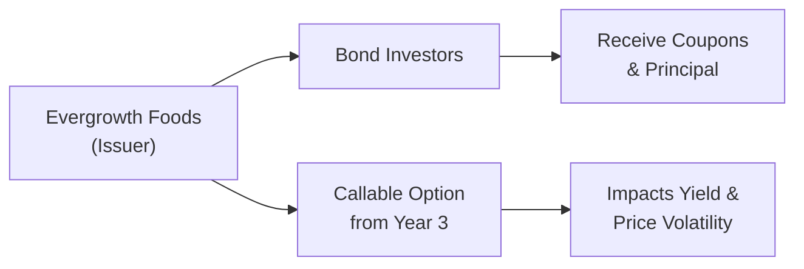

## Introduction
Ever stared at a bond’s term sheet in confusion, wondering if you’re missing a crucial detail? Maybe you’ve worried about how layering a floating coupon on top of an embedded call might affect pricing. Well, that’s exactly what we’ll explore here. In this section, we’ll walk through a typical exam vignette about identifying a bond’s features and highlight the key items you should look out for. Let’s face it: if you can decode a bond’s offering document, you’re already well on your way to making informed pricing and risk management decisions.

In Chapter 2 so far, we’ve discussed various fixed income instruments, from government to corporate to securitized. Now we’re going to dig into the specifics of a short scenario—like the ones you’ll see during the CFA Level II exam—just to show you how to identify each relevant feature. This skill becomes incredibly powerful not just for your exam, but also in real-world investing.

## A Hypothetical Bond Vignette
Imagine you receive a brief corporate bond offering document from “Evergrowth Foods Inc.”—a medium-sized consumer staples firm. The company has a “BBB” credit rating from a well-known rating agency. Here are some snippet details from the offering:

• Maturity Date: 5 years from issuance  
• Coupon: 3.25% for the first two years, then resets quarterly at 3-month SOFR + 150 bps (with a minimum floor of 2.00%)  
• Day Count Convention: Actual/360  
• Optional Redemption: Callable at par from year 3 onward  
• Issue Size: USD 300 million  
• Payment Frequency: Semiannual for the fixed portion; quarterly once floating begins

Now, if this were an item-set question, you’d see multiple choice queries asking you to interpret the bond’s features. You might be asked to identify how the convertible portion (if any) or the call feature will affect yield, or maybe which day count convention changes the accrued interest calculations. Sometimes these subtle elements are the difference between a comfortable pass and a surprise on exam day.

## Interpreting Bond Features
Let’s break down the primary features you might see in a vignette, using the Evergrowth Foods bond as an example.

### Issuer Type
First, look at who’s offering the bond. In our scenario, it’s a corporate bond issued by Evergrowth Foods, a for-profit corporation. Because it’s not a government or securitized product (like mortgage-backed securities), you’d classify it as a corporate bond. The credit rating of “BBB” also confirms it’s investment-grade rather than high-yield—definitely something to note when you assess risk and yield.

### Coupon Structure
Our example has a “hybrid” coupon. It’s fixed at 3.25% for the first two years and then floats at 3-month SOFR plus 150 basis points. This means the interest rate risk shifts partway through the bond’s life. During the fixed portion, you know exactly what you’ll earn. Later, when it floats, the coupon payments will align more with short-term interest rates.

• Fixed segment: 3.25% for two years  
• Floating segment: 3-month SOFR + 150 bps, so interest resets quarterly

Floating-rate notes often use a short-term benchmark like SOFR, LIBOR (phasing out in many markets), or T-bill rates. If you see references to a “reference rate” in the term sheet, that’s your giveaway that the bond coupon is floating.

### Day Count Conventions
A bond’s day count convention affects how accrued interest is calculated, which can slightly alter yield numbers. Our example uses Actual/360. This means actual days elapsed are counted in the numerator, and 360 is used in the denominator. If you’re used to Actual/365, you must be mindful that the difference can impact yield calculations.

Sure, you might think: “Oh, it’s just a day count convention.” But on the exam—and in real life—knowing the difference between 30/360, Actual/365, and Actual/360 can keep you from messing up your accrued interest computations.

### Embedded Options
Evergrowth’s bond is callable at par from year 3 onward. This call feature is an embedded option that allows the issuer to redeem the bond before maturity if it becomes favorable for them. How does this affect you, the investor?

• The “short call option” is effectively in the issuer’s hands.  
• Callable bonds typically offer a higher yield to compensate investors for that risk.  
• If market interest rates drop, the issuer might call the bond—meaning you get your principal back sooner, but then you have to reinvest at (presumably) lower yields.

An alternative scenario would be if the bond had a put option (though that’s not true here). That would give you, the bondholder, the right to sell it back to the issuer. Either way, these features can significantly alter the risk/return profile of the bond and, therefore, its pricing.

## Real-World Applications
In actual practice, you would start by pulling up the prospectus or term sheet and meticulously listing out the key features. That might look like this:

1. Issuer: Evergrowth Foods Inc. (Corporate)  
2. Maturity: 5 years from issuance  
3. Coupon Structure: 3.25% fixed for 2 years, then floating at 3M SOFR + 150 bps (floor of 2.00%)  
4. Day Count & Accrual: Actual/360  
5. Embedded Call: Callable at par from year 3 onward  
6. Credit Rating: BBB

Armed with these bullet points, you can move on to deeper analysis: how do you price the floating leg? Do you add the spread to the yield curve or implied forward rates? How do you handle the call feature? These details influence everything from discount factors to risk metrics like duration and convexity. In a test environment, you’re likely to see at least one question about each feature—like the day count effect on accrued interest or how a bond’s embedded call might affect your yield to maturity assumptions.

### A Quick Mermaid Diagram
Below is a simple diagram illustrating how the issuer, the investor, and the embedded call work together. It’s not exactly rocket science, but it helps visualize relationships:

The presence of the call option (D) influences how investors (B) analyze both yield and risk, and it may change the way the coupon is structured or purchased.

## Conclusion
When faced with a real or exam-based bond offering vignette, read carefully and pin down the relevant features:

• Who’s the issuer? Government, corporate, or some securitized product?  
• Does the bond pay a fixed or floating coupon? If floating, how often does it reset, and to which reference rate?  
• Which day count convention is used, and how will that play into yield calculations?  
• Are there any embedded options—calls, puts, convertibility—that require separate valuation considerations?

By methodically dissecting these items, you’ll be well on your way to answering exam questions with confidence (and maybe even impressing your colleagues in the process). Trust me, once you’ve built the habit of summarizing bond features, you’ll save yourself a lot of confusion down the line.

As discussed in Chapter 2.1 and 2.2, the type of instrument and coupon structure drives much of the subsequent pricing math. A “simple-sounding” detail—like a day count convention or call schedule—can be the difference between a correct answer and a dreaded second-guess in the exam hall. So read carefully, summarize concisely, and interpret with diligence.

---

## References and Further Reading
• CFA Institute Level II Curriculum, Fixed Income Readings and end-of-reading questions.  
• “The Handbook of Fixed Income Securities” by Frank Fabozzi for more comprehensive examples on bond features.  
• Mock exams from CFA Institute or reputable third-party providers that simulate the item-set format.  

---

## Practice Questions: Identifying Bond Features in Item Set Format



### Which bond feature in a corporate bond would typically trigger an upward adjustment to its yield relative to an otherwise similar non-option bond?

- [ ] Put option
- [ ] Conversion option
- [x] Call option
- [ ] Sinking fund requirement

> **Explanation:** A call option benefits the issuer, not the bondholder, and typically leads to a higher yield to compensate investors for the possibility of early redemption at lower market interest rates.

### When analyzing Evergrowth Foods Inc.’s bond that transitions from fixed to floating coupon payments, to which type of reference rate might the coupon be pegged?

- [ ] 10-year Treasury yield
- [ ] LIBOR, even though it’s being phased out
- [x] SOFR or similar short-term benchmark rate
- [ ] A swap spread above the Treasury rate

> **Explanation:** Many floating-rate bonds use short-term benchmarks like LIBOR or, increasingly, SOFR. Longer-term rates like 10-year Treasuries are generally not used as floating references for standard corporate bonds.

### Under an Actual/360 day count convention, what is the main factor that can cause a slight difference in accrual interest calculations compared to Actual/365?

- [x] The denominator days are set at 360 for interest calculations
- [ ] The numerator uses a standardized 365 days
- [ ] The coupon rate is reset monthly
- [ ] The bond is convertible

> **Explanation:** With Actual/360, the numerator counts actual days, but the denominator is always 360. This causes daily interest accrual to be slightly higher than an Actual/365 approach.

### When an issuer redeems a bond early through a call feature, how is the investor most likely to be impacted?

- [x] Potential reinvestment at lower yields if interest rates have fallen
- [ ] Extended duration to maturity
- [ ] A forced conversion into equity
- [ ] Increased coupon payments

> **Explanation:** A callable bond is typically called when interest rates decrease, which compels the investor to reinvest at potentially lower yields.

### Which of the following is inherently characteristic of a floating-rate note?

- [x] Coupons reset at designated intervals based on a reference rate
- [ ] Payment frequency aligns strictly with an annual schedule
- [x] Credit rating is irrelevant
- [ ] Day count conventions are always Actual/365

> **Explanation:** Floating-rate notes usually reset their coupons periodically according to a reference rate. The day count convention can vary, and credit rating remains highly relevant for risk considerations.

### From an investor’s perspective, which bond type typically has the shortest duration?

- [x] Floating-rate note
- [ ] 10-year fixed-rate corporate
- [ ] 30-year Treasury bond
- [ ] Zero-coupon bond

> **Explanation:** Floating-rate notes have coupons that adjust with market rates, reducing interest rate sensitivity and therefore typically resulting in shorter effective durations.

### Why might a bond’s offering memorandum emphasize the index and spread for a floating coupon?

- [x] Because the total coupon depends on both the index level and the added spread
- [ ] It’s required by securities regulators to highlight only the issuer’s logo
- [ ] Floating deals never have a spread; they always reset to the index rate
- [ ] Investors do not need this information for valuation

> **Explanation:** Investors must know the reference index and spread to project expected coupon payments and discount them appropriately when determining fair value.

### When moving from a fixed coupon to a floating coupon after two years, which yield measure might be less relevant going forward?

- [x] Yield to Maturity for the entire life
- [ ] Current yield
- [ ] Simple yield
- [ ] Yield to Call

> **Explanation:** Once the bond becomes floating, the yield to maturity calculated at issue can become less representative of future coupons due to the unknown path of interest rates. The bond’s return is more closely tied to the floating reference rate after the reset.

### If a bond is described in a prospectus as “callable at par beginning in year 3,” which statement is correct?

- [x] The issuer can redeem (call) the bond at face value anytime on or after year 3
- [ ] The investor can demand redemption (put) after year 3
- [ ] The bond ceases to pay coupons after year 3
- [ ] The bond automatically converts to equity at the beginning of year 3

> **Explanation:** A callable bond grants the issuer the right to redeem the bond at a specified price (in this case, par) on or after a certain date, which is year 3 here.

### A fixed-rate bond with a 3% coupon switching to a floating rate of SOFR + 150 bps likely experiences what primary shift in risk at the reset point?

- [x] The interest rate risk is transferred more from the issuer to the investor
- [ ] The bond automatically gains equity-like characteristics
- [ ] Credit risk ceases to exist
- [ ] The bond becomes convertible

> **Explanation:** With a floating coupon, the interest payment resets based on market rates, meaning the investor bears less price sensitivity to changes in interest rates (lower duration), but the variability of coupon payments introduces different forms of risk.


