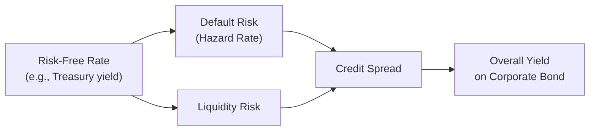

## Overview

I still remember the first time I tried to make sense of credit spreads. I was looking at two bonds—both had the same maturity, but the corporate bond’s yield was noticeably higher than the government bond’s yield. My gut reaction was, “Well, okay, that must be the default premium.” But then someone reminded me that liquidity, taxes, and a bunch of other factors also matter. So I sorta realized that the difference was more complicated than just “hey, you might default.” Reduced-form credit risk models aim to zero in on this complexity: they start with observed market spreads and attempt to parse out how much of that spread is tied to credit (default) risk itself, as opposed to other influences like liquidity conditions or risk premia demanded by investors.

In this section, we will explore how credit spread modeling works within a reduced-form framework. We’ll talk about how we can back out implied default intensities, interpret changing spreads over time, and incorporate macroeconomic indicators. We’ll also touch on advanced processes, like affine models, which capture spread volatility and even jumps in spread levels. By the end, you should be able to see not just how important credit spreads are in signaling the market’s perception of credit risk, but also how real-world practitioners—think portfolio managers or risk analysts—use these models to navigate bond and derivatives markets.

## The Link Between Reduced-Form Models and Credit Spread Dynamics

Reduced-form models start with something we directly observe in the marketplace: credit spreads. These spreads are the extra yield on a risky bond (such as a corporate bond) above a comparable, risk-free benchmark (like a Treasury). They reflect the market’s collective judgment of default probability, potential recovery value, and an added premium for uncertainty and illiquidity.  

But not all portions of that credit spread are purely about the issuer defaulting. Liquidity risk, tax treatment differences, and overall market risk sentiment get lumped into the spread as well. Reduced-form models strive to strip away as many of these confounding factors as possible, isolating the true default-related component. In doing so, the models rely on an intensity-based approach—sometimes referred to as a “hazard rate” in default timing—that can be inferred or “backed out” from market data.

Here’s a simple representation of how these different components feed into a bond’s total yield:

## Backing Out Default Intensities, Recovery Rates, and Risk Premia

One advantage of reduced-form models is that we can observe a corporate bond’s yield spread over the risk-free rate (or the spread in a credit default swap, CDS) and logically “reverse engineer” certain parameters. In particular:

• Default Intensity (Hazard Rate): Denoted often by λ(t), it’s the instantaneous probability of default in a very small time interval.  
• Recovery Rate (R): The fraction of face value you can still expect to recover if a default does occur.  
• Risk Premium: Investors typically demand further compensation for uncertainty and risk aversion.  

A simplified relationship often seen in credit risk literature is:


\text{Spread}_t \approx (1 - R) \, \lambda_t.


This is not a perfect formula—real markets embed all sorts of premiums and complexities—but it’s a helpful starting point. 

In practice, credit analysts will compare model-implied spreads to actual market spreads. By adjusting the hazard rate and assumptions about recovery (or adjusting the risk premium parameters in more sophisticated settings), the model is “calibrated” until it matches observed data as closely as possible.

## Beyond Default Risk: Liquidity, Tax, and Other Adjustments

It’s rarely enough to assume all the yield differential is purely about default. At times, it’s easy to see the market reacting less to a fundamental default risk change and more to supply/demand mismatches or macroeconomic events that make liquidity scarce (or abundant). For example, if a certain bond becomes what folks call a “crowded trade,” liquidity might spike, narrowing the spread, even if the actual credit risk of the issuer hasn’t changed a bit.

Reduced-form models tackle this challenge by inserting extra terms into the spread or hazard-rate process to reflect liquidity conditions and other market frictions. We might see a bond whose spread blows out temporarily (i.e., increases abruptly), not because the issuer’s fundamentals are deteriorating but because dealers are holding less inventory. As a result, in interpreting a big jump in credit spreads, it’s critical to disentangle fundamentals from market frictions.

## Constant Versus Stochastic Recovery Rates

Recovery rates are, ironically, one of the biggest uncertainties in credit modeling. Conventional simplified models assume a constant recovery (say 40% or 50%). But in reality, recoveries can bounce around depending on market cycles, seniority in the capital structure, or even industry-specific trends.

• Constant Recovery: The assumption is that if default occurs, bondholders recover a fixed percentage (R). This helps keep the math simpler, but it can oversimplify real-world experiences.  
• Stochastic Recovery: Here, R can follow its own random process or be correlated with the issuer’s financial health, which in practice is more realistic. If the entire sector is in trouble (like in a big industry downturn), recovery rates might be lower across the board.

Varying recovery rates affect the shape and level of credit spreads in a model. When the possibility of extremely low recovery exists (e.g., “maybe everyone is in trouble at once”), spreads often have fatter tails on the upside. Also, it affects pricing of credit derivatives that are sensitive to loss severity, such as tranches in collateralized debt obligations (CDOs).

## Spread Volatility, Jumps, and Correlation with Interest Rates

Broadly speaking, advanced credit spread models allow for random volatility in spreads and can incorporate “jumps” that happen abruptly (e.g., at rating downgrades or big macro announcements). One way to handle these dynamics is through AFFINE MODELS. 

### Affine Processes

In an affine model, the short rate (or hazard rate, or credit spread itself) follows a stochastic process where the log of the characteristic function is a linear (affine) function of the state variables. A typical representation for a hazard rate \\(\lambda_t\\) might be:


\lambda_t = \alpha + \beta X_t,


where \\(X_t\\) can itself be a mean-reverting process or follow some jump-diffusion pattern. These models are widely used for their tractability and for providing closed-form solutions for bond or CDS pricing under certain assumptions.

If you’re using an affine model to drive both the risk-free interest rate and the credit spread, you can introduce correlation terms that capture how default risk might rise in a downturn (when interest rates may also shift in response to central bank policy or market sentiment). That correlation can dramatically reshape the term structure of credit spreads, particularly for longer maturities.

## Macroeconomic Variables in Credit Spread Forecasting

Economies don’t move in a vacuum—credit spreads reflect broader macro trends. When we reduce credit models purely to hazard rates, we often lose that bigger “economic story.” Modelers attempt to incorporate macro indicators in a few ways:

• Direct Input into Hazard Rates: The hazard rate \\(\lambda_t\\) might be related to leading indicators like GDP growth forecasts, unemployment rates, or manufacturing indexes.  
• Regime-Switching Models: The economy transitions between “good” and “bad” states with certain probabilities, and those states can drive different levels of \\(\lambda_t\\).  
• Factor Models: A set of latent or observed factors (some of which may be macro variables) are used to predict changes in credit spreads.  

Including macro information can enhance the predictive accuracy of credit spread models, especially when capturing cyclical patterns or potential regime shifts.

## Real-World Usage: Valuation, Stress Testing, and VaR

So how do practitioners put these models to use? Let’s say you’re managing a portfolio of corporate bonds and want to measure risk. You might feed current market spreads and historical spread volatility data into a reduced-form model to project potential losses under various scenarios—like a deep recession. This is part of a broader Value at Risk (VaR) or stress-testing routine.

Another angle: credit default swaps (CDS). If you can back out hazard rates and calibrate them to your view of liquidity and macros, you can potentially spot mispricings between the bond market and the CDS market. Or you might structure a hedge—if your model indicates certain CDS spreads are “too tight,” you could buy protection, expecting those spreads to widen if fundamental conditions deteriorate.

Portfolio managers also pay attention to “edging” changes in spreads. If spreads start to tick up in minor increments over a few days with no major news, that might signal the market is quietly growing uneasy about the issuer. Conversely, a sudden jerk upward in spreads might be a liquidity shock. A well-tuned reduced-form model tries to gauge how much of that shock is about real fundamental risk rather than short-term market factors.

## Interpreting Credit Spread Fluctuations: A Practical Mini-Example

Picture a simple scenario: You hold a bond from Company XYZ that trades at a yield of 5%, while the equivalent maturity Treasury yields 3%. The credit spread is 2%. After calibrating a reduced-form model, you find that your hazard rate estimate for XYZ is 2.5% per year with a 40% recovery. The model might produce:


\text{Model-Implied Spread} = (1 - 0.40)\times 0.025 = 0.015 \quad \text{(or 1.5%)}.


But the actual market spread is 2%. The difference (another 0.50%) could be explained by other risk premium components, illiquidity, or potential model shortcomings (calibration error). If you believe your hazard rate is correct, you might interpret the 0.50% “extra” spread as cheap. Maybe you see an opportunity to capture excess yield—provided you think the market is overestimating the company’s credit risk or undervaluing the bond’s liquidity. Or you might suspect your hazard rate is too low. This is where deeper fundamental research comes in.

## Mermaid Diagram: Credit Spread as a Function of Default Beliefs

Below is a conceptual flowchart showing how a reduced-form modeling approach might feed from market data into hazard rate calibration and ultimately inform portfolio decisions.

## Glossary

• Credit Spread: The yield difference between a corporate (or risky) bond and a comparable risk-free bond. Reflects default risk, liquidity, and other factors.  
• Recovery Rate (R): The fraction of a bond’s par value that investors expect to recoup in the event of default.  
• Affine Process: A class of stochastic processes for interest rates or credit spreads, where the log of the characteristic function is linear in the state variables.  
• Yield Premium: The extra yield required by investors for bearing additional risk beyond that of a risk-free security.  
• Spread Volatility: How much the bond yield differential fluctuates over time because of market conditions, issuer fundamentals, etc.  
• Risk Premium: The return above the risk-free rate that investors demand for facing higher risk.  
• Calibration Error: The gap between model-implied values and actual market observations.  
• Liquidity Risk: The potential difficulty or cost of trading a security without significantly affecting its price.  

## References

• Duffie, D. (2010). Dynamic Asset Pricing Theory.  
• Jarrow, R. and Turnbull, S. (1995). “Pricing Derivatives on Financial Securities Subject to Credit Risk.” Journal of Finance.  
• O’Kane, D. (2008). Modelling Single-Name and Multi-Name Credit Derivatives.  

• For an official perspective and more examples:  
  - CFA Institute Level II Curriculum (Fixed Income volumes).  
  - Various working papers and research notes from the Federal Reserve Board on credit spreads.  

## Test Your Knowledge: Credit Spread Modeling



### A fixed-income analyst observes that a company’s bond yield is 6.2% while a similar-maturity government bond yield is 4.0%. The observed credit spread is 2.2%. According to a simplified reduced-form approach that assumes a 40% recovery rate, what is the implied hazard rate (λ)?

- [ ] 0.60%
- [ ] 0.88%
- [x] 3.67%
- [ ] 5.50%

> **Explanation:** A simplified relationship is Spread = (1 − R) × λ. Here, 2.2% = (1 − 0.40) × λ => λ = 2.2% / 0.60 = 3.67%.

### Which of the following is a primary goal of reduced-form credit risk models when analyzing credit spreads?

- [ ] Ignoring default risk entirely in favor of macroeconomic factors.
- [ ] Focusing solely on liquidity and ignoring default risk.
- [x] Isolating the default-related portion of the observed credit spread.
- [ ] Eliminating any volatility in observed spreads.

> **Explanation:** Reduced-form models aim to decompose observed credit spreads, isolating the portion attributable to default risk from other factors like liquidity and taxes.

### In a reduced-form model, which of the following assumptions would most likely increase the model-implied credit spread?

- [ ] Assuming a high recovery rate.
- [x] Assuming a lower recovery rate.
- [ ] Seeing zero correlation with interest rates.
- [ ] Excluding liquidity premium.

> **Explanation:** A lower recovery rate increases the potential loss given default, leading to a higher model-implied spread.

### Which statement best describes an affine process in the context of credit spread modeling?

- [x] It is a stochastic process where the characteristic function’s logarithm is linear in the state variables.
- [ ] It assumes default can never occur after a certain time.
- [ ] It only models deterministic spread paths.
- [ ] It is a process where interest rates are always risk-free.

> **Explanation:** Affine processes are widely used because they allow for analytical tractability, with log characteristic functions that are affine (linear) in the underlying state variables.

### If a bond’s market spread is substantially higher than the model-implied spread, what might be a possible explanation under a reduced-form framework?

- [ ] The bond has zero liquidity risk.
- [x] Market participants may be demanding a higher risk premium or reflecting additional liquidity concerns.
- [ ] The model is perfectly calibrated to all risk factors.
- [ ] The recovery rate is higher than in the model.

> **Explanation:** When market spreads exceed model-implied spreads, it often indicates that other risk premiums, liquidity shortfalls, or market anxieties are boosting the spread beyond the pure default compensation.

### Which of the following key macroeconomic indicators might be directly integrated into a reduced-form model to forecast credit spreads?

- [ ] Company’s historical dividend growth.
- [ ] Seasonal weather patterns.
- [x] GDP growth and unemployment rates.
- [ ] Prior year’s bond coupon payments.

> **Explanation:** Reduced-form models often incorporate macro variables (like GDP, unemployment, etc.) to refine hazard rate forecasts and capture economic conditions.

### What is the role of calibration error in reduced-form credit modeling?

- [ ] It enhances the fit of the model to market data.
- [x] It measures how much the model’s implied spreads deviate from observed spreads after calibration.
- [ ] It indicates the maximum theoretical default rate.
- [ ] It is an alternative term for the hazard rate.

> **Explanation:** Calibration error reflects the degree of mismatch between what the model projects and what the market trades at. Large errors may indicate the model needs better assumptions regarding liquidity, recovery, or macro factors.

### When a company’s credit spread “jumps” suddenly without any apparent change in its financial performance, which factor is most likely contributing to this sudden spike under a reduced-form approach?

- [ ] A guaranteed decline in the hazard rate.
- [ ] An improvement in recovery assumptions.
- [ ] A reduction in market risk premium.
- [x] A surge in liquidity risk or market risk premium.

> **Explanation:** Sudden jumps in spread often reflect market risk perception changes—like dealers reducing inventory or investor panic—rather than a fundamental change in the issuer’s default likelihood.

### Which approach best captures the idea that an economy can switch between “good” and “bad” states with corresponding changes in default intensities under a reduced-form framework?

- [x] Regime-switching models
- [ ] Constant intensity models
- [ ] Zero volatility recovery assumption
- [ ] Market microstructure models

> **Explanation:** Regime-switching allows the hazard rate to take on different values or distributions depending on the overall economic environment.

### True or False: Reduced-form models ignore macroeconomic indicators and focus solely on the micro-level default risk of a specific company.

- [ ] True
- [x] False

> **Explanation:** Although simpler variants may focus only on the issuer-level hazard rate, many implementations of reduced-form models do incorporate macro metrics (e.g., GDP, unemployment, etc.) because credit risk is influenced by the broader economic landscape.


