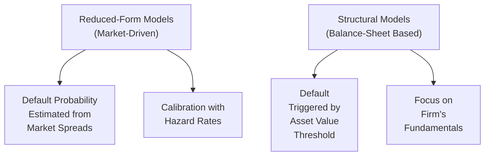

## Introduction

If you ever had that moment where you peek at financial markets and wonder, “Hmm, how on earth do they come up with those credit spreads for corporate bonds?”—you’re not alone. In my early days, I found myself scratching my head over models that tried to forecast when a company might default. Reduced-form models (also known as intensity-based models) were among the first explanations that felt almost intuitive. They say, “Default can arrive randomly, and we can glean its probability right off market prices.” It sounds neat, right?

Reduced-form models essentially treat default much like a “Poisson process.” In plain English, think about how some sudden events—like a random phone call—occur with a certain probability over time. Except, in this case, the probability is gleaned from credit spreads, bond prices, and market data that update frequently. This approach contrasts with structural models where everything hinges on a company’s balance sheet, assets, and liabilities. Reduced-form models worry less about whether a firm’s asset value crosses some threshold and more about what the market “thinks” of that firm at each moment.

Below, we’ll walk through the key strengths of reduced-form models, the limitations that can catch you off guard, and how to reconcile them with structural approaches. And by the end, you’ll see how analysts often pick and choose elements from both to get a better handle on credit risk.

## Major Strengths of Reduced-Form Models

### Less Emphasis on Firm-Specific Inputs

One of the biggest advantages is that reduced-form models don’t rely heavily on the nitty-gritty details of a company’s assets. You won’t always need to guess whether the firm’s asset volatility is 20% or 25%, or whether intangible assets are adequately accounted for—sometimes that’s a tough game. Instead, the model just says: “Let’s look at current bond prices, let’s see how the credit spreads are evolving, and let’s capture that random risk of default from observable market data.” It’s a bit like saying: “We don’t have to open the hood of the car to assess the engine’s details if we’re just listening for engine knocks in real time.”

### Ease of Calibration to Market Data

These models can typically be calibrated using data like corporate bond yields, credit default swap (CDS) spreads, or even equities. For instance, if you have up-to-date CDS spreads, you can back out hazard rates (the instantaneous default intensities) that match the observed prices. Because everything is anchored to market prices, the calibration feels straightforward—especially when the market is liquid. Think of it like setting your watch every day to the official clock; if the data are reliable, your model time is spot on.

### Random Arrival Processes That Capture Timing

Reduced-form models allow for a flexible default arrival process. Default can happen at basically any point in time, with a hazard rate that adjusts to market conditions. That’s powerful because it acknowledges that even a firm with decent balance sheets can suddenly fall victim to a credit event—especially if the market signals it through widening spreads. So if the market is spooked by, say, a regulatory investigation, your model can dynamically reflect that risk in real-time hazard rates.

### Incorporating Market Sentiment and Macro Factors

Markets aren’t just about firm fundamentals. Sometimes, big macroeconomic shifts or changes in investor sentiment can overshadow a single company’s specifics. Reduced-form models make it relatively painless to factor these “bigger picture” elements in, because if spreads blow out across the sector or region, the hazard rate jumps accordingly. So you get a tool that’s agile—responding to central bank moves, economic data, or even short-term panic. 

## Key Limitations and Pitfalls

### Reliance on Potentially Illiquid or Sentiment-Driven Data

Just because market prices are out there doesn’t mean they’re always reliable. We’ve all seen times when low-volume bond issues trade sporadically, so the prices might not accurately reflect true credit risk. Or we get into those mania phases of the market where investor fear or euphoria overtakes rational pricing. Reduced-form models feed on these spreads. If the spreads are wacky, well, the model can be wacky too.

### Calibration Problems in Distressed Markets

Imagine a crisis scenario where bid-ask spreads balloon; it’s like trying to precisely tune a guitar string in the middle of a thunderstorm. Calibrating to a wide and noisy spread is tricky—sometimes the model ends up with hazard rates that swing wildly. If a bond is trading at 50 cents on the dollar, is it truly reflecting default probability or is it reflecting forced selling, liquidity constraints, or just raw panic? Distressed markets can break a reduced-form model’s neat calibration.

### Oversimplification of Underlying Drivers

Because the approach doesn’t require analyzing a firm’s internal metrics in great detail, it can ignore the structural or fundamental drivers of solvency. A company might have a hidden risk that’s glaring once you open the books, but if the market is collectively ignoring it, your model might do the same. This can lead to underestimating default risk if you don’t keep an eye on actual leverage and cash flow coverage.

### Extreme Market Behavior Hurts Hazard Rate Assumptions

Reduced-form models often use a Poisson-like intensity that remains somewhat stable over short intervals. But in times of extreme volatility—think 2008 global financial crisis or severe recessions—the entire concept of a constant or smoothly varying hazard rate can fail. When market conditions flip from normal to highly distressed in a matter of days, your model might not keep pace. Defaults can bunch up, hazard rates can spike in ways well beyond historical patterns, and that’s where the standard reduced-form approach might leave you with inaccurate predictions.

## Contrasting Reduced-Form With Structural Models

Structural models, as you might recall from your credit risk studies (and from Chapter 19 on Merton Model Basics), rely on firm-level data. They model a company’s liabilities and assets, then assert that default occurs when the firm’s asset value dips below the face value of its debt. This approach is deeply rooted in corporate finance concepts (e.g., the firm’s equity is a call option on its assets).

Reduced-form models, by contrast, say, “Sure, that’s a cute idea. But I just want to see what the market is willing to pay for the bonds now, and I’ll back out the default probabilities from there.” 

In practice, structural models can offer deeper insight into a firm’s solvency—if you have the data. But that data (asset volatility, intangible asset valuations, capital structure complexities) can be hard to get. Reduced-form is typically simpler to calibrate but can ignore a firm’s balance-sheet realities. Both approaches have value. Many analysts actually overlay structural data onto a reduced-form framework or vice versa, trying to get the best of both worlds.

## The Importance of Scenario Analysis and Stress Testing

One way to mitigate some of these limitations is scenario analysis. If you suspect a recession might be lurking, you can layer that possibility on top of your reduced-form hazard rates. For example, you might say, “Under normal conditions, the hazard rate is X, but if GDP growth falls below 0%, I’ll shift the hazard rate up by a certain factor.” 

Stress testing is similar, except you’re looking for how your existing portfolio or firm might behave under an extreme but plausible scenario. If your stress test reveals that the hazard rate jumps to levels that produce unacceptably large losses in your portfolio, it’s a clue to reconsider your risk exposures. This approach helps hedge against times when the model’s assumptions break down, because you’re effectively prodding it with “what if” questions that replicate real crises.

## Combining Structural and Reduced-Form Insights

A neat trick, often called the “hybrid approach,” is to start with a structural model’s perspective of the firm’s fundamentals—like its leverage, debt maturities, and earnings variability—and then calibrate the hazard rates used in a reduced-form approach to ensure that these fundamentals do not diverge from actual spreads. This can be especially valuable if the issuer is under follow-up scrutiny from rating agencies or if the bond market for that issuer is thinly traded.

The logic behind combining them is:  
• Use the structural model to anchor your sense of firm-specific risk.  
• Use the reduced-form model to reflect “real-time” market conditions.  
• Compare the two results. If they’re drastically different, ask “Why?” Maybe the market is ignoring a hidden fundamental risk, or maybe the fundamental data is stale while the market sees new negative news.

## Glossary

- **Market Liquidity**: The ease with which securities can be bought or sold without major price impact. In illiquid markets, spreads can be misleading.  
- **Sentiment-Driven Risk**: The risk arising from investor psychology. Sometimes prices deviate from fundamental values because of panic or exuberance.  
- **Stress Testing**: Analyzing how a model or portfolio holds up under hypothetical, and often harsh, economic scenarios.  
- **Model Risk**: The risk that the model itself is flawed due to questionable assumptions or incomplete data.  
- **Bid-Ask Spread**: The price difference between what buyers are willing to pay (bid) and what sellers are willing to accept (ask) for an asset.  
- **Distressed Markets**: Situations where bond or stock prices have plunged, often accompanied by high default risk and limited liquidity.  
- **Firm Fundamentals**: Internal metrics such as asset coverage, leverage, profitability, and liquidity. These form the backbone of true solvency analysis.  
- **Hybrid Approach**: A modeling strategy that mixes elements of structural (firm fundamentals) and reduced-form (market-driven intensity) models to get a more rounded view of credit risk.

## Practical Takeaways

• Reduced-form models are easier to calibrate when markets are working smoothly with plenty of liquidity.  
• They’re great at reflecting sudden changes in market perception, making them agile in short-term forecasting.  
• However, they might ignore deeper structural drivers—so be careful relying on them exclusively.  
• Scenario analysis and stress testing offer a partial safety net, helping you see how hazard rates might behave under extreme market conditions.  
• For the best picture, combine structural insights (e.g., a firm’s balance-sheet health) with reduced-form models’ real-time signals from the market.

## References and Further Reading

- Arora, N., Bohn, J.R., and Zhu, F. (2005). “Reduced Form vs. Structural Models of Credit Risk: A Case Study.”  
- Das, S. (1997). “Credit Risk Derivatives.” Journal of Derivatives.  

You might also explore official CFA Institute curriculum on credit risk modeling. Look for volumes discussing current market practices in default intensity calibration and scenario analysis. Many advanced practitioners rely on both academic texts and real-world data from agencies like the Federal Reserve, European Central Bank, or the Bank for International Settlements for crisis-oriented modeling insights.

## Test Your Knowledge: Strengths, Limitations, and Hybrid Approaches in Reduced-Form Credit Models



### Which of the following is most characteristic of reduced-form credit risk models?  
- [ ] They rely primarily on a firm's assets crossing a threshold.  
- [ ] They require extensive balance sheet analysis of the firm.  
- [x] They estimate default probabilities from market prices and spreads.  
- [ ] They do not need any form of calibration.  

> **Explanation:** Reduced-form models focus on calibrating default probabilities using market information (e.g., bond yields, CDS spreads). By contrast, structural models concentrate on whether the firm’s asset value dips below total debt.

### When might market liquidity pose the greatest challenge to reduced-form calibration?  
- [ ] During normal trading conditions with tight bid-ask spreads.  
- [x] In distressed markets or when bid-ask spreads widen significantly.  
- [ ] In markets with excessive liquidity and minimal spreads.  
- [ ] When a firm offers daily investor calls.  

> **Explanation:** In distressed markets, bond prices often become less reliable indicators of credit risk because wide bid-ask spreads can be driven by forced selling or illiquidity, undermining the calibration process.

### Which of the following best represents a limitation of reduced-form models?  
- [ ] They are too heavily reliant on proprietary firm data.  
- [x] They may fail to incorporate structural drivers of a firm’s balance sheet.  
- [ ] They don’t utilize bond or CDS spreads in any capacity.  
- [ ] They assume firm liabilities evolve in a predictable manner.  

> **Explanation:** Reduced-form approaches sometimes ignore deeper structural drivers like capital structure or asset valuation, which are essential in structural modeling.

### Why might a hybrid approach be appealing to credit analysts?  
- [ ] It eliminates the need for complicated calibrations.  
- [x] It combines real-time market signals with deeper firm-level analysis.  
- [ ] It only uses credit rating agencies for determining hazard rates.  
- [ ] It completely replaces traditional structural methods.  

> **Explanation:** A hybrid approach attempts to capture both the immediacy of market-driven data (reduced-form) and the detailed solvency insights from firm fundamentals (structural approach).

### Which of the following is an advantage of reduced-form models?  
- [x] They can be updated quickly based on changing market prices.  
- [ ] They provide a precise measure of a firm’s total liabilities.  
- [ ] They completely avoid reliance on credit spreads.  
- [ ] They cannot be stressed with hypothetical scenarios.  

> **Explanation:** Reduced-form models are often lauded for their responsiveness to new market data and ease of recalibration as prices move.

### In a severe financial crisis, how do extreme market shifts impact reduced-form assumptions?  
- [ ] They generally reinforce the accuracy of constant hazard rates.  
- [ ] They have no impact on hazard rates because default is deterministic.  
- [x] They can derail the standard hazard rate assumptions, leading to model errors.  
- [ ] They make the model simpler to apply.  

> **Explanation:** Extreme market fluctuations cause hazard rate assumptions to behave erratically, which can lead to inaccurate or unstable model outputs.

### What is an example of incorporating macro factors into a reduced-form model?  
- [ ] Setting default events purely based on the firm’s internal cash flow analysis.  
- [x] Increasing hazard rates if GDP growth forecasts turn negative.  
- [ ] Ignoring changes in interest rates.  
- [ ] Plugging in stable corporate financial statements into the model.  

> **Explanation:** One advantage of reduced-form models is their adaptability. Incorporating data like GDP forecasts or central bank policy changes into hazard rate calculations is straightforward.

### Which statement best describes “market sentiment” as it applies to reduced-form credit modeling?  
- [x] It refers to investor behavior and attitudes that influence bond and CDS spreads.  
- [ ] It’s purely a function of historical default data.  
- [ ] It’s irrelevant to the pricing of corporate bonds.  
- [ ] It only applies to structural credit models.  

> **Explanation:** Investor psychology or sentiment can strongly influence spreads, which in turn affect how reduced-form default probabilities are calibrated.

### How do stress tests help mitigate model risk in reduced-form frameworks?  
- [ ] They eliminate the need for hazard rates.  
- [ ] They remove subjectivity from spread data.  
- [ ] They ensure spreads stay constant during crises.  
- [x] They reveal potential vulnerabilities by simulating adverse market conditions.  

> **Explanation:** Stress tests inject hypothetical but plausible scenarios to see if the model’s outputs remain reasonable. This helps identify weaknesses or blind spots in the model structure.

### Reduced-form models primarily estimate default risk by:  
- [x] Inferring hazard rates from observable market prices such as bond yields and CDS spreads.  
- [ ] Using laptop-based simulations of corporate assets.  
- [ ] Setting default triggers from accounting-based thresholds alone.  
- [ ] Relying on rating agencies for all inputs.  

> **Explanation:** Reduced-form approaches revolve around extracting default intensities (hazard rates) from market-based information, aligning model outputs to real-time prices.


