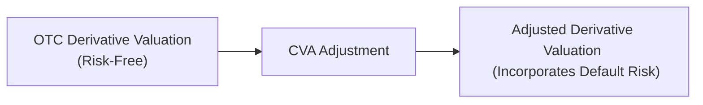

## Introduction
Sometimes, when I first heard the term “Credit Valuation Adjustment,” I felt my eyes glaze over a little bit—CVA just sounded like more finance jargon. But once you unpack it, you realize it’s a really intuitive idea: no matter how “perfect” a derivative’s valuation might look in a default-free universe, we still face real-world credit risk from our counterparty. So, CVA is basically the difference between a derivative’s risk-free value and its true value once we factor in the possibility that our counterparty might bail on their obligations.

In the context of over-the-counter (OTC) derivatives, CVA has become a critical topic—especially post–global financial crisis—because credit risk events can strike quickly and wipe out gains you thought were locked in. In this section, we’ll explore the definition of CVA, its key components, regulatory considerations, and examine a real-world example. We’ll also highlight some best practices and pitfalls to watch out for. 

## The Rationale Behind CVA
In a default-free world, the fair value of a derivative is typically computed using a risk-free discount curve (like the overnight indexed swap (OIS) curve). But in reality, there’s a chance that you might not receive all future cash flows if your counterparty defaults. That’s where CVA comes in—this adjustment subtracts an expected loss from the risk-free value. Sometimes, we refer to it as the “credit risk haircut” on a derivative’s price.

The concept also extends beyond just your counterparty’s risk. Firms can look at bilateral CVA (bCVA), which simultaneously accounts for their own default risk through something called Debt Valuation Adjustment (DVA). However, practically speaking, many institutions focus first on unilateral CVA (uCVA), which only adjusts for counterparty risk. 

Below is a simple diagram to help visualize how risk-free valuation is adjusted downward by CVA to reflect credit risk:



## Core Components
At the heart of CVA’s calculation, we have four main ingredients. If you want to put them together in a rough formula, you might see something like this in various forms:


\text{CVA} \approx (1 - R) \times \sum_{t=1}^{T} \Bigl( \text{EE}(t) \times \text{PD}(t) \times \text{DF}(t) \Bigr)


Here, \\(R\\) (recovery rate) is closely related to Loss Given Default (LGD) by the relation \\(\text{LGD} = 1 - R\\). We’ll dig into each component below.

### Expected Exposure (EE)
Expected Exposure (EE) is basically the average potential credit exposure at a future time. It’s a forward-looking measure—meaning we try to peer into the future and see how large the derivative’s value to you might become. If you’ve ever been worried someone might break a promise right when it becomes most advantageous to you, that’s exactly why we look at exposure after all the possible rate changes, price fluctuations, or credit events that might occur.

To estimate EE, practitioners often use simulation techniques—like Monte Carlo—to model possible paths of underlying risk factors (interest rates, FX rates, etc.). Then, they look at the derivative’s value across many scenarios and pick out the average net positive exposure at each time point.

### Probability of Default (PD)
Probability of Default is the chance your counterparty will default at any given time. If we break down a derivative’s life into discrete time intervals (say monthly or quarterly), we can estimate PD(t) for each interval. Typically, this PD might be derived from credit ratings, market-implied default probabilities (e.g., from CDS spreads), or internal corporate credit models.

### Loss Given Default (LGD)
If the counterparty does default, you might recover some portion of the exposure through collateral, partial payments, or legal claims—so you don’t necessarily lose everything. The fraction that you do lose is called Loss Given Default. A typical assumption for LGD might be in the range of 40% to 60%, though it varies based on the type of collateral, seniority of claims, and other nuances.

### Discount Factors (DF)
This is straightforward but really important: we discount future potential losses back to today to account for the time value of money (e.g., a potential loss next year is worth less than a potential loss next week). Typically, you would use risk-free discounting or (in some models) credit curve discounting, depending on your firm’s assumptions and regulatory guidance.

## Unilateral vs. Bilateral CVA
You might come across “unilateral CVA” (uCVA) or “bilateral CVA” (bCVA). Unilateral CVA references only the counterparty’s risk. Bilateral CVA tries to be even-handed by considering both sides:

- **Unilateral CVA (uCVA):** Only accounts for the possibility your counterparty defaults.  
- **Bilateral CVA (bCVA):** Also includes the possibility your own firm defaults, which introduces DVA (Debt Valuation Adjustment). 

From a regulatory perspective, many banks historically used unilateral CVA for a while. Over time, and especially after major crises, the market has shifted toward bilateral frameworks to align with fair value measurement standards and to reflect symmetrical risk profiles.

## The Role of Netting and Collateral
One huge factor that lowers CVA is the presence of robust netting agreements. If you’ve got multiple derivatives with the same counterparty, netting lets you consolidate all those exposures so that gains in one contract can offset losses in another. Instead of paying out on each contract individually (which can inflate exposure), the net result is often smaller. This netting effect can significantly reduce your Effective Exposure (EE).

Collateral agreements (e.g., under a Credit Support Annex, or CSA) also reduce CVA because they require parties to post collateral in proportion to the derivative’s market value. That means your net exposure—the portion actually at risk—shrinks. 

However, watch out for cross-default provisions or contingent clauses. They can complicate the analysis because the default of one entity in a corporate group might trigger defaults in other related entities, changing your real exposure unexpectedly.

## Regulatory Capital Requirements and Basel
On the regulatory side, CVA is crucial in bank capital calculations. Ever since the Basel III (and subsequent revisions under Basel IV) introduced specific capital requirements for CVA risk, banks have had to hold more capital to cover the potential mark-to-market loss on their derivatives. The logic is simple: even if a bank is hedged from a market risk perspective, it still faces credit risk to counterparties. 

The main objective of these regulations is to ensure banks have a cushion in case of widespread credit deterioration among counterparties. Basel frameworks also encourage improvements in netting, collateral, and risk management practices. And from a personal perspective, I remember being at a conference when Basel III was just rolling out—everyone had questions about how the new CVA capital charges would drastically change desk-level trading strategies (spoiler: they did).

## Example: Interest Rate Swap
Imagine you enter into a 5-year, USD 100 million notional interest rate swap, paying fixed and receiving a floating rate (tied to SOFR). When you enter the swap, you might think, “All is well—my derivative is matched perfectly with my funding needs.” But guess what happens if your counterparty’s credit health slides?

1. As time passes, the swap’s fair value could become positive to you (e.g., fixed rates rise or your counterparty is paying you more through the floating side).  
2. If the counterparty looks shaky, you might want to measure your CVA. So, you estimate your **Expected Exposure** across each month of the swap (maybe it peaks in year 3).  
3. Based on your internal or external rating models, you approximate **PD**(t).  
4. You assume a certain **LGD**—say 60%.  
5. Finally, you apply the appropriate discount factors to each period to reflect present value.

Adding all those discounted expected losses up gives you the CVA. If the counterparty’s credit rating worsens during the life of the swap, your CVA would jump, effectively lowering your net fair value of the position and impacting P&L.

## Real-World Deterioration Examples
During the 2008 financial crisis, one institution famously saw its CVA book skyrocket when its large derivative counterparties’ credit spreads widened significantly. In fact, CVA was one of the big angles that revealed how interconnected the financial system was: if your major counterparty’s risk soared, your derivatives’ valuations dropped, and you needed to post more capital. This caused quite a bit of market panic and forced greater transparency into firms’ derivative exposures.

Another time, I remember reading about a major commodity trading firm that had a large derivative position with a bank whose credit ratings were cut rapidly. Overnight, that bank’s default probability soared, and the commodity trading firm’s accountants recognized a substantial CVA charge, affecting its earnings that quarter.

## Best Practices and Common Pitfalls
So, how can you manage CVA effectively without letting it catch you by surprise?

- **Use robust modeling:** You’ll want to consider dynamic credit spread changes, correlation between market moves and counterparty health, and possible wrong-way risk (where an exposure to the counterparty grows just as that counterparty becomes more likely to default).  
- **Maintain strong collateral and netting agreements:** In many cases, the best hedge against credit risk is a strong legal framework.  
- **Perform stress tests:** Sometimes you won’t see trouble until you run extreme market scenarios and realize how quickly CVA can blow up.  
- **Beware of inconsistent discount rates:** A mismatch between discount rates for default risk and discount rates for future cash flows can lead to inaccurate CVA measurements.  
- **Engage cross-functional teams:** CVA is not just a quant or risk management job. It affects traders, accountants, finance teams, and legal teams.  

## Conclusion
CVA isn’t just another academic concept to memorize for the exam. It’s a practical, real-world adjustment that can profoundly influence a firm’s derivative pricing and risk strategy. No matter how large or small your exposure might be, ignoring CVA can cause big estimation errors, especially when markets are stressed and dreaded credit events loom on the horizon. 

If you want to shine in your career (and ace the exam), it’s crucial to understand why CVA exists, how it’s calculated, and the big regulatory constraints behind it. Ultimately, CVA is a perfect example of bridging that gap between “theory” and “practice”—it forces us to realize that risk-free valuations are rarely risk-free in the real world.

## References and Further Reading
- Gregory, Jon. “Counterparty Credit Risk and Credit Value Adjustment: A Continuing Challenge for Global Financial Markets.” Wiley Finance.  
- Hull, John. “Risk Management and Financial Institutions.” Wiley.  
- International Swaps and Derivatives Association (ISDA). (https://www.isda.org/)  
- Basel Committee on Banking Supervision (https://www.bis.org/bcbs/)  

Below is a tiny illustrative Python snippet that demonstrates a simplified approach to computing CVA for a hypothetical derivative. Always remember that real-world CVA computations can be far more detailed, involving complex simulations:

```python
import numpy as np

time_points = np.array([0.5, 1.0, 1.5, 2.0, 3.0])  # in years
EE = np.array([2_000_000, 3_000_000, 4_000_000, 3_500_000, 2_500_000])  # expected exposures
PD = np.array([0.01, 0.02, 0.03, 0.04, 0.05])  # probabilities of default
discount_factors = np.array([0.98, 0.96, 0.94, 0.92, 0.88])
LGD = 0.6  # 60% loss given default

cva_estimate = 0
for i in range(len(time_points)):
    cva_estimate += EE[i] * PD[i] * LGD * discount_factors[i]

print(f"Approx. CVA: ${cva_estimate:,.2f}")
```

Anyway, hope this gives you a good sense of how CVA is defined, how it’s calculated, and why it matters so much in credit risk management. Good luck with your continued studies—CVA is one of those essential building blocks you’ll encounter time and again in fixed income and derivatives!

## Test Your Knowledge: Credit Valuation Adjustment in Derivatives



### Which of the following best describes the main purpose of Credit Valuation Adjustment (CVA)?

- [x] Adjusting a derivative’s valuation to reflect the counterparty’s default risk.
- [ ] Accounting only for the exchange rate fluctuations of multi-currency swaps.
- [ ] Eliminating the need for collateral agreements in OTC trading.
- [ ] Streamlining accounting processes by assigning a single discount rate.

> **Explanation:** CVA captures the financial impact of potential losses if a counterparty defaults, thereby reducing the derivative’s fair value below that computed under risk-free assumptions.

### Which of the following is not typically a component of CVA?

- [ ] Expected Exposure
- [ ] Probability of Default
- [x] Inflation Rate
- [ ] Loss Given Default

> **Explanation:** CVA calculations usually incorporate Expected Exposure, Probability of Default, and Loss Given Default. Inflation rate is not directly part of the standard formula for CVA, although it could be factored in indirectly through discount rates if a model requires it.

### In a simple formula, CVA is proportional to (1 – Recovery Rate) multiplied by which of the following?

- [x] The sum of discounted Expected Exposure multiplied by Probability of Default.
- [ ] The total notional plus credit spread.
- [ ] The risk-free rate multiplied by net exposure.
- [ ] The forward rate under a floating index.

> **Explanation:** CVA is commonly structured as CVA ≈ (1 – R) × Σ (EE × PD × DF). Recovery Rate = 1 – LGD, so (1 – R) is the LGD component.

### In the context of CVA, netting agreements primarily:

- [x] Reduce the overall exposure by offsetting gains and losses across multiple contracts.
- [ ] Increase the Probability of Default by bundling counterparties together.
- [ ] Are rarely used in practice.
- [ ] Prevent the need for credit ratings.

> **Explanation:** Netting agreements let you sum up gains and losses across multiple positions with the same counterparty, reducing true exposure that might otherwise inflate EE.

### Which statement applies to unilateral CVA (uCVA)?

- [x] It only accounts for the counterparty’s default risk.
- [ ] It only accounts for the firm’s own default risk.
- [ ] It computes credit risk for both parties.
- [ ] It depends on inflation rates rather than interest rates.

> **Explanation:** Unilateral CVA (uCVA) includes only the counterparty’s credit risk. In contrast, bilateral CVA (bCVA) also considers the institution’s own default risk.

### The role of discount factors in CVA calculation is to:

- [x] Reflect the time value of money for future potential losses.
- [ ] Eliminate exposure to interest rate risk.
- [ ] Convert nominal interest rates to real rates.
- [ ] Account for inflation-linked bonds only.

> **Explanation:** Discount factors are integral because future exposures and losses need to be translated back to a present value measure.

### Under Basel regulations, an increase in a firm’s CVA:

- [x] Will likely increase the capital requirement for counterparty exposure.
- [ ] Has no effect on capital requirements.
- [ ] Automatically decreases the risk-weighted assets to zero.
- [ ] Negates the need for regulatory reserves.

> **Explanation:** Basel III (and subsequent frameworks) have specific charges for CVA risk, which means that higher CVA translates to higher capital requirements.

### In an interest rate swap, the time at which your Expected Exposure is likely to be highest often occurs:

- [x] Midway or later in the swap’s life, depending on how interest rates change.
- [ ] Immediately upon initiation of the swap contract.
- [ ] Only on maturity date.
- [ ] Never; Expected Exposure remains flat.

> **Explanation:** The peak of expected exposure could vary by market conditions but often becomes significant near the middle or later stages, especially when there’s accrued value in the contract.

### Which of the following is a potential limitation or pitfall in CVA modeling?

- [ ] Accepting dynamic credit spreads.
- [ ] Using netting agreements in net exposure.
- [ ] Stress testing future possible exposures.
- [x] Ignoring the correlation between market risk factors and counterparty credit risk.

> **Explanation:** Failing to consider how market movements can coincide with a deteriorating credit profile (wrong-way risk) can severely underestimate the required CVA.

### A bilateral CVA also considers the firm’s own default risk, which is reflected in:

- [x] Debt Valuation Adjustment (DVA).
- [ ] High water marks.
- [ ] Internal credit rating triggers only.
- [ ] Settlement netting for all counterparties.

> **Explanation:** Bilateral CVA includes DVA to account for the possibility that the firm itself might default, affecting the net fair value of derivatives.


