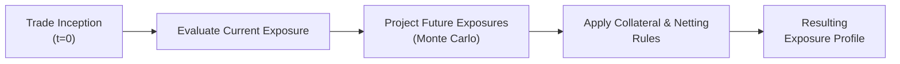

### Introduction

Measuring credit exposure over time is an absolutely pivotal step in computing the Credit Valuation Adjustment (CVA). In essence, if you have ever used a derivative contract such as a swap, forward, or option, you know how both your profit/loss and overall exposure can swing back and forth as market conditions evolve. That means credit risk—the possibility that a counterparty cannot make good on its obligations—doesn’t stay fixed. It can grow or shrink depending on the underlying asset’s price volatility, interest rates, or even the credit standing of your counterparty itself.

I remember the first time I calculated my potential future exposure (PFE) for a foreign exchange forward. I was a bit intimidated at first, since the exposure profile literally changed every day based on currency fluctuations. But once you get the hang of it, measuring exposures at different points in time becomes a natural extension of your market risk analysis, with a credit-twist.

Anyway, here we’ll discuss core concepts like current exposure, potential future exposure, expected exposure, and the techniques—particularly Monte Carlo simulation—that help you quantify these in real-world contexts. We’ll also see how collateral and netting provisions change risk profiles dramatically.

### Why Measuring Credit Exposure Over Time Matters

It’s not enough to pick a single “snapshot” of exposure at inception or at some arbitrary point. In many derivatives—like interest rate swaps or long-dated currency forwards—the mark-to-market value might be negative today (meaning your counterparty owes you nothing if they default). But a few months later, the position might swing in your favor, exposing you to significant credit risk if the counterparty can’t pay. The flip side is also true, where you might owe them money. Hence, we need a dynamic way of modeling exposure to reflect real-time changes.

From a CVA perspective (and for regulatory capital requirements in many jurisdictions), regulators and risk managers want to see the full distribution of exposures over time. They look at metrics such as:

• Current Exposure  
• Peak Exposure / Potential Future Exposure at certain confidence levels  
• Expected Exposure (EE) and Expected Positive Exposure (EPE)—averages over time  
• Collateral agreements and netting sets to see how they reduce actual risk  

By aggregating these measures, you can refine your credit risk management, allocate capital more effectively, and figure out the correct fair value adjustment for credit risk in your derivative portfolios.

### Key Measures of Exposure

#### Current Exposure

Current exposure represents the mark-to-market value at this very moment—basically, the gain you would lose if the counterparty defaulted right now. If it’s an interest rate swap with a market value of +USD 2 million to you, that is your current exposure. Conversely, if the market value is negative for you, your direct credit exposure is zero (the other side might owe you money, but if you default, they have the exposure on you).

While it sounds straightforward, real life can be more complicated. If you have multiple transactions with the same counterparty, netting agreements can reduce the total current exposure to a net figure. You might have a pay-fixed swap in the money and a receive-fixed swap out of the money with that same entity, so only the net sum of both positions forms the relevant “current” exposure. Netting can reduce your credit risk in many derivatives-based portfolios.

#### Peak Exposure and Potential Future Exposure (PFE)

Sometimes, it’s not the average or immediate mark-to-market you’re worried about; it’s the biggest likely blow-up. Peak exposure is the maximum exposure you might face within a given confidence level. Potential Future Exposure (PFE) is closely related. If you say, “I want to be 95% confident that my exposure will not exceed X million dollars at any time over the next two years,” that X is your potential future exposure at the 95th percentile. Some risk managers use the 99th percentile to be more conservative, though that obviously becomes more capital-intensive.

We typically measure PFE using simulation-based methods. For instance, if you have a cross-currency swap that runs five years, you’ll simulate interest rates, exchange rates, and possibly even credit spreads to see how the swap’s market value changes over that horizon. Then you pick the distribution of exposures at each point in time, collect the relevant percentile, and track that from near-term to far-term. The top portion of that distribution is your peak or potential future exposure.

#### Expected Exposure (EE) and Expected Positive Exposure (EPE)

Expected exposure is the average or mean of all simulated exposures at a particular time slice in the future. You might see something like:  
• EE(6 months) = $1.5 million  
• EE(12 months) = $2.0 million  
• EE(24 months) = $2.6 million  

And so on. It’s an expected value, so naturally, it smooths out the highs and lows. For CVA calculations, you might use the Expected Positive Exposure (EPE), which is the time-weighted average of expected exposures across all future time points—or sometimes it’s just the average of the positive exposures, ignoring negative ones (depending on the particular formulation).

You’ll see these terms appear in regulatory frameworks (like Basel) and in standard industry practice to figure out capital charges or to feed model inputs for credit-adjusted pricing. And, to be honest, you can get some surprising results—like an interest rate swap that’s close to at-the-money at inception but shows fairly large EPE 5 years out if interest rates have a good chance to move in your favor.

### Collateral Arrangements and Netting

Collateral is your best friend in managing credit exposure. Under a Credit Support Annex (CSA), if your derivative position goes in your favor, you get collateral from your counterparty, typically in cash or liquid securities. This can drastically reduce your net exposure, particularly if collateral is posted every day (or on some frequent schedule). You just have to keep in mind the operational details:

• Thresholds: Sometimes, each party sets a threshold of exposure below which no collateral is posted.  
• Minimum Transfer Amount: Collateral only changes hands if the amount exceeds a certain threshold (e.g., $100k).  
• Rounding: Collateral might be posted in round sums, meaning $1.2 million in exposure might be matched by $1.15 million collateral.  
• Frequency: Daily or weekly margining cycles can cause short windows where uncollateralized exposure spikes.  

In practice, the presence of collateral will flatten those distributions of future exposure. Instead of seeing $5 million potential future exposure on an interest rate swap, you might see $0.5 million thanks to daily margin posting. Always note the “margin period of risk”: the length of time between the last collateral posting and any default, plus the time it takes to liquidate collateral. That drives the extent of actual uncollateralized exposure.

#### Close-Out Netting

If you have multiple derivatives with a single counterparty, a strong netting agreement ensures that only net amounts are owed upon default. This can cut down your risk significantly. Say you have five swaps, each with a notional of $10 million, and the net mark-to-market across them is a mere $200k in your favor because half are out-of-the-money for you, and half are in-the-money. With a netting set, if your counterparty defaults while the net is $200k, that’s your exposure (ignoring collateral for the moment). Without netting, you could theoretically be owed $5 million on two contracts but owe $4.8 million on the other three, and the other side might only pay you the $5 million owed on those in-moneys if they felt like it (or if the default laws allowed partial offset). Netting arrangements clarify that everything is aggregated into one big net payment or receipt.

### Simulation Techniques and Modeling Approaches

A robust way to measure exposure over time is by simulating the underlying risk factors:

1. Identify Key Risk Factors  
   For an interest rate swap, that’s typically the relevant yield curve. For a cross-currency swap, add in exchange rates. For equity and commodity derivatives, you’d simulate stock prices or commodity prices.  

2. Generate Scenarios  
   Use a Monte Carlo approach with, say, 10,000 paths. Each path simulates the daily or monthly evolution of prices/rates based on statistical assumptions (mean, volatility, correlations, etc.).  

3. Revalue the Derivative  
   At each time step, for each scenario, you compute the mark-to-market of the derivative. This might involve discounting expected cash flows, factoring in the floating rate resets, or applying an option pricing model if it’s an option-based contract.  

4. Calculate Exposure  
   Exposure = max(derivative value, 0) if you’re measuring your credit exposure (they owe you). In a portfolio setting, incorporate netting across positions.  

5. Collateral Rules  
   Subtract or limit exposure by factoring in the collateral that would have been posted in each scenario.  

6. Exposure Profile  
   From these scenario-generated exposures, you can compute statistics like the mean (Expected Exposure), the chosen percentile (Potential Future Exposure), or time-sliced distributions.  

Here’s a simple flowchart that outlines the process conceptually:



It may look like a lot at first. But once you set up your simulation framework—be it in Python, R, or specialized risk software—you just feed in the deals, run thousands of hypothetical paths, and out come your exposure profiles.

#### Simple Monte Carlo Example (Python)

Below is a very simple (and, mind you, highly simplified) Python snippet that simulates exposures for a single interest rate swap. The real models can get way more complex, especially in how you generate correlated rates or handle rate curve dynamics (e.g., Hull-White or LIBOR Market Model). This snippet just conveys the flavor:

```python
import numpy as np

num_sims = 10000
time_steps = 12  # 12 months
discount_rate = 0.02
np.random.seed(42)  # For reproducibility

exposures = np.zeros((num_sims, time_steps))

for i in range(num_sims):
    swap_value = 0.0
    for t in range(time_steps):
        # Random interest rate shock
        rate_change = np.random.normal(0, 0.0005)
        # We'll just assume the swap's value changes linearly with rate
        swap_value += 10_000_000 * rate_change
        # If the swap_value is positive, it's an exposure for us
        exposures[i, t] = max(swap_value, 0)

expected_exposure = exposures.mean(axis=0)
print("Monthly Expected Exposures:", expected_exposure)
```

In real life, you’d discount at the current or forward curve, simulate multiple correlated factors, handle day count conventions, and so on. But the idea is the same.

### Real-World Examples and Case Considerations

Let’s run through a scenario. Suppose you’re managing a portfolio for a large bank, loaded with interest rate swaps as well as foreign exchange forwards. Suddenly, market volatility spikes—maybe due to a central bank interest rate announcement or a geopolitical event. As volatility ramps up, the potential movements in the underlying rates or FX get bigger. This means your distribution of outcomes fans out, pushing up your PFE (and maybe your expected exposure too). The timing of your margin calls under a CSA arrangement also becomes more critical; if your agreement says collateral is posted every Friday, then a shocking event that happens on a Monday could leave you uncollateralized for several days.

Stakeholders—risk committees, senior management, and regulators—will want quick updates on how your exposure profile has changed. That’s when your existing simulation frameworks and daily margining processes become front and center. You’ll run a new set of increments in your Monte Carlo, revalue your derivatives, see what the new potential future exposure is, and busily pass that on to management. And if you see your exposure skyrocket, you might call your counterparty for additional collateral or re-hedge the underlying positions to reduce your overall potential loss in case of default.

### Best Practices and Common Pitfalls

• Always Validate Your Models: Monte Carlo exposure simulation is only as good as the model assumptions. If you don’t capture correlation or volatility properly, your PFE estimates might be off.  
• Incorporate Realistic Collateral Conditions: Some teams assume daily margining with zero threshold, but the actual CSA could have a large threshold and a weekly margin frequency. That changes things drastically.  
• Watch Out for Wrong-Way Risk: If your counterparty’s credit quality deteriorates when your exposure is highest, that is called wrong-way risk. Models ignoring that correlation can dangerously underestimate exposure.  
• Don’t Overlook Legal Documentation: Netting sets must be legally enforceable. If local jurisdictions don’t fully recognize your netting agreement, your net exposure might not be net at all.  
• Regular Updates: Market conditions rarely stay constant. Evaluate your exposure models and parameters frequently to reflect changes in volatility, credit spreads, or economic outlook.

### Exam Tips for CFA Level II

Under exam conditions, especially in a vignette-style question, you might be handed a scenario where you have to:

• Identify what the current exposure is (e.g., mark-to-market value).  
• Distinguish between potential future exposure and expected exposure.  
• Recognize what netting means in a multi-derivative scenario.  
• Factor in collateral thresholds and margin posting frequency.  
• Possibly compute simplified versions of a PFE or EE with some easy math or identify the correct formula from multiple choices.  

Time management is key: often, a vignette will compress a big scenario into a short set of data. Carefully read the details about the netting set, the collateral agreement, whether it’s daily or weekly margining, and the relevant interest rate or currency assumptions. Usually, there’s a trick: maybe the question states a significant threshold for collateral, or that netting excludes certain trades. Keep your eyes peeled.

### References and Further Reading

• Hull, John. “Options, Futures, and Other Derivatives.” This is the classic source on derivatives pricing, risk measurement, and the mathematics behind it.  
• Brigo, Damiano, and Massimo Morini. “Counterparty Credit Risk, Collateral, and Funding: With Pricing Cases for All Asset Classes.” Excellent coverage of advanced CVA topics, calibrating models, and real-life complexities in implementing these frameworks.  
• Various industry journals (e.g., Journal of Derivatives) feature articles on dynamic collateral management.  
• CFA Institute Curriculum for Level II, especially sections on derivatives pricing and credit risk.  

Stay curious: The more you dig into scenario analysis, the more you can tailor derivative strategies to mitigate credit risk effectively.

## Test Your Knowledge: Measuring Credit Exposure Over Time



### Which of the following best describes current exposure in a derivative contract?

- [ ] The maximum projected exposure at a future date.
- [ ] The time-weighted average of future exposures.
- [x] The present mark-to-market value that could be lost if the counterparty defaults immediately.
- [ ] The total notional amount of the derivative.

> **Explanation:** Current exposure is the amount you would lose if the counterparty defaulted right now, represented by the current mark-to-market value in your favor.

### In the context of potential future exposure (PFE), at which point in time is exposure typically measured?

- [ ] Only at the final maturity date.
- [x] At multiple time points throughout the derivative’s life.
- [ ] Exclusively at the inception date of the contract.
- [ ] At two intervals: inception and maturity.

> **Explanation:** Potential future exposure is assessed over the entire lifespan of the derivative, often by generating a distribution of exposures at different future dates.

### Why does collateral posting frequency matter when measuring credit exposure?

- [ ] More frequent postings increase net exposures over time.
- [ ] Less frequent postings decrease net exposures significantly.
- [x] Gaps between postings can cause spikes in uncollateralized exposure.
- [ ] Posting frequency is unrelated to uncollateralized exposure.

> **Explanation:** If collateral is posted infrequently, there can be a window in which exposure can build up before collateral arrives, increasing credit risk.

### What role does netting play in measuring derivative exposures?

- [ ] It guarantees zero exposure for any portfolio of trades.
- [x] It allows offsetting gains and losses across multiple trades under a single agreement.
- [ ] It applies only to trades of the same notional amount.
- [ ] It cannot be enforced under any legal system.

> **Explanation:** Under proper netting agreements, gains on some trades can offset losses on others, reducing the net credit exposure to a single counterparty.

### Which of the following statements about Expected Exposure (EE) is most accurate?

- [x] EE is the arithmetic mean of all simulated exposures at a given time point.
- [x] EE can be computed via Monte Carlo simulations of future derivative values.
- [ ] EE represents an extreme worst-case measure of exposure.
- [ ] EE is always equal to zero when a derivative is out of the money.

> **Explanation:** Expected Exposure is typically computed as the average of the positive potential exposures across many simulated paths at each point in time. It is not a worst-case measure.

### When might a high correlation between counterparty credit quality and underlying asset returns cause you to underestimate exposure?

- [ ] When the derivative contract is at the money.
- [ ] When the correlation is exactly zero.
- [ ] In a normal, stable market environment.
- [x] When there is wrong-way risk, and the asset value moves in favor of the investor just as the counterparty’s credit deteriorates.

> **Explanation:** Wrong-way risk describes a negative dependency where your exposure increases at the same time the counterparty becomes less creditworthy, which can significantly increase actual exposure compared to simpler models.

### Which measure is often used to show the highest exposure level with a given confidence level during the life of a derivative?

- [ ] Current Exposure
- [ ] Expected Positive Exposure
- [x] Potential Future Exposure (PFE)
- [ ] Time-Weighted Exposure

> **Explanation:** Potential Future Exposure is typically the statistic that shows the upper limit of exposure at a specified confidence level over the product’s lifetime.

### Under a Credit Support Annex (CSA), which factor can impact the effectiveness of collateral to reduce exposure?

- [ ] The derivative type (e.g., swap vs. forward) alone.
- [ ] The notional amount, irrespective of changes in mark-to-market.
- [ ] The capital requirements set by regulators.
- [x] The threshold and minimum transfer amount in the CSA, plus the margining frequency.

> **Explanation:** Collateral effectiveness depends on contractual details like thresholds and posting frequency. Larger thresholds or less frequent postings allow higher uncollateralized exposures to build.

### How can close-out netting reduce credit exposure?

- [x] By offsetting amounts owed across multiple derivative positions, resulting in a single net claim.
- [ ] By disallowing partial offset of positions, thus clarifying total obligations.
- [ ] By requiring the posting of cash collateral daily.
- [ ] By preventing the bankruptcy of either counterparty in default.

> **Explanation:** Close-out netting ensures that upon default, only the net amount owed is due, reducing overall exposure across multiple trades.

### True or False: In a simulation framework, the exposure to a derivative is always the greater of zero and the derivative’s market value in each scenario.

- [x] True
- [ ] False

> **Explanation:** When measuring your credit exposure, you only monitor scenarios where the swap (or derivative) mark-to-market is in your favor (positive). If it’s negative, the exposure to the counterparty you face is zero.


