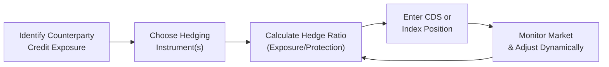

## Introduction
CVA (Credit Valuation Adjustment) can sometimes feel like one of those mysterious, behind-the-scenes calculations—like the wizard pulling levers in the background. Really, though, CVA is about adjusting the value of a derivative (like a fancy interest rate swap or currency swap) to account for the risk that your counterparty might default. The big question, once you’ve figured out how much that risk is worth, is how you hedge it. After all, no one wants to be caught off-guard if a counterparty’s credit condition deteriorates, right?

In Chapter 21 so far, we explored what CVA is (Section 21.1) and how to measure credit exposure over time (Section 21.2). Here, we’ll turn our attention to the “how-to” of CVA hedging—practical approaches that professionals on real trading floors (and exam takers in real testing centers) can employ to offset counterparty credit risk.

## Key Hedging Tools
When it comes to hedging CVA, you’ve got a few tools in the kit that are widely used in the marketplace:

• Single-Name CDS  
• Index CDS  
• Portfolio-Based Hedges  

These three categories let you purchase credit protection—much like buying an insurance policy—on either a single counterparty or a broad range of companies.  

### Single-Name CDS
A Single-Name Credit Default Swap (CDS) is one of the most direct ways to hedge CVA for a specific counterparty. If you’re worried about, say, Counterparty XYZ going south, you buy a CDS on XYZ. Then, if XYZ defaults, your CDS pays out, offsetting losses you’d face from the default scenario in your derivatives portfolio (assuming the notional coverage aligns properly with your expected exposure).

But there’s a snag: sometimes that single-name CDS might not trade often, or it might be super expensive or hard to get. Illiquidity can create higher bid-ask spreads, meaning you pay a premium over the “fair” level. You also face basis risk if the CDS spread doesn’t perfectly match the default risk of your specific derivative position.

### Index CDS
Index CDS is basically a standardized basket of CDS for multiple reference entities. The most common global examples include iTraxx in Europe or CDX in North America. These instruments typically have better liquidity (especially in normal market conditions) and narrower bid-ask spreads relative to single-name CDS.

If your derivative exposure is spread across multiple counterparties, or if there isn’t a deep market for a particular single-name CDS, using an index can offer an approximate hedge. You might hedge a portion of the credit risk by shorting an index (purchasing protection) that somewhat correlates with your counterparty’s industry or general market risk. That said, you’ll pick up basis risk between the index and your specific counterparty.

### Portfolio-Based Hedges
Sometimes neither a single-name CDS nor an index alone captures the entire credit risk landscape of your derivative exposures. In that case, a tailor-made portfolio hedge might be arranged. You build a basket of CDS exposures, perhaps adding or subtracting certain single names or sub-index layers to mirror your counterparty exposures more closely.

These portfolio-based hedges can get complicated fast. Traders often use them for a multi-counterparty swap book, layering on different CDS positions to create a mosaic that approximates the overall counterparty risks.  

## Hedging Considerations
Think of hedging CVA like balancing on a tightrope. You have to be careful about how much hedge you put in place, what instruments you use, and how your exposures evolve. Let’s walk through some primary considerations:

### Basis Risk
Basis risk is arguably the largest headache in CVA hedging. It’s the mismatch between the reference entity (or market index) you’re hedging with and the actual credit risk of your counterparty. This mismatch can arise because:

• The CDS you’re purchasing references a different legal entity than the one actually bearing credit risk in your derivative.  
• The counterparty might have very specific default triggers, collateral protocols, or other contractual details that differ from the reference entity’s coverage in the CDS.  
• Market sentiment can shift abruptly, causing spreads on your hedge instrument to diverge from the actual risk of your counterparty.

### Liquidity Issues
Imagine you’re trying to buy a single-name CDS on some specialized corporate entity that isn’t widely traded. You might see wide bid-ask spreads (ouch), or maybe there’s no available market at all. In those cases, you either rely on an index-based approach or look for a portfolio-based solution. Liquidity not only hits your transaction costs but also affects how quickly you can adjust your hedge (more on that in “Dynamic Hedging” below).

### Correlation Risk
Correlation risk pops up when the counterparty’s default probability is linked to other market factors that affect your exposure. If you have an interest rate swap, and the notional at risk grows precisely when your counterparty’s credit quality tanks, you have what’s often called “wrong-way risk.” Hedging that is trickier because when one factor moves, so does the other, typically in a way that increases your credit exposure.

### Cost-Benefit Analysis
No hedge is free. Actually, some hedges are quite expensive, especially if the reference entity’s credit spread is already wide. Before you jump into a CDS position, you’ve got to weigh the cost of paying premiums versus the anticipated benefits. The cost-benefit equation involves:

• Probability of default and potential loss.  
• Liquidity and basis risk, which might erode the effectiveness of your hedge.  
• Regulatory capital relief: In some jurisdictions, properly hedged exposures might reduce regulatory capital requirements, partially offsetting hedge costs.  

## Dynamic Hedging and Wrong-Way Risk
We can’t talk about CVA hedging without touching on dynamic hedging and the dreaded wrong-way risk. Let’s unravel these concepts:

### Dynamic Hedging
When you dynamically hedge CVA, you’re adjusting your hedge ratio over time. Since the credit spreads, the notional exposure of your derivatives portfolio, and other risk factors fluctuate, a static hedge struck at the outset might become obsolete fairly quickly. In dynamic hedging, risk managers periodically (for instance, monthly or quarterly, if not more frequently) recalculate CVA, update the implied default probabilities, and tweak the hedge positions accordingly.

If you’re into math, imagine your CVA exposure at time t is:

\text{CVA}(t) = \int_0^T \mathrm{EE}(u) \cdot \mathrm{PD}(u) \cdot \mathrm{LGD} \, du,

where:
• \\(\mathrm{EE}(u)\\) is the expected exposure at future time \\(u\\).  
• \\(\mathrm{PD}(u)\\) is the probability of default for the counterparty at time \\(u\\).  
• \\(\mathrm{LGD}\\) is the loss given default.

But in practice, you recast or re-hedge at intervals, because \\(\mathrm{EE}(u)\\) and \\(\mathrm{PD}(u)\\) keep changing. You might see your derivative’s fair value shift or your counterparty’s spread blow out, and you’d need to reflect that in your hedge.  

### Wrong-Way Risk
Wrong-way risk is basically your worst nightmare: it’s when your exposure to a counterparty gets bigger right as that counterparty’s credit quality deteriorates. One classic example is if you have a swap with a bank that’s heavily involved in the same market that drives your derivative’s payoff. If the markets move against the bank, the swap exposure grows in your favor, but ironically, that’s the moment the bank might be most likely to default. Yikes.

Hedging wrong-way risk often requires more sophisticated, integrated modeling. You need to explicitly incorporate correlation between the exposure and the probability of default. This might mean adjusting your dynamic hedge more frequently or combining a single-name CDS with some other hedges if your counterparty is vulnerable to specific economic shocks.

## Practical Cases and Examples
Let’s talk about some scenarios you might encounter in real life:

### Large Unhedged Swap Portfolio with a Weakening Counterparty
Imagine you’re an investment bank with a big portfolio of interest rate swaps with a medium-rated corporate. Initially, you felt comfortable with the credit profile: the corporate had stable income, low leverage, and a decent track record. But new competition, cost overruns, and maybe an unwise acquisition start to rattle the corporate’s fundamentals. You see the corporate’s credit spread creeping upward.

So now your credit risk managers are sweating a bit. They decide to hedge the CVA on the entire swap portfolio. Access to single-name CDS on this corporate might be patchy, so the bank:

1. Buys a single-name CDS for partial coverage, albeit in limited size (to reflect the illiquid market).  
2. Taps the index market for the remainder, using a correlated investment-grade index that roughly reflects the corporate’s sector.  
3. Adjusts the hedge ratio over time, paying attention to cost (dealers might quote a wide spread on the single-name CDS given the corporate’s shaky outlook).

### Multi-Counterparty Portfolio and Basket Hedges
Another scenario is if you have exposure to multiple investment-grade counterparties. Rather than trying to buy a single-name CDS on each one, you might just buy an index CDS that lumps together a variety of similar-rated entities. Sure, it’s less precise, but it can be more liquid and cheaper. You accept the basis risk that the index might not move one-for-one with your actual group of counterparties.

A more refined approach is the creation of a custom basket or portfolio hedge. For example, you might:

• Identify your top 10 counterparties by net notional exposure.  
• Classify each counterparty’s sector and region, then find the best combination of CDS instruments—some single-name, some index—to approximate your overall credit exposure as closely as feasible.  
• Dynamically update as the relative proportions of exposures change or if certain credit spreads widen more than others.

## Diagram: CVA Hedging Flows
Below is a simplified Mermaid diagram illustrating how CVA hedging might flow in practice:



• A → B: You discover your expected credit exposure to the counterparty.  
• B → C: Based on liquidity, basis risk, and correlation, you pick either a single-name CDS or an index approach.  
• C → D: You finalize the size of the hedge, deciding how much notional coverage you need.  
• D → E → C: You continuously monitor how your exposure evolves, rebalancing your hedge if market or credit conditions move.

## Python Snippet: Simple Illustration of CDS Hedge Rebalancing
If you’re a bit of a geek (like many of us in finance), you might want to do a quick-and-dirty simulation of how a hedge could be rebalanced over a few time steps. Here’s a toy Python code snippet:

```python
import numpy as np

np.random.seed(42)
exposures = [100]  # Start with an exposure of 100 million
spreads = [0.015]  # Start with a CDS spread of 150 bps

hedge_sizes = []

for t in range(1, 6):  # let's do 5 rebalancing steps
    # Random shock to exposure
    exp_change = np.random.uniform(-10, 10)
    new_exposure = max(0, exposures[-1] + exp_change)
    exposures.append(new_exposure)
    
    # Random shock to current spread
    spread_change = np.random.uniform(-0.003, 0.003)
    new_spread = max(0.0001, spreads[-1] + spread_change)
    spreads.append(new_spread)
    
    # Hedge ratio: Desire to hedge some fraction of the exposure
    # Suppose we hedge 80% of exposure
    hedge_size = 0.8 * new_exposure
    hedge_sizes.append(hedge_size)

for i in range(len(hedge_sizes)):
    print(f"Time {i+1}: Exposure={exposures[i+1]:.2f}, Spread={spreads[i+1]:.4f}, Hedge={hedge_sizes[i]:.2f}")
```

In a real-life scenario, you’d incorporate more robust models for exposure forecasting and spread dynamics. This snippet is just to illustrate how you might track evolving exposures and re-hedge step by step.

## Conclusion and Exam Tips
CVA hedging—while it might seem like a specialized domain—is basically your main line of defense against unexpected credit risk in derivative portfolios. Whether you choose single-name CDS, index CDS, or some portfolio-based combination, keep these best practices in mind:

• Always weigh the cost of protection against the potential credit losses—and factor in liquidity constraints.  
• Recognize that basis risk can lead to over- or under-hedging.  
• Remember that correlation can magnify your exposure, especially with “wrong-way risk.”  
• Don’t forget dynamic rebalancing—market conditions evolve quickly, so static hedges can lose their effectiveness.  

In the CFA exam context, item-set questions often involve a scenario with a derivative portfolio and a potentially deteriorating counterparty. You’ll see data on spreads, costs, and maybe the firm’s rating outlook. They’ll likely ask: “Which hedging strategy is most appropriate, given the basis risk, liquidity, or cost constraints?” Practice reading those question stems carefully, watch out for the details (like whether the counterparty is included in a particular index or not), and ensure you can match the hedge approach to the scenario’s specifics.

## Additional References
• O’Kane, Dominic. “Modelling Single-Name and Multi-Name Credit Derivatives.” Wiley.  
• BIS Working Papers on credit risk mitigation and evolving CDS market structures (https://www.bis.org/).  
• Gregory, Jon. “The xVA Challenge: Counterparty Credit Risk, Funding, Collateral, and Capital.” Wiley.  
• Refer also to Chapter 23 (Credit Default Swaps) in this Volume for deeper insights on single-name vs. index CDS mechanics.  

And, yes, I realize that was a lot of ground to cover. But hopefully it gives you enough of a sense to feel comfortable tackling those dreaded CVA hedging exam questions—and maybe helps you avoid a sleepless night or two when you’re actually doing this in real markets.

---

## Test Your Knowledge of CVA Hedging Approaches



### Which of the following is an advantage of using an index CDS for CVA hedging rather than a single-name CDS?

- [x] Greater liquidity and narrower bid-ask spreads
- [ ] Tighter basis risk
- [ ] No sensitivity to correlation risk
- [ ] Elimination of all transaction costs

> **Explanation:** Index CDS instruments generally trade more frequently, have larger volumes, and narrower spreads compared with most single-name CDS. However, index CDS introduces basis risk because it's not a perfect match for any single counterparty.

### In a CVA hedge, what does "basis risk" specifically refer to?

- [ ] The risk that interest rates move in an unanticipated direction, affecting exposure
- [ ] The risk that margin requirements will force the hedge to close early
- [x] The mismatch between the hedging instrument’s credit spread and the actual credit risk of the counterparty
- [ ] The risk of hedging with short-dated instruments for longer-term exposures

> **Explanation:** Basis risk is the mismatch between what you’re hedging (a particular counterparty’s credit risk) and what your hedge instrument references (e.g., a different entity or a broad market index).

### Which statement best characterizes wrong-way risk in a CVA context?

- [ ] The phenomenon that credit spreads narrow when exposure rises
- [x] A situation where exposure to a counterparty increases at the same time the counterparty’s default probability also increases
- [ ] A situation where an index CDS references fewer entities than a single-name CDS
- [ ] A mismatch between notional amounts and collateral posted

> **Explanation:** Wrong-way risk is when the exposure and the probability of default move in tandem, exacerbating potential losses.

### When is dynamic hedging most beneficial in the context of CVA?

- [x] When credit spreads and the notional of the derivative exposure are expected to change frequently
- [ ] When the counterparty is a government entity with negligible default risk
- [ ] When the CDS market is illiquid, and trading costs are prohibitive
- [ ] When no correlation exists between exposure and default probability

> **Explanation:** Dynamic hedging is most helpful when the underlying credit metrics and the derivative’s exposure vary significantly over time—regular adjustments keep the hedge relevant.

### What is the primary challenge faced when using an index CDS to hedge a specific single-counterparty CVA exposure?

- [ ] The reduced liquidity compared to single-name CDS
- [x] The difference between the index constituents’ credit risk and the actual counterparty’s credit risk
- [ ] The longer maturity usually required by index CDS
- [ ] The absence of correlation effects

> **Explanation:** An index CDS references a basket of names, so it doesn’t perfectly match the default risk of a single firm, creating basis risk.

### Which of these would NOT typically be a primary concern for an entity looking to hedge CVA using single-name CDS?

- [ ] Potentially high transaction costs
- [x] The risk that interest rates might fall, making borrowed capital cheaper
- [ ] Illiquidity in the single-name CDS market
- [ ] Basis risk between the CDS reference entity and the actual counterparty

> **Explanation:** While interest rate changes could affect general market conditions, it’s not the primary concern for credit-specific hedges, which focus on default risk and spreads.

### Which of the following practices can help mitigate wrong-way risk?

- [x] Incorporating correlation modeling and adjusting hedges dynamically
- [ ] Only relying on short maturity instruments
- [x] Using additional hedges if the counterparty’s default probability rises with the same factors that increase exposure
- [ ] Avoiding any CDS hedging

> **Explanation:** To mitigate wrong-way risk, you’d want to explicitly model correlation and be prepared to enhance or adjust hedges if exposure and credit risk move in the same direction.

### What is the main reason to consider cost-benefit analysis before implementing a CVA hedge?

- [x] To compare the cost of CDS protection with the potential benefit of avoiding future credit losses
- [ ] To ensure the hedge increases net credit risk
- [ ] To maximize the residual unhedged exposure
- [ ] To set the same hedge ratio across all instruments, regardless of risk

> **Explanation:** You want to ensure that you don’t overspend on CDS premiums relative to the expected payoff if a default occurs.

### If an investment bank uses a portfolio-based approach to hedge CVA across multiple counterparties, it might:

- [ ] Only hedge the largest single exposure 
- [ ] Use only a single-name CDS for each counterparty
- [x] Create a basket of CDS instruments that approximates the overall portfolio’s risk
- [ ] Take no hedging action to avoid basis risk

> **Explanation:** A portfolio-based hedge tries to synthesize the exposure of multiple counterparties into a single (or series of) hedging instrument(s) that best covers the grouped risk profile.

### A true statement regarding dynamic CVA hedging is:

- [x] It involves periodic rebalancing of hedge positions as credit spreads and exposures change.
- [ ] It is a static hedge established for the life of the derivative.
- [ ] It eliminates all basis risk by design.
- [ ] It is only applicable for interest rate swaps, not currency swaps.

> **Explanation:** Dynamic hedging is about recalculating and rebalancing your hedge frequently to stay aligned with evolving market conditions and exposure profiles.


