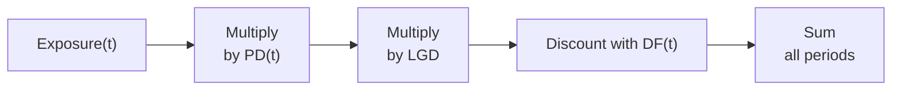

## Scenario and Overview

Imagine you work in the credit risk department of a major financial institution—let’s call it Riverdale Bank. You've just been handed an interest rate swap transaction that the bank executed with Acme Corporation. The bank's executives are a bit concerned about Acme’s creditworthiness. They want you to calculate the potential credit loss if Acme were to default on its obligations. In other words, they want a CVA (Credit Valuation Adjustment).

Now, in a typical CFA® Level II exam setting, you’d get a brief "vignette" describing all the relevant details: notional amount, time horizon, projected net exposures, default probabilities (PDs), discount factors (DFs), and so on. Then you'd be asked to piece everything together to find the CVA. This is exactly what we'll do here.

## Why CVA Matters

CVA represents the market value of counterparty credit risk. It adjusts the price of a derivative to reflect the possibility that the counterparty could default. If you ignore CVA, you might overvalue your derivative position since you’re not factoring in that you might never actually receive some portion of those future payments.

CVA is usually defined by the following formula:


\text{CVA} = \sum_{\text{time } t} \left( E[\text{Exposure at }t] \times PD(t) \times LGD \times DF(t) \right)


where:  
• E[Exposure at t] is the expected exposure if the counterparty defaults at time t.  
• PD(t) is the probability of default over the period covering t.  
• LGD is the loss given default rate (1 – recovery rate), typically expressed as a fraction (e.g., 60%).  
• DF(t) is the discount factor to convert future costs into present value.

When we calculate the final CVA, we’re effectively saying, “Hey, it’s possible this counterparty might not be around to pay us what's owed at future dates, so let's apply a fair discount to the derivative’s value.”

## Setup for the Sample Vignette

We have the following key contract details:

• A 3-year plain vanilla interest rate swap between Riverdale Bank (the party receiving fixed) and Acme Corporation (paying fixed).  
• Notional: USD 50 million.  
• Payment frequency: semiannual (every six months), so we have 6 periods over three years.  
• The projected exposures at each semiannual period.  
• The discount factors for each period.  
• The probability of default (PD) and Loss Given Default (LGD).

Let’s outline the data in a table. Suppose the scenario gives us the following (for example purposes):

| Semiannual Period (t) | Time (years) | Projected Exposure [E(t)]  | PD(t) per period | LGD  | DF(t)   |
|-----------------------|--------------|----------------------------|------------------|------|---------|
| 1                     | 0.5          | $1,200,000                | 0.8%            | 60%  | 0.995   |
| 2                     | 1.0          | $1,450,000                | 1.0%            | 60%  | 0.990   |
| 3                     | 1.5          | $1,700,000                | 1.3%            | 60%  | 0.983   |
| 4                     | 2.0          | $1,950,000                | 1.6%            | 60%  | 0.975   |
| 5                     | 2.5          | $2,050,000                | 2.0%            | 60%  | 0.967   |
| 6                     | 3.0          | $2,200,000                | 2.5%            | 60%  | 0.959   |

Note: The probability of default (PD) here is assumed per period. For a more accurate multi-period model, you might see cumulative default probabilities. But let’s keep it simpler—this is typical in exam-style item sets.

## Step-by-Step CVA Calculation

### 1. Identify Exposure at Each Point
We gather or project the swap’s exposure at each period. This can be done using a valuation model. In many exam questions, they’ll provide you with these expected exposures directly. Here, we have that in the “Projected Exposure” column.

### 2. Get the Probability of Default (PD)
We identify the probability of default for each corresponding period. In real-world scenarios, this might come from a credit curve or rating-based hazard rates. For exam purposes, they usually provide the PD(t)s.

### 3. Note the LGD
Loss Given Default is typically (1 – recovery rate). If the bond or derivative recovers, say, 40% of its value in the event of default, the LGD is 60%. This can be constant or vary over time.

### 4. Apply the Discount Factor (DF)
We discount each term to the present because the potential default at t is a future event.

### 5. Perform the Summation
Multiply them all together for each time period t, then sum across all periods:


\text{CVA} = \sum_{t=1}^6 \left[ E(t) \times PD(t) \times LGD \times DF(t) \right].


Let’s see how it works out with our example numbers:

Period 1 contribution:  
0.8% of $1,200,000 is $9,600. LGD is 60%, so $9,600 * 60% = $5,760. Then discounted at 0.995:  
$5,760 * 0.995 = $5,731.20.

Period 2 contribution:  
1.0% of $1,450,000 is $14,500. LGD is 60%, so $8,700. Discount factor 0.990:  
$8,700 * 0.990 = $8,613.

Period 3 contribution:  
1.3% of $1,700,000 is $22,100. With 60% LGD, that’s $13,260. Discount factor 0.983:  
$13,260 * 0.983 = $13,037.58.

…and so on, for each period. Summing all results gives the total CVA. Let’s pretend (for demonstration) the final sum is around $65,000. That would mean you’d reduce the derivative’s fair value by about $65,000 to account for default risk.

### A Quick Mermaid Diagram on the Flow

Below is a simple diagram to visualize how exposures, PD, LGD, and discounting combine:

Each box represents a step in the multiplication chain. The final step adds up the contributions across each semiannual period.

## Interpreting the Results

A CVA of, say, $65,000 means that in today’s money, that’s how much you expect to lose on average due to potential counterparty defaults over the swap’s life. In practice, managers might use this figure to:

• Adjust derivative pricing.  
• Allocate capital for counterparty risk.  
• Negotiate credit support annexes (CSAs) that might require collateral posting if the swap’s value becomes too large.

**Exam Tip**: Don’t forget to interpret your final answer. The exam question might ask: “What does this CVA imply for the pricing and risk management of the swap?” or “How would a sudden increase in PD(t) due to a credit rating downgrade affect your CVA?”

## Netting and Collateralization

### Netting
Often, you’ll hear about “netting sets.” If we have multiple derivatives with Acme Corporation, we can offset winning and losing positions. Netting reduces exposure because the negative and positive market values partially cancel. On the exam, watch for a statement such as “Riverdale Bank has four derivative contracts with Acme. The combined net exposure is laid out in the table.” That means you only apply the PD to the netted exposure amounts rather than summing notional exposures across all swaps.

### Collateralization
Collateral can drastically reduce CVA because it lowers your exposure. If Acme posts collateral whenever the swap’s market value rises above a certain threshold, your risk of losing money if they default goes down. The exam might say something like, “A CSA is in place, so exposures are capped at $X per period.” Then your E[Exposure(t)] is replaced by that capped exposure.

For example, if your uncollateralized exposure might be $2.2 million in Period 6, but the CSA threshold is $1 million, then the maximum exposure is $1 million if Acme defaults. This means the CVA declines accordingly.

## Sensitivity Analysis

You might wonder, “What if Acme’s credit rating is downgraded tomorrow?” Then PD(t) might jump from, say, 2.0% at Period 5 to 3.0%. This will push up your CVA. Sensitivity analysis tells you how your CVA changes if certain assumptions shift:

• PD(t) changes with credit rating or market conditions.  
• LGD moves if the firm’s recovery rate changes.  
• Discount factors vary if interest rates fluctuate.  
• Exposure changes if volatility or underlying rates shift.  

Knowing these sensitivities keeps you ahead of the game. If you see a small rating downgrade might cause a large spike in CVA, you might want to require more collateral or reduce your position.

## Potential Exam Traps

• **Mixing Up Cumulative vs. Marginal PD**: Some item sets give you cumulative probabilities; others give you marginal. Watch out for how PD(t) is defined.  
• **Ignoring Netting**: If the question gives you net exposures, you must use them. Don’t inadvertently fixate on a single contract.  
• **Wrong LGD**: Double-check whether the question states a recovery rate or an LGD. If they say “Recovery Rate is 40%,” the LGD is 60%.  
• **Discounting at the Wrong Rate**: Make sure you apply each period’s discount rate properly.  
• **Partial Collateral**: If the question mentions a threshold or minimum transfer amount, it might reduce (not fully eliminate) your exposure.

## Practical Applications and Tips

• **Real-World CVA Desks**: Many banks have dedicated CVA desks that manage this risk dynamically, often hedging with credit default swaps (CDS).  
• **Regulatory Capital**: Regulators often require banks to hold capital for CVA risk.  
• **Impact on Derivative Pricing**: Traders frequently factor in the CVA cost when quoting a price.  
• **Keep Track of Global Benchmarks**: In certain markets, the discount rates might be based on OIS (Overnight Indexed Swap) curves rather than LIBOR or SOFR. Make sure you know which discount factor is relevant.

## Best Practices

• **Build a Systematic Approach**:
  1. Gather exposures.  
  2. Determine PD(t) and LGD.  
  3. Factor in netting and collateral.  
  4. Discount to present.  
  5. Sum across relevant time buckets.  

• **Double-Check Data**: A single decimal place can transform a 0.13% PD into 13%, so be meticulous.  
• **Stay Calm Under Exam Pressure**: Allocate time to ensure you interpret the question properly and incorporate all relevant details.

## References for Further Exploration

- CFA Institute Level II Curriculum, Fixed Income and Derivatives sections on Credit Risk and CVA.  
- Gregory, Jon. “The xVA Challenge: Counterparty Credit Risk, Funding, Collateral, and Capital.”  
- “Central Counterparties: Mandatory Central Clearing and Initial Margin Requirements for OTC Derivatives,” Jon Gregory.  
- Risk.net: Articles on CVA management and regulatory capital rules.

## Test Your Knowledge: Calculating and Interpreting CVA



### A bank enters into a 2-year swap with semiannual payments. Which factor most directly drives an increase in CVA?

- [ ] Lower loss given default (LGD)
- [x] Higher probability of default (PD)
- [ ] Lower discount factors (DF)
- [ ] Decreasing exposure

> **Explanation:** CVA is most sensitive to the probability of default. If PD rises, the portion of future exposure potentially lost escalates, increasing CVA.

### Which of the following best describes netting in CVA calculations?

- [ ] Applying LGD separately to each derivative
- [x] Combining exposures across multiple derivatives before applying PD
- [ ] Using mid-period discount rates for each separate contract
- [ ] Eliminating the discount factor for short-term contracts

> **Explanation:** Netting involves summing positive and negative exposures across contracts with the same counterparty before applying PD. This can significantly reduce the overall exposure.

### If a bank employs partial collateralization with a threshold, how is E[Exposure(t)] affected for CVA?

- [ ] Exposure is always $0 because the transaction is fully collateralized
- [ ] PD transitions to 0% under partial collateralization
- [x] Exposure is capped at the threshold if the uncollateralized amount exceeds that threshold
- [ ] LGD immediately drops to zero

> **Explanation:** Partial collateralization sets a threshold. Any exposure above that threshold is collateralized, lowering the uncollateralized portion of the exposure.

### Which of the following is the primary result of calculating CVA for derivative pricing?

- [ ] Ignoring counterparty credit risk
- [ ] Identifying the best net present value absent credit risk
- [x] Adjusting/modifying the derivative’s fair value to account for credit risk
- [ ] Accelerating the default if the PD is under 2%

> **Explanation:** CVA is typically added as a cost or deduction from the fair value of a derivative to account for the potential credit risk of the counterparty.

### If an exam vignette shows a table of “cumulative” PD instead of “marginal” PD, which approach is correct?

- [ ] Treat them as marginal PD values
- [ ] Double them to account for default prior to each period
- [ ] Ignore the difference, as it has minimal impact
- [x] Convert the cumulative PD into marginal PD for each period

> **Explanation:** For CVA calculations, you usually need marginal PD for each period. If you only have cumulative PD, you must convert it.  

### Which scenario best captures a common exam trap?

- [ ] Substituting net exposures for gross exposures
- [x] Confusing a 40% recovery rate with a 40% LGD
- [ ] Using discount factors for each period
- [ ] Factoring in the credit spread for discounting

> **Explanation:** Recovery rate and LGD are often mixed up. If the question states "Recovery Rate: 40%," that means the LGD is 60%.

### A trader sees a large jump in the counterparty’s credit spread. All else equal, how should CVA change?

- [x] It should increase
- [ ] It should slightly decrease
- [x] It should fluctuate if netting is used
- [ ] It won’t change unless interest rates move

> **Explanation:** A higher credit spread implies higher default probability, thereby increasing CVA. Netting might moderate the final magnitude, but the direction is an increase.

### If discount factors increase (i.e., interest rates fall), what is the typical short-term effect on CVA?

- [x] CVA slightly increases in present value terms
- [ ] CVA moves to zero
- [ ] CVA always decreases
- [ ] CVA is unaffected by discount rates

> **Explanation:** With higher discount factors, future losses weigh more heavily in present terms, leading to a moderate increase in CVA.

### Which action can mitigate CVA?

- [x] Collateral posting by the counterparty
- [ ] Removing netting agreements
- [ ] Increasing the notional amount
- [ ] Doing nothing until maturity

> **Explanation:** Collateral reduces potential losses if the counterparty defaults, which lowers the effective exposure and thus reduces CVA.

### CVA is typically:

- [x] True
- [ ] False

> **Explanation:** CVA is typically the expected loss due to counterparty default, calculated as the discounted sum of exposures multiplied by PD and LGD.


