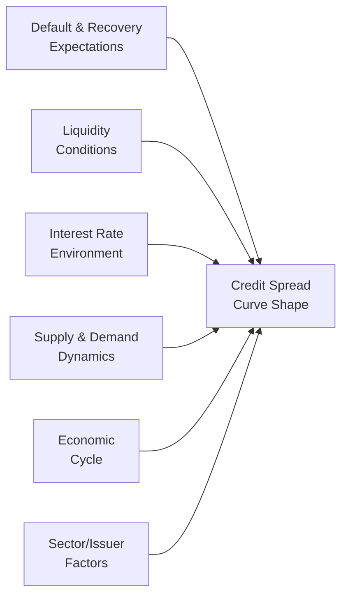

## Overview

If you’ve ever wondered why some high-yield bonds have higher spreads at short maturities, or why investment-grade debt can be cheaper beyond the 10-year mark, you’re definitely not alone. In real life, I've had plenty of conversations with friends—some in finance, some not—where we scratch our heads about why certain bonds look super cheap relative to risk at one part of the maturity spectrum but not at another. The kicker is: it’s rarely due to a single factor. Instead, the shape of the credit spread curve reflects a jumble of influences like default risk outlook, base interest rates, overall liquidity in the bond market, and, of course, basic supply and demand. So, let’s dig into this a bit more.

## Placing Credit Spread Shapes in Context

We’ve seen in earlier discussions (especially in chapters on interest rate term structures and credit analysis) that yields on corporate bonds can be decomposed into a risk-free component plus a credit spread. That credit spread is the extra yield investors demand for bearing credit risk. However, the credit spread can vary not just in magnitude but also across the maturity spectrum. One might see:

• An upward-sloping credit spread curve, where longer-dated bonds show bigger spreads.  
• A downward-sloping curve, where near-term paper is penalized more heavily than longer-dated issues.  
• A humped or otherwise “wonky”-shaped pattern that changes in different maturity buckets.

Credit spreads aren’t static. They change as the outlook for credit risk, liquidity, economic growth, and countless other variables shift. For a portfolio manager preparing for the CFA Level II exam, it’s vital to know how these shapes develop, how they may evolve, and how you can position a portfolio to benefit from potential changes.

## Diagram: Inputs Driving the Credit Spread Curve

As shown above, the actual shape of the credit spread curve is an outcome of multiple interconnected forces.

## Key Drivers of Credit Spread Shapes

### Default Risk and Recovery Expectations

At the core of credit spreads lies the probability of default and the expected recovery rate. If the market suspects that default risk grows substantially over time for a particular issuer or sector, it might demand higher compensation at longer maturities, creating an upward slope. Conversely, if near-term default risk is considered acute—maybe the company is “in trouble right now” but might improve if it survives the next few years—then the shorter end might show higher spreads.  

From personal memory, I recall analyzing an energy company bond during a rough patch for oil prices. The market seemed to think the next two years could be dicey, but if the company managed to stay afloat, future prospects brightened quite a bit. Short-term credit spreads were sky-high, while five-year spreads were surprisingly moderate.

### Liquidity Conditions

Liquidity can shape the credit spread curve in ways that may initially seem puzzling. Typically:

• Short-dated, high-grade bonds enjoy strong liquidity, often leading to narrower spreads at the short end.  
• Less frequently traded issues—like long-term high-yield bonds—may see wider spreads to compensate investors, especially if it’s going to be hard to offload these bonds without big price impacts.  

However, extremes can surface if, say, a flight to quality hits the market, and everyone tries to buy only the most liquid short-term paper. That demand might compress short-term spreads drastically while leaving long-term spreads at normal or even elevated levels.  

### Interest Rate Environment and Monetary Policy

A major influence on credit spreads—particularly shorter maturities—is central bank policy. During tightening cycles, short-term borrowing costs rise, and companies reliant on rolling short-term debt might see additional default risk or refinancing pressure. That can widen short-term credit spreads. Meanwhile, if investors believe that rates will not keep climbing perpetually, they might remain more sanguine about longer maturities, flattening or even inverting the spread curve.

On the flip side, when the central bank is flooding the market with liquidity (e.g., quantitative easing), longer-dated yields (and spreads) could compress as investors “reach for yield” further out on the curve. 

### Market Supply and Demand Dynamics

The interplay of bond issuance volume and investor appetite can be dramatic. Suppose big corporations favor issuing 10-year or 30-year bonds to lock in low rates—suddenly you could have a deluge of new supply at long maturities that outstrips demand, causing spreads to widen. If demand for these bonds isn’t robust, that segment of the curve can experience upward pressure on yields relative to the risk-free rate.

In contrast, a wave of pension fund or insurance company demand might target, for instance, the 15- to 20-year segment to match liabilities. This surge in buyers can push spreads down in that exact maturity range. 

### Economic Cycle Position

Market participants almost always keep an eye on where we are in the economic cycle. The exact slope of the credit spread curve may change as expansions or recessions set in:

• In expansions, credit risk perceptions ease. Spreads can tighten across all maturities, but sometimes the flattening at the long-end is more pronounced if investors see stable growth for many years.  
• In recessions, spreads generally blow out across the board, but the shape of the curve can become more chaotic. Sometimes, shorter maturities spike higher if the fear is immediate. Other times, it’s the long end of the curve that leaps up, especially if the future looks bleak.

### Sector- or Issuer-Specific Factors

Think of airlines, energy, or heavily cyclical industries that rely on commodity prices. Their credit outlook can be extremely sensitive to an economic switch. Meanwhile, stable sectors (utilities, consumer staples) may show flatter or more stable spread curves since the market sees a lower risk of the unknown blowing up the business model. 

It’s also interesting to watch how investor concerns might cluster around certain maturities. An airline that has large aircraft leases expiring or major debt maturities in a specific year might show a spike in spreads precisely around that period.

## Common Shapes and Patterns

• Upward Sloping (Normal): The “classic” scenario suggests higher risk further out.  
• Downward Sloping (Inverted): Often signals elevated near-term uncertainty or defaults.  
• Humped/Curved: Could mean a specific tenor is especially risky or exceptionally liquid, and the rest of the curve is shaped differently.  
• Flat: Suggests a uniform view of credit risk across all maturities or a market in transition.

## Analytical Tools for Spread Curves

• Structural Models: As introduced in credit risk modeling (see earlier chapters on Merton’s model), these treat equity as a call option on a firm’s assets. Default likelihood is measured relative to asset value thresholds. This can help you see how default probabilities evolve over various horizons, and thus inform how the spread might vary by maturity.  
• Reduced-Form Models: Here, we estimate a default intensity (or hazard rate) that changes over time. By modeling different intensities for short, medium, and long maturities, you can produce a spread curve shape that aligns with expected default probabilities.  
• Stochastic Simulation: Monte Carlo techniques (discussed in prior chapters) can incorporate random changes in macro variables, interest rates, or sector fundamentals to produce a distribution of possible spread curve shapes.

## Best Practices for Managing Credit Spread Curves

• Continual Monitoring of Liquidity: Keep an eye on changes in market liquidity, which can show up quickly in the shape of the spread curve.  
• Macro Analysis: Watch central bank policy signals. If rate hikes are on the horizon, shorter-term credit spreads might widen first.  
• Identify Technically Driven Distortions: Look out for big issuance or a supply drought in certain maturities. This can represent tactical trading opportunities.  
• Diversification Across Maturities: Spread your credit exposures so you’re not overly reliant on just one part of the curve.  
• Hedging With Curve Trades: Use curve steepeners/flatteners if you believe one end of the spread curve is mispriced relative to the other.  

## A Quick Real-World Illustration

Let’s consider a hypothetical electric utility, PowerGen, which is typically viewed as stable with fairly predictable cash flows. Right now, it has:  
• A major debt redemption due in 12 months.  
• A big capital expenditure scheduled about 5 years from now.  

In a stable economy, the 1-year bond might carry a relatively modest spread, because the firm is well-regarded and near-term default risk is low. The 5-year, however, might see a bit of extra spread due to uncertainties around generating enough operating cash flow to fund that big expenditure. Then, the 10-year might have a slightly smaller spread than the 5-year, as the market is confident the firm will recover those costs over the longer horizon. The result could be a mild hump at the 5-year point on the spread curve.

## Conclusion

Credit spread shape tells a story about how the market perceives risk, liquidity, and many other factors across different time frames. As a Level II candidate, you want to integrate these ideas into your bond selection, portfolio construction, and risk management strategies. Evaluate each segment of the curve with an eye for what might materially shift investor behavior. Don’t assume a single driver is at play—often, it’s a confluence of factors that yield the final shape. Keep refining your macro view, your issuer-level credit research, and your sense for market technicals. By doing so, you’ll be a step ahead in positioning for potential spread curve shifts and more confident under exam conditions.

---

## References and Further Reading

- Fabozzi, F. J. (Ed.). (2016). Bond Markets, Analysis, and Strategies. Oxford University Press.  
- 2025 CFA Program Curriculum Level II, Fixed Income by CFA Institute.  
- Altman, E. (2019). “Default Risk, Mortality Rates, and Valuation of High-Yield Bonds.” Journal of Finance.  
- International Monetary Fund. (Yearly). Global Financial Stability Report: Market Developments and Issues.  
  https://www.imf.org/external/pubs/ft/gfsr/  

---

## Test Your Knowledge: Determinants of Credit Spread Shapes



### Which of the following factors is most directly associated with an upward-sloping credit spread curve?  
- [ ] Expectations of a rapid decrease in default risk over time  
- [ ] A sharp improvement in near-term liquidity  
- [x] Market perception that default risk grows at longer maturities  
- [ ] A significant reduction in credit issuance in the long end  

> **Explanation:** An upward-sloping credit spread curve often arises when investors think an issuer’s default risk increases the further out in time you go.

### Which of the following best illustrates the economic cycle’s impact on credit spreads?  
- [x] Spreads widen across all maturities during a recession, though the shape of the curve may vary.  
- [ ] Spreads do not change at all in a downturn.  
- [ ] Spreads flatten only at the short end during booms.  
- [ ] The economic cycle has negligible influence on long-term credit spreads.  

> **Explanation:** In practice, recessions generally lead to higher default fear across the board, widening spreads. The curve shape, though, may not be uniformly parallel—it can twist or hump depending on which maturities the market perceives as riskier.

### How does liquidity typically affect short-term bond spreads versus longer-term bond spreads?  
- [ ] Short-term bonds are always less liquid and thus have higher spreads.  
- [ ] Liquidity has no bearing on spreads across maturities.  
- [ ] Markets tend to become illiquid only in very long maturities (20+ years).  
- [x] Shorter maturities can be more liquid, potentially contributing to tighter spreads at the short end.  

> **Explanation:** Short-term, high-grade bonds often have more active trading, lowering required spreads for liquidity risk. Longer-term issues can be less liquid, meaning spreads may be higher.

### A flattening of the credit spread curve can be caused by:  
- [ ] A spike in short-term rates combined with a reduction in default fear for short maturities.  
- [ ] Decreasing long-term liquidity and stable short-term liquidity.  
- [ ] Large-scale demand for mid-term bonds only.  
- [x] Changes in market supply and demand that affect specific maturities, and central bank policy that influences each segment of the curve differently.  

> **Explanation:** A flattening spread curve could result from a multitude of factors, including central bank actions that tighten the short end plus growing demand at the long end, narrowing the difference in spreads across maturities.

### When an issuer with a large debt redemption due in 3 years experiences heavy investor concern, what is the likely impact on the credit spread curve?  
- [ ] The 3-year spread narrows abruptly.  
- [ ] All spreads across maturities simultaneously reduce.  
- [x] The 3-year segment of the curve may see a “hump” or higher spread relative to other maturities.  
- [ ] Only the 7–10-year area experiences a spike in spreads.  

> **Explanation:** If a big maturity in 3 years poses immediate refinancing or default risk, traders often demand extra premium in that specific maturity, leading to a localized spread hump.

### Which statement regarding interest rate policy and credit spreads is accurate?  
- [x] If the market anticipates rising short-term rates, short-dated spreads can widen relative to longer maturities.  
- [ ] Central bank policy has no impact on credit spreads.  
- [ ] Rate hikes are consistent with narrower spreads across all maturities.  
- [ ] Since credit risk is unique to issuers, monetary policy does not influence spread shapes.  

> **Explanation:** Anticipated rate hikes can push up short-term refinancing costs, increasing near-term default risk perception and thus widening short-term spreads.

### An inverted credit spread curve (higher near-term spreads, lower long-term spreads) might indicate:  
- [ ] Complete faith in near-term conditions.  
- [x] Acute near-term fears about potential default or liquidity issues.  
- [ ] Expectation of extended economic boom only in the long term.  
- [ ] High appetite for short-dated paper.  

> **Explanation:** If the near-term outlook is poor (e.g., potential upcoming default triggers), the short end of the curve can see disproportionately high spreads, creating an inverted shape.

### Sector-specific factors could lead to different shapes for two issuers with the same credit rating if:  
- [ ] Their bond maturities are all identical.  
- [x] One issuer faces cyclical revenue uncertainty while the other has stable revenues.  
- [ ] They operate in the same industry.  
- [ ] Both have uniform debt structures.  

> **Explanation:** Even with the same nominal credit rating, sector or issuer fundamentals—like cyclical revenues or large capital outlays—cause spreads at certain maturities to diverge.

### Why might large-scale issuance of 10-year bonds lead to a steepening of the credit spread curve beyond 10 years?  
- [x] Excess supply in the 10-year bucket can push up spreads there, making longer maturities relatively less expensive in comparison.  
- [ ] Large-scale issuance usually narrows spreads.  
- [ ] The 10-year has no effect on other maturities.  
- [ ] Demand almost always exceeds supply.  

> **Explanation:** When supply outpaces demand in a particular tenor, spreads in that segment can widen. This might create or accentuate a slope versus other maturities.

### A humped credit spread curve might occur if:  
- [x] There is a specific maturity where default or refinancing risk is perceived to be especially high, while near and far maturities have lower perceived risk.  
- [ ] The yield curve is also flat.  
- [ ] Default risk is uniform across all maturities.  
- [ ] Liquidity is identical in all maturities.  

> **Explanation:** A hump generally arises because one segment has a unique risk (or liquidity) feature, so the market prices that maturity segment differently from others.


