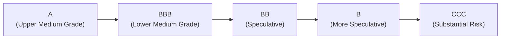

## Introduction
Rating transitions can sometimes feel like the hidden switch that catches you off guard in the fixed income world—one moment you hold an “A” bond, and the next thing you know, it’s downgraded to “BBB” or even lower. I remember early in my career being absolutely stunned by how quickly a negative earnings report or a sudden change in management strategy could drive downgrades and rattle bond prices. Once you see that happen a few times, you come to realize rating transitions are not just small adjustments in a letter grade. They can move markets and reshape an entire portfolio’s risk and return profile.

Below, we’ll take a look at how rating agencies approach transitions, introduce transition matrices, and discuss the ways investors can monitor and manage the risk (and potential reward) associated with ratings migrating up or down. Even if you’re new to fixed income and rating methodology, don’t worry—we’ll break it down step by step.

## Understanding Rating Transitions
A credit rating is an evaluation of an issuer’s perceived creditworthiness, often assigned by agencies such as Moody’s, S&P, or Fitch. Each agency uses slightly different nomenclature (e.g., Moody’s might say “Baa2,” while S&P might say “BBB”), but they all aim to rank the probability of default (or likelihood of timely debt servicing).

A “rating transition” is simply the movement from one rating to another over a given time frame (e.g., within one year). These transitions can significantly affect bond prices, spreads, and portfolio holdings. Upgrades (“A” to “AA”) typically mean a narrower spread and potential price appreciation, while downgrades (“A” to “BBB” or below) imply a higher spread and risk.

### Why Do Transitions Occur?
• Changes in Issuer Fundamentals: Deteriorating financials, such as reduced profits or higher leverage, can lead a rating agency to downgrade an issuer. The opposite is true for improved fundamentals, which might trigger upgrades.  
• Industry and Macroeconomic Shifts: An entire sector might face cyclical or secular challenges (like an oil price crash for energy companies), leading to a cluster of downgrades. Conversely, a tech boom might lead to a wave of upgrades in that sector.  
• Event Risk: Takeovers, restructurings, or new regulations can cause sudden changes in an issuer’s outlook.  

## Impact on Credit Spreads
One of the main reasons rating transitions matter is their effect on credit spreads. If a bond with a “BBB” rating suddenly becomes “BB+,” it might cross that magical boundary between investment-grade and high-yield, often referred to as a “fallen angel.” The impact can be dramatic:

• Forced Selling Pressure: Certain institutional investors (e.g., pension funds or insurance companies) are restricted by mandate to hold only investment-grade (IG) bonds. A portfolio that sees a bond slip to speculative-grade may need to sell quickly, widening spreads.  
• Price Volatility: Downgrades commonly trigger downward pressure on bond prices, since a higher yield demanded by new investors equates to a lower price for existing holders.  
• Spread Curve Shift: Across the market, if a whole sector faces a domino effect of downgrades, the credit spread curve might “jump” upward in those maturity segments.  

On the flip side, a bond on the cusp of an upgrade can offer price appreciation as spreads tighten. It can be just as exciting to spot a potential upgrade story as it is nerve-wracking to watch for possible downgrades.

## Modeling Transitions with a Rating Transition Matrix
At its core, a rating transition matrix is a Markov chain model showing the probabilities of moving from one rating to another (including remaining in the same rating) over a defined period—commonly one year. If you haven’t seen one before, it might look like this (in a simplified version with just four rating categories):

|               | AAA  | AA   | A    | BBB  |
|---------------|------|------|------|------|
| AAA           | 90%  | 6%   | 3%   | 1%   |
| AA            | 3%   | 85%  | 9%   | 3%   |
| A             | 1%   | 4%   | 90%  | 5%   |
| BBB           | 0%   | 2%   | 5%   | 93%  |

Here, reading horizontally, you see the probabilities of going from a row rating to a column rating. For example, if a bond is initially “AA,” there is an 85% chance it remains “AA,” a 3% chance it climbs to “AAA,” a 9% chance it slips to “A,” and a 3% chance it moves to “BBB,” over one year.

### Markov Chain Representation
In more formal terms, if we let:

• pₜ = the probability distribution vector of ratings at time t  
• M = the transition matrix  

then:

$$
p_{t+1} = p_t \times M
$$

This helps in projecting how a distribution of issuers might look after 1 year, 2 years, or more. Large concentrated bets on borderline ratings can become very risky if the transition probabilities suggest a high chance of migration into speculative-grade territory.

### State Diagram Illustration
To visualize how a single issuer’s rating might move, consider this Mermaid flowchart:

While in reality the arrows can go both ways (upgrades and downgrades), this simplified diagram highlights how credit quality can slide downward and how each step typically entails wider spreads and higher yield demands.

## Key Rating Thresholds and Market Reactions
Not all rating changes are equally impactful. Moving from “BB” to “B” is important, but typically less market-moving than slipping from “BBB-” to “BB+.” Why?

1. **Investment-Grade vs. High-Yield Split:** Crossing this boundary can spark forced selling by institutional investors who are not allowed to hold below investment-grade securities.  
2. **Market Perception of Risk:** The difference in perceived default risk (and thus credit spread) often makes a discrete jump at this boundary.  

If you’ve ever heard the term “fallen angel,” it’s referencing a bond that falls out of IG status. These can be bargains if an investor is willing to stomach the extra risk (and if there’s confidence the issuer can bounce back). Conversely, they can also be traps if the downgrades keep rolling in.

## Practical Considerations for Bond Portfolio Managers
### 1. Monitoring Issuer Financial Health
Watch leverage ratios, interest coverage, and liquidity metrics. Even intangible factors—like industry leadership or brand reputation—can tilt rating agency opinions.

### 2. Tracking Sector Trends
If a whole sector is in trouble (think energy during a commodity price collapse), the probability of multiple downgrades rises. This is particularly relevant for portfolio managers looking to avoid correlated losses.

### 3. Preparing for Sudden Spread Widening
Position your portfolio so that if a bond is teetering on the edge of a threshold, you have a contingency plan. Maybe you hedge with credit default swaps (CDS) or lighten your exposure before the official downgrade hits.

### 4. Exploiting Upgrade Potential
A bond that’s just shy of an upgrade rating can offer interesting opportunities for both yield and capital appreciation if conditions improve. Keep an eye on rating agencies’ watchlists and outlooks.

## Best Practices and Common Pitfalls
• **Best Practice:** Diversify across rating segments. If you concentrate heavily in borderline IG or borderline HY names, you risk the domino effect of rating transitions.  
• **Common Pitfall:** Assuming rating stability. Yes, a company might have been “A” for years, but that doesn’t guarantee future rating stability—particularly if macro conditions shift dramatically.  
• **Best Practice:** Use scenario analysis. Stress test your portfolio for rating transitions during a recession scenario or sector downturn.  
• **Common Pitfall:** Overreliance on a single rating agency. Each agency has its own rating approach. Triangulate your analysis with at least two major agencies (Moody’s, S&P, Fitch) to reduce blind spots.

## Example: Potential Impact of a Rating Downgrade
Imagine you manage a portfolio containing 5% of a single issuer’s debt, currently rated “BBB.” The issuer’s coverage ratio has deteriorated, and the rating agency places the bond on “negative watch.” Within three months, you see a downgrade to “BB+.” Suddenly, the bond’s spread widens from 200 basis points over Treasuries to 350 basis points. This 150-basis-point jump lowers the bond’s secondary market price, creating a mark-to-market loss, and due to your portfolio constraints, you might be forced to sell.

If you have advanced knowledge of these signals and a sense of the rating agency’s approach, you might reduce your exposure earlier, or employ hedging to offset the price drop. Conversely, if you foresee a potential reversal, you could decide to hold or even buy more at cheaper levels—assuming the company’s fundamentals can still bounce back.

## Conclusion and Exam Tips
Rating transitions are no small detail in fixed income. They can change the shape of the credit spread curve, force portfolio rebalancing, or open new opportunities for alpha. For the CFA exam, it’s crucial to understand not only what a “downgrade” or “upgrade” implies, but also the mechanics of transition matrices and the interplay with forced selling or buying in the market.

• **Know Your Boundaries:** That investment-grade/high-yield split is often a big deal in practice questions.  
• **Use Transition Matrices Wisely:** Examiners love asking about expected transitions or how a distribution of ratings might evolve over time.  
• **Stay Alert to Industry Cycles:** The exam might present a vignette with signals of corporate or sector deterioration—be ready to estimate the potential rating migration and its effects on spreads.  
• **Stress Testing:** Watch for questions that ask you to estimate how a portfolio would fare if several holdings got downgraded simultaneously.  

Rating transitions remind us that the fixed income landscape changes over time and is just as sensitive to fundamentals and market sentiment as equity markets are. Keep track of those rating trends, remain diversified, and you’ll be far better positioned to manage (and capitalize on) those transitions.

---

### References
- Hull, J. (2018). Options, Futures, and Other Derivatives. Pearson.  
- Moody’s Investors Service. (Annual). Corporate Default and Recovery Rates.  
- Standard & Poor’s. (Annual). S&P Global Ratings Transition Studies.  

---

## Test Your Knowledge: Rating Transitions and Their Impact Quiz



### 1. Which of the following statements best describes the term “fallen angel”?

- [ ] A bond that was originally high yield and was upgraded to investment grade.
- [ ] A bond that has lost its default protection but remains investment grade.
- [x] An investment-grade bond that was downgraded to speculative grade.
- [ ] A bond that has never been rated by the major rating agencies.

> **Explanation:** A “fallen angel” is a bond that initially carried an investment-grade rating but was later downgraded to sub-investment-grade status.

### 2. An investor holds a portfolio primarily composed of BBB-rated bonds. According to common mandates, what is the most likely risk if several of these bonds are downgraded to BB+?

- [ ] Credit spreads will compress, increasing the bonds’ market value.
- [x] Some institutional investors may be forced to sell, widening the spreads.
- [ ] The downgraded bonds will automatically be upgraded back in the next review cycle.
- [ ] The portfolio will remain unaffected because BB+ is still considered investment grade.

> **Explanation:** Crossing from BBB to BB+ typically means moving into high-yield territory. Many institutional mandates prohibit holding bonds below investment grade, which may trigger forced selling and cause spread widening.

### 3. A rating transition matrix is primarily used to:

- [ ] Calculate the exact price change of a bond during a single day of trading.
- [ ] Model short-term changes in equity market volatility.
- [x] Forecast the probability of moving from one credit rating to another over a defined period.
- [ ] Determine discount rates for equities based on dividend growth.

> **Explanation:** A transition matrix estimates the likelihood of rating migrations over a certain time horizon, often one year, allowing investors to predict potential changes in credit quality.

### 4. When a bond is on the brink of an upgrade from BBB- to BBB+, investors might expect:

- [x] A tightening of credit spreads and potential price appreciation.
- [ ] An automatic downgrade if the issuer’s profitability declines.
- [ ] Immediate rise in default probabilities.
- [ ] No effect on bond pricing due to minor rating changes.

> **Explanation:** Moving from BBB- to BBB+ typically indicates improving creditworthiness and can result in narrower spreads, boosting the bond’s price.

### 5. Which of the following best characterizes the difference between investment-grade and high-yield (speculative-grade) bonds?

- [x] Investment-grade bonds are often subject to tighter mandates, while high-yield bonds typically offer higher spreads and risk.
- [ ] High-yield bonds carry no default risk.
- [x] A rating of BBB- (or Baa3) and above usually identifies investment-grade, while anything below is high yield.
- [ ] All bonds with a rating of AA or below are automatically considered high yield.

> **Explanation:** Investment-grade bonds (BBB-/Baa3 or higher) generally face tighter investment mandates, while speculative-grade bonds carry a higher risk of default and thus command higher spreads.

### 6. Which risk is most associated with “downgrade cycles”?

- [x] Multiple issuers are downgraded around the same time, causing broader market stress.
- [ ] Upgrades frequently outnumber downgrades, reducing default probabilities.
- [ ] There is no impact on a bond’s yield due to industry-wide ratings stability.
- [ ] Overreliance on equity valuations.

> **Explanation:** A “downgrade cycle” typically occurs when numerous issuers receive downgrades in a short span, potentially leading to increased spreads and forced selling in the market.

### 7. If pₜ represents the current distribution of credit ratings across a portfolio and M is the transition matrix, then:

- [ ] pₜ₊₁ = pₜ ÷ M
- [ ] pₜ₊₁ = pₜ + M
- [x] pₜ₊₁ = pₜ × M
- [ ] pₜ₊₁ = M × pₜ × M

> **Explanation:** Under a Markov chain framework, the new distribution is the previous distribution multiplied by the transition matrix.

### 8. In practice, a sudden downgrade from BBB to BB can lead to increased volatility because:

- [ ] The coupon rate of the bond decreases automatically.
- [ ] The issuer must immediately pay off all existing debt.
- [ ] Rating agencies will not allow an issuer to be upgraded for at least five years.
- [x] Many institutional investors may need to sell the bond, causing a potential liquidity crunch and price drop.

> **Explanation:** Large-scale selling from investors restricted to investment-grade instruments typically drives bond prices down and widens spreads, increasing volatility.

### 9. Which of the following represents a best practice in managing rating transition risk?

- [ ] Concentrating solely in BBB bonds to optimize yield.
- [x] Diversifying across multiple rating categories to reduce the impact of transitions.
- [ ] Ignoring industry or macro factors since rating changes are random.
- [ ] Relying entirely on one rating agency’s report for portfolio decisions.

> **Explanation:** Diversification is essential to mitigate the risk that rating transitions in a specific segment (e.g., borderline IG bonds) will severely damage portfolio returns.

### 10. A transition matrix can be used to project multi-year rating distributions by multiplying the matrix repeatedly over time.

- [x] True
- [ ] False

> **Explanation:** Extending the Markov chain over multiple periods involves iterative multiplication of the transition matrix to estimate longer-term rating dynamics.


