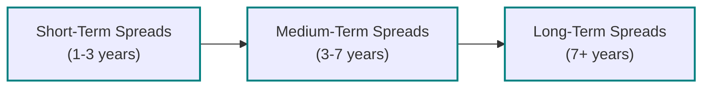

## Introduction

Let’s go ahead and dive into the final segment of Chapter 22—one of my favorites—where we’ll chat about how credit spreads can shift across different maturities, so-called “term structure” shifts. You might recall from earlier sections in this chapter that a security’s credit risk is expressed through its spread over a risk-free benchmark. The twist here is that this spread is rarely the same for, say, a 2-year bond and a 10-year bond from the same issuer. These different spreads for different maturities shape the credit curve and can shift or twist in response to market conditions, issuer fundamentals, or rating updates.

So, imagine an issuer with great short-term liquidity prospects but potential problems lurking in the long run—maybe there’s a wave of debt coming due in seven years. Investors might demand minimal spreads on the short end but a heftier premium on longer maturities. Or the reverse might happen if the issuer’s short-term picture is shaky but the future looks much rosier. 

All that said, analyzing these shifts is crucial for success on the Level II exam. This is typically tested with item-set vignettes that blend qualitative data (like management commentary or rating agency watchlists) with quantitative data (like spread tables by maturity, rating-transition matrices, or macro indicators). The exam wants to see if you can figure out how spreads might move (steepen, flatten, or shift in a parallel fashion) and how you would respond as a bond analyst or portfolio manager.

## Why the Term Structure of Credit Risk Matters

Before we jump into the typical question patterns, let’s confirm why you care about this. 
• Changes in a firm’s credit quality often play out differently across maturities. A short-term rating watch might spike immediate funding costs but leave the long-end unaffected—maybe because investors believe the firm will address the issues in time.  
• Liquidity events, such as forced selling by certain investor mandates, can trigger short-term dislocations that fade later.  
• Rating cliffs—where a single downgrade pushes a bond from investment-grade to high-yield—can introduce a discontinuous jump in spread at specific maturities.  
• Shifting macro conditions, like an anticipated recession, can cause a widespread re-pricing of credit risk that might be more severe in the outer maturities if the outlook for that sector or issuer is negative.

## Common Influences on Credit Curve Shape

It’s not just about “up” or “down.” The credit spread curve can move in nuanced ways:

Parallel Shift  
• A “parallel shift” means every maturity sees roughly the same absolute spread increase (or decrease).  
• You might see this happen in a broad risk sentiment change—imagine a major macro shock that affects all issuers in a certain sector.  

Steepening  
• A steepening occurs if long-term spreads widen (or tighten) relative to short-term spreads—or vice versa if short-term spreads move but the long end remains still.  
• Usually indicates differing levels of concern about near-term default risk vs. longer-term prospects.  

Flattening  
• A flattening can indicate that short-term and long-term spreads converge.  
• It often shows that investors see the issuer’s creditworthiness as uniformly good or uniformly challenged across all maturities.

Twisting  
• A twist would mean some mid-section of the curve changes while the short and long ends remain relatively anchored.  
• Twists often occur when rating agencies telegraph possible changes for a specific maturity or when there’s a supply/demand imbalance in particular segments.

Here’s a quick mermaid diagram to visualize how a credit curve might shift:

## Key Factors to Look for in Vignettes

When item sets test your understanding of credit-spread term structure, they typically weave together multiple data points across a 1–2 page vignette. These might include:

Issuer Fundamentals  
• Debt-to-EBITDA, interest coverage, revenue trajectory.  
• Any upcoming debt maturities—particularly if they cluster at a near or mid-term date.  
• The vigor or weakness of the issuer’s sector—think cyclical sensitivity, commodity exposure, or technology disruptions.

Macro Environment  
• Central bank policy, growth outlook, inflation expectations, and risk sentiment.  
• Liquidity conditions—are capital markets welcoming or tight right now?

Rating Trajectory  
• Watchlists from rating agencies, signals of potential upgrade or downgrade, and timing of rating reviews.  
• Historical rating transitions to gauge if this issuer or sector is prone to big cliff effects.

Investor Base  
• Some mutual funds or pension funds must dump bonds if they fall below a certain rating.  
• Hedge funds or special-situation investors might step in at that juncture, temporarily creating big price dislocations.

Short-Term vs. Long-Term Funding Pressures  
• Changes in short-term funding markets can abruptly spike short-term spreads.  
• Supply overhang in longer-dated bonds can weigh on the long end, but maybe cause the short end to tighten if supply is less.

These signals come in statements or data tables that you need to pick apart systematically. 

## Exam Tips and Strategies

• Parse All Data Thoroughly:  
  The exam loves to present data in a neat table and then drop a piece of commentary in the text that reveals a not-so-obvious but critical factor—like a rating agency hinting at a possible negative outlook. Don’t skim these details; they might be the reason the 5-year spread changed more steeply than the 10-year spread.  

• Understand Liquidity Events:  
  “The CFO said the company plans to issue a large chunk of new debt in 3-year maturities next quarter” might signal upward pressure on the short- to medium-term spreads. Or, if a redemption schedule is front-loaded, short-term spreads might spike.  

• Rating Cliff Effects:  
  This is a biggie. If there’s a risk that the bond might tip from investment-grade to BB or below, the spread can jump significantly. Keep an eye out for references to rating thresholds or agencies discussing “potential multi-notch downgrades.”  

• Investor Mandates and Supply Shocks:  
  If you read that major pension funds “cannot hold sub-investment grade,” a pending downgrade can unleash a wave of forced selling. That can spike spreads at particular maturities.  

## Typical Analysis Steps in a Vignette

1. Identify the Macro Trend  
   • Read the economy’s health cues. Are we in growth mode or near a downturn? Rising default probabilities in a stressed environment can shift spreads upward across the curve, but the effect might be more pronounced at certain maturities.

2. Issuer-Specific Metrics  
   • Is the issuer’s leverage going up or down? Are they rolling over debt soon? A near-term maturity wall might cause the short end of the credit curve to widen drastically. A heavy extension of new supply in the longer maturities might weigh on that end.

3. Liquidity Environment  
   • A short-term liquidity crunch, like we saw in some major crises, can spike short-term spreads. The market may remain calm about longer maturities if the liquidity crunch is expected to be temporary.

4. Rating Trajectory  
   • If rating agencies mention a negative outlook, try to figure out how that squares with near-term vs. long-term maturities. If a negative rating watch is triggered by cyclical factors, it might weigh heavier on longer-dated bonds.

5. Assess the Shape of the Credit Curve  
   • Sift through the data table: are short-term spreads up by 10 bps while mid-term is up by 40 bps? That suggests a twist or partial steepening. If all maturities increased by roughly 20 bps, that’s a parallel shift.

6. Formulate a Trade or Hedge  
   • The exam might ask how you’d position a bond portfolio or which derivative you’d use. Perhaps you want to go long the short end if you expect near-term improvements, or short the long end if you see a risk of significant deterioration in future credit metrics.

## Real-World Anecdote

I once witnessed a telecom issuer that leveraged up to fund a big expansion. The rating agencies flagged the debt ratio as borderline for a downgrade—nothing certain, but the watch notice was out there. The short-term spreads stayed relatively stable because the business generated decent cash flow, so there was no immediate risk of default. But the 7–10 year part of the credit curve ballooned almost overnight as investors worried about whether the expansion would pay off long term. It was a textbook example of a steepening curve centered around that mid-to-long maturity range.

Anyway, we accounted for that by hedging with interest rate swaps on the 7-year portion of the curve. We also took a small short position on the existing 10-year bond, anticipating that the risk premium might widen further if the rating actually got cut. We ended up benefiting from that short as the rating cut came in sooner than the consensus expected, pushing up spreads across those maturities.

## Common Pitfalls

• Failing to Connect Vignette Data to Your Conclusion  
  It’s easy to see a table with spreads, read a bunch of issuer commentary, and then guess the shape of the curve. But exam graders want to see that you’re using the data. Resist the temptation to rely solely on your intuition—instead, match each piece of data to the final big picture.

• Ignoring the Role of Liquidity  
  Sometimes the short-term segment is more about short-term funding markets than about the issuer’s fundamental credit risk. If the vignette mentions “tight repo markets” or “spike in commercial paper rates,” that can overshadow the fundamental story at the short end.

• Missing Cliff Effects  
  A small mention that “the issuer is rated BBB–, placed on negative watch” might be your only clue that they’re on the verge of losing investment-grade status. The spread implications can be severe.

• Overthinking  
  Don’t get lost in hypothetical scenarios beyond what’s in the text. The exam is big on using the data provided. Overcomplicating your narrative can lead you astray. 

## Practice Example with a Hypothetical Vignette

Let’s imagine you’re given a table:

• Issuer ABC, rated BBB by two agencies, but S&P placed it on negative watch.  
• Macro data suggests the economy is slowing, with GDP revisions trending downward.  
• Spreads for ABC’s 2-year bond increased by 10 bps, while the 5-year jumped 25 bps, and the 10-year soared 40 bps.  
• The CFO mentions a big chunk of debt coming due in five years.  
• Management’s tone suggests they’re struggling with new infrastructure costs.

You might conclude that the credit curve is steepening because of concerns about the medium- to long-term horizon. The negative watchers are focusing on the possibility that synergy claims from the new infrastructure project might not materialize soon. Meanwhile, short-term default risk is probably mild, so short-dated spreads are not as badly affected. The correct answer might well be: “The curve is steepening, with the large rating downgrade risk looming in 5+ years, so we expect further widening in that maturity segment.”

## Emphasizing Exam Relevance

From an exam standpoint, you should be able to:  
• Differentiate among parallel, flattening, steepening, or twisting shifts.  
• Read the micro indicators (e.g., maturity schedule, rating watch) and macro signals.  
• Draw a logical conclusion about which part of the curve is impacted and how to trade or hedge that risk.

In actual item-set questions, you’ll often see 4–6 multiple-choice questions that test each angle—maybe they ask about the shape of the curve, the reason behind it, the best hedging instrument, how rating transitions factor in, or the potential “cliff effect.”

Finally, never forget the big picture: if a question focuses on analyzing how spreads will change, incorporate both fundamentals (issuer specifics) and technicals (market liquidity, supply/demand, rating constraints). That’s the hallmark of a well-rounded Level II approach.

## References and Recommended Reading

• CFA Institute (2025). “Practice Questions for Level II: Item Set Format” in the CFA Institute Learning Ecosystem.  
• CreditSights Research. Market Insights: Credit Curves and Rating Actions (published regularly).  
• Refer back to Chapter 22.2 for a refresher on the basic determinants of credit spread shapes.  
• Chapter 18: Introduction to Credit Risk Analysis for the underlying concepts of Probability of Default (PD) and Loss Given Default (LGD).

---

## Test Your Knowledge: Shifts in the Term Structure of Credit Risk



### Analyzing a parallel shift  
A corporate bond issuer sees all its bond spreads widen by 20 bps simultaneously, from the 2-year maturity out to the 10-year tenor. This is an example of which type of shift in the credit spread curve?

- [x] Parallel shift  
- [ ] Flattening  
- [ ] Steepening  
- [ ] Twisting  

> **Explanation:** A parallel shift means spreads across all maturities move by roughly the same magnitude in the same direction.

### Rating cliff effect impact  
An issuer’s short- and medium-term bonds remain stable, but spreads on its longer-dated bonds suddenly expand after a rating agency places the issuer on negative watch for a potential downgrade from BBB– to BB+. Which best describes the spread curve shift?

- [ ] Parallel shift  
- [ ] Flattening  
- [x] Steepening  
- [ ] Inversion  

> **Explanation:** Long-term spreads expand significantly due to the perceived heightened default risk in future periods. This causes a steepening between near-term and long-term maturities.

### Liquidity-driven short-term risk  
If a vignette states that short-term bank funding costs for a particular issuer have spiked due to a temporary liquidity squeeze, but longer maturities remain largely untouched, what shape change is most likely?

- [ ] Parallel upward shift  
- [ ] Flattening  
- [ ] Steepening  
- [x] Twisting  

> **Explanation:** A twist typically happens when part of the curve (in this case, short-term spreads) is disproportionately affected, while the long-term segment holds steady.

### Macro outlook on near-term vs. long-term  
A macroeconomic report projects a mild recession in the coming year, but a strong recovery afterwards. If that scenario is fully believed by market participants, how might the term structure of credit spreads adjust for an issuer with stable fundamentals?  

- [ ] Flatten at the short end  
- [x] Wide short-term spreads, narrower long-term spreads  
- [ ] Uniform spread widening across all maturities  
- [ ] Inversion due to fear of default in the short term  

> **Explanation:** A recession soon could raise default risk in the near term, causing short-term spreads to widen more than the long term. If the recovery is expected to be robust, longer maturities might not widen as much.

### Leveraged maturity wall scenario  
An issuer has a large debt due exactly five years from now and moderately lower debt thereafter. If markets fear the issuer will struggle to refinance that five-year debt, which maturities might see a disproportionately large spread increase?

- [ ] 10+ year bonds  
- [x] Bonds maturing around 5 years  
- [ ] Bonds maturing in the next 1 year  
- [ ] All maturities equally  

> **Explanation:** The bond maturities where the refinancing risk is most concentrated typically see the largest spread. Investors worry about that specific date’s refinancing or default scenario.

### Forced selling from rating mandates  
A bond trades at a BBB rating but is placed on negative watch. Many institutional investors have mandates that require them to hold only investment-grade securities. What phenomenon might occur if the bond is downgraded to junk?

- [x] Cliff effect  
- [ ] A minor flattening  
- [ ] Parallel yield shift  
- [ ] No significant change  

> **Explanation:** A rating downgrade pushing an issuer beneath investment-grade quality can cause forced selling, drastically widening spreads—known as a cliff effect.

### Economic improvement and credit curve shift  
Data indicates a strong economic expansion, with rating agencies expecting upgrades for the issuer in the mid-term. Short-dated spreads drop slightly, but 7–10 year spreads fall substantially more. Which best describes the change?

- [ ] A flattening driven by near-term fear  
- [x] A steepening in a bullish scenario (longer spreads dropping more)  
- [ ] A twisting at intermediate maturities  
- [ ] A parallel downward shift  

> **Explanation:** If future fundamentals improve significantly, the longer end could rally more strongly, causing a steeper overall curve (lower long-term spreads relative to short-term).

### Short-term surge on negative news  
In a vignette, you see that an issuer is rumored to have immediate liquidity issues tied to a legal settlement due in six months. Short-term spreads spike, while the rest of the curve remains nearly the same. This is best described as:

- [ ] A broad parallel shift  
- [ ] A flattening  
- [ ] A standard steepening  
- [x] A twist around the short-term sector  

> **Explanation:** If only the short end adjusts to that specific six-month legal settlement risk, then the short maturities experience a sharp move, causing a curve twist.

### Inversion in credit spreads  
If the short-term spread for a corporate issuer rises above its long-term spread, which unusual shape is this?

- [x] Inverted credit curve  
- [ ] Neutral shift  
- [ ] Flattened structure  
- [ ] Twisted curve  

> **Explanation:** Inversion means short-term credit spreads exceed long-term spreads, signaling immediate or near-term risk is exceptionally high.

### True or False:  
A rating cliff effect can only occur when a bond is initially rated AAA.

- [ ] True  
- [x] False  

> **Explanation:** Cliff effects commonly happen at the boundary between investment-grade (e.g., BBB–) and high-yield (e.g., BB+), but they can occur at other breakpoints as well. It is not exclusive to AAA bonds.



---

**Final Exam Tips**  
• Pay close attention to rating watch announcements and their timing.  
• When uncertain, methodically align each piece of data to a potential shape shift.  
• Keep referencing any mention of supply and demand, maturity walls, or forced selling triggers.  
• Practice staying calm in vignettes. Skim the scenario once, then dive into the details carefully, highlighting or annotating data that aligns with the question.  

**References for Additional Practice**  
• CFA Institute (2025). “Practice Questions for Level II: Item Set Format.”  
• CreditSights Research. “Market Insights: Credit Curves and Rating Actions.”  

Good luck with your study, and remember: the better you parse the story behind those spread shifts, the quicker you’ll zero in on the correct exam answers.
