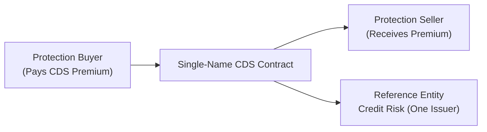
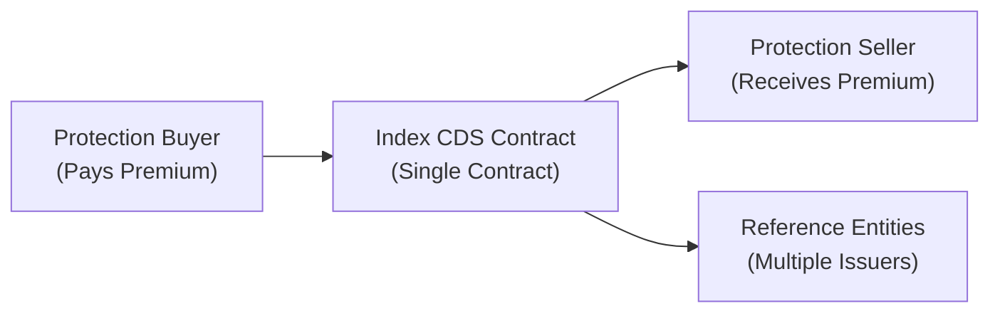
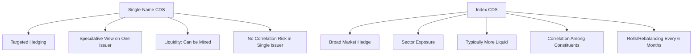

## Introduction

It’s not every day that we talk about hedging credit risk, but Credit Default Swaps (CDS) represent one of the most powerful tools out there. They can help investors manage the possibility of default on corporate or sovereign debt. In a nutshell, a CDS is like an insurance contract for credit risk: the protection buyer pays periodic premiums (usually expressed as basis points per year on the notional amount), and the protection seller agrees to compensate the buyer if a defined credit event—often default, bankruptcy, or restructuring—occurs.

But let’s be real: there’s a big difference between hedging the credit risk of a single issuer and hedging the risk of an entire group of issuers. That’s why we have Single-Name CDS on the one hand, referencing a single corporate or sovereign entity, and Index CDS on the other, referencing a basket (or index) of multiple issuers.

Perhaps you’ve heard about major indices like CDX in North America or iTraxx in Europe. They bundle many names into a single contract, giving you an easy and more liquid way to hedge or gain exposure to a wider slice of the credit market. And yeah, it sounds a bit simpler—why worry about each company’s credit individually if you can hedge an entire index with one trade? But as always, trading and portfolio management are about nuance and detail. Single-name contracts let you target specific risks. Index swaps let you go broad. And each approach has its own distinct challenges, especially in terms of correlation, liquidity, and market pricing.

## Core Concepts of a CDS

Before we jump into the specifics, let’s ground ourselves in the basic idea of how a CDS works:

• The Protection Buyer pays a periodic premium (typically quarterly) based on an annualized spread in basis points.  
• The Protection Seller, in return for that premium, agrees to make a contingent payment if the Reference Entity experiences a credit event.  
• The Notional Amount is the principal base used to calculate both the premium payments and the contingent payout.  
• Settlement can be physical (the buyer delivers the defaulted bond/loan to the seller and receives par) or cash (the seller pays the difference between par and the bond’s market price).

Now, that’s your foundation. From here, we’ll expand to single-name CDS versus index CDS. 

## Single-Name CDS

Single-name CDS reference one particular entity—maybe a big telecom company, a major bank, or a sovereign government. Investors might want to buy protection on, say, Sovereign X or Corporate Y if they suspect the issuer’s credit quality might be deteriorating and they want to hedge. Or, let’s be honest, they might buy if they’re just looking to profit from a slump in that issuer’s credit standing.

### Key Characteristics

• Specific Issuer Exposure: A single-name CDS is laser-focused on the default risk of one issuer. Maybe you’re holding a large position in that firm’s bonds and want insurance. Or you believe a certain issuer’s spread is going to widen, so you buy protection to profit from that.  
• Flexibility in Position Sizing: You can tailor the notional of the CDS to precisely match the bond position you’re hedging, or to take a speculative position that aligns with your conviction level.  
• Liquidity Varies: Liquidity depends on the reference entity. If it’s a big household-name issuer or a top-tier sovereign, there’s often plenty of liquidity. If it’s a smaller or low-rated company, sometimes the market is a lot thinner and bid-ask spreads can widen.

### Single-Name CDS Structure

Below is a simplified diagram of a single-name CDS transaction:

In this structure, the protection buyer pays a periodic premium to the seller, and the seller covers the default risk of a single issuer. Simple enough.

### Uses in Practice

• Hedging a Concentrated Bond Position: If your portfolio is heavy on a single issuer’s debt, a single-name CDS on that issuer can help offset potential losses if the issuer defaults.  
• Expressing a View on a Company’s Credit Health: If you’re feeling bearish on a particular firm, you might buy CDS protection. If that firm underperforms, its CDS spread widens, and the value of your protection goes up.  
• Creating Synthetic Short Positions: Going “short” credit is not as straightforward as shorting a stock, but buying CDS protection effectively lets you bet on credit deterioration.

## Index CDS

Index CDS—like CDX in North America or iTraxx in Europe—cover a basket of issuers. Each index comprises a set number of names, typically major corporations or financial institutions that meet liquidity and credit rating requirements. Because these indices are standardized, they often have substantial market depth, tight bid-ask spreads, and relatively robust price discovery.

### How Index CDS Work

You can think of an index CDS as a bundle of single-name CDS exposures, combined into one contract. The protection buyer pays one unified premium to protect against the group of names in the index. If any of the names in the basket default, the index notional is typically reduced by that name’s weighting, and a default settlement is triggered for that portion only.

Here’s a schematic view:

### Key Characteristics

• Broader Credit Exposure: Instead of focusing on a single issuer, you get exposure (or hedging) across multiple issuers.  
• Diversification and Correlation: Because you’re working with several names, you reduce issuer-specific risk—but you introduce correlation risk. If they’re highly correlated, you might see larger moves in the index spread.  
• High Liquidity: Index CDS are generally more liquid than many single-name CDS, which often translates to tighter bid-ask spreads and better price discovery.  
• Roll Dates: One quirk is that these indices “roll” every six months (commonly March and September), when a new index series is introduced. Names that are downgraded or in default might get removed, and new names are added if they meet the inclusion rules.

### Practical Applications

• Market-Level or Sector Hedging: If you run a large corporate bond portfolio and want to hedge the entire thing quickly, it’s often simpler to use an index CDS that aligns with your portfolio’s credit quality and region.  
• Tactical Macro Trades: Suppose you think the investment-grade credit market is about to widen in spreads. Buying index protection is far more straightforward (and liquid) than setting up multiple single-name CDS trades.  
• Basis Trading: Traders constantly look for potential mispricings between the aggregated single-name CDS positions and the index. If the index seems cheap relative to the sum of its parts, they can buy the index while shorting selected single names, or vice versa.

## Liquidity Considerations

Let me share a personal anecdote about liquidity in both markets. I recall a situation a few years back, right before an earnings season, when I wanted to reduce exposure to a single industrial name that I felt might show weaker guidance. The single-name CDS market for that company suddenly became super quiet—wide bid-ask spreads, not much activity. Alternatively, the broad industrial sector index CDS was active and much cheaper to trade. It was a no-brainer for me to hedge with the index. Sure, it wasn’t the perfect match to that one issuer. But if you weigh transaction costs, it sometimes makes sense to trade a more liquid instrument that only partially aligns with your risk.

Generally, index CDS measure up as:

• More Liquid: They have standardized notional, standard contract terms, and attract a wide array of market participants.  
• Tighter Bid-Ask Spreads: Because of the depth and frequency of trades.  
• Easier Execution: If your strategy calls for a quick macro hedge, you can do it effortlessly.

Single-name CDS, by contrast:

• Less Liquid, Depending on the Name: Blue-chip or sovereign names can still have decent liquidity, but smaller or riskier companies might be thinly traded.  
• Potentially Higher Transaction Costs: If you need a large size, you could move the market or face an unfavorable spread.  
• Tailored Exposure: While you sacrifice some liquidity, you’re getting a precise hedge or bet on a single issuer.

## Correlation Dynamics

An interesting twist comes when we talk about correlation. In an index CDS, defaults among the underlying names can cluster, especially in times of market stress. If bad news hits a sector, multiple names within that sector might default at once, driving bigger index movements. This is essentially default correlation, the phenomenon where the likelihood of multiple defaults increases if the underlying issuers share risk factors (like being in the same industry or region).

### Default Correlation’s Impact on Index CDS

• Spread Behavior: In stable markets, the correlation might be low. Each issuer behaves independently, so the index spread can remain contained. However, once systematic risk flares, correlation can spike, causing the index spread to blow out.  
• Pricing Complexity: If market participants expect correlation to rise, they might charge higher premiums for index CDS. This caution, in turn, can drive the single-name versus index basis.  
• Risk Management: Index CDS can blunt the risk of broad defaults across a sector or credit environment, but if you hold names that are significantly more (or less) risky than the average index constituents, your protection may either under- or over-hedge you.

## Index Roll and Rebalancing

Index roll in CDS works a bit like rebalancing in an equity index:  
• Every six months, a new series of the index is launched.  
• Names that have defaulted or no longer meet index requirements are removed.  
• Fresh names that meet the criteria are added.  
• Traders who hold the “old series” can roll their position into the “new series” if they want to maintain continuous exposure.  

This rolling process can create interesting trading opportunities or arbitrage scenarios around the time of rebalancing. If a certain name is anticipated to be dropped from the index, its single-name CDS spread might widen or narrow depending on how participants position for the roll.

## Comparing Single-Name vs. Index CDS

The table below highlights some of the key similarities and differences:

| Aspect                  | Single-Name CDS                                       | Index CDS                                           |
|-------------------------|-------------------------------------------------------|-----------------------------------------------------|
| Reference Entity        | One issuer (corporate or sovereign)                   | A basket/portfolio of several issuers               |
| Liquidity               | Varies, can be limited for smaller entities           | Generally higher, with standardized instruments     |
| Bid-Ask Spread          | Often wider, especially for less-traded names         | Usually tighter due to robust market participation  |
| Credit Event Impact     | Default triggers payout on the single issuer only     | Default of any constituent triggers partial payout  |
| Diversification         | Concentration in a single credit                      | Spreads risk across multiple issuers                |
| Correlation Risk        | N/A (single issuer only)                              | Important, as multiple defaults can be correlated   |
| Typical Use Case        | Specific hedging or speculative trade on one issuer   | Broad market hedge or sector-level positioning      |

## Practical Applications for Portfolio Managers

Let’s consider a scenario that might crop up in an exam vignette or real life:

• You manage a corporate bond portfolio with 50% of your assets in high-grade industrial names. You’re afraid an upcoming Fed announcement might spark broader market volatility and cause credit spreads to widen.  
• One choice is to buy protection on each individual issuer. But that’s a lot of trades to negotiate, each with its own liquidity constraints.  
• Alternatively, you buy a high-grade CDX index. You won’t perfectly hedge each name (some of your holdings might not even be in the index, or your name weightings differ), but you will gain quick, relatively inexpensive coverage for the overall credit risk.  
• You can adjust the notional of the index protection to approximate the portfolio’s overall market value or credit spread duration.  

On the flip side, if you suspect a single company in your portfolio is about to get hammered—let’s say they’re heavily exposed to rising energy costs—and you want targeted coverage, then a single-name CDS is your friend. By focusing on that issuer, you avoid buying more protection than you need.

## Basis Trading

Traders love to watch the difference (the “basis”) between:  
• Summation of single-name CDS spreads for each index constituent, and  
• The quoted spread of the index itself.

When the index is “cheap” relative to the single-names, you might buy the index and buy protection on the single-names or vice versa. This is a fairly advanced strategy that depends on the assumption that the index level eventually converges to the sum of its individual parts. However, correlation risk, idiosyncratic news, and short-term liquidity squeezes can cause the basis to remain dislocated for considerable periods. 

## Potential Pitfalls

• Over-Hedging or Under-Hedging: Using an index to hedge one or two issuers might lead to mismatches in risk coverage and net exposures.  
• Rolling Risk: If you hold an index CDS through the roll date, you’ll need to roll the position if you want to maintain continuous coverage. Market conditions around the roll can sometimes be volatile.  
• Counterparty Credit Risk: Even though you’re hedging the default risk of a reference entity, you also need to ensure that your CDS counterparty is creditworthy.  
• Model Risk: Pricing and valuation for CDS can be quite model-dependent, particularly for correlation assumptions in index products.

## Encouraging Continuous Learning

I can’t stress enough that CDS is not just for short-term trades. They’re a crucial piece of the fixed income puzzle, whether you’re a bond portfolio manager, macro hedge fund trader, or corporate treasurer. Their flexibility and complexity reward continuous study. A best practice is to keep an eye on broad credit market signals—such as the level of iTraxx or CDX indices—and track single-name CDS spreads for major issuers in your portfolio. Sometimes it’s these subtle changes that portend bigger moves in the bond market.

## Visual Summary

Here’s a high-level mind map to reinforce the differences:

## Exam Tips and Key Takeaways

• Make sure you understand exactly when you’d choose to use single-name CDS vs. index CDS. Exam questions often hinge on recognizing the appropriate financial instrument for the scenario.  
• Watch out for correlation assumptions; index CDS price is heavily influenced by the perceived correlation among its constituents.  
• Remember the differences in liquidity and how that might practically affect your hedging strategy.  
• In item-set questions, expect data about the index spread vs. a particular name’s CDS spread, and be ready to interpret changes or “basis” relationships.  
• Time management: If the question references a potential upcoming macro risk event, the index might be the simpler choice. If the question focuses on issues unique to a single issuer, single-name CDS is more relevant.  

## References and Further Reading

- CFA Institute Level II Curriculum—Fixed Income Readings on Credit Derivatives.  
- Fabozzi, F. J. (Ed.). (2015). Handbook of Fixed Income Securities.  
- ISDA. (2014). Credit Derivatives Definitions. (https://www.isda.org)  
- “Credit Default Swaps and the Credit Crisis” by BIS (Bank for International Settlements).  
- Practitioner articles from Risk.net discussing index CDS roll and basis trading strategies.

## Practice Questions: Single-Name vs. Index CDS

Below is a short quiz with common scenarios and conceptual questions to help you gauge your understanding of Single-Name vs. Index CDS Contracts.



### In a Single-Name CDS, the primary advantage over an Index CDS is:
- [ ] Lower liquidity needs.  
- [ ] Broader credit exposure.  
- [x] Targeted hedging of a specific issuer’s default risk.  
- [ ] Automatic rebalancing of underlying credits.  

> **Explanation:** A Single-Name CDS focuses narrowly on one issuer’s credit risk, making it ideal for targeted hedging or speculation. Index CDS provide broader exposure to multiple names but sacrifice specificity.

### A portfolio manager who wants to quickly hedge the overall credit risk of their large investment-grade corporate bond portfolio would most likely:
- [ ] Buy single-name CDS on each bond in the portfolio.  
- [x] Purchase protection via an investment-grade index CDS (e.g., CDX IG).  
- [ ] Sell protection on specific high-yield issuers.  
- [ ] Choose equity index puts instead of CDS.  

> **Explanation:** An index CDS allows for faster, broader coverage than creating multiple single-name CDS positions. It’s a more efficient way to achieve a macro-level hedge.

### Which of the following best describes correlation risk in Index CDS?
- [ ] It’s irrelevant because each name is fully independent.  
- [x] Multiple names could default simultaneously, amplifying the index spread.  
- [ ] It only matters when the index is over-hedged.  
- [ ] It only applies to sovereign reference entities.  

> **Explanation:** Index CDS spreads are significantly affected by the possibility that multiple reference entities default together (default correlation). In stressed markets, correlation can spike, causing larger moves in the index.

### An investor expects a single corporate issuer to experience financial distress while the rest of the market remains stable. This investor’s best hedge is:
- [ ] Buying iTraxx.  
- [x] Buying single-name CDS protection on that specific issuer.  
- [ ] Buying an interest rate swap.  
- [ ] Selling a broad market ETF.  

> **Explanation:** The single-name CDS directly targets the suspected credit event. Index CDS or other instruments may dilute the exposure or hedge broader factors not relevant to the single issuer’s troubles.

### When an index CDS “rolls,” it typically involves:
- [x] The introduction of a new series with updated constituents.  
- [ ] The merging of single-name CDS into one contract.  
- [ ] Physical settlement of all outstanding notional.  
- [ ] The elimination of existing correlation risk.  

> **Explanation:** Index CDS are reconstituted in March and September (commonly) to reflect changes in the credit market. This is known as the “roll,” and participants can roll their old position into the new series.

### What is a primary reason index CDS markets are generally more liquid than single-name CDS?
- [x] They offer standardized exposure to a basket of credits, attracting more participants.  
- [ ] They are linked to equity volatility.  
- [ ] They only exist for sovereign entities.  
- [ ] They require higher notional amounts to trade.  

> **Explanation:** Index CDS represent a broad credit exposure, are standardized, and are used by many investors to hedge or speculate on overall credit markets. This standardization encourages deeper participation and liquidity.

### The difference between an index CDS’s spread and the sum of its constituent single-name CDS spreads is known as:
- [ ] Liquidity premium.  
- [x] Basis.  
- [ ] Roll risk.  
- [ ] CDS arbitrage wedge.  

> **Explanation:** The term “basis” refers to the spread difference. It can open up arbitrage opportunities if there is a significant gap between the index level and the aggregate of the underlying single-name CDS spreads.

### If a portfolio already holds corporate bonds of ten different issuers and the manager wants a mild credit hedge without fully eliminating issuer-specific upside, a viable approach could be:
- [x] Buying an index CDS with partial notional coverage.  
- [ ] Selling the entire bond portfolio.  
- [ ] Buying single-name CDS on all ten issuers.  
- [ ] Initiating an FX forward contract.  

> **Explanation:** Using an index CDS at partial notional effectively reduces overall credit risk while maintaining some issuer-specific upside. You’re not fully hedging or exiting the positions, just moderating risk.

### In which situation might a Single-Name CDS be favored over an Index CDS?
- [x] When hedging the credit risk of a large, specific exposure to one key issuer.  
- [ ] When seeking a broad hedge for a portfolio of 50 different issuers.  
- [ ] When liquidity is the biggest concern in stressed markets.  
- [ ] When correlation among all credits is extremely high.  

> **Explanation:** Single-Name CDS is a focused hedge on one issuer. If a manager is heavily exposed to one issuer, a targeted hedge is more appropriate than a broad index coverage.

### A statement says, “Index CDS typically experiences a lower bid-ask spread compared to Single-Name CDS.” True or False?
- [x] True  
- [ ] False  

> **Explanation:** Because of higher standardization and deeper market participation, index CDS often exhibit lower bid-ask spreads than single-name CDS.


