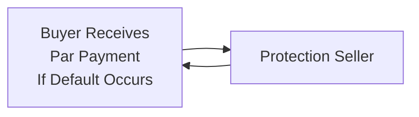

### Introduction
Credit Default Swaps (CDS) serve a dual purpose in today's fixed income and credit markets: they help institutions hedge default risk while enabling investors to speculate on changes in a borrower’s credit quality. If you're new to CDS, imagine it like an insurance policy—only instead of protecting your car, the policy protects you against a bond issuer’s default. 

But I remember when I first learned about CDS, I thought, “Wait, so there's a contract that pays out if a company defaults, but we can actually trade it on a daily basis?” It can feel a bit mind-boggling at first. Let’s break it down step by step, clarifying the structure, typical credit events, and the settlement protocols that keep CDS markets orderly. We’ll also look at a few of the advanced considerations, from restructuring clauses to the dreaded “cheapest-to-deliver” scenario under physical settlement.

### CDS Contract Basics and Cash Flows
A CDS can be visualized as a contract between two parties: the protection buyer and the protection seller. The buyer pays a periodic premium (often called the CDS spread) to the seller, who in turn provides protection if (and only if) a specified credit event occurs. 

- Protection Buyer: Pays regular premium payments (the “premium leg”) to the seller.
- Protection Seller: Receives the premiums but is obligated to compensate the buyer if a credit event (e.g., the reference entity defaults) occurs.

The premium is usually quoted in basis points, annualized, but typically paid in quarterly installments. For example, if the CDS spread is quoted at 100 basis points (1%), on a notional of $10 million, the quarterly payment would be 1% × $10,000,000 × (¼ year) = $25,000 each quarter, assuming no credit event has yet taken place. If the reference entity defaults, the protection seller stops receiving periodic payments and must make the buyer whole (subject to the settlement process described below).

#### Accrued Premium
A CDS contract often includes a feature such that if a credit event occurs partway through a payment period, the buyer must pay any accrued premium due up to the date of default. This makes sense because from the start of the last payment date until the default date, the buyer has been “on cover”—that is, receiving insurance protection. So, the buyer pays the partial premium they owe at the moment the credit event is declared.

### What Constitutes a Credit Event?
One of the biggest sources of confusion around CDS is determining what actually triggers the protection seller’s payment. In practice, this is fairly standardized by the International Swaps and Derivatives Association (ISDA). Some common triggers are:

• Bankruptcy: The reference entity files for bankruptcy or other insolvency proceedings.  
• Failure to Pay: The reference entity fails to make a scheduled payment on its debt beyond any grace period.  
• Restructuring: A somewhat more complicated scenario in which the debt’s terms are altered to suit the distressed borrower, such as maturity extensions, coupon reductions, or principal haircuts.

ISDA’s definitions are crucial. The 2014 ISDA Credit Derivatives Definitions (and subsequent amendments) clarify what counts as restructuring in different regions. In some jurisdictions, even a forced extension of maturity can be considered a partial default, while in others it might require more severe changes to qualify as a restructuring event. As we’ll see later, the “Modified Restructuring” (Mod-R) vs. “No Restructuring” clauses can significantly affect how you interpret your CDS contract.

### Settlement Protocols
If a credit event is declared, the next question is: how does the protection seller make the buyer whole? Two primary methods apply:

#### Physical Settlement
With physical settlement, the protection buyer delivers eligible defaulted bonds (or loans) of the reference entity to the seller. In exchange, the seller pays the buyer the bond’s face value (often “par”). If you think about an old-school insurance analogy, it’s akin to handing over the damaged property in exchange for the full insured value.

• Physical settlement is often favored by investors who hold the underlying bonds because they can offload them at par once a default happens.  
• One complicating factor is the “cheapest-to-deliver” notion. The buyer will typically look for the lowest-priced eligible instruments to deliver (within the constraints of the contract) so that it captures the largest economic benefit.  

#### Cash Settlement
Cash settlement avoids the fuss of physically exchanging bonds. Instead, the parties agree on a reference price for the defaulted bond (the “recovery price”) and the protection seller pays the buyer the difference between face value and that recovery price.

For instance, if the reference entity’s bonds are deemed to be worth $20 per $100 of face value, the protection seller pays $80 per $100 notional to the protection buyer. Modern CDS transactions commonly use an ISDA-led auction to arrive at this final “auction price.”

### The ISDA Auction Process
Nowadays, many CDS trades adopt a protocol specifying that settlement will occur via an ISDA-monitored auction. This is how it typically works:

• An auction is called once a credit event is officially confirmed.  
• A group of participating dealers submits bids and offers for the defaulted bonds.  
• The auction mechanism determines a final price (the “Auction Final Price”), which becomes the consensus “recovery price” for purposes of calculating cash settlement.  
• The protection buyer receives (Par Value – Auction Final Price) from the protection seller.

This standardized process prevents the chaos of bilateral negotiations on bond value and ensures that most market participants converge on the same recovery value.

### Advanced Considerations
CDS can get more complicated than straightforward premium-for-protection. Below are a few of the more nuanced angles:

#### Restructuring Clauses
Some CDS contracts allow restructuring to be an official credit event; others do not. Under “Modified Restructuring,” restructured debt can trigger the CDS, but only certain types of extended maturities or coupon changes qualify. Under “No Restructuring” clauses, the trigger is strictly limited to more conventional defaults, like missed payments or bankruptcy.

Market participants in Europe often see “Modified-Modified Restructuring” (Mod-Mod-R) which sits somewhere between fully including and fully excluding restructuring events. Region and contract preference shape which version you’ll encounter.

#### Cheapest-to-Deliver
In physical settlement, if the contract is triggered, the buyer can deliver whichever eligible obligation is “cheapest.” Commonly, the buyer (if they’re a hedge fund, for instance) will scour the market for the most deeply discounted bond—while still meeting contract eligibility requirements—and deliver it. This obviously affects the overall transaction cost to the seller, who must pay par for a bond that’s trading substantially below par. As a result, sellers often prefer narrower definitions of deliverable obligations to limit the buyer’s cheapest-to-deliver advantage.

#### Changing CDS Spreads
A CDS spread is just like an insurance premium—except it’s dynamic. As the reference entity’s creditworthiness shifts, the implied probability of default changes, and the CDS spread will widen or tighten. A mild rumor of distress can make spreads jump, while a surprise improvement in fundamentals can tighten spreads. 

When you see a sudden spike in a company’s CDS spread, the markets are signaling elevated default concerns. Conversely, a hefty compression in spread suggests the market perceives lower default risk. 

### Practical Real-World Applications
• Risk Management: Banks or large institutions with big exposures to a corporate bond can buy CDS protection to hedge their default risk. Think of it as wearing a seatbelt when the road might get slippery.  
• Speculation: Hedge funds might buy CDS protection to bet that a credit event is coming, or sell protection to profit from stable credit conditions if they expect no default will happen.  
• Basis Trading: This strategy involves exploiting pricing discrepancies between the CDS spread and the yield spreads of the underlying bonds. If the bond is deemed “cheap” relative to the CDS, you might buy the bond (long credit) and buy CDS protection. The reverse might apply if the bond is “rich” relative to the CDS.  

### Illustration with a Quick Example
Let’s say Bank A has a $10 million corporate bond from Company X. Bank A worries that Company X is heading toward trouble. It decides to buy CDS from a protection seller at a spread of 200 basis points per year. That’s 2% on $10 million = $200,000 in annual premium. Typically, this is split into four quarterly payments of $50,000 each. 

If Company X defaults:
1. Bank A stops paying further premiums (beyond accrued amounts).  
2. Bank A either delivers the defaulted bond to the seller (physical settlement) or is compensated in cash for the bond based on the final auction price.  
3. If the bond’s recovery rate is 30%, the protection seller pays out 70% of par ($700,000 per $1 million, totaling $7 million).  

Without CDS, Bank A would have to realize much of that loss itself. By using CDS, the bank effectively limited its downside risk, though at the cost of paying the ongoing premium.

### How Settlement Actually Happens: Step by Step
1. A credit event is declared by the appropriate determinations committee or relevant authority (often referencing ISDA definitions).  
2. If physical settlement is used, the buyer must notify the seller of their intention to deliver bonds. The notice includes the par amount and the specific bonds that qualify.  
3. If cash settlement is used, the auction process kicks in. A set of designated dealers tries to fix a final settlement price.  
4. Once the final price is published, the seller pays (Notional – Notional × Auction Final Price) to the buyer. If the auction price is 25 cents on the dollar, the buyer gets 75% of the notional.  

### A Word on Accrued Premium
Don’t forget that the buyer must often pay the accrued premium at the time of the default if the event occurs between premium dates. If a credit event happens 1.5 months into the quarter, the buyer pays for that 1.5 months of coverage before receiving the payout.

### Potential Pitfalls and Best Practices
• Documentation Risk: Always double-check what’s in the CDS contract, especially regarding deliverable obligation specifications and restructuring definitions.  
• Basis Risk: Hedging a single bond with a broad CDS index can lead to basis risk if the underlying index behaves differently than the specific bond.  
• Liquidity: CDS markets can dry up in times of crisis or for smaller reference entities. Spread quotes may become unreliable, or the cost might spike.  
• Regulatory/Accounting Complexities: Different jurisdictions have separate capital treatment for CDS, possibly complicating a bank’s capital adequacy calculation.  

### Exam Tips
For exam item sets, be prepared for scenario-based questions that test your understanding of credit event definitions and settlement mechanics. You might see a short story describing an issuer’s restructuring or missed payment, and you’ll have to decide (a) whether that triggers the CDS, (b) which settlement mechanism is used, (c) how to calculate the final payment, and (d) what accrued premium is owed.

You should also be ready to discuss the rationale behind physical vs. cash settlement, the role of ISDA auctions, and the idea of cheapest-to-deliver. Sometimes the question will highlight a complex restructuring scenario and ask if it triggers coverage under “Modified Restructuring” or “No Restructuring” conventions. 

Finally, remember that building a hedging position or a speculative position can be tested via numerical examples involving the notional amount, the annual spread, the probability of default, and the expected recovery rate. The exam might ask you to compute the expected payoff or the fair value of a CDS contract.

### Additional References and Further Exploration
• ISDA Credit Derivatives Definitions: The ultimate reference on standard credit event triggers and settlement procedures.  
• Choudhry, M. (2018). The Credit Default Swap Basis. Explores basis trading opportunities and the interplay between CDS and underlying cash bonds.  
• Risk.net and Bloomberg: Provide timely insights on how CDS markets reacted to major corporate defaults (e.g., “ISDA holds auction for X Company’s default”).  
• CFA Institute materials on “Credit Derivatives”: Offers deeper coverage of valuation, trading strategies, and risk management considerations associated with CDS.  

---

## Test Your Knowledge: CDS Mechanics and Settlement Protocols



### Which party regularly pays the CDS spread in a standard single-name CDS contract? 
- [x] The protection buyer
- [ ] The protection seller
- [ ] The reference entity
- [ ] The bond trustee

> **Explanation:** The protection buyer pays the premium (CDS spread) to the protection seller in exchange for default protection.  

### How are CDS spreads most commonly quoted, and how are they typically paid?
- [ ] They are quoted daily and paid daily.
- [ ] They are quoted monthly and paid upfront.
- [x] They are quoted annually but usually paid in quarterly installments.
- [ ] They are quoted quarterly and paid annually.

> **Explanation:** CDS spreads are quoted on an annualized basis (e.g., 100 bps = 1%) but the actual payments are typically made quarterly.  

### Which of the following would most likely be considered a credit event under a typical ISDA definition?
- [ ] A small decline in the reference entity’s bond price.
- [x] Bankruptcy filing of the reference entity.
- [ ] A downgrade to the entity's credit rating.
- [ ] A market rumor of liquidity issues.

> **Explanation:** Bankruptcy is a standard credit event. Market rumors or price declines and rating downgrades generally do not trigger CDS protection unless they lead to actual failure to pay or other ISDA-defined events.  

### Under physical settlement of a CDS contract, the protection buyer usually:
- [ ] Sells additional bonds in the open market.
- [x] Delivers the defaulted bond to the seller in exchange for par.
- [ ] Delivers equity shares to the seller in exchange for par.
- [ ] Receives immediate bond coupons for the next coupon date.

> **Explanation:** Physical settlement involves delivering the defaulted debt security to the seller and receiving par (face value) in return.  

### What is the primary function of the ISDA CDS auction process?
- [ ] To determine if a credit event has occurred.
- [x] To establish a market-wide recovery (final) price for the defaulted bond.
- [ ] To automatically net all CDS positions across participants.
- [ ] To confirm the cheapest-to-deliver obligation.

> **Explanation:** ISDA auctions set the standardized recovery price used to calculate final settlement amounts under cash settlement.  

### In the event of a credit event occurring mid-way through a payment period, what happens to accrued premium?
- [x] The buyer pays the accrued premium up to the default date.
- [ ] The buyer pays only half of the accrued premium if it’s past the 15th day.
- [ ] The buyer gets a credit for any accrued premium from the seller.
- [ ] The accrued premium is waived and not owed anymore.

> **Explanation:** The protection buyer must settle any premium accrued from the last payment date through the credit event date.  

### Cheapest-to-deliver generally benefits:
- [x] The protection buyer.
- [ ] The protection seller.
- [ ] Neither party, it's just a formality.
- [ ] The reference entity itself.

> **Explanation:** Cheapest-to-deliver allows the buyer to deliver the lowest-priced eligible obligation at par, maximizing their benefit and the seller’s cost in physical settlement.  

### Which statement best describes the “No Restructuring” clause in a CDS?
- [ ] It triggers a credit event if the issuer extends maturity by one year.
- [ ] It requires the seller’s explicit consent to settle default scenarios.
- [x] It excludes restructuring scenarios from being considered credit events.
- [ ] It applies only to sovereign bonds.

> **Explanation:** “No Restructuring” excludes restructuring scenarios from triggering a payout under the CDS; it focuses on more concrete default events like bankruptcy or failure to pay.  

### If a CDS contract calls for cash settlement and an ISDA auction establishes a defaulted bond’s final price at 35%, how much would the protection buyer receive (per $1 face value)?
- [ ] $0.35
- [x] $0.65
- [ ] $1.35
- [ ] $0.35 minus accrued premium

> **Explanation:** Under cash settlement, the seller pays (1 – final price) = 65% of par in this example.  

### True or False: A wider CDS spread almost always indicates that the reference entity’s default risk is perceived to be higher.
- [x] True
- [ ] False

> **Explanation:** A widening spread is typically interpreted as a sign the market views the issuer’s credit risk as increasing, hence the higher “insurance” cost.  


