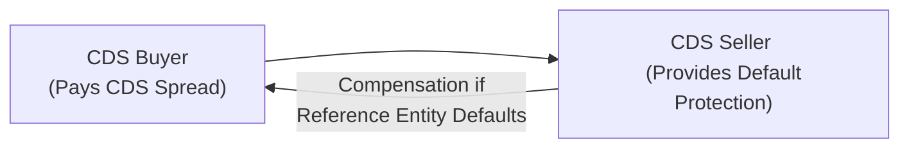

## Fundamental Pricing Approach

Anyone who has peeked into the CDS world tends to focus first on this fundamental question: “How on earth do we actually price one of these contracts?” I still remember my first real CDS trade—my heart was pounding, partly because I was worried about messing up the math, but also because I knew how crucial these instruments can be for hedging credit risk. So, let’s break it down.

At its core, a credit default swap (CDS) can be thought of as an insurance policy on an underlying reference entity’s debt. The buyer pays a periodic fee—also called the premium or spread—and in return, the seller agrees to compensate the buyer if that reference entity defaults. The fair spread on a CDS is found by equating:

• The present value of the premium leg (the buyer’s expected payments).  
• The present value of the protection leg (the buyer’s expected payout in the event of default).

### Premium Leg vs. Protection Leg

You can think of the premium leg as a series of payments made over the life of the CDS, typically quoted in basis points (bps) of the notional amount. If no default occurs, the buyer continues to pay this annualized spread until maturity (or until the contract is terminated).

The protection leg, on the other hand, represents the seller’s obligation if the reference entity defaults. If default happens, the buyer generally receives (1 – recovery rate) × notional, either via physical settlement (delivering the defaulted bond in exchange for par) or cash settlement. The exact formula for the “fair” CDS spread ensures that, at inception, the expected present value of these two legs is equal.

Here’s a more “mathy” representation that might look intimidating, but don’t worry—we’ll keep it conceptual:


\text{Fair Spread} \approx 
\frac{\displaystyle \int_{0}^{T} (1 - R) \cdot \lambda(s) \cdot e^{-\int_{0}^{s} [r(u)+\lambda(u)]\,du}\, ds}
{\displaystyle \int_{0}^{T} e^{-\int_{0}^{s} [r(u) + \lambda(u)]\,du}\, ds}


Where:  
• \\(R\\) is the recovery rate.  
• \\(\lambda(t)\\) is the hazard rate (a.k.a. default intensity).  
• \\(r(u)\\) is the risk-free or benchmark discounting rate.  
• \\(T\\) is the CDS maturity.

Intuitively, the numerator captures the expected loss portion (that is, how likely default is, multiplied by how much you lose), and the denominator captures a measure of how long you expect to pay spreads (discounted to present value).

Below is a quick mermaid diagram to visualize the flow between the CDS buyer and seller:

### Discount Rate Considerations

In practice, we often discount future payments at LIBOR/SOFR-based rates. The discount curve should reflect the **risk-free or near-risk-free** environment, or sometimes the swap curve for the corresponding maturities. This discount rate assumption is key: an underestimation can inflate the present value of the premium leg, while an overestimation might distort the cost of protection.

## Credit Spreads and Market Conditions

Ever notice how, during a market scare, CDS spreads across a whole industry suddenly widen (and sometimes it feels like everything in your portfolio goes red)? That’s because CDS spreads respond massively to systemic or idiosyncratic shocks:

• **Default Risk Perception**: If investors believe that the chance of default is rising, they’re willing to pay more for protection, pushing up the CDS spread.  
• **Credit Quality Deterioration**: A downgrade or negative news—like a looming debt maturity or questionable earnings—often triggers an almost immediate reaction in spreads.  
• **Systemic Factors**: During economic downturns, or periods of high volatility (think major political shocks), entire sectors can see their average spread spike. Investors just get more defensive.

One personal anecdote: back in 2008, I recall seeing normally stable industrial names with CDS spreads that soared in tandem with finance companies. It demonstrated how quickly contagion and panic can ripple across the market, even when fundamentals might not have changed all that much.

## Hazard Rate (Default Intensity) Models

Though I joked earlier about the math, advanced pricing models use a hazard rate (or default intensity) to describe how likely an entity is to default over a small slice of time. This approach is typical in **reduced-form** credit models.

### Modeling Default Over Time

Under the hazard rate method, we assume that the probability of surviving (i.e., not defaulting) up to time \\(t\\) is:


S(t) = e^{-\int_{0}^{t} \lambda(\tau)\, d\tau}


where \\(\lambda(\tau)\\) is the default intensity at time \\(\tau\\). Intuitively, we integrate the hazard rate to find the cumulative chance of making it each step of the way.

### Calibrating with Market Data

We usually calibrate \\(\lambda(t)\\) by matching observed CDS spreads at various maturities. If we see that a 5-year CDS is trading at 300 bps, we back into the hazard rate that explains this spread. Of course, it’s never quite that straightforward in real life—liquidity premiums, small sample sizes, or unusual capital structures can cause calibration headaches.

## Recovery Rate Assumptions

The portion of par the lender (or protection buyer) expects to recover upon default is crucial to the CDS pricing process. A lower recovery rate means a larger expected loss on the underlying bond, and therefore a higher CDS spread.

### Market-Based Recovery

Sometimes the market sets a “standard” recovery rate for an industry (e.g., 40% for a certain senior unsecured bond). But as soon as there’s any whiff of a sector meltdown—maybe shipping or energy—market participants quickly revise these assumptions, which can push spreads higher. That shift can ripple through hazard rate calibrations.

If you want a quick rule of thumb:  
• Higher assumed recovery → Lower spread.  
• Lower assumed recovery → Higher spread.

Even a small change in your recovery assumption can dramatically alter the final CDS price.

## Advanced Focus: Structural vs. Reduced-Form Insights

Though the reduced-form approach is more common in day-to-day trading, structural models (like the Merton model) also inform participants about default risk. The Merton model sees a firm’s equity as a call option on its underlying assets—if assets dip below the firm’s liabilities, that’s effectively a default scenario.

In practice, many credit desks blend both approaches: they look at the firm’s option-implied volatility, capital structure details, and then cross-check with simpler hazard rate calibrations. They also incorporate swap curve adjustments (especially after LIBOR’s transition to SOFR), and factor in any liquidity premiums. Let’s face it, a meltdown scenario with no liquidity is going to widen CDS spreads even if the fundamental default risk hasn’t changed.

## Correlation and Contagion Effects

It’s not enough to just look at a single issuer in a vacuum. When multiple firms are operating in the same sector, or when the entire economy is in freefall, correlation can spike. Market participants might buy protection on a basket of names or an index (like the CDX or iTraxx series), which can push spreads up wholesale, even for firms that remain relatively solid. We saw this dynamic vividly in past crises: the tide goes out, and correlation leaps.

## Vignette Emphasis

In an exam setting, you might get a meaty scenario: imagine a hypothetical chemical manufacturer rumored to be facing litigation that could severely hamper its financials. The question might ask you to calculate the implied default probability given a certain bid/ask on the 5-year CDS, or how the spread should shift if the recovery rate changes from 40% to 30%. They might also throw in a scenario where the yield curve shifts, and you’ve got to recast the discount factors. Summaries for the exam:

• Carefully identify the contract terms (notional, maturity, recovery assumption).  
• Convert annual spreads to the correct payment frequency.  
• Adjust for discount factors.  
• Solve for or interpret the hazard rate.  
• Weigh changes in market condition and how they shift the credit spread.

Also, watch out for trick questions comparing the bond spread vs. the CDS spread. A bond’s yield spread may differ from the CDS spread due to contract differences, deliverable instruments, and the so-called “cheapest-to-deliver” option embedded in physical settlement.

## Practical Applications

### Hedging and Speculation

Banks, asset managers, and hedge funds use CDS for both hedging and speculative bets. If a bond manager wants to reduce exposure to a particular credit, they might buy CDS protection. Conversely, a manager might sell CDS protection if they believe the market’s default estimates are overly pessimistic.

### Capital Allocation Decisions

Some institutions use the implied default rates from CDS markets to guide capital reserves or to set risk limits. A sharp jump in CDS spreads can signal a forward-looking problem that might not yet show up in fundamental credit analysis (like a rating downgrade).

### Curve Trades

A trader could buy short-dated protection and sell long-dated protection on the same name, hoping the short end of the curve will widen relative to the long end. These so-called curve trades rely on shapes and shifts in the term structure of credit spreads.

## Glossary

• **CDS Spread (Premium)**: The annualized fee, in basis points of notional, paid by the protection buyer.  
• **Default Intensity (Hazard Rate)**: The instantaneous probability of default at any point in time.  
• **Recovery Rate**: The assumed fraction of par value recovered if default happens.  
• **Loss Given Default (LGD)**: (1 – Recovery Rate). Represents the portion of par value lost in the event of default.  
• **Term Structure of Credit Spreads**: How CDS spreads vary with different maturities.  
• **Upfront Payment**: Sometimes an up-front adjustment is needed if the on-market spread differs from a standardized “running” spread (e.g., 100 bps).  
• **Basis Points (bps)**: One bps = 0.01%.

## References and Further Reading

• Jarrow, R. & Turnbull, S. (1995). “Pricing Derivatives on Financial Securities Subject to Credit Risk.” Journal of Finance.  
• Hull, J. (2012). Options, Futures, and Other Derivatives. Pearson. (Credit Derivatives Chapters)  
• CFA Institute Level II Curriculum – Fixed Income and Derivatives (Readings on pricing credit risk and CDS).  
• Moody’s Analytics. “The Merton Model and Credit Spreads.”  

## Test Your Knowledge: Pricing and Factors Affecting CDS Spreads



### A CDS buyer typically compensates the seller using which of the following?
- [ ] A one-time lump sum calculated on LGD
- [x] A periodic spread in basis points on the notional
- [ ] Only the protection leg if default occurs
- [ ] Physical delivery of a bond at maturity

> **Explanation:** The buyer of CDS pays a periodic premium (spread) calculated on the notional amount until maturity or until a credit event occurs. 

### Which of the following best expresses how a higher recovery rate assumption affects the fair CDS spread, all else equal?
- [ ] It increases the CDS spread
- [ ] It creates no change in the CDS spread
- [x] It lowers the CDS spread
- [ ] It first increases and then decreases the CDS spread

> **Explanation:** A higher recovery rate assumption implies a smaller loss given default, thus requiring a lower CDS spread to make the contract fair at initiation.

### Which statement about hazard rate (default intensity) models is correct?
- [x] Hazard rate models estimate default as a continuous-time process with an instantaneous probability of default
- [ ] Hazard rate models cannot be calibrated against market CDS spreads
- [ ] Hazard rate models assume zero recovery rate by default
- [ ] Hazard rate models always produce a flat term structure

> **Explanation:** Hazard or default intensity models treat the chance of default as an instantaneous probability in each small time interval. They are often calibrated to observed CDS spreads.

### In a fair CDS contract at inception, the present value of the premium leg is set to:
- [x] Equal the present value of the protection leg
- [ ] Exceed the present value of the protection leg by a liquidity premium
- [ ] Be twice the protection leg due to principal repayment risk
- [ ] Be the square of the hazard rate times notional

> **Explanation:** By definition, the CDS contract is priced so that the two legs (the premium and the protection leg) have equal present values, meaning no arbitrage at inception.

### When investors believe that default risk has significantly decreased for an issuer, the most likely impact on that issuer’s CDS spread is:
- [x] It will tighten (decrease)
- [ ] It will widen (increase)
- [ ] It will remain unchanged
- [ ] It will invert to negative values

> **Explanation:** Improved credit quality (i.e., lower perceived default risk) causes spreads to tighten because the fair cost of protection decreases.

### Which of the following would most likely cause CDS spreads to rise for a broad market index?
- [ ] A significant increase in the average recovery rate
- [x] Heightened systemic uncertainty or a major economic downturn
- [ ] A stable macroeconomic environment
- [ ] A sharp drop in short-term interest rates

> **Explanation:** Systemic risk factors like a looming recession or severe market turbulence can push CDS spreads higher across the board, reflecting increased perceived default probabilities.

### How does an increase in volatility of a reference entity’s asset values generally affect its CDS spread?
- [x] It tends to increase the CDS spread
- [ ] It tends to reduce the CDS spread
- [x] It can increase the hazard rate estimation
- [ ] It has no effect on the CDS spread

> **Explanation:** Higher volatility increases the probability that the firm’s asset value might fall below its liabilities (in a structural model view). This raises the hazard rate and CDS spreads.

### One typical difference between bond yield spreads and CDS spreads for the same issuer is that:
- [x] Bond yield spreads can reflect funding and liquidity factors absent in CDS spreads
- [ ] CDS spreads are always lower than bond spreads
- [ ] Bond yield spreads never account for credit risk
- [ ] They converge to the same figure during periods of market stress

> **Explanation:** Bond yields can be influenced by various market frictions (liquidity risk, funding costs), whereas CDS spreads aim to isolate and reflect default probability and recovery assumptions more directly.

### A short-term CDS spread is tighter relative to a longer-term CDS spread for an issuer. One explanation could be:
- [x] Investors perceive lower near-term default risk but greater uncertainty in the distant future
- [ ] Investors perceive immediate risk but no future risk
- [ ] The hazard rate is locked at zero
- [ ] The short-term spread must always exceed the long-term spread

> **Explanation:** If there is higher uncertainty in the longer run, the term structure can slope upward, meaning short-dated spreads remain lower due to perceived lower near-term risk.

### A CDS contract requires no payments if:
- [x] True
- [ ] False

> **Explanation:** If there is no credit event and the contract reaches maturity without default, then the protection seller collects the periodic premiums and pays nothing other than providing the insurance coverage. In other words, no default means no protection payoff.


