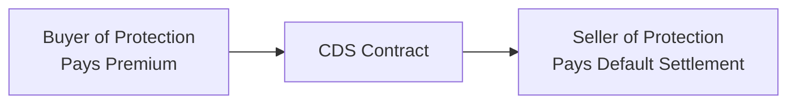

## Scenario Overview

Picture this: You’re managing a fixed income portfolio regularly exposed to both investment-grade and high-yield issuers. Suddenly, the broader economy starts flashing red with weakening GDP growth, signs of monetary tightening, and shaky corporate cash flows. You know from experience that when macroeconomic indicators falter, corporate defaults can rise—especially in speculative-grade names. 

Enter credit default swaps (CDS): derivatives designed to protect (or profit) from a deterioration in an issuer’s creditworthiness. As the manager, you’re now considering single-name CDS to hedge specific problem issuers and an index CDS to shield the entire portfolio from systemic shocks. In an exam or real-world scenario, you’d be asked to figure out which route—single-name or index CDS—makes sense, how to calculate potential payouts, and how to interpret all these cross-currents of default risk.

Below, we work through a vignette that walks you through essential tasks: identifying credit events, calculating cash settlements, deciding between physical and cash settlement, and evaluating the risk/reward trade-off of different CDS-based hedges. We’ll also look at advanced angles like correlation, scenario analysis with hazard rates, and liquidity considerations.

## Key Concepts: Single-Name vs. Index CDS

When you buy a single-name CDS, you’re effectively purchasing insurance on a specific issuer (e.g., Company X). If Company X defaults—triggering a “credit event”—the CDS seller compensates you (the protection buyer). In return, you pay a periodic premium (the CDS spread) until maturity or until a credit event occurs.

An index CDS aggregates multiple issuers—think a basket of corporate bonds, often grouped by rating or sector (like the CDX for North American high-yield names). If any issuer in the index defaults, there’s a payment to the protection buyers. Index CDS contracts can hedge systemic or sector-wide risk relatively quickly, though they might not perfectly offset the idiosyncratic risk of any single issuer. 

Here’s a quick table comparing the two:

| Factor                 | Single-Name CDS                           | Index CDS                                                    |
|------------------------|-------------------------------------------|--------------------------------------------------------------|
| Coverage               | Protection on a specific issuer           | Protection on a basket of multiple issuers                   |
| Precision of Hedge     | High (idiosyncratic risk coverage)        | Low (offsets broad macro or sector risk)                     |
| Premium Cost           | Depends on issuer-specific spread         | Spread reflects average credit risk of the index component   |
| Liquidity              | Can be illiquid for smaller issuers       | Often more liquid, standardized structure                    |
| Risk-Reward Profile    | Concentrated exposure to a single name    | Diversified, more partial hedge                              |

## Understanding Credit Events and Settlement Mechanisms

Credit events are conditions that constitute a default under CDS documentation. Common triggers include missed coupon payments, bankruptcy, and debt restructuring. A typical exam or real-life scenario would require you to figure out whether a specific event (say, a missed coupon) qualifies as a credit event under International Swaps and Derivatives Association (ISDA) definitions.

Once a credit event is confirmed, two main settlement routes exist:

• Physical settlement: The protection buyer delivers the defaulted bond (or loan) to the protection seller and receives the par value in exchange.  
• Cash settlement: The protection buyer receives a cash amount reflecting the difference between par and the post-default market value of the reference obligation.

It’s a classic decision: physical settlement can be more direct if you already hold the bond, but it sometimes poses logistical challenges if the bond is hard to deliver or if a scramble for deliverable bonds ensues. Cash settlement is more streamlined, especially when physically exchanging bonds is cumbersome or if you want to avoid the operational hassle.

## Diagram: Flow of Payments

To visualize how CDS payments work, here’s a simple Mermaid diagram. The buyer of protection pays a periodic premium. If default occurs, the seller of protection pays the settlement amount.

## Calculating Cash Settlements

Let’s say Company X, a high-yield issuer, misses its coupon payment—a “failure to pay” credit event. The bond’s price collapses from par (100) to 40 on default. With a notional value of $1 million, if you hold the protection via cash settlement, your compensation is:

• (Par – post-default price) × notional = (100 – 40) × $1,000,000 ÷ 100 = $600,000  

However, continue to factor in the accrued premium. If the credit event happens mid-cycle, you owe the seller the unpaid portion of your premium for that accrual period. On the exam, watch for a line or two in the vignette specifying how many days into the premium cycle you are so you can handle the final fractional premium.

## Considering Recovery Rates

Hedging with CDS crucially depends on the assumed recovery rate (R). If R is the fraction of par an investor recovers upon default, then logically the “loss given default” is (1 – R). In general:

• Higher R → Lower default losses → Less valuable protection  
• Lower R → Higher default losses → More valuable protection  

Because the CDS settlement is typically (1 – R) × notional when default occurs in a cash settlement scenario, a big shift in R can radically change your payoff. But watch out—recovery rates can vary by seniority or claim type, so be sure you’re matching the reference obligation with the appropriate bond or loan in your portfolio.

## Hazard Rates and Scenario Analysis

Examiners often introduce hazard rates (λ) to model the probability of default over time. The hazard rate is the conditional default probability given survival to that point. For instance, if you forecast a 10% hazard rate for the next year, that suggests about a 10% chance of default within the year, but the actual math can get more nuanced if you spread that across months or consider continuously compounded rates.

A simplified formula for the fair CDS spread might look like:


\text{CDS Spread} \approx \frac{\lambda (1 - R)}{\sum_{t=1}^{N} D(t) S(t)}


where:  
• \\( \lambda \\) = Hazard rate (default intensity)  
• \\( R \\) = Recovery rate  
• \\( D(t) \\) = Discount factor for time \\( t \\) (often from a relevant discount curve)  
• \\( S(t) \\) = Survival probability up to time \\( t \\)  

The denominator essentially sums the present value of all premium payments the protection seller expects to receive, weighting each by the probability of surviving to that payment date. On the exam or in real practice, you might see a table with different hazard rates, discount factors, or survival probabilities. You’d be asked to compute or compare hypothetical spreads or break-even default rates to see if the CDS is priced attractively for your forecast default scenarios.

## Single-Name vs. Index: Risk-Reward Trade-Offs

Imagine you’re worried about a specific high-yield issuer—say it’s in the retail sector that’s especially vulnerable to an economic downturn. Using single-name CDS, you can precisely hedge just that issuer’s default risk. That’s especially appealing if your portfolio weighting is large in that name and if you strongly believe it faces idiosyncratic distress.

But if you suspect a wider meltdown across multiple sectors, or you want a quick macro hedge, an index CDS (like CDX or iTraxx) can offset a broader portion of your portfolio’s credit exposure. The trade-off is that the index approach won’t perfectly align with your particular bond holdings. Some credits in the index might never default, while some of your holdings outside the index might get hammered by a default. 

## Liquidity and Market Depth

Another big check for your hedging choice: liquidity. Many small issuers’ single-name CDS markets get thin quickly, especially if the issuer is borderline or not widely traded. That can drive spreads sky-high or create wide bid-ask spreads. Index CDS, on the other hand, typically enjoy more robust liquidity because they’re standardized, actively traded products. The upshot: it’s often cheaper or at least more straightforward to transact in an index CDS, though you’ll compromise on precision.

## Portfolio Correlation Effects

Remember that while an index CDS addresses broader macro factors, it won’t necessarily protect you from quirks and fundamentals unique to a single issuer. If that issuer’s correlation with the broader market is relatively low, an index hedge might miss the mark. If your high-yield issuer is in a sector that’s diverging from the overall market, or if you’re seeing big idiosyncratic negative news, a single-name CDS is likely your best option.

However, if your entire portfolio is loaded with high-yield corporates from various sectors, the index route might be a more cost-effective macro hedge. In exam item sets and real life, you’ll often see a scenario with partial correlation across different issuers. Maybe the auto sector is heavily correlated to consumer spending cycles, while healthcare is less so. Understanding these correlation nuances helps you see how your chosen CDS might or might not deliver the risk reduction you want.

## Practical Vignette: Choosing a Hedging Strategy

Let’s walk through a plausible portfolio scenario:

• You hold $20 million in an array of corporate bonds—some investment-grade, some high-yield.  
• You’re particularly worried about “XYZ Corp,” a high-yield retail issuer that’s occupying $3 million of your portfolio. You see depressed quarterly sales and think it might default within a year.  
• You also notice worrisome macro signals that affect global credit markets as a whole.  

You have two broad choices:

1. Buy single-name CDS on XYZ Corp for $3 million notional.  
2. Buy an index CDS (e.g., CDX High Yield) for a $5 million notional to reduce your overall high-yield exposure.

In an exam question, you might see tables:

• CDS premium for XYZ Corp: 400 bps  
• Index CDS premium on CDX: 280 bps  
• Estimated recovery for XYZ Corp: 30%  
• Probability of default for XYZ Corp: 18% over the next 12 months  
• Probability of default for the index as a whole: 7% (weighted average)

Your job would be to figure out which choice is more cost-effective. You’d calculate that single-name CDS costs you 400 bps, but it fully addresses the 18% default likelihood for that specific name. Meanwhile, the index’s 280 bps might hedge a broader chunk of your credit risk, but it only partially hedges XYZ, and the overall default probability is lower. 

If you strongly suspect XYZ is going under soon, you might prefer the targeted hedge, despite its higher spread cost. If you expect a more generalized credit meltdown, the index route might give you a better big-picture hedge. Also factor in your portfolio’s correlation: maybe your other high-yield bonds correlate heavily with XYZ’s sector, in which case the index approach can cover more than one problem child.

## Settlement: Physical vs. Cash

One subtlety is how, in a forced default scenario, the final payoff occurs. Make sure you read each question or scenario carefully. Physical settlement demands you deliver the actual bond after default to the seller. This can be beneficial if you already hold the bond and want to get rid of it at par. Cash settlement means you receive a payment equal to (par – recovery price). This might be simpler administratively but watch out for the final determination of the recovery price—especially if the bonds become illiquid in a distressed market. 

## Potential Pitfalls and Common Mistakes

• Not verifying that a missed coupon or restructuring event meets the official credit event definition under ISDA.  
• Confusing the “premium accrual” with the coupon accrued on the underlying bond.  
• Inaccurate or outdated assumptions about recovery rate, leading to mispriced or misunderstood protection.  
• Over-hedging or under-hedging due to correlation assumptions that turn out to be off in real life.  
• Underestimating liquidity risk, especially in single-name CDS for smaller issuers.  

## Best Practices and Practical Tips

• When analyzing potential CDS hedges, perform scenario analysis across multiple hazard rates: a bullish scenario (low default risk), a base scenario, and a stress scenario (high default risk).  
• Combine single-name and index CDS for layered protection, where the index covers your broad credit exposure and the single-name instrument zeroes in on your biggest trouble spots.  
• Continuously monitor the credit environment: If you see fundamental changes in the issuer’s outlook or macro environment, adjust your hedges swiftly. CDS markets can move fast!

## Example of a Multi-Rate Scenario Analysis

Let’s say interest rates or hazard rates are “low,” “medium,” or “high,” as shown below. The wide variation in hazard rates might yield drastically different outcomes for your CDS usage.

| Hazard Rate Scenario | Probability of Default (Next 12M) | Implied CDS Spread* (bps) |
|----------------------|------------------------------------|---------------------------|
| Low                  | 5%                                 | 150                       |
| Medium               | 10%                                | 250                       |
| High                 | 20%                                | 480                       |

*These spreads assume a 40% recovery rate. The actual formula will vary based on discount factors and survival probabilities.

In the “High” scenario, the cost of protection skyrockets, but the implied risk is also higher, so paying more might be justified if you strongly believe default is looming. For exams, you might be asked: “Given the manager believes the hazard rate is 20%, is the 480 bps spread on XYZ’s CDS overpriced or underpriced compared to the manager’s internal model?”

## Final Thoughts and Exam Tips

In a typical Level II item set, you’ll see a narrative about a portfolio manager juggling different bonds, accompanied by tables of current CDS spreads, possible hazard rates, and clues about macro conditions. You’ll need to pick the “most cost-effective” or “most appropriate” hedge. Avoid tunnel vision: read carefully, mind the definitions, do the arithmetic on premium costs, and consider whether the question hints at a broad meltdown or a single-issuer meltdown. 

Above all, watch for subtle twists: maybe the question states that you can’t physically deliver the bond or there’s a settlement advantage if you do. Or maybe the question signals that the bond is trading at 20 or 30 points below par, so you see a certain recovery level. The devil’s in the details, and exam vignettes are designed to test how well you integrate them.

## References for Further Exploration

• CFA Institute official practice materials for Level II: Credit Derivatives.  
• Hull, John. Options, Futures, and Other Derivatives. (Comprehensive coverage of CDS valuation.)  
• Fabozzi, Frank. The Handbook of Fixed Income Securities. (CDS structures, multi-issuer hedging strategies.)  
• Risk Magazine articles on notable corporate defaults and how CDS markets reacted.  
• Bloomberg Intelligence sector reports for up-to-date spreads, default forecasts, and index methodology.

## Test Your Knowledge: Navigating CDS in a Portfolio Context



### In a single-name CDS, what best describes the role of the protection buyer?
- [ ] Pays a premium and receives coupon payments if there is no default.
- [ ] Receives a premium and pays par value if a default occurs.
- [x] Pays a premium periodically and receives a settlement if a credit event occurs.
- [ ] Issues the underlying bond to cover default losses.
> **Explanation:** The protection buyer in a single-name CDS pays periodic premiums to the protection seller. If the reference entity experiences a credit event, the protection buyer is entitled to receive compensation (physical or cash settlement).

### Which of the following situations likely triggers a CDS credit event under standard ISDA definitions?
- [ ] A change in the bond’s maturity date without alteration to its coupon payment.
- [ ] A significant decline in the bond’s secondary market price.
- [x] The issuer fails to pay its scheduled coupon by the end of the applicable grace period.
- [ ] The bond is upgraded from BB to BBB.
> **Explanation:** Under most ISDA definitions, failing to pay a scheduled coupon (once the grace period is exceeded) qualifies as a credit event. Market price declines or rating changes do not automatically trigger a CDS.

### Which factor is a primary disadvantage of physical settlement in CDS?
- [ ] It is more costly in every scenario.
- [x] Delivering the defaulted bonds may be difficult or operationally cumbersome.
- [ ] There is no guarantee of receiving par value from the protection seller.
- [ ] Regulatory agencies prohibit physical settlements in most jurisdictions.
> **Explanation:** Physical settlement requires delivering defaulted bonds, which can become difficult and potentially expensive if a market scramble develops for deliverable obligations post-default.

### In determining whether to choose an index CDS to hedge broader risk, what should a manager primarily consider?
- [x] The correlation of individual holdings to the index composition.
- [ ] The correlation of the benchmark equity index to the bond market.
- [ ] The issuer’s specific recovery rate on the day of default.
- [ ] The distance to default using a Merton model.
> **Explanation:** When using index CDS to hedge, the manager should check the overlap and correlation between the portfolio’s holdings and the index. If correlation is low, the hedge may be inefficient.

### If you want to target a specific troubled issuer in your portfolio, which instrument most effectively addresses idiosyncratic (issuer-specific) risk?
- [ ] Interest rate swap.
- [ ] Index futures on the S&P 500.
- [x] Single-name CDS.
- [ ] Currency forward contract.
> **Explanation:** A single-name CDS focuses on one issuer’s credit risk, making it the cleanest hedge if you have a strong conviction that a particular issuer is in trouble.

### In a cash settlement scenario, if an issuer’s bond trades at 25% of par post-default, how much does the protection buyer receive for $1 million notional (ignoring premium accruals)?
- [ ] $25,000
- [ ] $100,000
- [x] $750,000
- [ ] $975,000
> **Explanation:** The payoff is (par – market price) × notional ÷ 100. So (100 – 25) × $1,000,000 ÷ 100 = $750,000.

### An exam vignette shows that single-name CDS on an issuer is quoted at 500 bps. The issuer’s estimated hazard rate is 25%, with a 30% recovery assumption. How might you judge the CDS if the fair spread is calculated at 650 bps under your model?
- [x] The quoted spread suggests the CDS might be undervalued, offering a potential buying opportunity.
- [ ] The spread is too high, indicating the market is overestimating default risk.
- [ ] The spread is exactly fairly priced, so no action is needed.
- [ ] The CDS is overpriced, indicating a short CDS position is best.
> **Explanation:** If your model says fair value is 650 bps, but the market quotes 500 bps, the cost to buy protection is cheaper than your model’s implied fair price, hinting that the CDS might be undervalued.

### A risk manager evaluating single-name CDS that is thinly traded should be most concerned with:
- [ ] Bankruptcy law changes in foreign jurisdictions.
- [ ] Changes to the reference obligation’s coupon frequency.
- [ ] The volatility of global oil prices.
- [x] Liquidity constraints that inflate bid-ask spreads and reduce pricing transparency.
> **Explanation:** When a single-name CDS is illiquid, bid-ask spreads widen, creating higher transaction costs and less transparency. This can significantly affect hedging effectiveness.

### Which best describes the function of recovery rate (R) in CDS valuation?
- [ ] It is the discount factor applied to all future cash flows.
- [ ] It measures the probability of default in each period.
- [ ] It is the premium paid by the protection buyer.
- [x] It indicates the fraction of par value that investors recover following default.
> **Explanation:** The recovery rate (R) denotes the fraction of principal investors expect to recoup if default occurs and directly impacts the protection payment.

### A manager buys an index CDS to hedge a portion of her high-yield portfolio. True or false: This approach instantly offsets all issuer-specific credit risk in the portfolio.
- [x] True
- [ ] False
> **Explanation:** This is a trick question. The statement is actually false in practice, but if we treat it as a classic “true or false” item, note that the manager “instantly” gets a broad hedge. However, it does not perfectly offset single-issuer risk. Always check the correlation between the index and the actual exposures.


