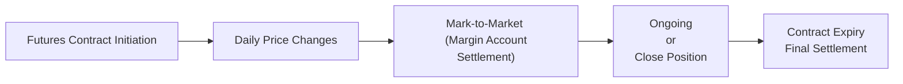

## Overview

I remember the first time I tried explaining Forward Rate Agreements (FRAs) to a friend over coffee, and I pretty much just stared at my cup and said, “Well, you know, you lock in a rate for the future.” He gave me this look like, “That’s it?” In a way, that actually is the big-picture idea. But let’s dig in deeper, because FRAs and short-term interest rate futures aren’t just about “locking in” rates. They’re about precise hedging, speculation, and portfolio rebalancing—especially in a fixed income context where interest rate risk is often a top concern.

In this section, we’ll explore how FRAs and interest rate futures (like Eurodollar or SOFR futures) are used in fixed income portfolio management. We’ll highlight how they work, the subtle differences between them, and some best practices (including how not to get caught off guard by basis risk or settlement mismatches).

## Forward Rate Agreements (FRAs) — Key Concepts

An FRA is basically an over-the-counter (OTC) contract that lets you set an interest rate now for borrowing or lending at some future date. If you’re the buyer of an FRA, you’re effectively concerned about rising interest rates—you want to lock in a favorable (lower) rate before it goes up. Conversely, if you’re a seller, you might worry about falling rates and you want to secure a higher rate now.  

Unlike exchange-traded futures, FRAs are private contracts:  
• Negotiated directly between counterparties (usually with a bank acting as a dealer).  
• Settled in cash at the start of the underlying loan period.  
• The settlement amount is based on the notional principal, the reference rate (like SOFR or what used to be LIBOR), and the difference between the agreed FRA rate and the prevailing market rate at settlement.

### FRA Mechanics in a Nutshell

1. Two parties agree on:  
   – Notional principal (e.g., $10 million).  
   – FRA rate (the fixed rate, say 4% annualized).  
   – Start date and end date of the underlying borrowing/lending period (e.g., 3 months from today to 6 months from today).  
   – Reference rate (e.g., 3-month LIBOR or 3-month SOFR).  

2. On the settlement date (the beginning of the underlying loan period):  
   – The FRA’s fixed rate is compared to the observed reference rate.  
   – A net cash payment is made from one party to the other.  
   – This payment is discounted back to the settlement date (because we’re converging on the present cost/benefit).  

3. After settlement, the contract expires. No ongoing margin calls exist (unlike with futures), but you do have counterparty credit risk because it’s a private OTC arrangement.

#### FRA Example

Let’s say you’re a portfolio manager who will borrow $10 million in 3 months, and you expect rates to rise. You enter into a 3×6 FRA (meaning it’s effective 3 months from now and settles at 6 months from now) at a rate of 4.00% annualized on a 3-month interest period.

• Notional: $10 million.  
• FRA rate: 4.00% annualized.  
• Underlying period: 3 months.  

Fast-forward to 3 months later—the reference rate observes at 4.25%. Because the rate is higher than the FRA’s rate, you as the FRA buyer receive a cash settlement compensating you for the extra 0.25% above the locked-in 4.00%.  

Using a simple calculation approach, the settlement formula for an FRA is typically:

( (Reference Rate – FRA Rate) × (Days in Underlying Period / 360) × Notional ) / 
(1 + (Reference Rate × (Days in Underlying Period / 360)) )

You, the buyer, gain if the reference rate ends up above 4.00%. If the reference rate is below 4.00%, you make a net payment.  

## Interest Rate Futures — Key Concepts

Unlike FRAs, interest rate futures are standardized contracts traded on an exchange (e.g., the Chicago Mercantile Exchange). Historically, Eurodollar futures were the benchmark for hedging short-term USD LIBOR rates, but with the post-LIBOR environment, SOFR futures are increasingly the go-to product.

• Standardization: Each contract has a fixed notional (often $1 million for Eurodollar and SOFR futures), a standardized maturity (quarterly), and a specific settlement procedure.  
• Daily Mark-to-Market: Gains and losses are credited or debited to your margin account daily.  
• Margin Requirements: You post initial margin and maintain variation margin.  
• Liquidity: Exchange-traded futures are often quite liquid, making it easier to enter and exit positions, though some contracts are more active than others.  
• Lower Counterparty Risk: The clearinghouse stands between counterparties, guaranteeing settlement so long as you keep your margin in good standing.  

### Example of Interest Rate Futures

Picture a 3-month Eurodollar futures contract:  
• Price is quoted as 100 minus the implied interest rate. For example, a 3-month interest rate of 3.0% implies a futures price of 97.00 (i.e., 100 – 3.00).  
• Each 1 basis point (0.01%) change in the interest rate corresponds to a specific tick value. For Eurodollars, that’s typically $25 per 0.01% for a $1 million notional over 3 months.  

So if you think rates will go up, you’d sell the futures contract (since higher rates mean lower futures prices). If you think rates will go down, you buy.

#### SOFR Futures

SOFR (Secured Overnight Financing Rate) futures are gradually replacing Eurodollar futures. The underlying mechanics are similar—the contract price is 100 minus the implied interest rate, the notional is typically $1 million, and daily settlement is in effect. One key difference is that SOFR is an overnight, nearly risk-free rate, while LIBOR was an unsecured term rate. This difference can introduce basis risk for some hedgers.

## Comparing FRAs and Futures

Although both FRAs and futures let you lock in or hedge a short-term interest rate, there are a few major differences:

• Type of Market:  
  – FRAs are OTC contracts that can be customized in terms of notional, start date, end date, day count convention, and reference rate.  
  – Futures are standardized, traded on organized exchanges.

• Credit Risk & Margin:  
  – FRAs have bilateral credit risk; each party faces the possibility the other might default.  
  – Futures are guaranteed by a clearinghouse, with daily margin requirements that significantly reduce counterparty credit risk.

• Liquidity:  
  – FRAs might be less liquid and often adjust less frequently.  
  – Futures typically offer higher liquidity and can be entered or unwound quickly.

• Settlement:  
  – FRAs settle in one net cash flow at the start of the underlying borrowing period.  
  – Futures settle daily (mark-to-market). Final cash settlement (or closeout) happens upon contract expiration if the position is still open.

• Basis Risk:  
  – In FRAs, you can, in theory, match the exact reference rate you’re exposed to.  
  – In futures, you’re beholden to the exchange’s reference rates. If your actual borrowing rate responds differently to the futures’ underlying rate, you may have some mismatch (basis risk).

## Basis Risk, Mark-to-Market, and Margin

A common question is: “Why wouldn’t I just stick to FRAs if I can customize them?” The answer often boils down to costs and flexibility. Futures markets usually provide narrower spreads, deeper liquidity, and less credit exposure. However, you might not always get a perfect hedge because your actual interest rate exposure could differ from the futures reference rate.

### Mark-to-Market Diagram

Below is a simple flow diagram illustrating how daily mark-to-market for futures differs from a single settlement in FRAs:

In an FRA, you effectively skip steps B and C: there’s just one big settlement near the start of the underlying loan period. This can be simpler if you're comfortable with the credit risk. But for an exchange-traded contract, you get daily settlement to avoid large exposures building up.

## Best Practices and Pitfalls

1. Align the Hedged Position’s Terms  
   – Make sure the day count convention in your FRA or futures reference matches the transaction you’re hedging. Misalignments can cause small but meaningful P/L leaks.  

2. Watch Out for Delivery or Expiration Mismatches  
   – If you’re hedging a 5-month exposure with a 3-month contract, you may need to roll futures each quarter. Rolling can incur costs and risk.

3. Consider Margin Implications  
   – Futures require margin calls if the market moves against you. FRAs don’t, but they do come with higher counterparty risk.  

4. Recognize That Rates Are Shifting from LIBOR to SOFR  
   – Always check which reference rate is being used. If you have liabilities tied to LIBOR-based instruments and you choose a SOFR future, you might be taking on basis risk.

5. Evaluate Liquidity  
   – If you need to close or roll a position quickly, a liquid futures market can be your friend. FRAs can be more cumbersome to unwind.  

6. Understand That FRAs Don’t Have a Secondary Market  
   – Yes, you can terminate an FRA or do an offsetting trade, but it’s not as smooth or standardized as a futures exchange.

## Conclusion

FRAs and short-term interest rate futures are two powerful instruments in the toolkit of any fixed income manager. Whether you use an FRA’s customization features or a futures contract’s ease of trading and reduced credit risk depends on your specific situation—your risk tolerance, the liquidity you need, and the exact interest rate exposure you’re hedging (or speculating on).  

In my experience, the biggest pitfalls often come from ignoring the details: day count mismatches, basis risk, or that oh-so-painful moment when you realize your contract’s final settlement date doesn’t precisely match your real-world exposure. But if you handle them diligently, FRAs and futures can be elegant solutions to short-term rate management challenges.

## References

• Hull, J. C. (2018). “Options, Futures, and Other Derivatives.” Pearson.  
• Fabozzi, F. J. (2012). “Bond Markets, Analysis, and Strategies.” Pearson.  
• Chicago Mercantile Exchange (CME) official website: https://www.cmegroup.com  
• CFA Institute (various years). “Fixed Income Readings in the CFA® Program Curriculum.”

--------------------------------------------------------------------------------

## Test Your Understanding: Forward Rate Agreements and Futures



### Which of the following best describes the key difference between FRAs and exchange-traded interest rate futures?

- [ ] FRAs require daily margining, whereas futures settle once at maturity.
- [x] FRAs are OTC contracts with custom terms, whereas interest rate futures are standardized and exchange-traded.
- [ ] FRAs allow no net settlement, whereas futures allow net settlement.
- [ ] FRAs are more liquid than futures in most market conditions.

> **Explanation:** FRAs are customized OTC contracts while futures are standardized and traded on an exchange with daily margining.

### In an FRA, the buyer is effectively:

- [ ] Hedging against falling rates.
- [x] Hedging against rising rates.
- [ ] Expecting currency fluctuations.
- [ ] Hedging corporate credit risk.

> **Explanation:** If you’re the buyer of an FRA, you gain when the reference rate rises above the agreed rate, so it’s effectively a hedge against rising rates.

### In a 3×6 FRA with a notional amount of $5 million and an agreed rate of 3.2%, the reference rate at settlement is 3.5%. Which party will pay, and to whom?

- [ ] The FRA buyer will pay the seller.
- [x] The seller will pay the buyer.
- [ ] Neither party pays; the contract expires worthless.
- [ ] Both parties pay margin to the clearinghouse.

> **Explanation:** Since the reference rate (3.5%) is higher than the agreed rate (3.2%), the buyer gains and thus receives compensation from the seller.

### When using Eurodollar futures to hedge a future borrowing cost, an investor who anticipates rising interest rates would typically:

- [x] Sell Eurodollar futures.
- [ ] Buy Eurodollar futures.
- [ ] Remain neutral because the futures market is inefficient.
- [ ] Switch to equity derivatives.

> **Explanation:** If interest rates rise, Eurodollar futures prices move down. A short position in futures gains when prices fall, offsetting higher borrowing costs.

### Which of the following is a primary advantage of exchange-traded interest rate futures over FRAs?

- [x] Lower counterparty risk via clearinghouse.
- [ ] Flexible notional amounts and settlement dates.
- [x] No daily marking to market.
- [ ] Both a and c are correct.

> **Explanation:** Futures have lower counterparty risk because the clearinghouse stands between buyer and seller, requiring daily margin. FRAs do not have daily marking to market.

### If you are rolling over your futures position to maintain a hedge, a common risk that arises is known as:

- [ ] Settlement Risk.
- [ ] Leverage Risk.
- [ ] Credit Risk.
- [x] Roll Risk.

> **Explanation:** Roll risk occurs when you continuously move from one futures contract to the next, potentially at unfavorable prices.

### One key result of daily marking to market for futures contracts is that:

- [ ] Contracts never expire.
- [x] Gains and losses are realized and settled daily.
- [ ] There is no initial margin requirement.
- [ ] The notional amount constantly changes.

> **Explanation:** Mark-to-market means all futures profits and losses are credited/debited to margin accounts every day.

### Which best describes basis risk in using interest rate futures?

- [x] The reference rate underlying the futures may not match the investor’s actual interest rate exposure.
- [ ] The notional on the futures cannot be matched to the hedged asset.
- [ ] Both parties face the risk of not receiving initial margin.
- [ ] Rates are always correlated positively with futures prices.

> **Explanation:** Basis risk arises when there is an imperfect correlation or mismatch between the futures reference rate and the investor’s actual exposure.

### When the reference rate ends below the FRA contract rate at settlement, the net cash flow from the FRA:

- [ ] Goes to the buyer of the FRA.
- [x] Goes to the seller of the FRA.
- [ ] Goes to the clearinghouse by default.
- [ ] Is equally split among all market participants.

> **Explanation:** If the actual market interest rate is below the FRA’s agreed rate, then the FRA buyer must compensate the seller.

### True or False: SOFR futures quotes are expressed as 100 minus the implied interest rate.

- [x] True
- [ ] False

> **Explanation:** Eurodollar and SOFR futures both follow the convention of quoting as 100 minus the implied interest rate.


