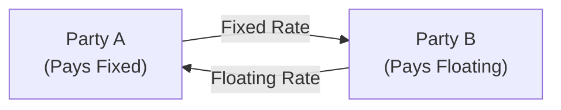

## Understanding the Basics of Interest Rate Swaps

Have you ever found yourself holding a bond paying a fixed coupon, but wishing—just for a moment—that you had the flexibility of floating rates instead? Or maybe you’re a firm that’s locked into a floating rate loan, but you’re worried rates could soar next year and sink your bottom line. This is where interest rate swaps come into play. They’re a tool (or sometimes we might call them a “magic wand”) that allows two parties to exchange interest rate flows so each party ends up with what they prefer: fixed or floating.

At their core, an interest rate swap is a derivative contract between two counterparties who agree to exchange interest payments on a certain notional principal. It’s like you’re saying, “Hey, I’ll pay you a fixed 3% on $10 million for the next three years, if you pay me the three-month SOFR on that same $10 million.” The notional—this $10 million—doesn’t physically change hands (usually!), but the interest payments do. Plain vanilla swaps are the simplest version of this exchange: one side pays fixed, the other side pays floating, and everyone tries to walk away happy.

From a Level II exam vantage point, interest rate swaps are pivotal to practice because they link multiple areas: interest rate risk, yield curve positioning, and credit risk. If you master the conceptual underpinnings here, you’ll see how swaps show up in vignettes that test everything from bond portfolio rebalancing to hedging strategies.

## Key Components of a Plain Vanilla Swap

Let’s dissect a plain vanilla interest rate swap piece by piece:

• Fixed Rate Leg: One party agrees to pay a fixed interest rate on the notional. These payments are typically made on a predetermined schedule (e.g., semiannually or annually).  
• Floating Rate Leg: The other party agrees to pay a floating rate, commonly tied to a reference index. Historically, LIBOR was the standard index, but now many markets have transitioned to SOFR or other risk-free rates.  
• Notional Principal: The “face value” on which payments are calculated. However, except in rare circumstances or specialized swaps, the notional itself doesn’t get exchanged.  
• Maturity: Swaps can be as short as a few months or stretch to 30 years. Each payment date is set in the contract.  
• Determination of the Swap Fixed Rate: The fixed rate is usually set such that the present value of the fixed leg cash flows exactly matches the present value of the expected floating leg at inception. This ensures the initial value of the swap is zero for both parties.

### Example of a Plain Vanilla Swap in Action

Imagine you’ve got Company A with a floating rate loan at SOFR + 1%. But you suspect rates might keep climbing, and paying more interest each quarter could kill your cash flow. Company B, on the other hand, is sitting on a big pile of fixed-rate debt at 4% but wants in on the potential savings from floating rates if rates drift downward. Long story short, these two companies sign a swap:  

• Company A pays Company B 4% fixed on a $100 million notional.  
• Company B pays Company A SOFR + 1% on the same $100 million notional.  

They effectively “swap” their interest obligations. Nobody needs to refinance their entire debt structure. They just cut (figurative) side deals and exchange interest payments.

## Role of Swap Markets and Key Participants

Swaps used to be exclusively over-the-counter (OTC) instruments, meaning they were agreed upon privately between two parties. Today, many standardized swaps go through clearinghouses to reduce counterparty credit risk. The central counterparty steps in as the buyer to every seller and the seller to every buyer, which helps ensure each side gets paid in the event the other can’t deliver. But bilateral swaps (i.e., direct OTC) still exist, especially for complex or highly customized deals.

Major swap participants include:

• Commercial Banks: They often act as swap dealers.  
• Investment Banks: Facilitate deals and sometimes keep a proprietary swaps desk.  
• Institutional Investors: Pension funds, insurance companies, and asset managers frequently turn to swaps for adjusting portfolio risk exposures.  
• Corporations: May use swaps to manage financing costs, capital structure, or other risk exposures.

## Applications and Strategies

### Converting Coupon Exposure (Fixed vs. Floating)

One of the primary uses—maybe even the biggest reason people think about swaps—is converting one’s exposure from fixed to floating or vice versa. Picture a pension fund that holds a large volume of bonds paying a fixed coupon. If the fund expects interest rates to fall, it might wish it had more floating exposure, or maybe the asset-liability matching approach dictates a different interest rate profile. Rather than dumping a chunk of the bond portfolio, the fund can enter swaps to effectively convert part of its fixed interest inflows to a floating rate stream.

### Taking Advantage of Comparative Advantage

These days, you might hear this concept taught in business school, but it’s essential for the exam. Suppose a firm can borrow more cheaply in the fixed rate market (maybe it has a stellar credit rating) but actually prefers floating rate exposure. Conversely, you might have another firm that can borrow more cheaply in the floating rate market but wants fixed rate debt. By each borrowing in the market where they enjoy the best rate (their “comparative advantage”) and then swapping those rates, both sides can end up with the structure they desire at lower overall cost.

### Managing the Shape of the Yield Curve

Swaps let you pick not just between fixed and floating, but also different maturities—like 2-year, 5-year, or 10-year swaps. Need to bet on a steepening or flattening curve? Engage in a mismatch of swap maturities (or use a forward-starting swap, which starts at some future date) to profit from changes in the term structure. While the specifics get more advanced, the gist is that you can position yourself for expected moves in the yield curve without selling old bonds and buying new ones.

### Hedging and Fine-Tuning Duration

In Chapter 25, we discuss how duration measures a bond’s sensitivity to interest rate changes. When you enter a receive-fixed/pay-floating swap, you’re effectively adding more fixed-rate exposure—boosting your duration. Conversely, a pay-fixed/receive-floating swap lowers your portfolio’s duration. This is a go-to method for portfolio managers who want to quickly adjust interest rate risk.

## Understanding Swap Spreads

Now, let’s chat about swap spreads. A swap spread is the difference between the fixed swap rate and the yield of a government bond of the same maturity—commonly referred to as:

Swap Spread = (Swap Fixed Rate) – (Government Bond Yield)  

Sometimes you’d see it as:

• 10-year Swap Rate – 10-year Treasury Yield = 10-year Swap Spread

Why does this matter? Well, the government bond is typically viewed as “risk-free” in interest rate terms (credit risk is minimal for sovereigns in their own currency). Meanwhile, a swap’s fixed rate usually incorporates not just interest rate expectations but also a dash of credit risk and liquidity considerations. By monitoring swap spreads, market participants track how risk perceptions shift over time. When a swap spread widens, it often suggests growing concerns about credit markets or lowered liquidity in certain segments.

### Interpreting Swap Spread Movements

• Wider Swap Spreads: A sign that the market is adding a premium for credit risk or there’s a scarcity of government securities in the repo markets—various factors can drive it.  
• Narrower Swap Spreads: Possibly indicates improving credit conditions or that government bond yields have risen relative to the swap rate.  

Swap spreads tend to react quickly during times of financial stress (or euphoria), which is why they’re closely watched by traders and analysts to glean signals about broader market sentiment.

## Risks and Considerations

It’s easy to think interest rate swaps are these magical contraptions that solve all your yield curve or duration problems. And sure, they can be super helpful. But let’s not forget the potential pitfalls:

### Counterparty Credit Risk

If you sign a long-term swap and your counterparty goes under (or wobbles financially), suddenly your swap may drop in value, or you might not receive the payments you expect. Central clearinghouses mitigate this somewhat by requiring margin from both sides.

### Mark-to-Market and Collateral

For swaps cleared through a central counterparty (CCP), you’ll face initial margin and variation margin calls. So if the swap swings against you, you may have to post more collateral. This can chew up liquidity.

### Basis Risk

Sometimes, your floating rate leg might track a slightly different index than the rate you’re actually exposed to. If the two indexes don’t move in perfect lockstep, you’ve got basis risk. For instance, your liabilities might reset based on 3-month term SOFR, but your swap references daily SOFR with a different compounding structure. Even minor divergences can be costly if volumes are large.

### Documentation and Regulatory Compliance

Swaps are subject to robust legal documentation under the ISDA (International Swaps and Derivatives Association) framework. It’s crucial to make sure the confirmation details, netting, and collateral provisions line up with your intentions. Also, remember the evolving landscape of regulation post-financial crisis—many jurisdictions require clearing for standardized swap contracts.

## Practical Structure and Cash Flow Diagram

To visualize the flow of payments in a plain vanilla interest rate swap, consider the following Mermaid diagram:

• Party A pays a fixed rate.  
• Party B pays a floating rate.  
• Notional principal is not exchanged, though it’s the reference for calculating interest payments.

## Valuation Insights

On exam day, you might be asked to value a swap mid-life. Once the market has changed, the swap is no longer at zero net present value. The steps typically involve:

1. Calculate the present value of the remaining fixed payments (discounted by the current yield curve).  
2. Calculate the present value of the expected floating payments (also discounted, but here you might rely on forward rate projections).  
3. The difference gives the swap’s net value to one side or the other.

For a simple estimation, the fixed leg can be viewed like a bond (coupon = fixed swap rate, principal = notional) and the floating leg can be viewed more like a floating-rate note that resets to market rates each payment period.

### Common Formula Reference

Often, the fair fixed swap rate (rᵣ) on an annual-pay swap can be roughly expressed as:


\text{Swap Rate} = \frac{1 - P_n}{\sum_{i=1}^{n} \alpha_i \cdot P_i}


• Pᵢ = Discount factor for a payment date i.  
• αᵢ = The year fraction between coupon dates (e.g., αᵢ might be 0.5 for semiannual).  
• Pₙ = The discount factor at maturity n.

The idea is that the fixed side is set so the value of the floating side and the fixed side match at inception, leading to zero initial value.

## Real-World Anecdotes

Honestly, I remember the first time I saw a swap’s mark-to-market statement. It felt so foreign: a big table with dates, discount factors, forward rates, and a final net figure that represented the swap’s current value. I thought, “There’s no way I’ll ever memorize this.” But after you walk through the logic a few times—especially once you see the straightforward “bond vs. floating note” analogy—it starts to click.

## Best Practices and Key Takeaways

• Know Your Motive: Before entering a swap, clarify why you want to do it. Is it hedging, speculation, or adjusting the portfolio’s duration profile?  
• Watch the Creditworthiness: Especially in bilateral OTC swaps. Understand how your counterparty’s rating or financial stability can impact the swap’s risk and potential credit valuation adjustment (CVA).  
• Keep an Eye on Regulation: Post-2008 regulations changed the swap landscape. Central clearing, margin requirements, and standardized swap documentation are now standard.  
• Evaluate Basis Risk: Make sure the floating leg closely matches your underlying exposure.  
• Don’t Overlook Swap Spreads: They offer insight into market sentiment around risk, liquidity, and credit.

## References

• Sundaresan, S. (2009). “Fixed Income Markets and Their Derivatives.” Academic Press.  
• CFA Institute (various years). “Derivatives and Risk Management in the CFA® Program.”  
• ISDA resources: https://www.isda.org/  

If you want a deeper dive into the intricacies of interest rate swaps—especially their evolving benchmarks, documentation, and the finer points of margining—ISDA is your go-to resource. Also, remember that the official CFA curriculum devotes significant time to how interest rate swaps tie into portfolio construction, risk management, and yield curve analysis, so definitely keep an eye out for item sets that bring it all together.

## Test Your Knowledge: Interest Rate Swaps and Swap Spreads



### Which of the following best describes a plain vanilla interest rate swap?

- [x] A swap where one party pays a fixed rate and receives a floating rate
- [ ] A swap where both parties pay only floating rates
- [ ] A swap where both parties pay only fixed rates
- [ ] A swap with immediate exchange of notional principal

> **Explanation:** A “plain vanilla” interest rate swap involves exchanging fixed for floating payments on a specified notional.  

### If the 5-year swap rate is 3.5% and the 5-year government bond yield is 3.0%, the swap spread is:

- [ ] –0.5%
- [x] 0.5%
- [ ] 3.5%
- [ ] 6.5%

> **Explanation:** The swap spread = 3.5% – 3.0% = 0.5%.  

### One of the primary reasons for using interest rate swaps in a fixed income portfolio is to:

- [ ] Increase currency exposure without modifying the rest of the portfolio
- [x] Adjust the portfolio’s interest rate exposure efficiently
- [ ] Eliminate default risk entirely
- [ ] Guarantee positive alpha

> **Explanation:** Interest rate swaps allow managers to transform fixed rate exposure to floating (or vice versa) and fine-tune overall duration without trading the underlying bonds.  

### A firm that borrows at a lower fixed rate than peers, but intends to have floating-rate obligations, can benefit from swaps through:

- [ ] Locking in a zero spread over Treasuries
- [ ] Eliminating the total cost of borrowing
- [x] Leveraging its comparative advantage in the fixed market and swapping to floating
- [ ] Raising equity capital to replace debt

> **Explanation:** Firms can exploit their comparative advantage by borrowing where they get the best rate, then swapping to their desired exposure.  

### In a receive-fixed/pay-floating interest rate swap, the investor’s portfolio duration will generally:

- [x] Increase, because the investor is effectively receiving fixed interest payments
- [ ] Decrease, because the investor will pay away all fixed interest
- [ ] Remain the same, as the notional principal is not exchanged
- [ ] Become negative

> **Explanation:** Receiving fixed adds more sensitivity to changes in interest rates, thus increasing duration.  

### Suppose a swap’s floating rate leg is tied to three-month LIBOR, but your liability is tied to three-month SOFR. The risk you face is primarily:

- [ ] Credit risk
- [ ] Settlement risk
- [ ] Prepayment risk
- [x] Basis risk

> **Explanation:** The mismatch between LIBOR and SOFR rates creates basis risk, because they may not move in perfect tandem.  

### For a standard plain vanilla interest rate swap, which of the following is true at contract initiation?

- [x] The present value of the fixed leg equals the present value of the floating leg
- [ ] The floating-rate receiver always pays an upfront premium
- [ ] The fixed-rate payer always earns positive carry
- [ ] The swap must have collateral posted equal to the notional

> **Explanation:** By design, the initial value of the swap is zero; the fixed side’s PV = floating side’s PV.  

### When the market perceives increased credit risk among swap counterparties, swap spreads will typically:

- [x] Widen
- [ ] Narrow
- [ ] Decrease to zero
- [ ] Show no change

> **Explanation:** Greater perceived credit or liquidity risk often increases swap rates relative to government bond yields, leading to wider spreads.  

### A forward-starting swap:

- [ ] Begins immediately upon signing the contract
- [ ] Pays interest on previous notional plus accrued interest
- [x] Starts at a predetermined date in the future
- [ ] Eliminates duration risk for the life of the underlying bond

> **Explanation:** A forward-starting swap kicks in at a future date, locking in future interest rate exposures in advance.  

### True or False: If a swap is centrally cleared, there is absolutely no counterparty credit risk.

- [x] True  
- [ ] False  

> **Explanation:** Trick question. Central clearing substantially reduces but does not entirely eliminate counterparty credit risk. The clearinghouse itself could default under extremely dire circumstances, although this scenario is exceedingly rare.  


