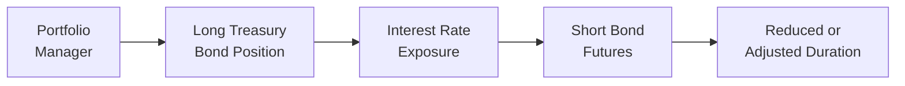

## Overview

Bond futures have long been a staple for institutional portfolio managers. If you’re managing a big bond portfolio and you sense a looming shift in interest rates, you don’t necessarily want to sell everything outright—especially if you’re concerned about transaction costs, liquidity constraints, or temporarily stepping away from exposures that your investment policy statement wants you to maintain. This is precisely where bond futures, traded on regulated exchanges, come to the rescue.

A bond future allows you to quickly adjust your portfolio’s duration (aka its sensitivity to interest rates) without having to completely unwind your positions in the physical (or “cash”) bond market. Plus, these instruments provide tremendous flexibility for yield curve trades, basis trades, and more advanced strategies. But, you know, let’s take a step back: bond futures don’t magically eliminate all risk. There’s basis risk, roll risk, differences between your bonds and the actual futures contract, and so on. Through this section, we’ll walk through why and how professionals use Treasury bond futures, how to calculate hedge ratios, and some tips and tricks so you don’t slip up along the way.

## Key Treasury Futures

In the United States, the CME (Chicago Mercantile Exchange) offers a range of Treasury bond futures:

• 2-Year Note futures  
• 5-Year Note futures  
• 10-Year Note futures  
• 30-Year Bond futures  

Each contract has a unique “deliverable basket” of Treasury securities that meet certain criteria (e.g., maturity ranges). For instance:

• 2-Year futures might have deliverable bonds around two-year maturities.  
• 5-Year futures typically have deliverable bonds around (you guessed it) five-year maturities.  
• 10-Year futures track the medium segment of the curve.  
• 30-Year futures cover the long end of the Treasury market.

Why do these different contracts exist? Because each bucket serves a different portion of the yield curve. If you need to hedge the interest rate risk of a longer-duration bond portfolio—like a portfolio heavy in 20- or 30-year Treasuries—then you might use 30-Year futures. On the other hand, if you have an intermediate bond portfolio, you’ll likely lean toward 5-Year or 10-Year futures for a more effective hedge.

### Contract Specifications Snapshot

Without going into every detail (CME resources are always your best friend for up-to-date specs), each Treasury future has:

• A face or notional amount for the futures contract (e.g., $100,000 or $200,000).  
• A deliverable basket of Treasury securities that meet certain maturity requirements at settlement.  
• A **conversion factor** that aligns each bond in the basket to the specifications of the futures contract.  
• A final settlement that usually happens via the physical delivery of the underlying Treasury. (Though most traders close or “roll” the position before the final delivery process.)

Below is a small Mermaid diagram illustrating the position flows:

In this diagram, the portfolio manager holds a large bond position (node “B”), which carries interest rate exposure (node “C”). By shorting bond futures (node “D”), the manager offsets part of that rate risk, ending with a more controlled duration posture (node “E”).

## Cheapest-to-Deliver, Conversion Factors, and Implied Repo

A critical element in Treasury futures is the concept of the **cheapest-to-deliver (CTD)** bond. Among the eligible bonds in the deliverable basket, the short futures position can choose which bond to deliver at settlement. Naturally, they will want to deliver the bond that’s most economical for them—hence, the “cheapest-to-deliver.” This CTD bond is not always the same bond across time; it can shift as yield curves change, or as the bond’s price relative to other deliverables changes.

### Conversion Factors

Each bond in the deliverable basket has an associated **conversion factor (CF)**, which standardizes its accrued interest, coupon rate, and maturity so they can be compared on an apples-to-apples basis. The futures price that you see quoted is multiplied by this CF to equate the bond to the notional specs of the contract. Formally:

Futures Invoice Price
= (Futures Settlement Price × Conversion Factor) + Accrued Interest

The invoice price is what the short would receive if they delivered that specific bond. The “cheapest-to-deliver” is the bond that yields the highest implied repo rate for the short. If that last phrase sounds a bit cryptic, here’s the short story: the implied repo rate is the rate of return that the short essentially realizes by buying the physical bond now and delivering it against the futures contract at settlement. When that implied repo is higher than other alternatives in the money market or repo market, it incentivizes the short to make that trade.

## Basis Trading

Ever notice in finance that “something’s off” between two related prices? The difference between the bond’s price in the cash market and the corresponding futures price is called the **basis**. When you factor in the conversion factor and the carry, you can see if the basis looks rich or cheap. Traders exploit this with **basis trading**:

• Buy the cash bond and short the futures contract if the basis is undervalued.  
• Or short the cash bond and go long the futures if the basis is overvalued.  

People often do this to lock in a spread between the bond’s cost of carry and the implied financing or “repo” embedded in the futures. But watch out: changes in yield curve shape or CTD optionality can mess with your basis trade. It’s not always a slam dunk. On exam day, remember to highlight basis risk—that’s the potential mismatch between your actual bond’s performance and the futures you used to hedge it.

## Hedging with Bond Futures

Bond futures are, in a sense, “durational blocks” you can add or subtract from your portfolio. Let’s say you hold $50 million worth of 10-year corporate bonds, and you’re anxious about an upcoming Fed announcement. You can quickly move your duration exposure up or down by going short (or long) 10-Year Treasury futures. That way, you can remain invested but reduce interest rate risk or capture some short-term yield curve shifts.

### Hedge Ratio Basics

In a typical scenario, you’ll want your **DV01** (Dollar Value of a Basis Point) on the futures side to match the DV01 of your portfolio or your target portion. DV01 basically tells you how many dollars your position wins or loses if yields shift by one basis point (0.01%). If you want a near-perfect hedge, you aim to ensure:

Total DV01 of the short futures position  
= DV01 of the underlying bond position you’re trying to hedge

Then the classic formula for determining how many contracts (N) to short (for a short hedge) can look something like this:

N = (Portfolio DV01) / (Futures DV01 × Conversion Factor)

The “conversion factor” part is essential because each deliverable bond in the futures basket has a unique CF, and the futures contract is priced accordingly. Sometimes, you’ll see a simpler ratio used if you know exactly which bond is the CTD. But watch out for a trick question on the exam: the CTD can change, so your hedge ratio might need rebalancing if the environment shifts.

Let’s do a super-quick numerical example (just keep it light):

• You have $25 million in a corporate bond with a DV01 of 11,000 USD per basis point.  
• Each 10-Year Treasury futures contract has a DV01 of 1,050 USD.  
• The conversion factor for the CTD is about 0.95.  

Number of contracts you might consider shorting:

N = 11,000 / (1,050 × 0.95) ≈ 11.00

So you’d short around 11 futures contracts, each controlling (in a sense) 1,050 USD of DV01 times the CF. This is a simplified version, but it illustrates the general approach. In real trading, you’d also refine the ratio to account for basis risk and maybe do partial hedges if you’re not looking to fully immunize your exposure.

### Hedging the Yield Curve and Partial Durations

A portfolio manager might get even more creative and do a yield curve hedge by using a combination of futures contracts—for example, simultaneously shorting some 5-Year futures and some 10-Year futures to target a specific portion of the curve. This technique can isolate “key rate durations,” a concept you might recall from your prior reading on interest rate risk (see Chapter 25 for a deeper dive). If the manager expects the yield curve to flatten between 5 and 10 years, they might buy 5-Year futures and short 10-Year futures, or some variation. The possibilities can get quite elaborate, but the exam is more about your conceptual and formulaic mastery rather than memorizing every possible futures combination.

## Managing Roll Risk

While bond futures settle quarterly (like the 10-Year Treasury futures contract typically has four annual settlement months), a lot of traders prefer to keep their hedge going indefinitely. This means that just before the settlement of the front-month contract, they “roll” the position into a later-dated contract by closing out the near contract and opening the subsequent contract. That might sound straightforward, but the twist is:

• The price difference between the two contracts may not be purely mechanical; it can incorporate differences in carry and changes in implied repo.  
• You might experience some slippage in the roll if the market is volatile or if many large players are rolling at the same time.

Essentially, you might see a slight mismatch that leads to either a net gain or loss when you roll from one contract to the next. This difference can add up over time, and it’s where a lot of subtlety creeps in. On an exam, you might see a question about the “roll return” or “roll yield” when analyzing the total performance of your futures hedge, especially if you hold the position through multiple contract cycles.

## Common Pitfalls and Best Practices

• **Ignoring CTD Shifts**: If your futures hedge is heavily reliant on the assumption that a particular bond remains cheapest-to-deliver, watch out for big yield curve shifts that make a different bond cheaper.  
• **Over-Hedging**: Many newbies (and even seasoned managers on a hectic day) might short too many contracts, turning a partial hedge into a net short. If the market rallies, you could lose money on your futures position.  
• **Forgetting Cross-Currency**: If you’re working with global bonds (say, you hold Euro-denominated paper but you hedge with U.S. futures), you’d better factor in currency exposures.  
• **Underestimating Transaction Costs**: Each time you roll your futures, you could face bid-ask spreads, clearing fees, and market impact. Over a year, that might reduce your alpha if you’re constantly rolling positions.

## Practical Example: Hedging a Long Corporate Bond Position

Let’s bring this to life with a quick scenario. Suppose you’re the portfolio manager of a $100 million portfolio of investment-grade corporate bonds, average maturity around 10 years. You suddenly sense that the Federal Reserve might hike rates more aggressively than the market expects. You want to lower your overall portfolio duration from 7.5 years to around 5.5 years, at least through the next month or so.

1. Calculate the portfolio’s approximate DV01. Let’s say the DV01 is $72,000 for a 1 bp move.  
2. Focus on 10-Year Treasury futures, where each contract might have a DV01 of $1,000 for the CTD at the moment.  
3. Suppose the relevant conversion factor is around 0.95.  

Using the formula:

N = DV01_portfolio / (DV01_futures × CF)  
N = 72,000 / (1,000 × 0.95) = 75.79

You might short roughly 76 futures contracts. This partial hedge aims to reduce the portfolio’s duration by about 2 years. Of course, that’s a simplified approach: you’d refine these numbers, consult your desk’s most current data, and keep an eye on the 10-Year’s CTD dynamic. But it’s a straightforward blueprint for how you’d quickly implement a hedge.

## Tables and Charts

Let’s include one more illustrative table. Imagine we have three different deliverable Treasury securities for a futures contract, each with a different coupon and maturity. The table below might look something like this:

| Bond ID | Coupon | Maturity        | Clean Price | Conversion Factor (CF) | Implied Repo Rate |
|---------|--------|-----------------|------------|------------------------|-------------------|
| Bond A  | 2.50%  | 7 yrs 6 months  | 98.10      | 0.94                   | 3.15%             |
| Bond B  | 3.00%  | 8 yrs 2 months  | 101.50     | 0.97                   | 2.85%             |
| Bond C  | 2.75%  | 8 yrs 6 months  | 99.20      | 0.96                   | 3.05%             |

From the short’s perspective, whichever delivers the highest implied repo is the most profitable to deliver. In this hypothetical example, Bond A might end up being the CTD if 3.15% is the highest implied repo.

## Integrating Bond Futures into a Broader Toolkit

Bond futures aren’t just for “big one-off hedges.” They interact with other derivatives such as interest rate swaps, forward rate agreements (FRAs), and interest rate options. For instance, sometimes you’ll find a manager who tailors a fine-tuned curve strategy with a combination of swaps at certain maturities and bond futures at others. This can get complicated fast, though, so if you’re still wrapping your head around standard bond futures, don’t worry too much about layering on the fancy stuff—get the fundamentals locked in first.

For more nuanced strategies, see also:

• Chapter 26: “Managing Yield Curve and Spread Risks”  
• Chapter 27: “Fixed Income Portfolio Construction”  

Here, we discuss how combining different hedging instruments can produce advanced yield curve exposures, spread trades, or credit overlays.

## Conclusion

Bond futures remain among the most liquid tools for adjusting and hedging fixed income exposures. They allow for quick pivoting in response to market events—like major central bank announcements—without the friction of selling a big chunk of your bond portfolio. At the same time, they introduce complexities. You have to account for the cheapest-to-deliver process, the conversion factor, basis differentials, and the frictional costs of rolling from one contract to the next. Lose sight of those details, and you might see your hedge fall short of expectations or, worse, become a net negative contributor.

Still, if you master these concepts—especially calculating hedge ratios using DV01 and tracking the CTD bond’s behavior—you’ll be in good shape for both the exam and real-world portfolio management. And hey, at the very least, you’ll have a sharper sense of how professional managers tame interest rate volatility day in and day out.

## References and Further Reading

• Burghardt, G. (2003). “Treasury Bond Basis.” McGraw-Hill.  
• CME Group Resources on Treasury Futures Specifications:  
  https://www.cmegroup.com/  
• Choudhry, M. (2010). “An Introduction to Bond Markets.” Wiley.  

• (Cross Reference) Chapter 25: “Measuring Interest Rate Risk”  
• (Cross Reference) Chapter 26: “Managing Yield Curve and Spread Risks”  

-----

## Test Your Knowledge: Bond Futures and Hedging Techniques



### When managers use bond futures to hedge a long position in 10-Year Treasury securities, their typical trade involves:

- [x] Shorting 10-Year Treasury futures to offset interest rate exposure.
- [ ] Going long 10-Year Treasury futures to reduce interest rate exposure.
- [ ] Buying physical bonds and shorting credit default swaps.
- [ ] Shorting T-bills to manage duration.

> **Explanation:** If you're holding a bond (long cash position) and you want to hedge interest rate risk, you typically short a futures contract to offset some or all of that exposure.  

### Which bond in a Treasury futures deliverable basket is chosen by the short position to settle the futures contract?

- [ ] The one prescribed by the U.S. Treasury.
- [ ] The one with the shortest time to maturity.
- [ ] The bond with the highest coupon rate.
- [x] The cheapest-to-deliver (CTD) bond that yields the highest implied repo rate.

> **Explanation:** The short will deliver the cheapest-to-deliver bond, which generally provides them the best implied financing or “implied repo” rate.  

### Which of the following best describes the role of a conversion factor in Treasury futures?

- [ ] It specifies the maximum volume of futures contracts to be traded.
- [x] It standardizes various potential deliverable bonds to a consistent futures price benchmark.
- [ ] It calculates accrued interest for bond coupons.
- [ ] It replaces the need to calculate DV01.

> **Explanation:** The conversion factor is used to convert the price of a deliverable bond to the standardized futures contract specifications.  

### A portfolio manager holds a $50 million position in a bond with a portfolio DV01 of $60,000. The Treasury futures contract they plan to use for hedging has a DV01 of $900 and a conversion factor of 0.95. Approximately how many futures contracts should the manager short to hedge the position?

- [ ] 60 contracts
- [ ] 70 contracts
- [x] 70.18 contracts (rounded to about 70)
- [ ] 66.47 contracts (rounded to about 66)

> **Explanation:** Using the hedge ratio formula N = (Portfolio DV01) ÷ (Futures DV01 × CF) = 60,000 ÷ (900 × 0.95) ≈ 70.18.  

### Which of the following is a key risk of rolling Treasury futures positions?

- [ ] The contract size may change unpredictably.
- [x] The cost of the roll can be higher or lower than expected, introducing slippage.
- [ ] The deliverable basket disappears once a year.
- [ ] Conversion factors become nullified after two rolls.

> **Explanation:** When rolling a futures position from one contract to another, changing market conditions and supply-demand dynamics can cause unexpected prices for the near and far contracts, leading to slippage.  

### What is a primary motive for engaging in a bond futures “basis trade”?

- [ ] Gaining exposure to equity-like returns at minimal cost.
- [x] Exploiting discrepancies between a bond’s cash market price and the futures price.
- [ ] Performing mergers and acquisitions in an industry-specific portfolio.
- [ ] Eliminating the cheapest-to-deliver option.

> **Explanation:** Basis trading aims to capture a spread between the bond’s price in the cash market and what is implied by the futures contract’s price.  

### If you anticipate the yield curve to steepen significantly in the coming months, which of the following is a likely strategy using futures?

- [ ] Buying 30-Year futures and shorting 2-Year futures.
- [x] Shorting 30-Year futures and going long 2-Year futures.
- [ ] Keeping the duration the same regardless of maturity.
- [ ] Buying credit default swaps on every maturity.

> **Explanation:** A steepening yield curve typically means long-end rates rise more than short-end rates. To profit, you might short the long end (sell 30-Year futures) and go long the short end (buy 2-Year futures).  

### The “implied repo” rate concept is most closely related to:

- [x] The effective rate of return a short can earn by buying the deliverable bond and delivering it against the futures contract.
- [ ] The interest rate set by the Federal Reserve for overnight borrowing.
- [ ] The annual coupon on the CTD bond.
- [ ] The slope of the yield curve.

> **Explanation:** Implied repo is the rate of return implied by the futures price, if one buys the bond now and delivers it at contract settlement.  

### Which of the following statements about bond futures hedging is correct?

- [ ] The same bond always remains cheapest-to-deliver throughout the contract’s life.
- [ ] Hedge ratios never require updating.
- [ ] Shorting bond futures increases interest rate risk in the portfolio.
- [x] Bond futures allow managers to quickly adjust duration without liquidating underlying positions.

> **Explanation:** One of the main advantages of bond futures is that they let you adjust interest rate risk quickly. On the other hand, CTD bonds can change, and hedge ratios often need recalibration.  

### In the context of bond futures, a portfolio manager’s “roll risk” refers primarily to:

- [x] The uncertainty and potential cost when moving from an expiring contract to a new one.
- [ ] The danger of margin calls throughout the life of the contract.
- [ ] The risk that the bond’s coupon is rolled over to the next year.
- [ ] The possibility that the bond’s maturity is extended by the issuer.

> **Explanation:** Roll risk is the cost or uncertainty involved in closing an expiring futures contract and reopening a new longer-dated one, potentially at less favorable pricing.  


