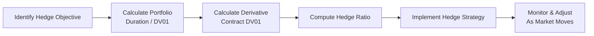

## Introduction and Overview

Well, here we are—diving into a practice vignette that combines multiple derivative instruments with fixed income concepts. This is definitely a territory where you might feel a tad overwhelmed, but trust me, once you see how each piece fits together, it’s not so bad. We’ll walk through hedging strategies involving futures, forward rate agreements (FRAs), and interest rate swaps. And we’ll do it in a way that feels like chatting with a friend—albeit a friend who loves bond math more than Netflix.

The key point is this: hedging a bond portfolio requires understanding the portfolio’s interest rate (duration) exposure and deciding which derivative instrument best accomplishes your desired goal. Sometimes, you want to neutralize your duration (maybe you worry about rising rates). Other times, you might want just a partial hedge. And in some scenarios, you might be looking to gain from an anticipated shift in the yield curve. 

This vignette-style example will show how exam questions might mix these ideas, presenting you with portfolio data, derivative quotes, and credit spreads, then asking, “So, how many contracts do we need to hedge this? Or should we use an interest rate swap?” Let’s step in:

## Hedging Essentials

### Core Hedging Concepts

• Duration Hedge: The aim is typically to reduce or eliminate your bond portfolio’s sensitivity to interest rate movements. If your portfolio has a big unhedged long-duration exposure and interest rates rise, you’re likely facing capital losses. A duration hedge helps offset that by taking a derivative position that profits when interest rates go up.  
• Partial Hedge: Sometimes you don’t want to hedge 100%. Maybe your forecast calls for only a slight move in rates, or you think the portfolio could benefit from a little “unhedged” upside.  
• Transaction Costs: You can’t ignore them. I remember once I tried to be super clever with a partial hedge on short-dated futures, only to discover the bid-ask eats me alive if I do them often. On the exam, watch for mention of these costs and factor them into your final recommendation.  
• Basis Risk: A mismatch between your bond portfolio’s actual performance and the performance of your chosen derivative. For instance, using Treasury futures to hedge a corporate bond might introduce some basis risk because credit spreads can widen or tighten independently of Treasury rates.

## Common Hedging Instruments

### Futures

Treasury futures are a straightforward tool for managing duration. Hedge ratio calculations generally hinge on the concept of DV01 (aka dollar value of a basis point). If your bond portfolio’s DV01 is $X, and a single futures contract’s DV01 is $Y, you can roughly target the hedge ratio as X/Y. Simple, right? 

Of course, real life is never that simple. You also deal with conversion factors if you’re using Treasury futures. And remember, day count conventions could influence settlement cash flows. But that’s the gist.

### Forward Rate Agreements (FRAs)

FRAs are typically used to hedge short-term interest rate exposure—like if you have a floating-rate liability that resets in a few months and you’re worried about rising short-term rates. For a bond portfolio, FRAs might come in if you see a short-term mismatch (e.g., you have a bond coupon reset in 90 days and want to lock in that reset level).

### Interest Rate Swaps

An interest rate swap allows you to swap from fixed to floating or vice versa. If you hold a fixed-rate bond portfolio but want to mimic a floating-rate exposure, entering a pay-fixed/receive-floating swap can offset a portion (or all) of your interest rate risk. It’s more flexible than using a standard futures contract for large sums or longer maturities. But you have the ongoing impact of paying or receiving net swap payments.

## Step-by-Step Hedging Process

Let’s look at the logical workflow for designing a hedge. This is basically how exam vignettes are structured, though obviously, the exam might present these steps in scrambled order to keep you on your toes:

Stop for a second and imagine a scenario: You have a bond portfolio worth $10 million with a duration of 5. Let’s do some quick math to illustrate how we might hedge using Treasury futures.

• Step 1: Identify Hedge Objective. Suppose you want to neutralize interest rate risk. You’re aiming for a net DV01 of zero.  
• Step 2: Calculate Portfolio DV01. DV01 = Market Value × Duration × 0.0001.  
  – For a $10 million portfolio with duration 5, that’s:  
    DV01 = $10,000,000 × 5 × 0.0001 = $5,000.  
• Step 3: Find Treasury Futures’ DV01. Let’s assume each Treasury futures contract has a DV01 of $85. (Your actual exam question might include a table showing different contract maturities, conversion factors, or something else. We’ll keep it simple here.)  
• Step 4: Compute Hedge Ratio. If you want to fully hedge $5,000 of DV01 with a derivative that has an $85 DV01, you need:  
  – 5,000 ÷ 85 ≈ 58.8, so ~59 contracts.  
• Step 5: Implement Hedge. You short 59 Treasury futures. Short positions gain when interest rates rise (and bond prices fall), offsetting your losses on the underlying bond portfolio.  
• Step 6: Monitor and Adjust. If interest rates do what you expect, or if your portfolio composition changes over time, or if the futures contract nears expiration, you’ll adjust accordingly.  

## Partial Hedge vs. Full Hedge

The discussion above assumes you want a complete hedge. But you might choose a partial hedge:

| Hedge Type         | Objective                                                 | Key Action                                                                     |
|--------------------|-----------------------------------------------------------|--------------------------------------------------------------------------------|
| Duration Hedge     | Eliminate interest rate risk (aim for DV01 = 0)           | Use enough futures or swaps to offset total DV01                               |
| Partial Hedge      | Reduce but not eliminate interest rate sensitivity        | Use fewer contracts or smaller swap notional                                   |

You’ll see exam questions referencing your outlook. Maybe you expect rates to rise but not by much, so hedging half your duration might give you a middle ground.

## Sample Vignette Scenario

Imagine the exam item set looks like this:

• You manage a $100 million bond portfolio with an effective duration of 7. A table in the vignette gives you each bond’s maturity, coupon, and credit rating, but the question is mostly about your total interest rate exposure.  
• You’re concerned that rates could rise over the next six months, but you’d rather not liquidate your bonds because of liquidity constraints (and maybe some tax reasons, too).  
• You’re shown several derivative quotes:  
  – A futures contract expiring in six months with a DV01 of $120 per contract.  
  – A pay-fixed, receive-floating swap with a notional of $50 million and a total DV01 of $4,000 for the entire swap.  
  – An FRA with three months to start and covering a notional of $20 million at an annualized rate of 4%.  

You might be asked to do the following:

1. Calculate the portfolio’s total DV01.  
2. Decide which derivative combination best hedges the risk, given your view on rates and the instruments’ available notional sizes.  
3. Solve for the number of futures contracts or the notional on the swap to either fully or partially hedge.  
4. Explain the advantage (and disadvantage) of using the swap instead of the futures or the FRA.  
5. Account for scenario analysis: what if rates move up by 50 bps, or the yield curve flattens?

### Quick Calculation Walk-Through

Step 1: Portfolio DV01  
• With a $100 million portfolio and duration of 7:  
  DV01 = $100,000,000 × 7 × 0.0001 = $70,000.  

Step 2: Evaluate Hedging Tools  
• Using Futures: Each contract has a DV01 of $120. To get near $70,000, you might need around 583 contracts ($70,000 ÷ $120). That’s quite a lot of contracts. Also watch for conversion factors and transaction costs.  
• Using an Interest Rate Swap: If one pay-fixed swap with a $50 million notional has a DV01 of $4,000, you’d need multiple swaps or a bigger notional to cover $70,000 in DV01. That might end up being 17.5 “units” of that swap (which is a bit awkward in practice). Also, partial hedging with a single swap might be fine if you only want to cover $4,000 DV01 out of $70,000.  
• Using FRAs: FRAs might be too short-term or too partial in coverage if your main risk is out to six months and beyond. However, they could be perfect if the question specifically focuses on short-term rate exposure—like covering a 3-month or 6-month horizon.

### Potential Pitfalls

• Mismatch in Notional: You might think you’ve hedged everything, but if your notional is insufficient or if your derivative references a different bond or index, you could still be exposed.  
• Ignoring the Transaction Costs: In short exam items, they often mention a 2-tick wide bid-ask spread or a $X commission per contract. That can add up, especially if you’re rolling the hedge frequently.  
• Overlooked Basis Risk: The corporate bond yield might not move perfectly with the Treasury yield used in the futures. If credit spreads widen unexpectedly, your hedge might be imperfect.  
• Day Count & Settlement Issues: If an exam question front-loads day count or settlement data, it might be crucial. For instance, a 360 vs. 365 day count can cause small but meaningful differences in your swap or FRA payoff.

## Scenario Analysis: A Quick Example

Let’s say you might see a question that gives two possible yield curve shifts:

1. A 50 bps parallel shift upward.  
2. A flattening scenario where short rates rise 75 bps, while long rates rise 25 bps.  

You’re asked to estimate:

• What happens to the net value of the portfolio if you do a 100% futures hedge in scenario 1 vs. scenario 2?  
• Which scenario might exhibit basis risk because your futures contract primarily reflects longer-end yields, while short yields moved more?

The best approach: separate the portfolio into short and long maturities, or use key rate durations. But remember, the exam will only give you so much time. So the key is to demonstrate understanding with a big-picture aggregator—maybe they included a table showing key rate durations at 2-year, 5-year, 10-year points. You’d multiply the respective change in yield by the key rate durations and sum the results. Then you compare that to the payoff from your futures or swap.  

## Practical Nuggets, Best Practices, and Real-World Notes

• Multi-Instrument Hedges: You might mix a partial futures hedge plus a swap to get a more precise offset. That’s common if your portfolio is large, or if you have varied exposures across maturities.  
• Rationale for Instrument Choice: In real life—and often on the exam—swaps can be more flexible for large notional hedges over a longer horizon, whereas futures might be cheaper for short-term or standardized hedging. FRAs are typically used for short-term interest rate exposures.  
• Ongoing Monitoring: A hedge is not set-and-forget. You might be tested on how you would adjust the hedge if the portfolio’s duration changes or if the yield environment evolves differently from your initial assumption.  

## References and Further Exploration

- CFA Institute (various years). “Fixed Income Portfolio Management” in the CFA® Program Curriculum.  
- Tuckman, B., and Serrat, A. (2011). “Fixed Income Securities: Tools for Today’s Markets.” Wiley.  
- Hull, J. (2021). “Options, Futures, and Other Derivatives.” 10th Edition. Pearson.  

Sometimes it’s worth refreshing your memory with basic bond math references too—like how to break down cash flows or quickly approximate price changes. A single question might combine all these elements.

## Conclusion and Next Steps

So that’s an overview of what a hedging-oriented exam vignette might look like. We touched on how to calculate hedge ratios, select instruments, and remain mindful of real-world complexities like basis risk and transaction costs. In practice, you’d gather your portfolio data, consider your interest rate outlook, pick the best derivative tool, and run the numbers. And if you realize the “perfect hedge” is elusive, well, that’s normal in fixed income. Keep an eye on partial hedges or strategies suited to your forecast.

Next up, as you finish this section, you might want to cross-reference Chapter 25: Measuring Interest Rate Risk. Reviewing Macaulay vs. Modified duration, and especially key rate durations, can seriously help you fine-tune a hedging strategy. And if you want more hands-on practice, check out the official CFA Institute practice problems on interest rate swaps and futures. They’re a fantastic way to get comfortable with exam-style item sets and the nuance of calculating DV01 alignment.

Anyway, hope this helped. Keep practicing those calculations!

---

## Hedging a Bond Portfolio: Test Your Knowledge



### In a typical bond portfolio hedge, what is the main purpose of matching the portfolio’s DV01 with the chosen derivative's DV01?

- [x] To neutralize the portfolio’s sensitivity to small interest rate changes
- [ ] To guarantee a profit regardless of interest rate movements
- [ ] To reduce liquidity risk in the bond portfolio
- [ ] To maintain exposure to credit spread movements

> **Explanation:** By matching DV01 amounts, you offset the portfolio’s interest rate sensitivity. That way, a small yield move impacts the derivative roughly in the opposite direction, reducing (or eliminating) net interest rate risk.

### You hold a $10 million bond portfolio with a duration of 6, implying a DV01 of $6,000. If each Treasury futures contract has a DV01 of $100, how many contracts would you need to fully hedge your interest rate exposure?

- [ ] 50
- [ ] 60
- [x] 60 contracts (rounded from 6000 ÷ 100 = 60)
- [ ] 600

> **Explanation:** A $6,000 DV01 means you need 6,000 ÷ 100 = 60 futures contracts to offset the portfolio’s duration-based risk. 

### A pay-fixed interest rate swap used to hedge a fixed-rate bond portfolio generally involves:

- [ ] Receiving a fixed rate and paying floating
- [ ] Holding the same fixed rate
- [x] Paying a fixed rate and receiving floating
- [ ] Entering a total return swap on the bond portfolio

> **Explanation:** If you’re long a fixed-rate bond portfolio, you’d hedge by paying fixed in a swap. This transforms your net position toward a floating-rate profile, neutralizing much of the fixed-rate risk.

### When hedging a corporate bond portfolio with Treasury futures, which of the following risks remains partially unhedged?

- [x] Credit spread risk
- [ ] Interest rate risk
- [ ] Currency risk
- [ ] Default risk of the futures exchange

> **Explanation:** Treasury futures hedge interest rate movements tied to government bonds. Credit spreads for corporate bonds can widen or tighten independently, leaving a portion of risk unhedged.

### What is a key difference between “full hedge” and “partial hedge” strategies?

- [x] A full hedge aims for zero net duration, while a partial hedge retains some duration in the portfolio.
- [ ] A full hedge only uses futures, and a partial hedge only uses swaps.
- [ ] A partial hedge is less expensive in every scenario.
- [ ] A full hedge implies hedging only a single maturity point on the yield curve.

> **Explanation:** Full hedges aim to eliminate interest rate sensitivity, whereas partial hedges keep some duration exposure in the portfolio to benefit from anticipated yield movements.

### Which of the following best describes “basis risk” in the context of hedging a bond portfolio with derivatives?

- [x] The risk that the underlying bond and the hedging instrument do not move in perfect correlation
- [ ] The risk of total default by the bond issuer
- [ ] The risk of regulator-imposed margin calls on futures
- [ ] The risk that interest rates do not move at all

> **Explanation:** Basis risk arises because your bond may not track perfectly with the reference security (e.g., a Treasury used for the futures). Credit spreads or other factors can cause mismatched price movements between the bond and hedge.

### Suppose you partially hedge your portfolio by using fewer futures contracts than needed for a full hedge. Which of the following is a likely outcome?

- [ ] You completely eliminate downside risk from rising yields.
- [ ] You pay more in transaction costs compared to a full hedge.
- [x] You retain some interest rate risk and potential upside if rates fall.
- [ ] You forfeit all coupon income from the portfolio.

> **Explanation:** A partial hedge means some portion of interest rate risk remains unhedged, which can be beneficial if rates move in your favor but also comes with potential downside if rates move against you.

### If a swap notional is too large compared to the portfolio size, what mismatch could this create?

- [x] Over-hedging, leading to net exposure in the opposite direction of the portfolio
- [ ] Under-hedging, defeating the purpose of the swap
- [ ] Perfect hedging, with zero risk
- [ ] No mismatch at all, since notional is arbitrary

> **Explanation:** If the swap’s notional is larger than the portfolio’s effective size, your DV01 offset might exceed the portfolio’s DV01, resulting in an over-hedged position and the possibility of losses if rates move in the opposite direction.

### In a typical exam scenario, which data point is most critical for calculating the appropriate futures hedge ratio?

- [ ] The bond’s yield-to-maturity
- [x] The DV01 of both the portfolio and the futures contract
- [ ] The average credit rating
- [ ] Historical volatility of the underlying bond

> **Explanation:** The ratio primarily depends on the dollar duration (DV01) of the bond position relative to that of the futures contract to determine how many contracts best hedge the position.

### True or False: Entering a forward rate agreement (FRA) is generally the ideal strategy to hedge intermediate-to-long-term rate risk on a 10-year bond portfolio.

- [ ] True
- [x] False

> **Explanation:** FRAs are typically used to hedge short-term interest rate exposures, like 3- to 6-month resets. They are not generally used for hedging longer-term bonds, where swaps or futures are more appropriate.


