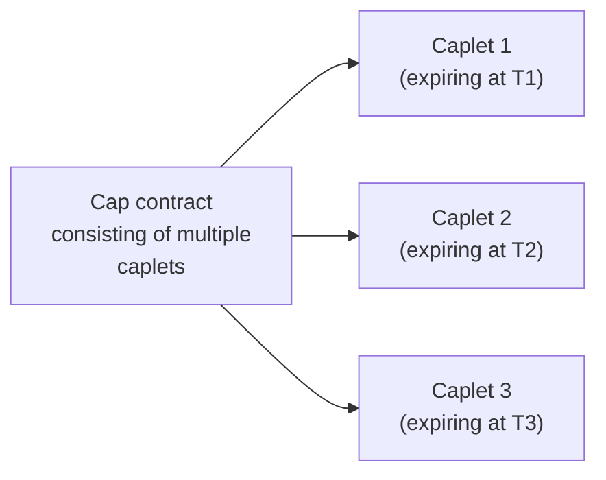
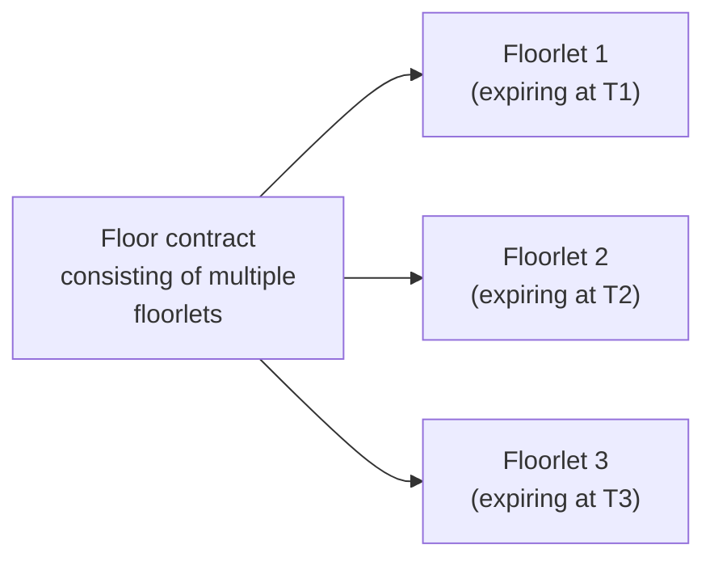
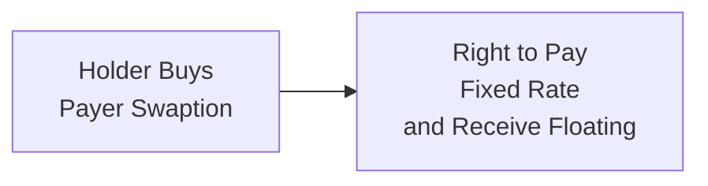

## Overview
Interest rate options—namely caps, floors, and swaptions—often show up in advanced fixed income strategies, especially in the context of liability-driven investing, yield curve hedging, and portfolio optimization. They may sound intimidating at first—believe me, I remember the first time I came across an interest rate cap: I was so worried about the “series of options” concept that I kept reading the same paragraph over and over. But once you get over the initial complexity, these products are really just about controlling interest rate exposure in a more tailored way than a standard swap or a futures contract might offer.

Anyway, in this section, we’ll lay out the rationale behind using caps, floors, and swaptions, talk about their pricing, talk about the risk metrics that matter (like vega), and explore real-world applications that might pop up in an exam vignette or your day job. If you’re feeling a bit shaky on interest rate volatility or basic bond math, consider refreshing your understanding of the yield curve from earlier readings (see Chapter 3: Yield Measures and Bond Pricing Basics and Chapter 8: Binomial Interest Rate Tree Models).

Let’s jump right in.

## Key Concepts and Definitions
Before diving into the how, here’s a quick recap of the what—namely the definitions of these instruments:

• A cap is a contract that sets a maximum interest rate for the buyer. It’s made up of multiple call options on interest rates (caplets) that usually reference a floating rate, like 3-month or 6-month LIBOR (or now SOFR in many markets). You pay a premium upfront, ensuring if interest rates spike above the strike, you’re compensated for that cost.

• A floor sets a minimum interest rate for the buyer. It’s essentially the opposite of a cap: it’s a series of put options on interest rates (floorlets). If interest rates drop below the strike, the payoff from the floor offsets the lost income on a floating-rate investment.

• A swaption is an option that grants the right (but not the obligation) to enter into an interest rate swap in the future. With a payer swaption, you lock in the right to pay fixed and receive floating. With a receiver swaption, you lock in the right to receive fixed and pay floating.

These tools are incredibly helpful if you have a floating-rate liability or asset and you want a certain degree of protection. Caps and floors help you hedge in a targeted way: a cap gives you a maximum cost, while a floor provides a minimum return. Swaptions are a bit more flexible because they let you decide later if it’s worth entering a swap—and in which role.

## The Mechanics of Caps and Floors

### Cap Structure
A cap is typically structured as a portfolio of caplets—individual short-term interest rate call options. Each caplet corresponds to a specific interval, say every 3 months for the length of the contract.

Imagine you manage a corporation with a large floating-rate loan indexed to 3-month LIBOR. You’re anxious about rates rising. So you purchase a 3-year cap with a strike of 5%. The cap is made up of 12 caplets (one for each quarter). If LIBOR resets above 5% at any payment date, the caplet for that period pays out the difference (LIBOR – 5%), multiplied by the notional and the day count fraction. If LIBOR is below 5%, that particular caplet expires worthless.

Let’s illustrate this visually:

Each caplet is an individual option tied to the reference rate over that interval.

### Floor Structure
A floor mirrors the cap but in reverse. It’s a series of put options on interest rates (floorlets). If your floating-rate investment is pegged to 3-month LIBOR and you’re worried about rates sinking too low—and you want to ensure you receive at least, say, 2%—you might purchase a floor at 2%. If at reset, LIBOR is below 2%, the floorlet compensates you for the difference.

Caps and floors are often used by companies issuing floating-rate notes (to cap their funding costs) or by investors in floating-rate notes (to guarantee a minimum return). These instruments can be more cost-effective (and flexible) than a plain-vanilla interest rate swap, where you might lose the upside if rates move in your favor.

## Swaptions

### Key Types of Swaptions
A swaption is basically an option on a swap. The two major types:

• Payer Swaption: Grants the holder the right to enter into a swap as the fixed-rate payer (and floating-rate receiver). You’d typically buy this if you expect rates to rise, because paying fixed at a lower current swap rate might become advantageous in the future if floating rates spike.

• Receiver Swaption: Grants the holder the right to enter into a swap as the fixed-rate receiver (and floating-rate payer). This is generally valuable if you anticipate rates will fall, because you’ll want to receive a higher fixed rate if floating rates drop.

### Example: Payer Swaption in Liability-Driven Investing
Think about a pension fund that has significant future liabilities. If the fund believes interest rates will rise, a payer swaption might allow them to lock in paying a lower fixed rate (by exercising the swaption if rates jump). If rates don’t rise, the swaption simply expires worthless, and the fund only loses the premium. This approach is especially useful when you need to hedge potential future liabilities but don’t want to fully commit to a swap right away.

Here’s a simple diagram:

## Pricing Considerations

### Black’s Model for Caplets and Floorlets
Interest rate caps and floors are often priced using extensions of Black’s model. For a single caplet, the standard formula under Black’s model (in simplified form) is something like:


\text{Caplet Value} = N \times \text{DF}(T) \times [\, L_0 \,\Phi(d_1) - K \,\Phi(d_2)\,] \times \tau


Where:
• \\( N \\) is the notional.  
• \\( \text{DF}(T) \\) is the discount factor at expiration \\( T \\).  
• \\( L_0 \\) is the forward LIBOR (or relevant floating rate) observed at inception.  
• \\( K \\) is the strike rate.  
• \\( \Phi(\cdot) \\) is the cumulative distribution function of the standard normal distribution.  
• \\( \tau \\) is the accrual factor (e.g., 0.25 for a 3-month caplet).

In essence, each caplet or floorlet is a straightforward option on the interest rate—so you can price it with a model akin to Black’s model for interest rates, then sum the present values of all caplets or floorlets to get the total premium.

### Swaption Pricing
Swaptions can also be priced using a version of the Black model or a more sophisticated short-rate model (e.g., Black-Derman-Toy) or the LIBOR market model. At a high level, the process involves:
1. Determining the forward swap rate for the maturity of the underlying swap.  
2. Calculating the volatility of that swap rate.  
3. Using an option pricing formula (like Black’s) that treats the forward swap rate as the underlying.

Some advanced approaches incorporate calibrations to the entire yield curve and swaption volatility surfaces, but the concept remains: you’re valuing an option on the future level of the swap rate.

## Risk Management and “The Greeks”
When you own a cap, floor, or swaption, you’re exposed to more than just changes in the underlying interest rate level. Two key risk metrics to keep in mind:

• Gamma: The curvature risk. If the underlying rate moves sharply, the value of your option changes at an accelerating rate. This can be either helpful or harmful depending on your position.  
• Vega: Sensitivity to implied volatility. Options gain value if implied volatility rises (assuming you’re a buyer). A spike in interest rate volatility can drive up the price of caps, floors, or swaptions, even if the underlying rate doesn’t move yet.

**Pitfall**: If you buy a cap or floor believing it’s a cheap hedge, but implied volatility suddenly collapses, you might see your option’s value fall, eroding your hedge benefits. Always watch volatility.

## Real-World Applications

### Hedging a Floating-Rate Liability with a Cap
Let’s imagine you’ve got a large floating-rate loan, say \$200 million, tied to 3-month SOFR plus a spread. You’re worried that SOFR might spike, blowing up your interest expense. One approach is to buy an interest rate cap at, for instance, 4%. You pay a premium upfront. If SOFR goes above 4% at any quarterly reset, the cap compensates you for that difference, effectively limiting your interest cost to around 4% plus your original spread. If rates stay under control, you won’t recoup the premium, but hey, you’ll probably be glad you didn’t face a major spike.

### Securing a Minimum Return with a Floor
Now, suppose you own a portfolio of floating-rate bonds. If short-term rates collapse, your coupon income will shrink (or could nearly vanish). Buying a floor, say at 1.5%, guarantees you’ll earn at least 1.5% on your floating securities. Though you pay a premium, it’s like an insurance policy against falling rates.

### Swaptions for Liability-Driven Investing
Many pension funds or insurance companies use swaptions to manage their future interest rate exposures, especially if they anticipate rates might change drastically before they restructure their liabilities. A receiver swaption can lock in the right to receive a higher fixed rate if you think rates might plunge in the future, which preserves your investment returns relative to your liabilities.

## Implementation Best Practices
• Understand Your Notional Amounts: Caps, floors, and swaptions can involve large notional exposures. Knowing precisely how much you need to hedge is crucial so you don’t overpay on premiums.  
• Model Risk: Small changes in implied volatility can cause big swings in option prices. Double-check your volatility assumptions.  
• Based on Liquidity: Caps and floors on major indexes (like 1-month or 3-month LIBOR/SOFR) are typically liquid. But if you’re trying to hedge an obscure index, pricing and availability might be an issue.  
• Timing: If you buy a cap too early (or too late) relative to your view on rates, you risk losing out on cost savings or missing the hedge. Don’t procrastinate if you see the writing on the wall.  
• Credit and Counterparty Risk: Like all OTC derivatives, you’re exposed to the counterparty that wrote the cap, floor, or swaption. Check collateral arrangements and netting clauses.

## Common Pitfalls
• Overlooking Premium Costs: A big mistake is ignoring how the cost of the cap/floor might erode your yield. Make sure the hedge’s benefits outweigh its expense.  
• Ignoring Volatility Changes: Some candidates get so focused on the direction of interest rates that they forget implied volatility is also a major driver of option prices.  
• Confusion Between Payer vs. Receiver Swaptions: On exam day (and in real life), you might freeze trying to recall which is which. Remember, payer swaption = you pay fixed. If you expect rates to rise, paying fixed can become attractive.  
• Underestimating Roll-Down: Caps and floors might lose value over time if rates remain well below or above the strike. Time decay can be substantial.

## Conclusion
Interest rate options—caps, floors, and swaptions—are powerful tools in managing and hedging interest rate risk. They allow a degree of specificity that other, more vanilla derivatives cannot always provide. Just keep in mind the interplay of interest rate movements, volatility, time decay, and the cost of premiums. In exam scenarios, be prepared to evaluate whether a firm or institution should use a cap, floor, swaption, or a straightforward swap. If you can justify your choice based on the scenario’s interest rate outlook, cost considerations, and desired risk profile, you’ll be well on your way to a top-tier item set performance.

Feel free to read more about these derivatives in references such as Hull’s “Options, Futures, and Other Derivatives,” or check out advanced modeling techniques (like the SABR model) if you want deeper insights. Meanwhile, take a short break if you need to, because next, we’ll delve into how these concepts tie into the broader realm of managing yield curve and spread risks—which can get pretty thrilling (in a finance-nerdy kind of way).

## References
• Hull, J. C. (2018). Options, Futures, and Other Derivatives. Pearson.  
• Brace, A., Gatarek, D., & Musiela, M. (1997). The Market Model of Interest Rate Dynamics. Mathematical Finance.  
• Rebonato, R. (2018). The SABR/LIBOR Market Model. Wiley.  
• CFA Institute, 2025 Level II Curriculum—Fixed Income Readings (Chapters 3, 8, 24).  

## Test Your Knowledge: Caps, Floors, and Swaptions



### Which of the following best describes an interest rate cap?

- [x] A series of call options on a floating interest rate index, ensuring the rate does not exceed a specified level.
- [ ] A single put option used to limit downside on a bond position.
- [ ] A standard contract that offsets credit risk on a corporate bond.
- [ ] An arrangement to pay a fixed rate and receive a floating rate on an ongoing basis.

> **Explanation:** A cap is composed of caplets, which are call options on interest rates. It limits the maximum rate exposure for the holder.

### What is the key difference between a cap and a floor?

- [x] A cap pays off when the reference interest rate exceeds the strike, while a floor pays off when the reference rate is below the strike.
- [ ] A cap is exchanged on an exchange, while a floor is traded OTC.
- [ ] A floor has unlimited upside potential, while a cap has unlimited downside potential.
- [ ] A cap is a one-time payment derivative, whereas a floor requires multiple premium payments.

> **Explanation:** A cap has payments when rates exceed a strike, whereas a floor pays if rates fall below a strike. Both typically trade in OTC markets.

### Which statement about swaptions is most accurate?

- [x] A payer swaption allows the holder to pay a fixed rate and receive a floating rate if exercised.
- [ ] A payer swaption forces the holder to pay the premium and automatically enter the swap.
- [ ] A receiver swaption is always less expensive than a payer swaption.
- [ ] A swaption is a forward contract with no optionality embedded.

> **Explanation:** A payer swaption lets you lock in paying fixed, receiving floating. It is an option, not an obligation.

### A pension fund fears rising interest rates in two years. Which derivative instrument would most directly allow them to benefit if rates rise, without forcing them into a swap?

- [x] A payer swaption.
- [ ] A receiver swaption.
- [ ] A floor.
- [ ] A futures contract on T-bonds.

> **Explanation:** A payer swaption gives the right but not the obligation to pay fixed, which becomes beneficial if rates rise significantly by exercise.

### An investor in floating-rate notes wants to ensure a minimum coupon if short-term rates collapse. Which product is most suitable?

- [x] A floor.
- [ ] A cap.
- [x] A long call on a fixed rate bond.
- [ ] A payer swaption.

> **Explanation:** A floor will provide payments when rates drop below the strike, effectively guaranteeing a minimum coupon.

### In Black’s model for pricing a caplet, the term Φ(d1) typically refers to:

- [x] The cumulative probability that a normally distributed random variable is less than d1.
- [ ] The payoff of a call option at expiry.
- [ ] The forward price of the underlying times the discount factor.
- [ ] The discount factor for the entire cap.

> **Explanation:** Φ refers to the cumulative distribution function for the standard normal distribution in option pricing models.

### A firm buys a cap with a strike of 5% on a notional of $100 million. Interest rates rise to 6% at reset. Which payoff is correct, ignoring day count conventions?

- [x] Approximately 1% of $100 million = $1,000,000.
- [ ] Approximately 5% of $100 million = $5,000,000.
- [x] Approximately 4% of $100 million = $4,000,000.
- [ ] Zero, because the firm must also pay a spread over the floating rate.

> **Explanation:** The payoff for a caplet is (Reference Rate – Strike) × Notional × accrual factor. At 6% vs. 5%, the difference is 1% on $100 million = $1,000,000 (pre-day count).

### When interest rate volatility increases, the value of long cap positions generally:

- [x] Increases, because caps are long volatility instruments.
- [ ] Decreases, because caps suffer from increased gamma risk.
- [ ] Remains unchanged, because only the strike matters.
- [ ] Decreases if interest rates are above the strike.

> **Explanation:** Longer volatility raises the value of the option component. Caps benefit from higher implied volatility.

### A receiver swaption is beneficial if:

- [x] Swaps fixed rates fall significantly below the strike level, making receiving fixed at the higher strike advantageous.
- [ ] Rates rise above the strike, because you can exercise at a lower fixed rate.
- [ ] You expect no changes in interest rates.
- [ ] You want to pay a floating rate in the long term.

> **Explanation:** A receiver swaption gives you the right to receive fixed, pay floating. If the fixed rate drops well below the strike, you gain by receiving the higher strike rate.

### True or False: Buying a cap always guarantees a lower effective interest rate than a fixed-rate financing option.

- [x] True
- [ ] False

> **Explanation:** Actually, it’s a bit of a trick question—caps don’t always guarantee a lower overall cost because you pay a premium. If rates remain below the strike, you get no benefit beyond your floating rate and lose the cap premium. However, under typical exam logic, one might say it "guarantees" a maximum rate paid, which can be lower than some fixed rates if conditions are right. The real nuance is that total cost includes the premium plus any floating spread.


