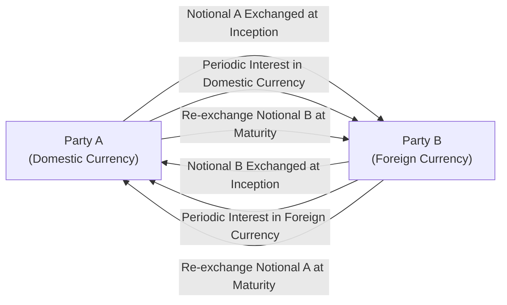

## Overview and Key Concepts

Cross-currency swaps extend the concept of interest rate swaps to multiple currencies. They can offer powerful solutions for investors and issuers who want to hedge both interest rate risk and currency risk. If you’re a domestic investor holding foreign currency bonds, you can use this tool to swap out the foreign currency exposure and convert the required interest and principal payments into your home currency—without necessarily having to sell or unwind your existing position. That said, let's examine the mechanics, risks, and best practices of cross-currency swaps.

It seems to me that exploring cross-currency swaps can feel a bit daunting at first—lots of moving parts, multiple cash flows, and exchange rates that never sit still. But once you see how these instruments simplify foreign-denominated financing (and, in some cases, open doors to more favorable funding costs), the payoff is definitely worth the effort.

## Rationale for Cross-Currency Swaps

• Hedging Currency Risk: One of the biggest headaches for global investors (or multinational firms) is exposure to foreign exchange (FX) fluctuations. A cross-currency swap helps neutralize this risk by effectively “locking in” the currency conversion based on the agreed exchange rates at inception.  
• Managing Interest Rate Risk Across Regions: With two different currencies come two different interest rate environments (and yield curves). A cross-currency swap lets you pick your preferred interest payment profile—fixed or floating—on each side, reducing unintended interest rate exposure.  
• Accessing Comparative Advantage: Different companies have varying degrees of “credit brand” in different markets. For instance, a European firm might issue bonds in USD at a more favorable rate than it can in EUR, then do a cross-currency swap to pay EUR. This “comparative borrowing advantage” can lower overall funding costs.

## Structural Mechanics of Cross-Currency Swaps

### Contractual Components

1. Initial Exchange of Notional  
   A cross-currency swap starts with the two parties agreeing on how much principal they want to exchange in each currency. At inception, there’s typically an exchange of these notional amounts based on the spot FX rate. For example, if Party A provides EUR 10 million, Party B might provide USD 12 million, assuming a certain EUR/USD spot rate.

2. Periodic Interest Payments  
   Throughout the life of the swap, each party pays interest on the notional it “received” in the other currency. For instance, if you’re a USD-based investor swapping into EUR, you would pay an interest rate (fixed or floating) on the USD notional to your counterparty, while receiving interest in EUR on the EUR notional.

3. Final Exchange of Notional  
   At the end of the swap’s term, the two parties re-exchange the principal amounts at the same notional values they initially swapped. This final exchange effectively closes out the position in terms of principal. Note that even if exchange rates have shifted dramatically, the notional re-exchange is done at the originally agreed terms.

### Visual Schematic

Below is a simple Mermaid diagram outlining the flow of payments in a cross-currency swap. Note that “Party A” and “Party B” exchange both principal (notional) and interest payments:

This diagram might look a bit intimidating, but the story is straightforward:  
• Day One: Swap principal amounts at a pre-agreed FX rate.  
• Throughout the Term: Pay and receive interest in different currencies.  
• Final Day: Swap principal amounts back.

## Using Cross-Currency Swaps to Hedge Foreign Bond Investments

Let’s say you’re a U.S. investor who purchased a EUR-denominated bond. You might have done so because you liked the yield spread in the European market. The trouble is, each coupon payment and the final redemption are all in euros. If the euro depreciates relative to the dollar, your returns could get hammered when converting back into USD.

One straightforward hedge: enter a cross-currency swap. At inception, you effectively “receive” EUR from the swap that track your expected euro cash flows on the bond, and you “pay” USD. Over the course of the swap, when your euro coupons come in, you can use them to meet your euro payment obligation in the swap. On the flip side, you receive USD from the swap that lines up with your home-currency needs. In the end, the bond’s interest and principal payments are effectively converted into dollars, drastically reducing your currency risk.

### Example

Imagine you hold a EUR 10 million par bond with a 5% annual coupon and five years to maturity. You want to hedge all cash flows back to USD, so you set up a cross-currency swap:  
• At inception, you receive EUR 10 million and pay USD 10.9 million (for illustration), reflecting the spot rate of around USD/EUR 1.09.  
• Each year, you pay a fixed USD rate (let’s assume 3.5% on the USD 10.9 million) and receive the 5% coupon in EUR on the EUR 10 million notional.  
• After five years, you give back the EUR 10 million and receive the USD 10.9 million notional at maturity.  

Now, you have effectively “locked in” a currency exchange and an interest rate arrangement that keep your net receipts in USD. Even if the EUR dives to USD/EUR 0.90 or climbs to 1.20, your principal re-exchange is unaffected because the cross-currency swap was locked at inception.

## Comparative Borrowing Advantage

Sometimes you’ll see cross-currency swaps used purely as corporate financing tools. Suppose a U.S.-based multinational wants to issue debt in the Japanese market at a lower interest rate than what it could get domestically. However, it doesn’t want JPY on its balance sheet. By issuing a yen-denominated bond and simultaneously entering into a cross-currency swap, the firm effectively “converts” those yen proceeds into dollars at inception. It then pays interest in yen on the bond, but receives yen from the cross-currency swap while paying out in USD, so net net, the firm’s expense might be cheaper than tapping the U.S. market.

This approach exploits the so-called “comparative borrowing advantage.” A firm may have a brand or credit rating that’s valued higher in one currency market than in another. That advantage translates into a lower cost of funds in that foreign market. The cross-currency swap is the “bridge” back to the firm’s home currency.

## Mark-to-Market Dynamics

Cross-currency swaps are subject to daily (or at least periodic) mark-to-market valuations. Changes in interest rates in both currencies—and the exchange rate itself—will cause the swap’s value to fluctuate. Normally, you’d see discount factors used to value the expected cash flows in each currency, with the exchange rate feeding into the final net present value (NPV). This can get more complicated if the swap is set up with floating rates on one or both sides—especially if you’re referencing different benchmark rates (SOFR in the U.S., EURIBOR in Europe, TONA in Japan, etc.).  

If the currency you receive appreciates, your net swap position might be in-the-money. If your currency obligations become more expensive, you might be out-of-the-money. In a real sense, a cross-currency swap is like a set of forward contracts on exchange rates combined with interest rate swaps—so its value can swing around with market conditions.

## Currency Basis and Pricing Nuances

Unlike a plain-vanilla interest rate swap that might be priced off the single-currency swap curve, a cross-currency swap involves two separate yield curves plus the relevant foreign exchange forward curve. The “FX basis” is the difference in yield (or discount rates) for the two currencies that might influence the fair swap rate. This basis can reflect supply-demand imbalances, credit perceptions, or market frictions between currency and interest-rate markets.

A quick aside: If you’ve ever tried personally exchanging currencies on a vacation, you might wonder why the “drop” or “spread” can differ day by day. Well, in institutional markets, that day-to-day difference can be built into the “basis” that impacts cross-currency swap pricing. We might see that the cost of borrowing one currency synthetically via a cross-currency swap is more (or less) than direct borrowing in that currency market, all because of these basis pressures.

## Risk Considerations

• Counterparty Risk: Like all swaps, you rely on your counterparty to perform. If they default, you could be exposed to credit risk on the net present value of your in-the-money side of the swap.  
• Liquidity Risk: Cross-currency swaps typically trade in less volume than plain-vanilla interest rate swaps. In times of market stress, those wide bid-ask spreads might make termination or re-hedging expensive.  
• Mismatch Risk: You need to size your swap notional amounts carefully. If your foreign bond or liability structure changes, you could be left over-hedged or under-hedged.  
• Operational Complexity: Tracking two sets of interest payments, multiple exchange rates, and different reference rates can lead to operational mishaps if not handled carefully.  

### Practical Example of Risk

There was a large global manufacturer (let’s call them “Company X”) that issued EUR bonds to capture low euro interest rates. They swapped back into USD using a cross-currency swap. Then, the euro experienced significant volatility and, simultaneously, Company X faced a credit downgrade. The combined effect was that the mark-to-market on the swap soared: Company X had to post substantially more collateral to remain in compliance with the swap’s terms. While the bond coupon was effectively hedged, they encountered real liquidity stress from the swap’s collateral calls. This underscores the importance of managing not just interest rate or currency risk, but also the liquidity and credit dimensions of derivative usage.

## Example: Calculating the Price of a Cross-Currency Swap

A thorough calculation can be quite involved, but let’s keep it relatively simple:

1. Determine the swap’s notional amounts in each currency based on today’s spot rate.  
2. Project out the interest payments in each currency.  
3. Convert all expected cash flows into a single currency (say, USD) using forward FX rates.  
4. Discount these USD cash flows by the USD discount curve and net them against your obligations.  

If the net present value is zero at inception (in an at-market swap), the fixed or floating swap rates are set so that neither party pays a premium. Over time, changes in yield curves or exchange rates cause the swap’s NPV to deviate from zero.

You might see formulas like:

(1)  
V_swap = ∑(CF_foreign × FX_forward / (1 + i_USD)^t ) − ∑(CF_domestic / (1 + i_USD)^t)

Where:  
• CF_foreign = foreign currency cash flow (coupon or principal)  
• FX_forward = forward exchange rate from foreign currency into USD for period t  
• i_USD = appropriate USD discount rate for period t  
• CF_domestic = the domestic currency cash flow

This is a simplified lens. Realistically, if you’re paying a floating rate on the USD side, you’d be updating your expected CF_domestic to reflect the projected floating payments over the life of the swap.

## Best Practices for Cross-Currency Swap Hedging

• Match Tenors and Cash Flows: For a perfect hedge, line up the notional amounts and swap maturity with the timing and amounts of your foreign bond or foreign liability’s principal.  
• Monitor Credit Quality: Keep an eye on your swap counterparty’s credit rating since deterioration could require additional collateral or unwinding the swap.  
• Evaluate Liquidity Buffers: Prepare for margin or collateral calls in adverse markets, especially if your swap position could move significantly in-the-money or out-of-the-money.  
• Documentation: Use standardized ISDA agreements, ensuring clarity on netting, collateral posting, and early termination rights.  

## Real-World Scenario: Japanese Company Debuts a USD Bond

A Japanese electronics firm might issue a USD bond to diversify its sources of capital (or to gain publicity in the U.S.). However, it doesn’t actually need USD for its domestic operations. So, it does a cross-currency swap, receiving USD-floating in the swap (which matches what it owes to bondholders) and paying JPY to the counterparty. The firm effectively transforms its USD debt into JPY debt while locking in a potentially more attractive cost of capital. This interplay between international debt capital markets and derivative overlays is extremely common in practice.

## Summation

Cross-currency swaps are an elegant solution to multi-currency financing and investment challenges, but they carry their own set of complexities and risks. If you approach them thoughtfully—aligning them with your overall asset-liability strategy, evaluating counterparty risk, and monitoring your liquidity needs—then these swaps can help manage currency and interest rate risks efficiently.  

Anyway, if you’re ever traveling abroad (like I once did when heading to Europe, buying fancy pastries in Paris without worrying about exchange rates), you might enjoy having everything “translated” back into your home currency to avoid surprises. Cross-currency swaps do that for your portfolio—on a much bigger scale, of course.

## References and Suggested Readings

• Levich, R. M. (2011). “International Financial Markets: Prices and Policies.” McGraw-Hill.  
• ISDA (International Swaps and Derivatives Association) documentation on cross-currency swaps:  
  https://www.isda.org/  
• CFA Institute materials on currency management, including foreign exchange markets and derivatives strategies  

## Exam Tips

• Watch for how cross-currency swaps can appear in a vignette that includes multiple currencies, different interest rate benchmarks, and a scenario describing how to convert foreign cash flows back to a domestic base.  
• Practice discounting cash flows in each currency, converting them at forward FX rates, and netting them out in your home currency to find the swap’s fair value.  
• Look out for items in the question discussing the “comparative borrowing advantage,” which might hint at a cross-currency swap solution.  
• Maintain clarity on net flows: in a cross-currency swap, you typically see both interest payments and principal exchanged at inception and maturity.  

## Cross-Currency Swaps and Hedging Mastery Check



### 1. A cross-currency swap differs from a traditional interest rate swap primarily because it:
- [x] Involves exchanging principal in two different currencies.
- [ ] Uses only domestic interest rates for both legs of the swap.
- [ ] Requires at least one pay leg tied to an equity index.
- [ ] Eliminates counterparty credit risk entirely.

> **Explanation:** The defining characteristic of a cross-currency swap is the exchange of principal amounts (and corresponding interest payments) in two different currencies, which is not found in a plain-vanilla interest rate swap.

### 2. In a cross-currency swap, interest rate payments are typically:
- [x] Based on the notional principal amounts exchanged for each currency.
- [ ] Converted to a single currency for net settlement.
- [ ] Exchanged only at inception and maturity.
- [ ] Based on the yield curve of the counterparty’s choice.

> **Explanation:** Each party pays interest on the notional it “receives” in the other currency. The notional amounts in each currency remain separate for the duration, and interest is calculated on those notionals.

### 3. An investor buys a foreign currency bond but wants to eliminate the currency exposure. Which derivative instrument is most suitable?
- [x] A cross-currency swap.
- [ ] A plain-vanilla interest rate swap.
- [ ] An equity swap with daily resets.
- [ ] A commodity swap.

> **Explanation:** A cross-currency swap can neutralize the foreign currency bond’s risk by converting its coupon and principal payments into the investor’s home currency.

### 4. Which of the following best describes the final principal exchange in a cross-currency swap if market exchange rates have changed significantly?
- [ ] The final exchange is adjusted for the new spot FX rate.
- [ ] The final exchange is canceled if the spot rates move by more than 5%.
- [x] The final exchange occurs at the same notional amounts agreed upon at inception.
- [ ] The final exchange is net-settled in one currency only.

> **Explanation:** At maturity, notional principal amounts are re-exchanged at the same quantities initially set, regardless of how the exchange rate has moved in the interim.

### 5. One reason firms use cross-currency swaps to issue debt in foreign markets is to:
- [x] Exploit a lower borrowing cost in a market where they have a comparative advantage.
- [ ] Avoid paying any interest on their debt.
- [x] Hedge interest rate exposures in a single market only.
- [ ] Permanently fix their credit rating.

> **Explanation:** Firms can issue debt where their credit is better perceived (and thus cheaper) and then swap back to their home currency via a cross-currency swap, taking advantage of a comparative borrowing advantage.

### 6. When valuing a cross-currency swap, an analyst must:
- [ ] Use only the domestic discount curve and ignore the foreign discount curve.
- [ ] Project the cash flows but avoid using forward exchange rates for conversions.
- [x] Convert foreign currency cash flows into the domestic currency using forward FX rates and discount them.
- [ ] Assume interest rates remain constant to simplify the calculations.

> **Explanation:** A proper valuation requires projecting all future cash flows in each currency, using forward FX rates for conversion, and then discounting those cash flows at the appropriate domestic interest rates (and potentially foreign interest rates too, depending on how the analysis is set up).

### 7. A cross-currency swap typically allows the counterparties to exchange:
- [x] Fixed for floating payments in different currencies.
- [ ] Common stock shares for bond coupons.
- [x] Floating for floating payments in different currencies.
- [ ] Bonds after maturity date only.

> **Explanation:** Cross-currency swaps can come in many forms, including fixed-for-floating or floating-for-floating arrangements, as long as they involve two different currencies.

### 8. If a cross-currency swap is in-the-money to one party, which of the following is true?
- [x] It has a positive net present value for that party.
- [ ] The party must pay a premium to close the swap.
- [ ] Spot exchange rates are irrelevant until maturity.
- [ ] The swap cannot be terminated early.

> **Explanation:** Being in-the-money indicates a positive net present value to that party. They might receive a payment if the swap is terminated early, but this depends on the swap’s terms.

### 9. A potential disadvantage of using cross-currency swaps for hedging is:
- [x] They can entail higher counterparty and liquidity risks compared to plain-vanilla swaps.
- [ ] They eliminate all currency risks without any residual exposures.
- [ ] They always require daily margin posting, even if the swap is out-of-the-money.
- [ ] They are rarely used in capital markets.

> **Explanation:** Cross-currency swaps are common, but they generally have more complex liquidity and credit risk considerations. Parties must manage these carefully, including any collateral posting terms.

### 10. Cross-currency swaps help a domestic investor holding foreign bonds to:
- [x] Convert interest and principal payments to the investor’s home currency.
- [ ] Incur greater FX volatility for higher returns.
- [ ] Invest only in zero-coupon foreign bonds.
- [ ] Exclude all interest rate risk from the transaction.

> **Explanation:** The primary hedge function is to convert future foreign currency coupon and redemption payments into the investor’s home currency, reducing or removing the FX risk associated with those bonds.


