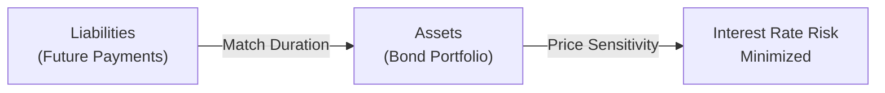

## Introduction and Conceptual Overview

If you’ve ever tried to gauge how a bond’s price might react if interest rates suddenly hopped up or slumped down, you’ve probably come across these two heavy hitters: Macaulay Duration and Modified Duration. They’re the go-to metrics for measuring a fixed-income instrument’s sensitivity to interest rate movements. In a nutshell, Macaulay Duration tells you the weighted average time it takes to get your cash flows back, while Modified Duration refines that idea to directly estimate the bond’s price change when yields move.

Some people find duration calculations intimidating at first (I definitely did when I was new in fixed income… I remember squinting at the formulas and thinking “Am I sure I want to do this?”), but once you see them in action, it’s surprisingly straightforward—and extremely useful. Duration lets bond investors, portfolio managers, and analysts estimate and manage interest rate risk. 

In this section, we’ll dive deep into the concepts behind Macaulay Duration and Modified Duration and discover how they’re applied in real-world bond management. We’ll cover computations, best practices, possible pitfalls, and even a few personal tips I’ve picked up along the way.

## Understanding Macaulay Duration

Macaulay Duration is the original measure of a bond’s “time to cash flows.” It’s named after Frederick Macaulay (a financial economist from the 1930s) and is defined as the weighted average maturity of the bond’s cash flows, where the weights are the present values of each cash flow divided by the bond’s total present value (price). 

Mathematically, for a bond paying coupons and principal redemption, Macaulay Duration (D_Mac) can be expressed as:


D_{\text{Mac}} = \frac{\sum_{t=1}^{T} \left( t \times C_t \times v^t \right) + \left( T \times \text{Face Value} \times v^T \right)}{\sum_{t=1}^{T} \left( C_t \times v^t \right ) + \left( \text{Face Value} \times v^T \right )}


where:

• t = time period (e.g., 1 for the first coupon period, 2 for the second, etc.).  
• Cₜ = coupon payment at time t.  
• Face Value = the bond’s principal, typically paid at maturity T.  
• vᵗ = (1 + y)⁻ᵗ, the discount factor for yield y per period.  
• T = the number of total coupon periods to maturity.

Essentially, each cash flow is assigned a time weight t, and that weight is multiplied by the present value of the cash flow. Summing all these up and dividing by the bond’s total present value gives a measure in “years” that accounts for how spread out the cash flows are. The more spread out (longer maturity, smaller coupons), the higher the Macaulay Duration.

When you see a Macaulay Duration of, say, 7.2 years, that means, on average, you get your money back (in present value terms) in 7.2 years. Zero-coupon bonds are the easiest example: you only get one cash flow—principal at maturity—so the Macaulay Duration is precisely the time to maturity.

### Visualizing Macaulay Duration

Below is a simple Mermaid diagram showing a bond’s timeline of cash flows, highlighting how each flow contributes to duration:


Each arrow in this diagram represents a future cash flow. In Macaulay Duration, every payment is discounted and multiplied by the time period t, then divided by the bond’s total price.

## From Macaulay to Modified Duration

While Macaulay Duration is conceptually elegant, it’s not always the most practical measure when you want a quick read on price sensitivity to yield changes. That’s where Modified Duration (D_mod) comes in. Modified Duration refines Macaulay Duration by adjusting for the yield level:


D_{\text{mod}} = \frac{D_{\text{Mac}}}{1 + y}


where y is the yield per period (important to note if the bond pays semiannual coupons, you must use the semiannual yield in the denominator).

Modified Duration provides a direct estimate of how the bond’s price should change for a small change in yields. For example, if a bond has a Modified Duration of 5, you can say that if the yield rises by 1% (100 basis points), the bond’s price should theoretically fall by about 5%. It’s a handy tool for day-to-day portfolio management and interest rate risk analysis.

### An Example of Macaulay vs. Modified Duration

Let’s do a quick example. Suppose you have a 3-year, annually paying bond with a 5% coupon and a yield to maturity of 6%. If you crank through the Macaulay Duration formula, you might get roughly 2.72 years. Then you adjust for that 6% yield:

D_mod = 2.72 / (1 + 0.06) ≈ 2.57.

So, a 1% increase in yield implies about a 2.57% drop in the bond’s price, all else equal.

## Practical Applications and Key Differences

While Macaulay Duration is grounded in the timing of cash flows—effectively, “when do I get my money back?”—Modified Duration is a more direct measure of price risk. In day-to-day practice, traders and portfolio managers typically talk about duration as if they really mean Modified Duration (or even Effective Duration if embedded options are involved).

1. Sensitivity to Coupon Rates: 
   • Longer maturity with lower coupons means higher duration. Why? Because more of the bond’s value gets pushed out further into the future.  
   • Conversely, a higher coupon shortens the Macaulay Duration because more money arrives earlier.

2. Impact of Yield Levels:
   • If two bonds have identical Macaulay Duration but different yields, they will have different Modified Durations after the adjustment by (1 + y). The bond with the higher yield will have a slightly lower Modified Duration.

3. Floating-Rate Bonds:
   • Their coupons periodically reset to market rates. This periodic reset drastically reduces price sensitivity because, in essence, the bond’s coupon always tries to stay close to the current yield environment. So, you’ll often see short durations for well-structured floaters.

4. Parallel Shift Assumption:
   • Both Macaulay and Modified Duration rely on the assumption of a parallel shift in the yield curve. If the yield curve experiences a twist or a non-parallel move, or if credit spreads change in a big way, duration-based estimates can go off track.

5. Bonds with Embedded Options (Callable, Putable):
   • The presence of embedded options introduces complexities where Modified Duration might not capture the entire story. You might use “Effective Duration” or “Option-Adjusted Spread (OAS) based approaches” to handle these more accurately.

## A Brief Python Example

If you’re curious about how you might calculate Macaulay Duration in code, here’s a simple Python snippet:

```python
def bond_price_and_macaulay_duration(face_value, coupon_rate, yield_rate, years_to_maturity, freq=1):
    """
    Calculates the price of a bond and its Macaulay duration.
    face_value: principal amount
    coupon_rate: annual coupon rate (e.g., 0.05 for 5%)
    yield_rate: yield per period (e.g., 0.03 for 3% per period if freq=2 for semiannual)
    years_to_maturity: total years until maturity
    freq: number of coupon payments per year
    Returns: (bond_price, macaulay_duration)
    """
    coupon_payment = face_value * coupon_rate / freq
    total_periods = int(years_to_maturity * freq)
    pv_cf = 0.0  # Present value of all coupon cash flows
    weighted_sum = 0.0  # Numerator for Macaulay Duration sums

    for t in range(1, total_periods + 1):
        cf = coupon_payment
        # final period includes face value redemption as well
        if t == total_periods:
            cf += face_value
        present_value = cf / ((1 + yield_rate)**t)
        pv_cf += present_value
        weighted_sum += t * present_value

    bond_price = pv_cf
    macaulay_dur = weighted_sum / bond_price

    return bond_price, macaulay_dur

face_val = 1000
c_rate = 0.05  # 5% annual coupon
y_rate = 0.06  # 6% yield per period
yrs = 3
price, d_mac = bond_price_and_macaulay_duration(face_val, c_rate, y_rate, yrs)
d_mod = d_mac / (1 + y_rate)

print(f"Bond Price: {price:.2f}")
print(f"Macaulay Duration: {d_mac:.4f} years")
print(f"Modified Duration: {d_mod:.4f}")
```

Of course, in real market conditions, you’d incorporate day count conventions, compounding considerations, and frequency carefully. But this snippet captures the essence.

## Common Pitfalls and Limitations

Even though durations are super-useful metrics of risk, they come with a few caveats:

• Parallel Yield Curve Shift Assumption: Real-life yield curves often move in a non-parallel way. Key rate durations (spot-check durations at different maturities) help address this, but Macaulay and Modified Duration alone are incomplete for complex yield curve shifts.  

• Large Yield Movements: Duration is most accurate for small changes in yields. Big changes in rates might lead to convexity effects—something you can capture with Convexity adjustments.  

• Embedded Options: A bond that can be called (redeemed early) or put (sold back to issuer) might behave differently. Investors usually measure *Effective Duration* for these securities, which is an extension of Modified Duration that accounts for changes in cash flows once interest rates shift.  

• Floating-Rate Concerns: For floating-rate issues, the reset feature can dramatically lower effective duration, sometimes making Macaulay Duration calculations less relevant.

So, use these durations with your eyes open. If you’re in a market environment where the yield curve is flattening on the short end but steepening on the long end, or if credit spreads are dancing around, a simple duration number might be misleading.

## Real-World Application: Minimizing Mismatch Risk

Many institutional investors—like pension funds and insurance companies—match the duration of assets (bonds) to the duration of their liabilities. This technique, known as immunization, aims to minimize interest rate risk. By aligning asset duration with liability duration, you reduce the mismatch that occurs if rates suddenly shift. 

Macaulay Duration is conceptually applied to the liabilities (future payments to policyholders, for instance) in the same manner as a series of cash flows. Meanwhile, managers pick a blend of fixed income instruments so that the combined asset duration lines up with the liability duration. 

But for day-to-day trading and dealing with changes in interest rates, Modified Duration is generally used because it offers a straightforward measure of price sensitivity.  

Here’s a simple Mermaid diagram illustrating a liability-driven investment approach that matches assets with liabilities via duration:



## Relevance for the CFA Exam

For the CFA 2025 Level II exam, you should be comfortable:

• Computing Macaulay Duration and Modified Duration for a variety of bonds: zero-coupon, coupon-paying, amortizing, and even convertible or floating-rate if specified.  
• Explaining conceptually why Macaulay Duration is “average time to cash flow” and why Modified Duration is “price sensitivity measure.”  
• Recognizing that differences between Macaulay and Modified Duration arise from the yield adjustment—and that these differences become more pronounced as yields increase or compounding becomes more frequent.  
• Using these durations in scenario-based item sets where you might see partial changes in yields or small differences in compounding conventions.  

Watch out for subtlety in vignettes. You might see the yield given on a nominal annual basis with semiannual coupons, so you’d have to adjust that for your (1 + y/2) factor. Or you’ll see scenarios hinting at non-parallel yield curve shifts. The exam might test whether you know the limitations of a single-number approach to duration.  

## Conclusion and Final Exam Tips

Alright, that’s the scoop on Macaulay and Modified Duration. At the end of the day, Macaulay Duration helps you conceptualize the time aspect of your cash flows—almost like a centroid or “center of mass” for when your bond’s money arrives. Modified Duration is more relevant for day-to-day market moves and portfolio adjustments because it translates interest rate changes into approximate price changes.

A few parting suggestions for your Level II exam approach:

• Memorize the formulas, but more importantly, understand their logic.  
• Practice enough item sets so that you can quickly parse yield conventions—“Yield per period or annual yield? Are coupons paid annually or semiannually?”  
• Double-check your numbers, especially if the exam question involves multiple yields or partial periods.  
• Be ready to discuss the difference between Macaulay Duration, Modified Duration, and Effective Duration, especially if the vignette features a callable or putable bond.  
• Time management is key: set up your equations carefully and avoid second-guessing each input.  

Understanding duration is at the heart of fixed income analysis. By building a strong foundation now, you’ll be better poised to tackle advanced topics like curve strategies, hedging, and immunization in the chapters that follow.

## Sample Exam Questions: Macaulay and Modified Duration Mastery



### Which statement best describes Macaulay Duration?
- [ ] It is a direct measure of price sensitivity for small yield changes.  
- [x] It is the weighted average time to receive a bond’s cash flows, measured in years.  
- [ ] It always equals the bond’s time to maturity, regardless of coupon payments.  
- [ ] It is only used for floating-rate bonds with coupons resetting frequently.

> **Explanation:** Macaulay Duration is the weighted average time (in present value terms) to receive all coupon and principal payments. It does not directly quantify how price changes with yield; that is the function of Modified Duration.


### A bond has a Macaulay Duration of 4.0 and a yield per period of 5%. What is its approximate Modified Duration?
- [ ] 3.80  
- [ ] 3.84  
- [x] 3.81  
- [ ] 3.20  

> **Explanation:** Modified Duration = Macaulay Duration / (1 + yield per period) = 4.0 / (1 + 0.05) = 3.81 (approximately).


### Which of the following best explains why Modified Duration is more widely used than Macaulay Duration for active bond trading?
- [ ] Macaulay Duration involves discounted cash flows, but Modified Duration does not.  
- [x] Modified Duration directly approximates percentage price changes for small yield shifts.  
- [ ] Macaulay Duration is only valid for zero-coupon bonds.  
- [ ] Modified Duration doesn’t require yield or coupon data.

> **Explanation:** Modified Duration is favored in practice because it translates yield changes into an expected percentage price change, making it highly valuable for daily trading and risk management.


### If a bond has a Modified Duration of 6 and yields increase by 50 basis points, what is the approximate percentage price change?
- [ ] +3.00%  
- [ ] –0.30%  
- [x] –3.00%  
- [ ] –6.50%

> **Explanation:** A yield increase of 0.50% (0.005 in decimal form) times the Modified Duration of 6 implies a 3% price drop, because duration measures sensitivity to rate hikes.


### The assumption of a parallel yield curve shift is a limitation for which type(s) of duration?
- [x] Both Macaulay and Modified Duration  
- [ ] Only Macaulay Duration  
- [ ] Only Modified Duration  
- [ ] Neither Macaulay nor Modified Duration

> **Explanation:** Both measures of duration assume a parallel shift in the yield curve. If the curve twists or changes shape, these single-number durations may misestimate actual price changes.


### When interest rates undergo a large, non-parallel swing, which measure is more appropriate than basic Modified Duration?
- [ ] Macaulay Duration  
- [ ] Nominal Duration  
- [x] Effective Duration  
- [ ] Potential Duration

> **Explanation:** Large or complex shifts, especially with embedded options, are better captured by Effective Duration, which accounts for changes in the bond’s cash flow structure as rates fluctuate.


### For a coupon-paying bond priced at par with a coupon rate equal to its yield, which statement is most accurate regarding Macaulay Duration?
- [x] It is shorter than the bond’s maturity.  
- [ ] It is equal to zero.  
- [ ] It equals the bond’s maturity.  
- [ ] It must be longer than the bond’s maturity.

> **Explanation:** When a bond is priced at par, its coupon equals the yield, so cash flows are balanced through time. Macaulay Duration will be shorter than maturity because some of your principal is effectively returned earlier via coupon payments.


### A zero-coupon bond has which relationship between its Macaulay Duration and time to maturity?
- [x] They are identical.  
- [ ] Macaulay Duration is always lower than time to maturity.  
- [ ] Macaulay Duration is always higher than time to maturity.  
- [ ] The two can never be compared directly.

> **Explanation:** Zero-coupon bonds pay no coupons until maturity, so you receive all cash flows at the end. Therefore, Macaulay Duration equals the bond’s time to maturity.


### Why is the yield per period used in the denominator to convert Macaulay Duration to Modified Duration?
- [ ] It accounts for the number of coupon payments only when the bond is in premium price territory.  
- [ ] It separates nominal yield from the real yield.  
- [ ] It ensures the correct day count convention is sprinkled in.  
- [x] It adjusts duration for the intensity of compounding and yield environment.

> **Explanation:** You must consider the yield per period for compounding and discounting. Dividing Macaulay Duration by (1 + the yield per period) adjusts the duration measure to reflect the actual sensitivity in that yield environment.


### True or False: For floating-rate bonds, Macaulay and Modified Duration are typically higher than for otherwise similar fixed-rate bonds.
- [ ] True  
- [x] False

> **Explanation:** Floating-rate bonds reset their coupon rates periodically, reducing price sensitivity to broader market shifts. Hence, they usually exhibit lower duration measures compared to a comparable fixed-rate bond.



## References and Further Reading

• Fabozzi, F. J. (ed.). “Bond Markets, Analysis, and Strategies.”  
• Tuckman, B. & Serrat, A. “Fixed Income Securities: Tools for Today’s Markets.”  
• “Fixed Income Analysis” (CFA Institute Investment Series).  

Consider exploring these texts for deeper dives on topics like yield curve modeling, advanced duration concepts (like key rate duration), and specialized structures (convertibles, mortgage-backed securities) where standard Macaulay or Modified Duration might fall short. They’re a must-read if you plan to go beyond the core Level II materials and reinforce your understanding of fixed income analytics.
