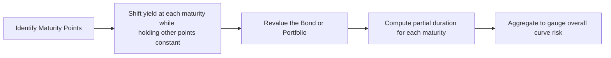

## Why Key Rate Durations Matter

I remember the day I first heard about “key rate durations.” I was sitting at my desk, frustrated with how my duration calculations never fully captured the real ups and downs of my bond positions. A friend casually mentioned partial durations, and I was like, “Wait, what are those?” It turned out that key rate durations gave me this “ah-ha” moment—finally, I had a tool to see exactly where along the yield curve I was most exposed. Yes, it’s one of those moments when you realize that not all shifts in interest rates are created equal, and a single measure like effective duration just wasn’t cutting it.

Key rate durations (a.k.a. partial durations) matter because yield curves just love to move around in ways that aren’t uniform. Sure, sometimes everything shifts up or down in a nice, neat parallel manner, but often the short end will nudge up while the long end barely moves—or vice versa. If you’ve only got a single measure of duration, then you might miss some critical distribution of risk. That’s where key rate durations stroll in. They help you see how your portfolio value might change when a particular segment of the curve (like the 5-year, 10-year, or 30-year point) shifts on its own.

## Understanding Partial Duration vs. Effective Duration

Before diving deeper into partial durations, let’s do a quick recap of effective duration. Effective duration is a measure of a bond’s sensitivity to small parallel shifts in the yield curve:


\text{Effective Duration} \approx - \frac{\Delta \text{Price}}{\text{Price}_0 \times \Delta \text{Yield}}


where \\(\Delta \text{Price}\\) is the change in the bond’s price due to a small shift \\(\Delta \text{Yield}\\) in the entire curve. Simple enough—until the curve twists or steepens. Then the real-world risk becomes more complicated.

Key rate duration, on the other hand, focuses on a shift at a single maturity point (like the 2-year, 5-year, 10-year, etc.). The partial duration for each node \\(i\\) is often defined as:


\text{KeyRateDuration}_i = - \frac{1}{\text{Price}_0} \times \frac{\partial(\text{Price})}{\partial (\text{Yield}_i)},


indicating how much the value of the bond (or portfolio) changes when the yield at maturity \\(i\\) changes. Other yields remain unchanged. This technique reveals “where” along the curve your biggest exposures lie.

## Where You’ll See This on the CFA® Exam

If you see a vignette describing a portfolio of bonds with a certain short-term, mid-term, and long-term exposure, plus a forecast that short rates are expected to jump while long rates stay stable, you’ll almost certainly need to apply partial durations. They might ask you to approximate the portfolio’s reaction to that partial shift. Or maybe you’ll see a scenario about a flattening or steepening trade and you have to figure out how to position yourself to benefit from the expected yield curve shape. Key rate durations will be your go-to tool.

## The Sum of the Parts: Linking Key Rate Durations to Total Duration

It turns out that if you sum up all the key rate durations, weighted by the portion of the value each maturity point influences, you land roughly on your bond’s effective duration. In other words:


\sum_{i=1}^{n} \text{KeyRateDuration}_i \approx \text{Effective Duration}.


But each partial duration by itself pinpoints how the bond’s price might change if that portion of the curve twists independently. It’s akin to having a bunch of mini-sensitivities, each targeted to a separate maturity slice of the yield curve.

## Practical Steps to Calculate Key Rate Durations

One approach is:



1. Identify the maturity points (or “key rates”) you want to analyze (e.g., 1-year, 2-year, 5-year, 10-year, etc.).  
2. For each maturity point \\(i\\), shift the yield at that node by a small amount (like 1 basis point), keep other yields the same, and recalculate the bond’s (or portfolio’s) price.  
3. Compute the partial duration based on the resulting price change.  
4. Repeat for the other maturity points to get a full set of key rate durations across the curve.  

If you’re doing this for a portfolio, you would just apply the same logic to the portfolio’s total value.

### A Quick Numerical Illustration

Let’s say we have a simple bond with a market price of $100. Here’s a hypothetical set of partial durations:

| Maturity Node | Key Rate Shift (bps) | Price Change ($) | Partial Duration |
|---------------|----------------------|-------------------|------------------|
| 2-year        | 1 bp                | -$0.15            | 1.50             |
| 5-year        | 1 bp                | -$0.35            | 3.50             |
| 10-year       | 1 bp                | -$0.28            | 2.80             |

The partial duration at the 2-year point is:

\text{KeyRateDuration}_{2y} 
   = - \frac{-0.15}{100 \times 0.0001}
   = 1.50


An intuitive reading of the table: if the 5-year yield climbs by 1 basis point only, you lose \$0.35, which translates to a partial duration of 3.50. Summing them up gives \\(1.50 + 3.50 + 2.80 = 7.80\\). If you computed the bond’s effective duration ignoring partial durations, you might find something close to 7.80. But you’d have no idea how that risk is distributed among short, intermediate, and long rates without partial durations.

## Shaping the Curve: Steepeners, Flatteners, and Beyond

One of the coolest uses of key rate durations is shaping trades. These trades aren’t about whether yields are generally going up or down; they’re about how the yield curve shape might change. For example:

• Steepener Trade: You might think short-term rates will spike while long-term rates stay put. If so, you’d want to keep your short-duration exposures low (or even negative) and carry more exposure in the long-end that you believe won’t rise.  
• Flattener Trade: Maybe you anticipate the long end to rise but short-term rates to remain anchored. You’d load up on short-dated exposure and short the long-maturity exposure.  

With partial durations, you can specifically isolate your portfolio’s risk “hot spots” along the curve. So if you want to run a steepener, you can dial up your 2-year key rate duration or dial down your 10-year key rate duration, and so on.

## Managing Curve Shaping Risk in a Portfolio

If you’re a portfolio manager, you might deploy key rate durations in your daily risk management routine. For instance, you check each morning’s yield curve. If your largest key rate duration is at the 7-year point, you know any big change near the 7-year maturity is going to drive the portfolio’s P&L that day. If you get a market forecast saying the 7-year rate might spike due to a Fed statement, you could hedge that portion or rebalance your holdings to shift the partial durations around.

Keeping track of partial durations also helps in more advanced contexts like:

• Immunization: If you have liabilities pinned to certain maturities (e.g., pension obligations at 5 and 10 years), you can match the portfolio’s key rate durations to the liability durations.  
• Hedging: A bond with significant 5-year key rate duration can be hedged with an instrument that’s also sensitive to the 5-year part of the curve (e.g., a 5-year Treasury future).

## Common Pitfalls and Challenges

• Overlooking Spread Movements. Even if you get the interest rate part of the curve correct, changes in a bond’s credit spread can overshadow or complicate your partial duration approach. Always consider credit risk or spread risk as well.  
• Using Too Few Nodes. If you only pick one or two “key rates,” you might miss a more subtle yield curve shape. Many professionals track partial durations at seven or more nodes.  
• Inconsistent Shifts. Key rate duration calculations assume an isolated shift at one node. Real market movements might shift adjacent maturities slightly, so results are approximations.

## A Personal Anecdote About Curve Twists

I recall a time I was analyzing a portfolio that “looked” like it had a moderate overall duration. But after running a partial duration analysis, I realized that yes, the total effective duration was 4.5, but more than half of that risk came from the 20-year portion of the curve, which was where the portfolio was intensely exposed—some big 20-year corporates. So we went into a week expecting the Fed to keep short rates stable, yet we were hammered by a sudden steepening in the 20-year to 30-year segment. Key rate durations gave me the heads-up that the 20-year portion would be a threat, but it still stung. That’s how I learned to incorporate partials in my daily risk checks.

## Exam Tips

• Watch out for Vignette Data. They’ll show you that the yield at the short end moves by 10 bps, while the belly and long end move by maybe 5 bps or 0 bps, and they’ll expect you to compute the portfolio’s new value.  
• Always Compare to Effective Duration. Remember that summing partial durations approximates your total duration. If the sum is drastically different, re-check your calculations.  
• Know the “Why.” For exam questions, it’s not enough to just compute partial durations. Understand how a manager could exploit them: a steepener vs. a flattener, or a butterfly trade (where the short and long ends move but the belly moves differently).  
• Time Management. Calculations can be lengthy. If you see a question with multiple partial durations given, be sure to keep track of each node in an orderly manner and do your computations systematically.

## A Small Python Snippet Example

If you want to replicate key rate duration calculations quickly:

```python
import pandas as pd

data = {
    'maturity':   [2, 5, 10],
    'price_0':    [100.00, 100.00, 100.00],   # original price
    'price_shift':[99.85, 99.65, 99.72],      # new price after 1bp isolated shift
}

df = pd.DataFrame(data)

df['partial_duration'] = -(df['price_shift'] - df['price_0'])/(df['price_0'] * 0.0001)

print(df[['maturity','partial_duration']])
```

Running this snippet would give you the partial duration for each maturity point. Of course, in real practice, you’d likely have more maturity nodes.

## Conclusion

Key rate durations are not just some fancy concept in a textbook; they’re a practical, powerful tool if you’re serious about managing and shaping yield curve risk. While effective duration is great for that textbook parallel shift, the real world rarely abides by that idea. Yield curves do all sorts of wacky things— pivot, twist, steepen, flatten—so partial durations give you the nuance you need to see where you stand. From exam day to trading desk, harnessing key rate durations means you can respond with precision when the curve decides to move in interesting ways.

## References

- Tuckman, B., & Serrat, A. (2011). Fixed Income Securities: Tools for Today’s Markets.  
- Jarrow, R. (2004). Modeling Fixed Income Securities and Interest Rate Options.  
- Official CFA Institute Curriculum, Yield Curve Strategies (various volumes).  

## Test Your Knowledge: Key Rate Durations and Shaping Risk



### A portfolio manager wants to measure the sensitivity of her bond portfolio to changes specifically at the 5-year point on the yield curve. Which metric would she use?

- [ ] Effective duration  
- [x] Key rate duration  
- [ ] Macaulay duration  
- [ ] Convexity  

> **Explanation:** Key rate duration (or partial duration) measures sensitivity to a shift in yield at a specific maturity (5-year in this case). Effective duration assumes a parallel shift, so it’s not as targeted for this purpose.

### Which of the following best illustrates a non-parallel yield curve shift?

- [ ] All points on the yield curve increasing by 20 bps  
- [ ] The yield curve shifting uniformly downward by 10 bps  
- [x] Short-term yields rising 5 bps while long-term yields fall 5 bps  
- [ ] Inflation expectations causing a parallel shift  

> **Explanation:** When short-term yields rise while long-term yields simultaneously fall, that’s a non-parallel shift (a flattening or twist). Parallel shifts are uniform across all maturities.

### If the 2-year yield increases by 1 bp and only the 2-year key rate duration is non-zero, which part of the portfolio will be affected?

- [ ] The entire portfolio equally  
- [x] Only the portion sensitive to 2-year rates  
- [ ] The portion sensitive to the 10-year yield  
- [ ] The portion sensitive to an overall shift  

> **Explanation:** Key rate duration isolates the effect of a single maturity’s yield movement. If only the 2-year key rate duration is non-zero, only securities sensitive to that 2-year point will be significantly impacted.

### For a bond portfolio with significant exposure around the 10-year node, a localized shift in the yield curve at the 10-year mark will:

- [x] Have a large impact on the portfolio value  
- [ ] Be completely offset by lower exposure to shorter maturities  
- [ ] Not affect the portfolio unless there’s also a parallel shift  
- [ ] Impact only callable bonds in the portfolio  

> **Explanation:** If the portfolio’s largest partial duration is at the 10-year node, then a yield change localized at that node will cause a correspondingly larger price movement.

### Which of the following statements is most accurate regarding the sum of key rate durations for a bond or portfolio?

- [ ] It exceeds the bond’s convexity  
- [ ] It should equal zero  
- [ ] It’s generally much larger than effective duration  
- [x] It is approximately equal to the effective duration  

> **Explanation:** Summing the partial durations for all nodes typically approximates the overall effective duration of the bond or portfolio.  

### If you’re expecting the yield curve to steepen, which partial duration positions might you favor?

- [ ] Increase short-term key rate duration and decrease long-term key rate duration  
- [x] Decrease short-term key rate duration and increase long-term key rate duration  
- [ ] Neutralize all partial durations  
- [ ] Focus on only the 2-year node  

> **Explanation:** In a steepener trade, short-term yields are expected to rise, and long-term yields are expected to fall or remain stable—so you want less exposure on the short end and more on the long end.  

### A flattening trade typically means:

- [ ] Investing at the short end if short rates are falling  
- [x] Increasing exposure at the short end if yields are lower there and reducing exposure at the long end  
- [ ] Maintaining a barbell strategy at both short and long ends simultaneously  
- [ ] Ignoring partial durations and focusing on a parallel shift  

> **Explanation:** In a flattening trade, the yield curve’s slope is expected to decrease. You’d typically go long shorter maturities (or short the long maturities) so that if the curve flattens, you benefit.

### An analyst attempts to compute partial durations at five different maturities, but the sum is much larger than the bond’s effective duration. Which is the most likely cause?

- [ ] Key rate durations were each computed correctly  
- [ ] Non-parallel shifts do not add up linearly  
- [x] The yield shifts used for each partial duration were inconsistent or incorrectly scaled  
- [ ] The bond has no coupon payments  

> **Explanation:** Typically, partial durations rely on the same small shift at each node. If inconsistent shift sizes or scaling factors are used, the partial durations can add up incorrectly.

### Which of the following is a common pitfall when using key rate durations?

- [ ] Using more than seven maturity nodes  
- [x] Ignoring the potential for credit spread changes  
- [ ] Summing partial durations to check them against effective duration  
- [ ] Using them to hedge non-parallel yield curve movements  

> **Explanation:** While key rate durations focus on interest rate risk at specific maturities, credit spread changes can still overshadow those effects. Failing to consider spreads is a frequent oversight.

### Key rate duration is best described as measuring an instrument’s sensitivity to:

- [x] A shift in yield at a specific maturity  
- [ ] Aggregate credit spread changes  
- [ ] Lockstep movements across all maturities  
- [ ] Changes in an issuer’s credit rating  

> **Explanation:** By definition, key rate duration (or partial duration) measures the sensitivity of a bond or portfolio to a change at a particular maturity on the yield curve.


